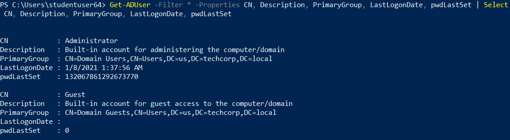
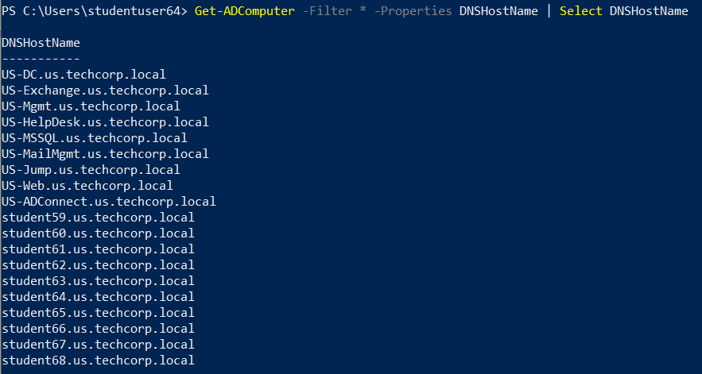
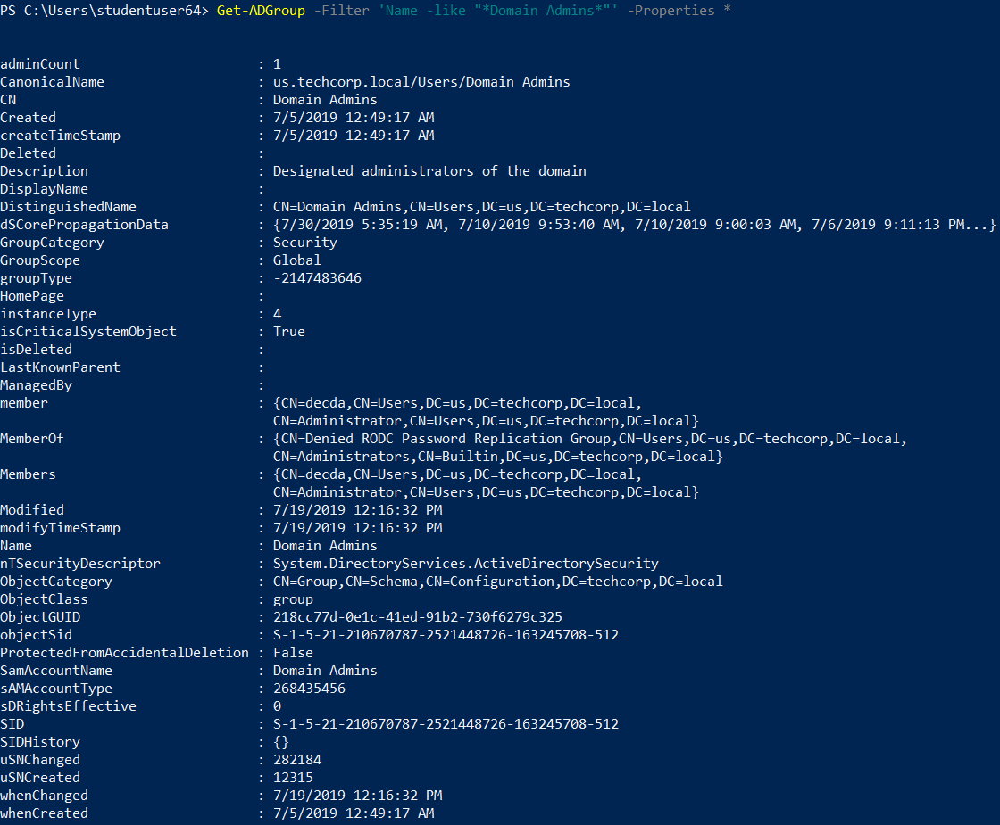
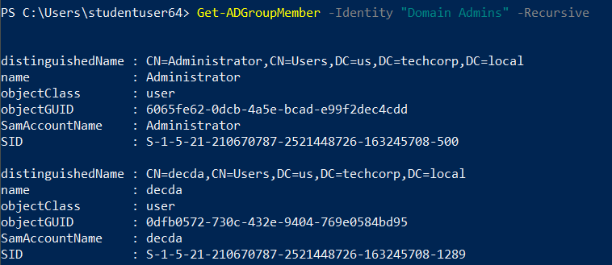
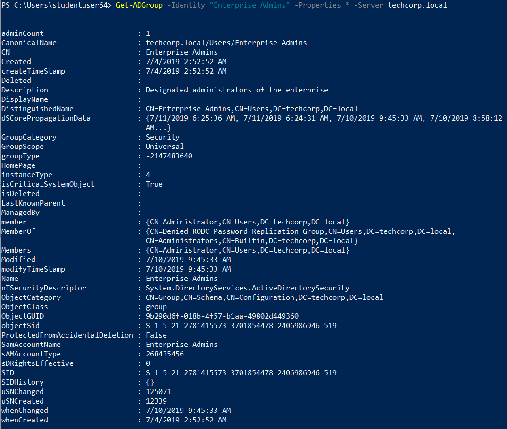
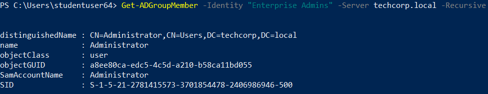
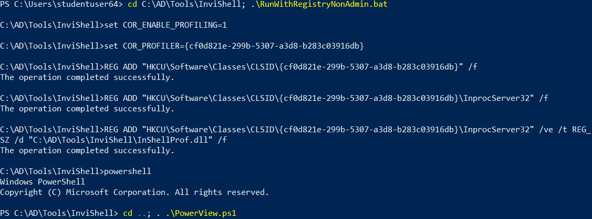
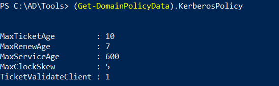

# Hands-On 1: Basic Enumeration

- [Hands-On 1: Basic Enumeration](#hands-on-1-basic-enumeration)
  - [Tasks](#tasks)
  - [Preparation - Import AD Module](#preparation---import-ad-module)
  - [Enumerate Users](#enumerate-users)
  - [Enumerate Computers](#enumerate-computers)
  - [Enumerate Domain Admins](#enumerate-domain-admins)
  - [Enumerate Enterprise Admins](#enumerate-enterprise-admins)
  - [Enumerate Kerberos Policy](#enumerate-kerberos-policy)

---

## Tasks

Enumerate following for the us.techcorp.local domain: 

- Users 
- Computers 
- Domain Administrators 
- Enterprise Administrators 
- Kerberos Policy

<br/>

---

## Preparation - Import AD Module

To import AD Module:

```
Import-Module C:\AD\Tools\ADModule-master\Microsoft.ActiveDirectory.Management.dll; Import-Module C:\AD\Tools\ADModule-master\ActiveDirectory\ActiveDirectory.psd1
```

<br/>

---

## Enumerate Users

```
Get-ADUser -Filter * -Properties *
```

```
Get-ADUser -Filter * -Properties CN, Description, PrimaryGroup, LastLogonDate, pwdLastSet | Select CN, Description, PrimaryGroup, LastLogonDate, pwdLastSet
```

  


<br/>

---

## Enumerate Computers

```
Get-ADComputer -Filter * -Properties DNSHostName | Select DNSHostName
```

  


<br/>

---

## Enumerate Domain Admins

- To get information of the `Domain Admins` group:

```
Get-ADGroup -Filter 'Name -like "*Domain Admins*"' -Properties *
```

  


- To get members in the `Domain Admins` group:

```
Get-ADGroupMember -Identity "Domain Admins" -Recursive
```

  


<br/>

---

## Enumerate Enterprise Admins

- To get information of the `Enterprise Admins` group:

```
Get-ADGroup -Identity "Enterprise Admins" -Properties * -Server techcorp.local
```

  


- To get members in the `Enterprise Admins` group:

```
Get-ADGroupMember -Identity "Enterprise Admins" -Server techcorp.local -Recursive
```

  


<br/>

---

## Enumerate Kerberos Policy

To enumerate Kerberos Policy, we need to use **PowerView**.

First use **InviShell**:

```
cd C:\AD\Tools\InviShell; .\RunWithRegistryNonAdmin.bat
```

<br/>

Then import PowerView:

```
cd ..; . .\PowerView.ps1
```

  


<br/>

To get Kerberos Policy:

```
(Get-DomainPolicyData).KerberosPolicy
```

  


<br/>

---