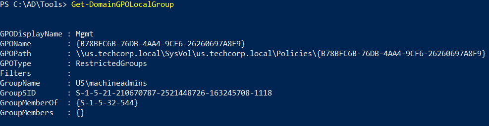
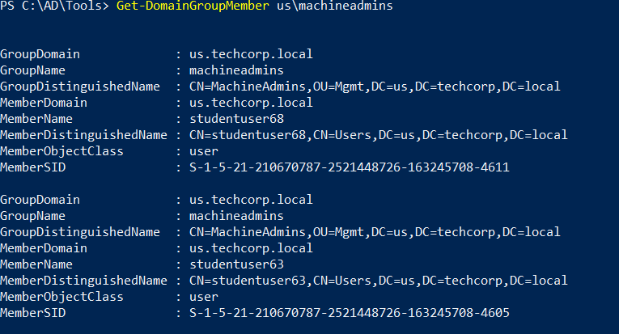
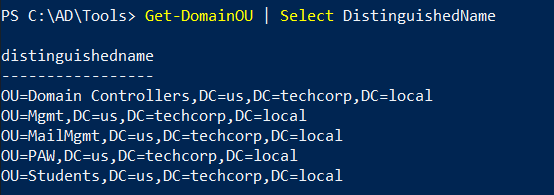
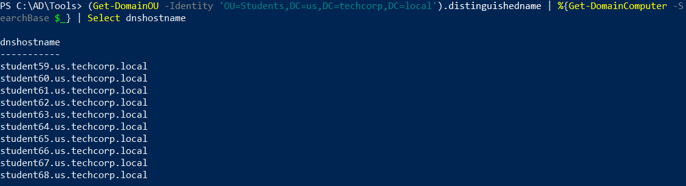
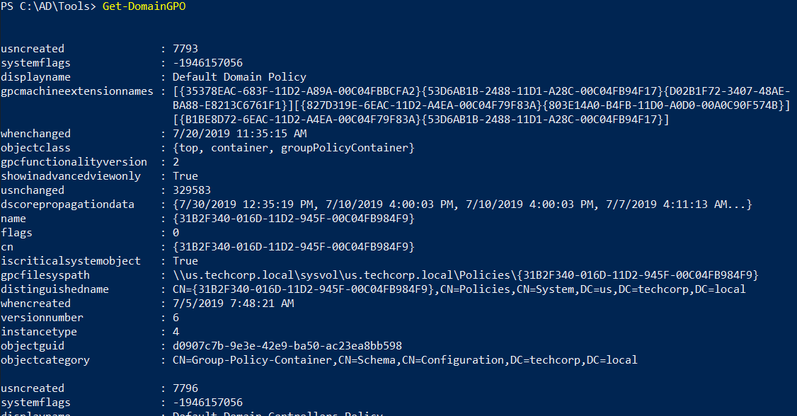
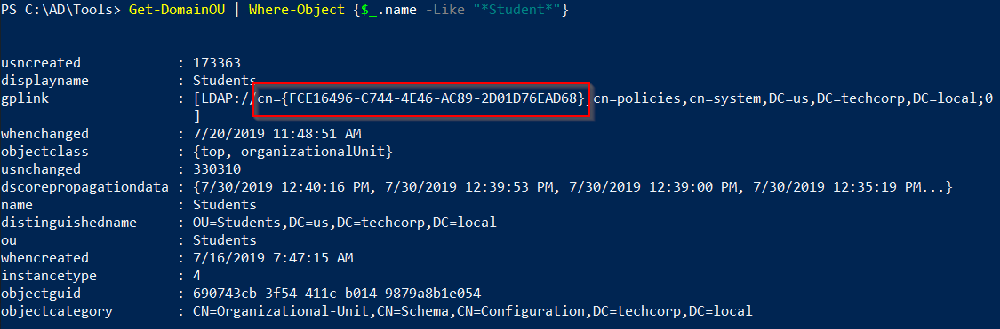
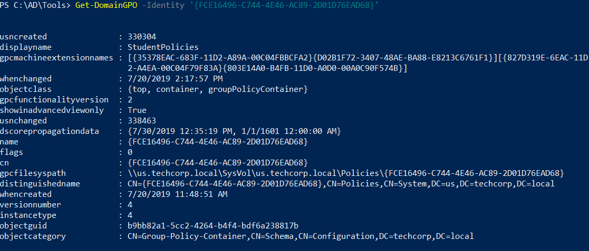

# Hands-On 2: GPO Enumeration

- [Hands-On 2: GPO Enumeration](#hands-on-2-gpo-enumeration)
  - [Tasks](#tasks)
  - [Enumerate Restricted Groups from GPO](#enumerate-restricted-groups-from-gpo)
  - [Enumerate Membership of the restricted groups](#enumerate-membership-of-the-restricted-groups)
  - [List all the OUs](#list-all-the-ous)
  - [List all the computers in the Students OU](#list-all-the-computers-in-the-students-ou)
  - [List the GPOs](#list-the-gpos)
  - [Enumerate GPO applied on the Students OU](#enumerate-gpo-applied-on-the-students-ou)

----

## Tasks

Enumerate following for the `us.techcorp.local` domain: 

- Restricted Groups from GPO
- Membership of the restricted groups 
- List all the OUs 
- List all the computers in the Students OU. 
- List the GPOs 
- Enumerate GPO applied on the Students OU.

---

## Enumerate Restricted Groups from GPO

Use PowerView:

```
Get-DomainGPOLocalGroup
```

  

<br/>

---

## Enumerate Membership of the restricted groups 

```
Get-DomainGroupMember us\machineadmins
```

  


<br/>

---

## List all the OUs 

Use PowerView:

```
Get-DomainOU | Select DistinguishedName
```

  

<br/>

---

## List all the computers in the Students OU

```
(Get-DomainOU -Identity 'OU=Students,DC=us,DC=techcorp,DC=local').distinguishedname | %{Get-DomainComputer -SearchBase $_} | Select dnshostname
```

  

<br/>

---

## List the GPOs

```
Get-DomainGPO
```

  

<br/>

---

## Enumerate GPO applied on the Students OU

First get the `gplink` attribute of the Student OU:

```
Get-DomainOU | Where-Object {$_.name -Like "*Student*"}
```

  

- `{FCE16496-C744-4E46-AC89-2D01D76EAD68}`

<br/>

Then list the GPO applied on the Students OU:

```
Get-DomainGPO -Identity '{FCE16496-C744-4E46-AC89-2D01D76EAD68}'
```

  


<br/>

----

