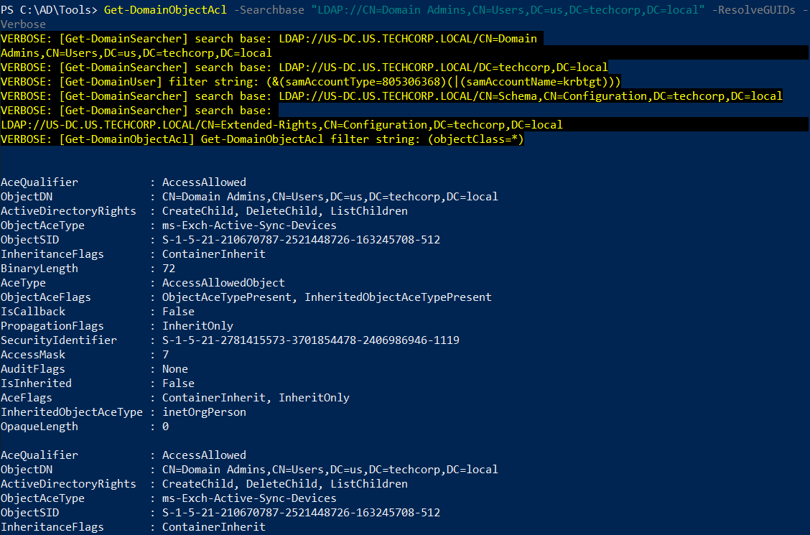
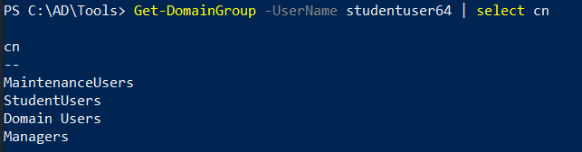

# Hands-On 3: ACL Enumeration

- [Hands-On 3: ACL Enumeration](#hands-on-3-acl-enumeration)
  - [Tasks](#tasks)
  - [Enumerate ACL for the Domain Admins group](#enumerate-acl-for-the-domain-admins-group)
  - [Enumerate all modify rights/permissions for the studentuserx](#enumerate-all-modify-rightspermissions-for-the-studentuserx)

---

## Tasks

Enumerate following for the us.techcorp.local domain: 

- ACL for the Domain Admins group 
- All modify rights/permissions for the studentuserx

---

## Enumerate ACL for the Domain Admins group 

Use PowerView:

```
Get-DomainObjectAcl -Searchbase "LDAP://CN=Domain Admins,CN=Users,DC=us,DC=techcorp,DC=local" -ResolveGUIDs -Verbose
```

  

<br/>

---

## Enumerate all modify rights/permissions for the studentuserx

There are 2 things to check:

1. ACL for studentuserx
2. ACL for the group of studentuserx

ACL for studentuserx:

```
Find-InterestingDomainAcl -ResolveGUIDs | ?{$_.IdentityReferenceName -match "studentuser64"}
```

<br/>

To get the group of studentuserx:

```
Get-DomainGroup -UserName studentuser64 | select cn
```

  

- MaintenanceUsers
- StudentUsers
- Domain Users
- Managers

<br/>

Take `StudentUsers` as an example. Enumerate the interesting ACLs:

```
Find-InterestingDomainAcl -ResolveGUIDs | ?{$_.IdentityReferenceName -match "StudentUsers"}
```

<br/>

---

