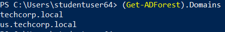
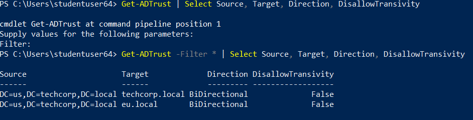
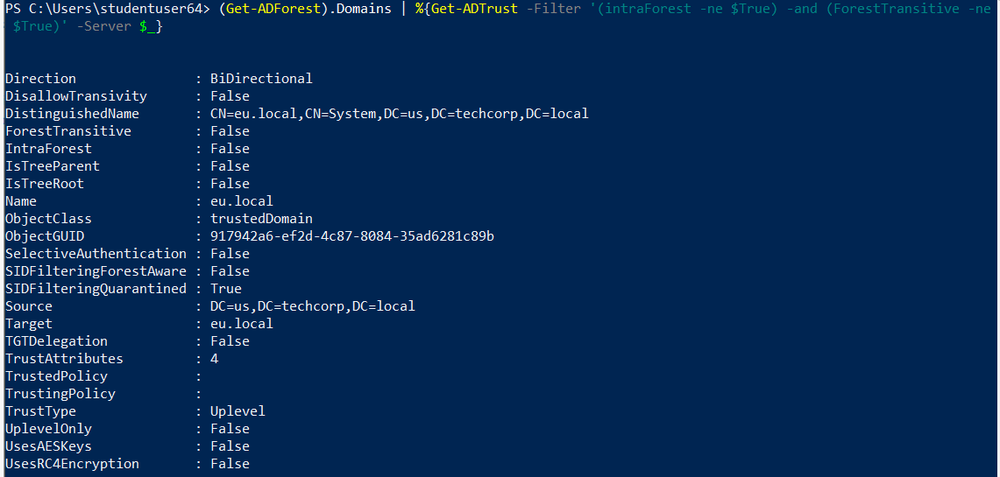
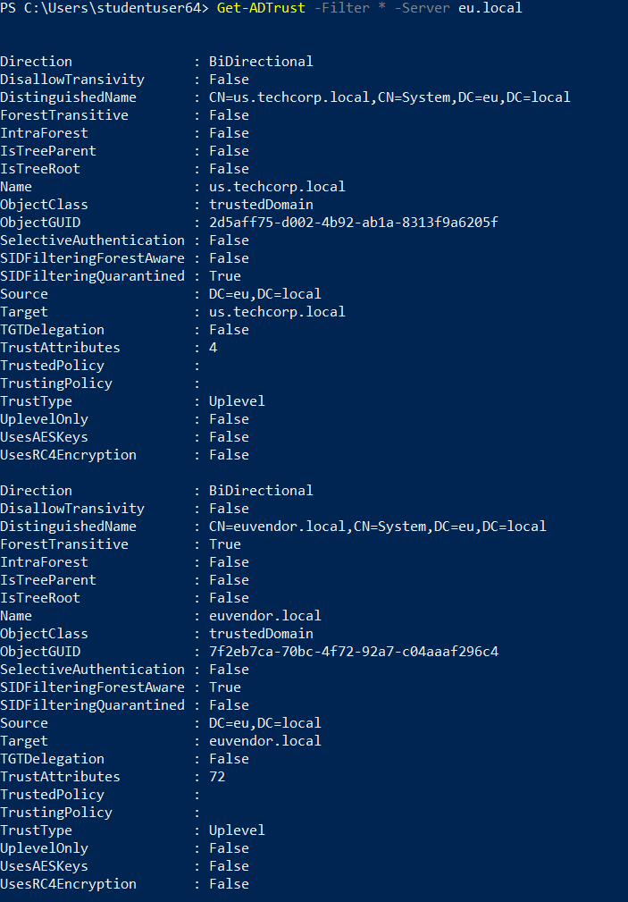

# Hands-on 4: Trusts Enumeration

- [Hands-on 4: Trusts Enumeration](#hands-on-4-trusts-enumeration)
  - [Tasks](#tasks)
  - [Enumerate all domains in the techcorp.local forest](#enumerate-all-domains-in-the-techcorplocal-forest)
  - [Map the trusts of the us.techcorp.local domain](#map-the-trusts-of-the-ustechcorplocal-domain)
  - [Map external trusts in techcorp.local forest](#map-external-trusts-in-techcorplocal-forest)
  - [Identify external trusts of us domain.](#identify-external-trusts-of-us-domain)
  - [Can you enumerate trusts for a trusting forest?](#can-you-enumerate-trusts-for-a-trusting-forest)

---

## Tasks

- Enumerate all domains in the techcorp.local forest. 
- Map the trusts of the us.techcorp.local domain. 
- Map external trusts in techcorp.local forest. 
- Identify external trusts of us domain. Can you enumerate trusts for a trusting forest?

---

## Enumerate all domains in the techcorp.local forest

Use AD Module.

```
(Get-ADForest).Domains
```

  

<br/>

---

## Map the trusts of the us.techcorp.local domain

Since the current domain is `us.techcorp.local`, simply run:

```
Get-ADTrust -Filter 'intraForest -ne $True' -Server (Get-ADForest).Name
```

  

<br/>

---

## Map external trusts in techcorp.local forest

```
(Get-ADForest).Domains | %{Get-ADTrust -Filter '(intraForest -ne $True) -and (ForestTransitive -ne $True)' -Server $_}
```

  

<br/>

---

## Identify external trusts of us domain. 

```
Get-ADTrust -Filter '(intraForest -ne $True) -and (ForestTransitive -ne $True)' -Server us.techcorp.local
```

  


<br/>

---

## Can you enumerate trusts for a trusting forest?

Since `us.techcorp.local` has **bi-directional trust** with `eu.local`, we can enumerate `eu.local` trust by:

```
Get-ADTrust -Filter * -Server eu.local
```

  

<br/>

---