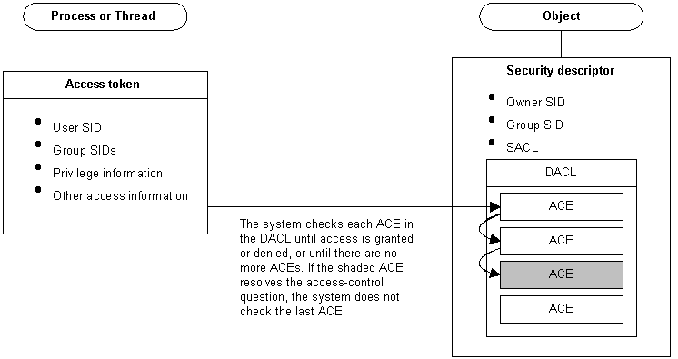
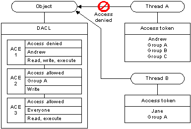
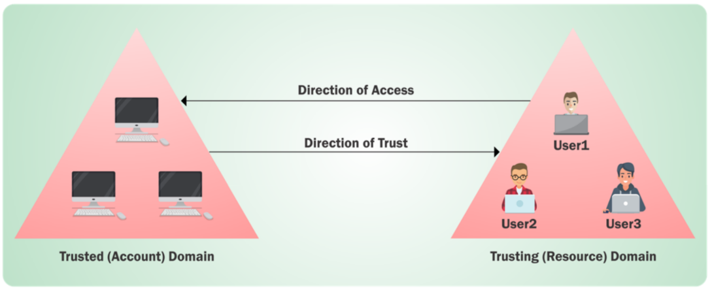
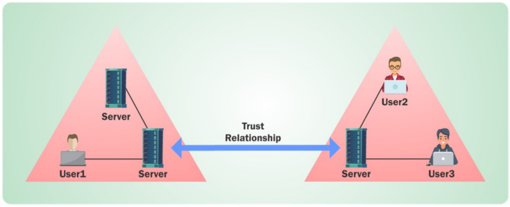
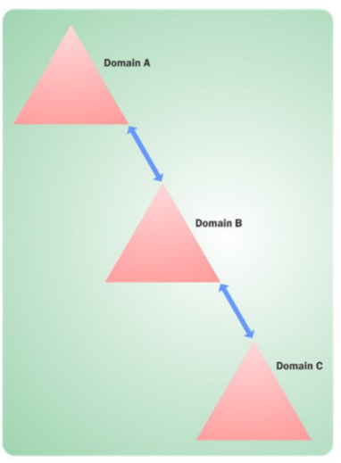
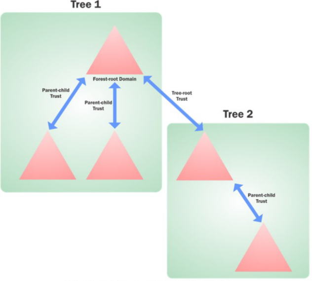
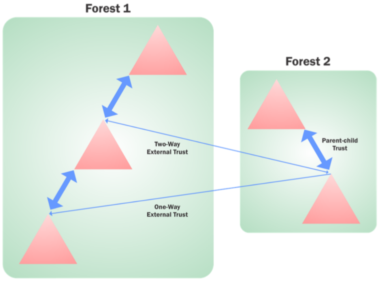
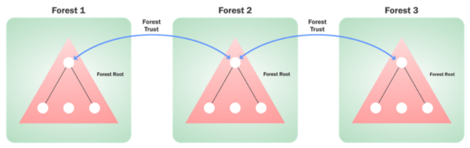
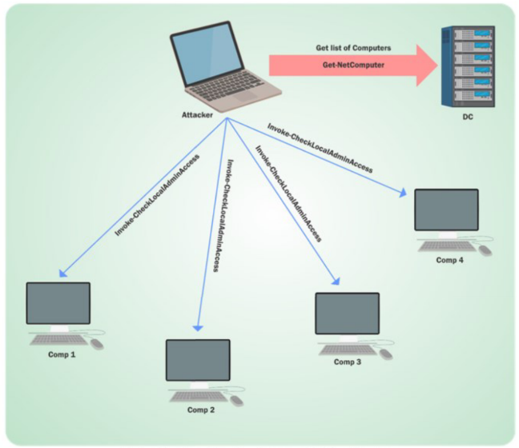
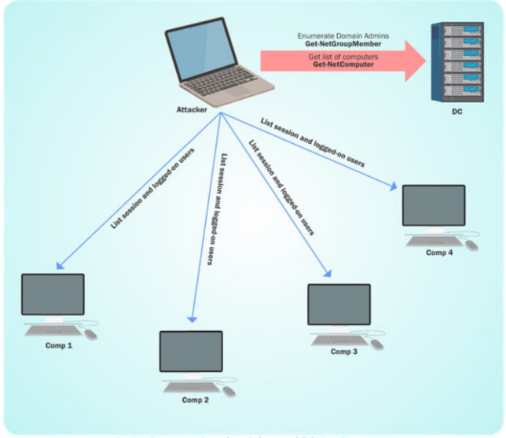

# Domain Enumeration

- [Domain Enumeration](#domain-enumeration)
  - [Tools](#tools)
  - [BloodHound](#bloodhound)
  - [Domain Enumeration](#domain-enumeration-1)
  - [Domain Policy Enumeration](#domain-policy-enumeration)
  - [Domain User Enumeration](#domain-user-enumeration)
  - [Domain Computer Enumeration](#domain-computer-enumeration)
  - [Domain User Group Enumeration](#domain-user-group-enumeration)
  - [Local Group Enumeration on machines](#local-group-enumeration-on-machines)
  - [GPO Enumeration](#gpo-enumeration)
  - [OU Enumeration](#ou-enumeration)
  - [ACL Enumeration](#acl-enumeration)
  - [Trust Enumeration](#trust-enumeration)
  - [User Hunting](#user-hunting)
  - [Defense](#defense)

----

## Tools

To enumerate AD environment, there are 2 common tools:

**1. PowerView**

https://github.com/PowerShellMafia/PowerSploit/blob/master/Recon/PowerView.ps1

```
. .\PowerView.ps1
```

<br/>

**2. ActiveDirectory.psd1**

- https://docs.microsoft.com/en-us/powershell/module/addsadministration/?view=win10-ps
- https://github.com/samratashok/ADModule

```
Import-Module .\Microsoft.ActiveDirectory.Management.dll
Import-Module .\ActiveDirectory.psd1
```

<br/>

**3. Bloodhound (C# and PowerShell Collectors)**
   
https://github.com/BloodHoundAD/BloodHound

----

## BloodHound

BloodHound uses **Graph Theory** for providing the capability of mapping the shortest path for interesting thigns like Domain Admins.

<br/>

BloodHound has built-in queries for frequently used actions. It supports **custom Cypher queries**.

<br/>

The following steps assume you are using BloodHound on Kali:

**Step 1: Run ingestor/collector using PowerShell or C#**

```
. .\BloodHound-master\Ingestors\SharpHound.ps1
```

```
Invoke-BloodHound -CollectionMethod All
```

Note we can avoid tools like MS ATA by using:

```
Invoke-BloodHound -CollectionMethod All -ExcludeDomainControllers
```

A file will be generated.

<br/>

The remaining steps see [Lab - BloodHound](l00-Bloodhound.md)

----

## Domain Enumeration

**Get Current Domain**

- PowerView
  
```
Get-NetDomain
```

- AD Module
  
```
Get-ADDomain
```

<br/>

**Get object of another domain**

- PowerView

```
Get-Domain -Domain techcorp.local
```

- AD Module

```
Get-ADDomain -Identity techcorp.local
```

<br/>

**Get domain SID of the current domain**

- PowerView

```
Get-DomainSID
```

- AD Module

```
(Get-ADDomin).DomainSID
```

<br/>

---

## Domain Policy Enumeration

**Get domain policy of the current domain**

- PowerView

```
Get-DomainPolicyData
```

```
(Get-DomainPolicyData).systemaccess
```

<br/>

**Get domain policy of another domain**

- PowerView

```
(Get-DomainPolicyData -Domain techcorp.local).systemaccess
```

<br/>

---

## Domain User Enumeration

**Get a list of users in teh current domain**

- PowerView

```
Get-DomainUser
Get-DomainUser -Identity studentuser64
```

- AD Module

```
Get-ADUser -Filter * -Properties *
Get-ADUser -Identity studentuser64 -Properties *
```

<br/>

Note:<br/>
- For DC, it doesn't matter if the default Domain Admin is renamed - always identified by the SID


<br/>

Note that properties of users in the current domain are very useful for situational awareness. For example, 

- it is abnormal that a user has `logoncount = 0` - this should be more like a decoy user;

- it is also interesting to see `pwdlastset` to be a very old date.

- PowerView

```
Get-DomainUser -Properties pwdlastset
```

- AD Module

```
Get-ADUser -Filter * -Properties * | Select -First 1 | Get-Member -MemberType *Property | Select Name
```

```
Get-ADUser -Filter * -Properties * | Select name, @{expression={[datetime]::fromFileTime($_.pwdlastset)}}
```

<br/>

**Search for a particular string in a user's attributes**

- PowerView

```
Get-DomainUser -LDAPFilter "Description=*built*" | Select Name, Description
```

- AD Module

```
Get-ADUser -Filter 'Description -Like "*built*"' -Properties Description | Select Name, Description
```

<br/>

---

## Domain Computer Enumeration

**Get a list of computers in the current domain**

- PowerView

```
Get-DomainComputer | Select Name
```

```
Get-DomainComputer -OperatingSystem "Windows Server 2019 Standard"
```

```
Get-DomainComputer -Ping
```

- AD Module

```
Get-ADComputer -Filter * | Select Name
```

```
Get-ADComputer -Filter 'OperatingSystem -Like "*Windows Server 2019 Standard*"' -Properties OperatingSystem | Select Name, OperatingSystem
```

```
Get-ADComputer -Filter * -Properties DNSHostName | %{Test-Connection -Count 1 -ComputerName $_.DNSHostName}
```

```
Get-ADComputer -Filter * -Properties *
```

<br/>

---

## Domain User Group Enumeration

**Get all the groups in the current domain**

- PowerView

```
Get-DomainGroup | Select Name
```

```
Get-DomainGroup -Domain techcorp.local
```

- AD Module

```
Get-ADGroup -Filter * | Select Name
```

```
Get-ADGroup -Filter * -Properties *
```

<br/>

**Get all groups containing the word "admin" in the group name**

- PowerView

```
Get-DomainGroup *admin* | Select Name
```

- AD Module

```
Get-ADGroup -Filter 'Name -like "*admin*"' | Select Name
```

<br/>

**Get all members of the Domain Admins group**

- PowerView

```
Get-DomainGroupMember -Identity "Domain Admins" -Recurse
```

- AD Module

```
Get-ADGroupMember -Identity "Domain Admins" -Recursive
```

<br/>

**Get the group membership for a user**

- PowerView

```
Get-DomainGroup -UserName studentuser64
```

- AD Module

```
Get-ADPrincipalGroupMembership -Identity studentuser64
```

<br/>

---

## Local Group Enumeration on machines

**Get all the local groups on a machine**

- Need Admin Privilege on non-dc machines

- PowerView

```
Get-NetLocalGroup -ComputerName us-dc
```

<br/>

**Get members of all local groups on a machine**

- Need Admin Privilege on non-dc machines
- PowerView

```
Get-NetLocalGroupMember -ComputerName us-dc
```

<br/>

**Get members of the local group "Administrator" on a machine**

- Need Admin Privilege on non-dc machines
- PowerView

```
Get-NetLocalGroupMember -ComputerName us-dc -GroupName Administrators
```

<br/>

---

## GPO Enumeration

**Group Policy** provides the ability to manage/changes configuration easily and centrally in AD. It allow configuration of:

- Security settings
- Registry-based policy settings
- Group policy preferences like startup/shutdown/logon/logoff scripts settings

<br/>

However, GPO can be abused for various attacks like privesc, backdoors, persistence, etc.

<br/>

**Get list of GPO in the current domain**

- PowerView

```
Get-DomainGPO
```

```
Get-DomainGPO -ComputerIdentity student64.us.techcorp.local
```

<br/>

**Get GPO(s) which use Restricted Group or groups.xml for interesting users**

- PowerView

```
Get-DomainGPOLocalGroup
```

<br/>

**Get users which are in a local group of a machine using GPO**

- Give interesting users to target
- PowerView

```
Get-DomainGPOComputerLocalGroupMapping -ComputerIdentity student64.us.techcorp.local
```

```
Get-DomainGPOComputerLocalGroupMapping -ComputerIdentity us-mgmt.us.techcorp.local
```

<br/>

**Get machines where the given user is a member of a specific group**

```
Get-DomainGPOUserLocalGroupMapping -Identity studentuser64 -Verbose
```

<br/>

---

## OU Enumeration

**Get OUs in a domain**

- PowerView

```
Get-DomainOU
```

- AD Module

```
Get-ADOrganizationalUnit -Filter * -Properties *
```

<br/>

**Get GPO applied on an OU**

- Read GPOname from gplink attribute from `Get-DomainOU`
- PowerView

```
Get-DomainGPO -Identity '{FCE16496-C744-4E46-AC89-2D01D76EAD68}'
```

<br/>

**Get users which are in a local group of a machine in any OU using GPO**

- PowerView

```
(Get-DomainOU).distinguishedname | %{Get-DomainComputer -SearchBase $_} | Get-DomainGPOComputerLocalGroupMapping 2>$null
```

<br/>

**Get users which are in a local group of a machine in a particular OU using GPO**

- PowerView

```
(Get-DomainOU -Identity 'OU=Mgmt,DC=us,DC=techcorp,DC=local').distinguishedname | %{Get-DomainComputer -SearchBase $_} | Get-DomainGPOComputerLocalGroupMapping 2>$null
```

For older versions of PowerView, the below commands would also work:

```
Get-DomainGPOComputerLocalGroupMapping -OUIdentity 'OU=Mgmt,DC=us,DC=techcorp,DC=local'
```

```
Find-GPOComputerAdmin -OUName 'OU=Mgmt,DC=us,DC=techcorp,DC=local'
```

<br/>

---

## ACL Enumeration

**Access Control Model** enables control on the ability of a process to access objects and other resources in AD based on:

- Access Tokens (security context of a process - identity and privs of user)
- Security Descriptors (SID of the owner, Discretionary ACL (DACL) and System ACL (SACL))
- Ref: <br/>
https://docs.microsoft.com/en-us/windows/win32/secauthz/access-control-model

<br/>

  


<br/>

**Access Control List (ACL)** is a list of **Access Control Entries (ACE)**, which corresponds to individual permission or audits access. 

- i.e. Who has the permission and what can be done on an object?

ACLs are vital to security architecture of AD. There are 2 types of ACL:

- DACL: Define the permissions trustees (a user / group) have on an object
- SACL: Log success and failure audit messages when an object is accessed

<br/>

  

<br/>

**Get the ACLs associated with a specified object**

- PowerView

```
Get-DomainObjectAcl -Identity student64 -ResolveGUIDs
```

<br/>

**Get the ACLs associated with the specified LDAP path to be used for search**

- PowerView

```
Get-DomainObjectAcl -Searchbase "LDAP://CN=Domain Admins,CN=Users,DC=us,DC=techcorp,DC=local" -ResolveGUIDs -Verbose
```

Note:<br/>
- Active Directory Rights:<br/>
  https://docs.microsoft.com/en-us/dotnet/api/system.directoryservices.activedirectoryrights?redirectedfrom=MSDN&view=dotnet-plat-ext-5.0
  <br/>
- Extended Rights:<br/>
  https://technet.microsoft.com/en-us/library/ff405676.aspx

<br/>

**Search for interesting ACEs**

- Use without `-ResolveGUIDs` for faster result
- PowerView

```
Find-InterestingDomainAcl -ResolveGUIDs
```

<br/>

**Get the ACLs associated with the specified path**

- PowerView

```
Get-PathAcl -Path "\\us-dc\sysvol"
```

<br/>

---

## Trust Enumeration

In an AD environment, **trust** is a relationship between two domains or forests which allows users of one domain or forest to access resources in the other domain or forest.

Trust can be automatic (parent-child / same forest / etc.) or established (forest, external).

**Trusted Domain Objects (TDOs)** represent the trust relationships in a domain.

<br/>

**One-way Trust**

  

- Unidirectional
- Users in the trusted domain can access resources in the trusting domain but the reverse is not true

<br/>

**Two-way Trust**

  

- Bi-directional
- Users of both domains can access resources in the other domain

<br/>

**Transitivity**

  

**Transitive** - can be extended to establish trust relationships with other domains. **All the default intra-forest trust relationships (Tree-root / Parent-Child) between domains within a same forest are transitive 2-way trusts.**

<br/>

**Nontransitive** - cannot be extended to other domains in the forest. It can be 1-way or 2-way. This is the default trust (called external trust) between 2 domains in different forests when forests do not have a trust relationship.

<br/>

**Default/Automatic Trusts**

1. Parent-child Trust - Automatically created betweem the new domain and the domain that precedes it in the namespace hierarchy, whenever a new domain is added in a tree. (e.g. `us.techcorp.local` is a child of `techcorp.local`). This trust is always `2-way transitive`.
   
2. Tree-root trust - Automatically created between whenever a new domain tree is added to a forest root. This trust is always `2-way transitive`.

  

<br/>

**External Trusts**

  


It is between two domains in different forests when forests do not have a trust relationship. It can be `1-way` or `2-way` and is `non-transitive`.

<br/>

**Forest Trust**

  


Forest Trusts are:

- between forest root domain
- cannot be extended to a 3rd forest (no implicit trust)
- can be 1-way or 2-way
- can be transitive or non-transitive

<br/>

**Get a list of all domain trusts for the current domain**

- PowerView

```
Get-DomainTrust
```

```
Get-DomainTrust -Domain techcorp.local
```

- AD Module

```
Get-ADTrust
```

```
Get-ADTrust -Identity techcorp.local
```

<br/>

**Get details about the current forest**

- PowerView

```
Get-Forest
```

- AD Module

```
Get-ADForest
```

<br/>

**Get all domains in the current forest**

- PowerView

```
Get-ForestDomain
```

- AD Module

```
(Get-ADForest).Domains
```

<br/>

**Get all global catalogs for the current forest**

- PowerView

```
Get-ForestGlobalCatalog
```

- AD Module

```
Get-ADForest | Select -ExpandProperty GlobalCatalogs
```

<br/>

**Map trusts of a forest**

- PowerView

```
Get-ForestTrust
```

- AD Module

```
Get-ADTrust -Filter 'intraForest -ne $True' -Server (Get-ADForest).Name
```

<br/>

---

## User Hunting

**Find all machines on the current domain where the current user has local admin access**

  


- The following command queries the DC of the current or provided domain for a list of computers (`Get-DomainComputer`), and then use multi-threaded `Test-AdminAccess` on each machine.
  
- PowerView

```
Find-LocalAdminAccess -Verbose
```

<br/>

This can also be done with the help of remtoe admin tools like WMI and PS Remoting. Quite useful in cases ports (RPC and SMB) used by `Find-LocalAdminAccess` are blocked. You can use:

- `Find-WMILocalAdminAccess.ps1`
- `Find-PSRemotingLocalAdminAccess.ps1`

<br/>

**Find computers where a domain admin (or specified user/group) has sessions**

  

- PowerView

```
Find-DomainUserLocation -Verbose
```

```
Find-DomainUserLocation -UserGroupIdentity "StudentUsers"
```

This function queries the DC of the current or provided domain for members of the given group (Domain Admins by default) using `Get-DomainGroupMember`, gets a lsit of computer `Get-DomainComputer` and list sessions and logged on users `Get-NetSession` / `Get-NetLoggedOn` from each machine.

<br/>

**Find computers where a domain admin session is available and curretn user has admin access**

- Use `Test-AdminAccess`
- PowerView

```
Find-DomainUserLocation -CheckAccess
```

<br/>

**Find computers (File Servers / Distributed File Servers) where a domain admin session is available**

- PowerView

```
Find-DomainUserLocation -Stealth
```

<br/>

## Defense

Most of the enumeration mixes really well with the normal traffic to the DC. But local admin hunting and Domain Admins hunting leave **Windows Security Event 4624 and 4634 on ALL the tested machines** and **additional 4672 in case of success**.

<br/>

Other than detection, hardening can be done on both DC and other machines to contain the information provided by the queried machine.

<br/>

**Netcease** is a script which changes permissions on the `NetSessionEnum` method by removign permission for Authenticated Users group. This fails many of the attacker's session enumeration and hence user hunting capabilities.

- https://github.com/p0w3rsh3ll/NetCease

```
.\NetCease.ps1
```

<br/>

Another interesting script from the same author is SAMRi10 which hardens Windows 10 and Server 2016 against enumeration which usees SAMR protocol (like net.exe).

- https://gallery.technet.microsoft.com/SAMRi10-Hardening-Remote-48d94b5b

<br/>

