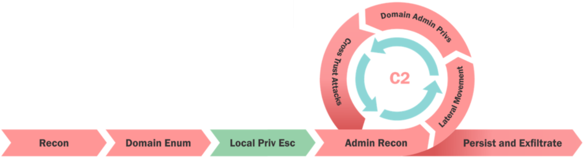

# Local Privilege Escalation

- [Local Privilege Escalation](#local-privilege-escalation)
  - [Privilege Escalation](#privilege-escalation)
  - [Local Privilege Escalation](#local-privilege-escalation-1)
  - [PowerUp](#powerup)
  - [BeRoot](#beroot)
  - [Privesc](#privesc)

---

## Privilege Escalation

  

In an AD environment, there are multiple scenarios which lead to privilege escalation. We had a look at the following:

- Hunting for local admin access on other machines
- Hunting for high privilege domain accounts (e.g. Domain Admins)

<br/>

## Local Privilege Escalation

There are various ways of locally escalating privielges on a Windows system.

- Missing patches
- Automated deployment, AutoLogon passwords, passwords in files in cleartext
- AlwaysInstallElevated (Any user can run MSI as SYSTEM)
- Misconfigured Services
- DLL hijacking
- ...

<br/>

We can use the following tools for complete coverage:

1. PowerUp: https://github.com/PowerShellEmpire/PowerTools/blob/master/PowerUp/PowerUp.ps1
2. BeRoot: https://github.com/AlessandroZ/BeRoot
3. PrivEsc: https://github.com/enjoiz/Privesc

<br/>

## PowerUp

We can check services issues with PowerUp.

**Get services with unquoted paths and a space in their name**

```
Get-ServiceUnquoted -Verbose
```

<br/>

**Get services where the current user can write to its binary path or change arguments to the library**

```
Get-ModifiableServiceFile -Verbose
```

<br/>

**Get the services whose configuration current user can modify**

```
Get-ModifiableService -Verbose
```

<br/>

We can also run all checks:

```
Invoke-AllChecks
```

<br/>

## BeRoot

Run all checks:

```
beRoot.exe
```

<br/>

## Privesc

Run all checks:

```
Invoke-PrivEsc
```

<br/>

