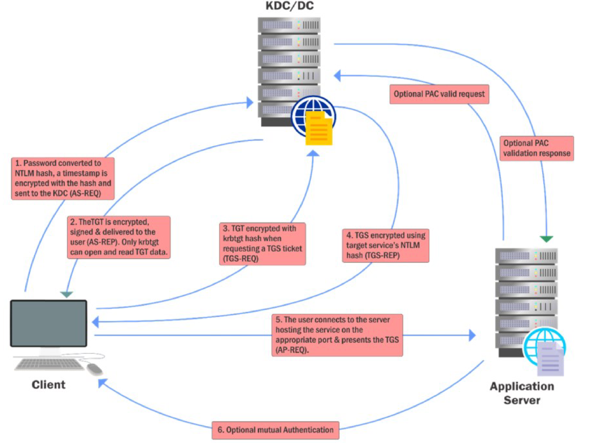

# Kerberos

- [Kerberos](#kerberos)
  - [About Kerberos](#about-kerberos)

---

## About Kerberos

Kerberos is the basic of authentication in a Windows AD enviroment. 

 

Clients (programs on behalf of a user) need to obtains tickets from **Key Distribution Center (KDC)**, which is a service running on the domain controller. These tickets represent the client's credential!

 

Therefore, Kerberos is understandably a very interesting target of abuse.

 

  

 

---