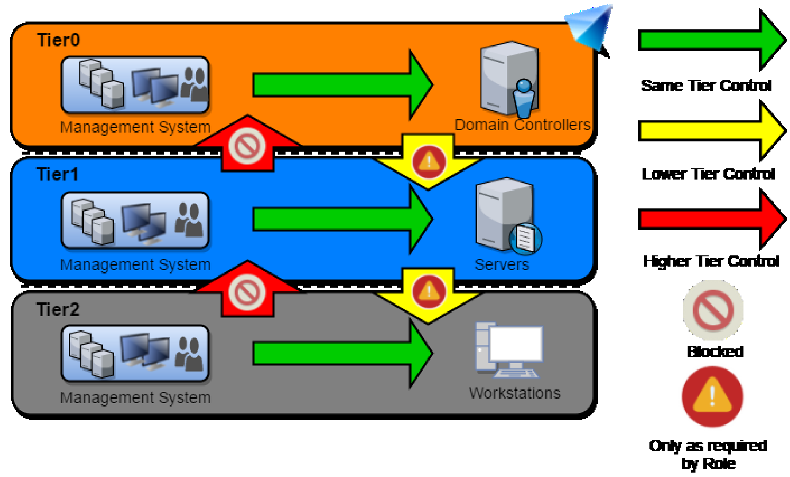
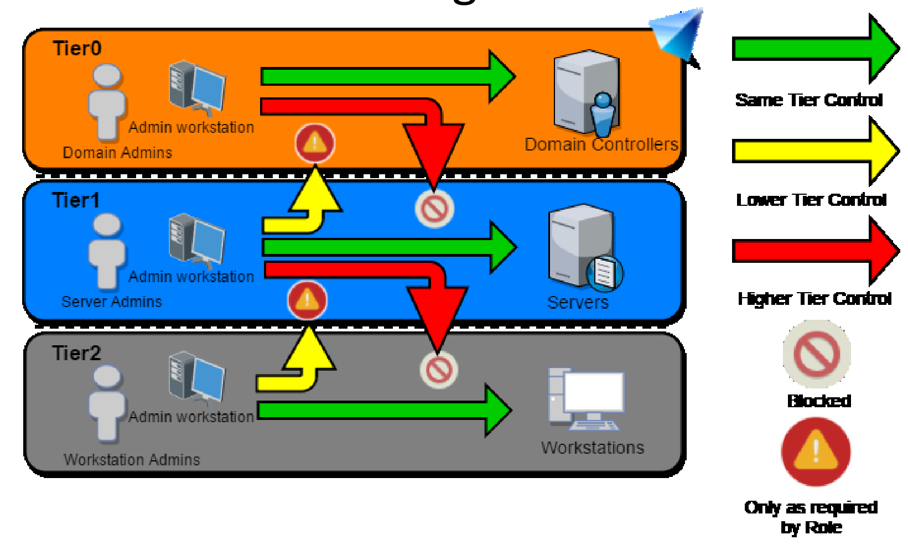
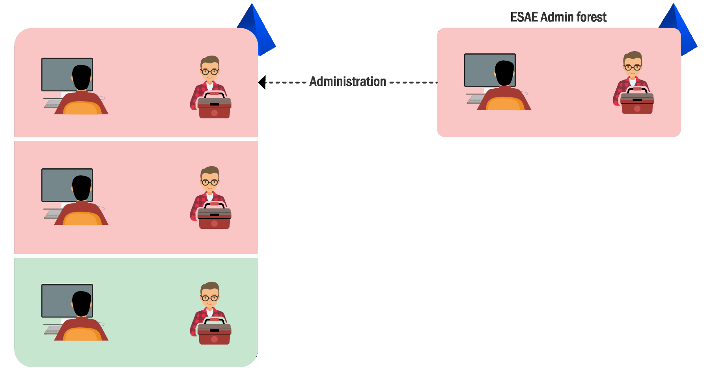

# Defenses

- [Defenses](#defenses)
  - [Overview](#overview)
  - [Protect and Limit Domain Admins](#protect-and-limit-domain-admins)
  - [Isolcate administrative workstations](#isolcate-administrative-workstations)
  - [Secure local administrators](#secure-local-administrators)
  - [Time bound (JIT) and just enough administration (JEA)](#time-bound-jit-and-just-enough-administration-jea)
  - [Tier Model](#tier-model)
  - [Enhanced Security Admin Environment (ESEA)](#enhanced-security-admin-environment-esea)
  - [Credential Guard](#credential-guard)
  - [Device Guard (WDAC)](#device-guard-wdac)
  - [Microsoft Advanced Threat Analytics (ATA)](#microsoft-advanced-threat-analytics-ata)

---

## Overview

- Protect and Limit Domain Admins
- Isolate administrative workstations
- Secure local administrators 
- Time bound and just enough administration 
- Isolate administrators in a separate forest and breach containment using Tiers and ESAE

<br/>

---

## Protect and Limit Domain Admins

**General rules**

1. Reduce the number of Domain Admins in your environment.
2. Do not allow or limit login of DAs to any other machine other than the Domain Controllers. If logins to some servers is necessary, do not allow other administrators to login to that machine.
3. (Try to) Never run a service with a DA. Credential theft protections which we are going to discuss soon are rendered useless in case of a service account.
4. Set "`Account is sensitive and cannot be delegated`" for DAs.

<br/>

**Protected Users Group**

Note:
Protected Users Group != Protected Group (AdminSDHolder)

Protected Users is a group introduced in Server 2012 R2 for "better protection against credential theft" by not caching credentials in insecure ways. A user added to this group has following major device protections:

- Cannot use CredSSP and WDigest - **No more cleartext credentials caching.**
- **NTLM hash is not cached**.
- Kerberos does not use DES or RC4 keys. **No caching of clear text cred or long term keys**.

If the domain functional level is Server 2012 R2, following DC protections are available:
- No NTLM authentication.
- No DES or RC4 keys in Kerberos pre-auth.
- No delegation (constrained or unconstrained)
- No renewal of TGT beyond initial four hour lifetime - Hardcoded, unconfigurable "Maximum lifetime for user ticket" and "Maximum lifetime for user ticket renewal"

Note:
In case of Protected Users Group, though you cannot use NTLM to do over-pass-the-hash, you can use aes256.
<br/>

---

## Isolcate administrative workstations

**Privileged Administrative Workstations (PAWs)**

A hardened workstation for performing sensitive tasks like administration of domain controllers, cloud infrastructure, sensitive business functions etc, which can provide protection from phishing attacks, OS vulnerabilities, credential replay attacks.

Admin Jump servers to be accessed only from a PAW, multiple strategies
- Separate privilege and hardware for administrative and normal tasks.
- Having a VM on a PAW for user tasks.

<br/>

---

## Secure local administrators

**LAPS (Local Administrator Password Solution)**

Centralized storage of passwords in AD with periodic randomizing where read permissions are access controlled.

Computer objects have two new attributes:
- `ms-mcs-AdmPwd` attribute stores the clear text password 
- `ms-mcs-AdmPwdExpirationTime` controls the password change.

Storage in clear text, transmission is encrypted.

Note:
With careful enumeration, it is possible to retrieve which users can access the clear text password providing a list of attractive targets!

<br/>

---

## Time bound (JIT) and just enough administration (JEA)

**JIT**

**Just In Time (JIT)** administration provides the ability to grant time-bound administrative access on per-request bases.

Check out Temporary Group Membership! (Requires Privileged Access Management Feature to be enabled which can't be turned off later)

```
Add-ADGroupMember -Identity ‘Domain Admins’ -Members newDA -MemberTimeToLive (New-TimeSpan -Minutes 60)
```

<br/>

**JEA**

**JEA (Just Enough Administration)** provides role based access control for PowerShell based remote delegated administration.

With JEA non-admin users can connect remotely to machines for doing specific administrative tasks. For example, we can control the command a user can run and even restrict parameters which can be used.

JEA endpoints have PowerShell transcription and logging enabled.

<br/>

---

## Tier Model

**Active Directory Administrative Tier Model**

Composed of three levels only for administrative accounts:

1. **Tier 0** – Accounts, Groups and computers which have privileges across the enterprise like domain controllers, domain admins, enterprise admins.<br/>
2. **Tier 1** - Accounts, Groups and computers which have access to resources having significant amount of business value. A common example role is server administrators who maintain these operating systems with the ability to impact all enterprise services.<br/>
3. **Tier 2** - Administrator accounts which have administrative control of a significant amount of business value that is hosted on user workstations and devices. Examples include Help Desk and computer support administrators because they can impact the integrity of almost any user data.<br/>

- Control Restrictions - What admins control.
- Logon Restrictions - Where admins can log-on to.

<br/>

**Control Restrictions**

  

<br/>

**Logon Restrictions**

  

<br/>

---

## Enhanced Security Admin Environment (ESEA)

ESEA is a dedicated administrative forest for managing critical assets like administrative users, groups and computers.

Since a forest is considered a security boundary rather than a domain, this model provides enhanced security controls. The administrative forest is also called **the Red Forest**.

Administrative users in a production forest are used as standard nonprivileged users in the administrative forest. 

Selective Authentication to the Red Forest enables stricter security controls on logon of users from non-administrative forests.

  


<br/>

---

## Credential Guard

https://docs.microsoft.com/en-us/windows/access-protection/credential-guard/credential-guard

It "uses virtualization-based security to isolate secrets so that only privileges system software can access them".

Credential Guard is e**ffective in stopping PTH and Over-PTH attacks** by restricting access to NTLM hashes and TGTs. **It is not possible to write Kerberos tickets to memory even if we have credentials**.

<br/>

But, credentials for local accounts in SAM and Service account credentials from LSA Secrets are NOT protected.

Credential Guard cannot be enabled on a domain controller as it breaks authentication there.

Note it is only available on the Windows 10 Enterprise edition and Server 2016.

Note:
Mimikatz can bypass it but still, Credential Guard is worthwhile to be used.

<br/>

---

## Device Guard (WDAC)

https://docs.microsoft.com/en-us/windows/security/threat-protection/device-guard/introduction-to-device-guard-virtualization-based-security-and-windows-defender-application-control

It is a group of features "designed to harden a system against malware attacks. Its focus is preventing malicious code from running by ensuring only known good code can run."

Three primary components:

1. **Configurable Code Integrity (CCI)** - Configure only trusted code to run<br/>
2. **Virtual Secure Mode Protected Code Integirty** - Enforces CCI with Kernerl Mode (KMCI) and User Mode (UMCI)<br/>
3. **Platform and UEFI Secure Boot** - Ensures boot binaries and firmware integrity

<br/>

UMCI is something which interferes with most of the lateral movement attacks we have seen. 

While it depends on the deployment (discussing which will be too lengthy), many well known application whitelisting bypasses - signed binaries like `csc.exe`, `MSBuild.exe` etc. - are useful for bypassing UMCI as well. Check out the LOLBAS project (lolbas-project.github.io/).

<br/>

---

## Microsoft Advanced Threat Analytics (ATA)

Traffic destined for Domain Controller(s) is mirrored to ATA sensors and a user activity profile is build over time – use of computers, credentials, log on machines etc.

It collects **Event 4776** (The DC attempted to validate the credentials for an account) to detect credential replay attacks.

It also **detect Behavior anomalies**.

<br/>

ATA is useful for detecting:

1. **Recon**: Account enum, Netsession enum
2. **Compromised Credentials Attacks**: Brute force, High privilege account/service account exposed in clear text, Honey token, unusual protocol (NTLM and Kerberos)
3. **Credential/Hash/Ticket Replay attacks**.

<br/>

Note that there are known bypasses of ATA. The key is to avoid talking to the DC as long as possible and make appear the traffic we generate as attacker normal.

To bypass **DCSync** detection, **go for users which are whitelisted**. For example, the user account used for PHS may be whitelisted.<br/>

Also, if we have NTLM hash of a DC, we can extract NTLM hashes of any machine account using `netsync`:

```
Invoke-Mimikatz -Command '"lsadump::netsync /dc:us-dc.us.techcorp.local /user:us-dc$ /ntlm:f4492105cb24a843356945e45402073e /account:us-web$"'
```

<br/>

If we forge a Golden Ticket with SID History of the Domain Controllers group and Enterprise Domain Controllers Group, there are less chances of detection by ATA:

```
Invoke-Mimikatz -Command '"kerberos::golden /user:us-dc$ /domain:us.techcorp.local /sid:S-1-5-21-210670787-2521448726-163245708 /groups:516 /krbtgt:b0975ae49f441adc6b024ad238935af5 /sids:S-1-5-21-2781415573-3701854478-2406986946-516,S-1-5-9 /ptt"'
```

<br/>

Note ATA (1.9) does not detect Golden tickets created with a non-existent username.

<br/>

When doing Over-PTH, when providing all `NTLM`, `AES128` and `AES256`, it avoids detection by ATA.

<br/>

---

