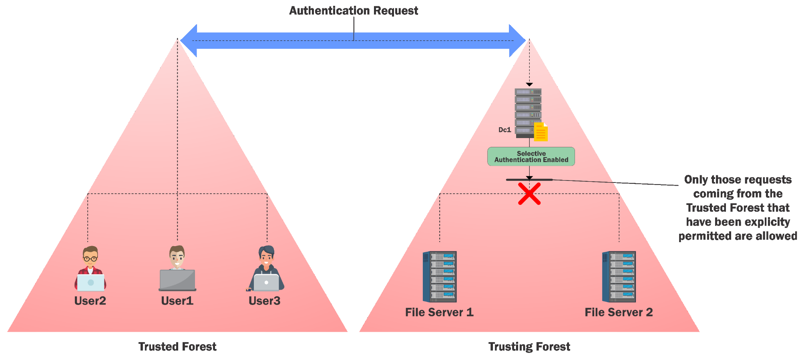

# Detections

- [Detections](#detections)
  - [Golden Ticket](#golden-ticket)
  - [Silver Ticket](#silver-ticket)
  - [Skeleton Key](#skeleton-key)
  - [DSRM](#dsrm)
  - [Malicious SSP](#malicious-ssp)
  - [Kerberoast](#kerberoast)
  - [Unconstrained Delegation](#unconstrained-delegation)
  - [ACL Attacks](#acl-attacks)
  - [Trust Tickets](#trust-tickets)
  - [Deception](#deception)

---

## Golden Ticket

Event ID:
- `4624`: Account Logon
- `4672`: Admin Logon

```
Get-WinEvent -FilterHashtable @{Logname='Security';ID=4672} -MaxEvents 1 | Format-List –Property *
```

<br/>

---

## Silver Ticket

Event ID:
- `4624`: Account Logon
- `4634`: Account Logoff
- `4672`: Admin Logon

```
Get-WinEvent -FilterHashtable @{Logname='Security';ID=4672} -MaxEvents 1 | Format-List -Property *
```

<br/>

---

## Skeleton Key

Events

- System Event ID `7045` - A service was installed in the system. (Type Kernel Mode driver)
- Security Event ID `4673` – Sensitive Privilege Use
- Event ID `4611` – A trusted logon process has been registered with the Local Security Authority

```
Get-WinEvent -FilterHashtable @{Logname='System';ID=7045} | ?{$_.message -like "*Kernel Mode Driver*"}
```

<br/>

To catch only `mimidrv`:

```
Get-WinEvent -FilterHashtable @{Logname='System';ID=7045} | ?{$_.message -like "*Kernel Mode Driver*" -and $_.message -like "*mimidrv*"}
```

<br/>

**Mitigation**

Running `lsass.exe` as a **protected process** is really handy as it forces an attacker to load a kernel mode driver. However, make sure that you test it thoroughly as many drivers and plugins may not load with the protection.

```
New-ItemProperty HKLM:\SYSTEM\CurrentControlSet\Control\Lsa\ -Name RunAsPPL -Value 1 -Verbose
```

<br/>

Verify after reboot:

```
Get-WinEvent -FilterHashtable @{Logname='System';ID=12} | ?{$_.message -like "*protected process*"}
```

<br/>

---

## DSRM

Events:

- Event ID `4657` - Audit creation/change of `HKLM:\System\CurrentControlSet\Control\Lsa\DsrmAdminLogonBehavior`

<br/>

---

## Malicious SSP

Events:

- Event ID `4657` - Audit creation/change of `HKLM:\System\CurrentControlSet\Control\Lsa\SecurityPackages`

<br/>

---

## Kerberoast

Events:

- Security Event ID `4769` – A Kerberos ticket was requested

Since 4769 is logged very frequently on a DC. We may like to filter
results based on the following information from logs:

- Service name should not be `krbtgt`
- Service name does not end with `$` (to filter out machine accounts used for services)
- Account name should not be `machine@domain` (to filter out requests from machines)
- Failure code is '`0x0`' (to filter out failures, `0x0` is success)
- Most importantly, ticket encryption type is `0x17`

<br/>

Mitigation

- Service Account Passwords should be hard to guess (greater than 30 characters)
- Use Managed Service Accounts (Automatic change of password periodically and delegated SPN Management)
- https://docs.microsoft.com/en-us/previous-versions/windows/it-pro/windows-server-2012-R2-and-2012/jj128431(v=ws.11)?redirectedfrom=MSDN

<br/>


---

## Unconstrained Delegation

Mitigation

- Limit DA/Admin logins to specific servers
- Set "`Account is sensitive and cannot be delegated`" for privileged accounts
- https://docs.microsoft.com/en-us/archive/blogs/poshchap/security-focus-analysing-account-is-sensitive-and-cannot-be-delegated-for-privileged-accounts

<br/>

---

## ACL Attacks

Events:

- Security Event ID `4662` (Audit Policy for object must be enabled) – An operation was performed on an object
- Security Event ID `5136` (Audit Policy for object must be enabled) – A directory service object was modified
- Security Event ID `4670` (Audit Policy for object must be enabled) – Permissions on an object were changed

<br/>

Useful tool:<br/>
- **AD ACL Scanner** - Create and compare create reports of ACLs.
- https://github.com/canix1/ADACLScanner

<br/>

---

## Trust Tickets

**SID Filtering**

- Avoid attacks which abuse SID history attribute (child to root domain privilege escalation, that is, DA from a Child to EA on forest root).
- Enabled by default on all inter-forest trusts. Intra-forest trusts are assumed secured by default (MS considers forest and not the domain to be a security boundary).
- But, since SID filtering has potential to break applications and user access, it is often disabled.

<br/>

**Selective Authentication**

In an inter-forest trust, if Selective Authentication is configured, **users between the trusts will not be automatically authenticated**. Individual access to domains and servers in the trusting domain/forest should be given.

  


<br/>

---

## Deception

Deception is a very effective technique in active directory defense. 

By using decoy domain objects, defenders can trick adversaries to follow a particular attack path which increases chances of detection and increase their cost in terms of time.

Traditionally, deception has been limited to leave honey credentials on some boxes and check their usage but we can use it effectively during other phases of an attack.

<br/>

What to target? Adversary mindset of going for the "lowest hanging fruit" and illusive superiority over defenders. We must provide the adversaries what they are looking for. For example, what adversaries look for in a user object:

- A user with high privileges
- Permissions over other objects
- Poorly configured ACLs
- Misconfigured / Dangerous user attributes and so on

<br/>

Let's create some user objects which can be used for deceiving adversaries. We can use Deploy-Deception for this: 

- https://github.com/samratashok/Deploy-Deception

<br/>

Note that Windows Settings|Security Settings|Advanced Audit Policy Configuration|DS Access|Audit Directory Service Access Group Policy needs to be configured to enable 4662 logging.

<br/>

Creates a decoy user whose password never expires and a 4662 is logged whenever x500 uniqueIdentifier - d07da11f-8a3d-42b6-b0aa76c962be719a property of the user is read:

```
Create-DecoyUser -UserFirstName user -UserLastName manager -Password Pass@123 | Deploy-UserDeception -UserFlag PasswordNeverExpires -GUID d07da11f-8a3d-42b6-b0aa-76c962be719a -Verbose
```

This property is not read by `net.exe`, WMI classes (like `Win32_UserAccount`) and ActiveDirectory module. But LDAP based tools like PowerView and ADExplorer trigger the logging.

<br/>

Create a decoy user named decda and make it a member of the Domain Admins group. As a protection against potential abuse, Deny logon to the user on any machine.

```
Create-DecoyUser -UserFirstName dec -UserLastName da -Password Pass@123 | Deploy-PrivilegedUserDeception -Technique DomainAdminsMemebership -Protection DenyLogon -Verbose
```

- If there is any attempt to use the user credentials (password or hashes) a 4768 is logged.
- Any enumeration which reads DACL or all properties for the user will result in a 4662 logging.

<br/>

---